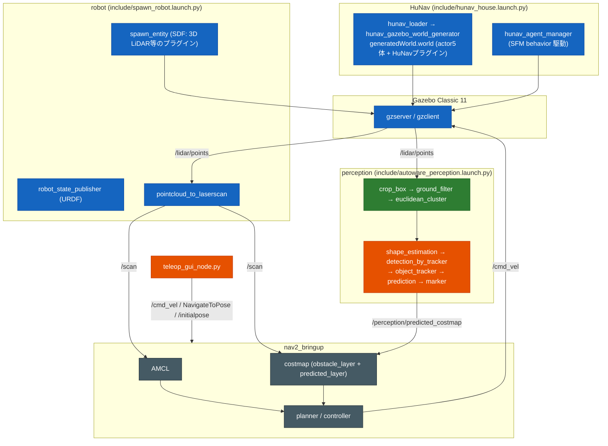
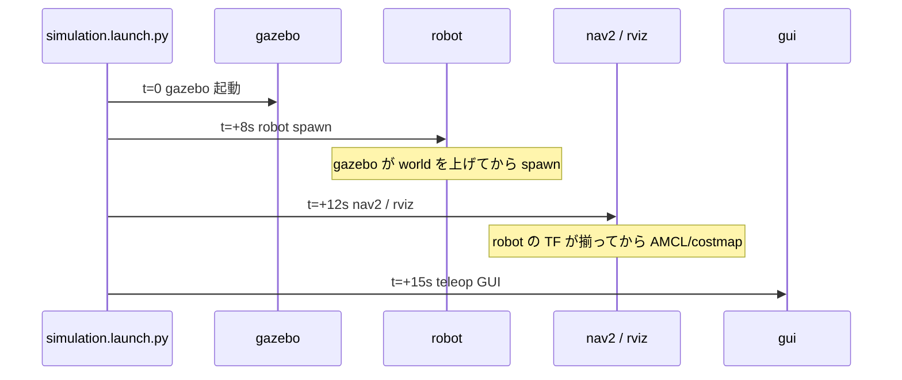

# susumu_object_perception — AGENTS

AIエージェント（および新規参加者）向けの作業ガイド。このパッケージで変更を加えるときの
前提・規約・落とし穴をまとめる。設計（全体構造・状態遷移・シーケンス図）は
[`docs/software_design.md`](docs/software_design.md)、詳細な構築履歴は
[`SETUP.md`](SETUP.md)、利用方法は [`README.md`](README.md) を参照。

## 何のパッケージか

ROS 2 Humble + **Gazebo Classic 11** 上の**シミュレーター**統合パッケージ。シミュレーターに
**Autoware 互換の perception** を載せた構成で、検出までは Autoware 純正モジュール、apt に無い
追跡/形状推定は Python で自作補完する（自作時は Autoware 公式ソースを参照し設計・既定値を踏襲）。

検出・追跡結果は **RViz 可視化が主**だが、**prediction の予測のみ Nav2 costmap に連携する**
（後述の[Nav2 連携](#nav2-連携predicted-層)）。HD 地図は使わず点群ジオメトリのみで検出する。

| 構成要素 | 内容 |
|---|---|
| World / 歩行者 | **cafe world**（既定）で **HuNavSim が5人**を通常歩行速度で歩かせる（house world は歩行者が固着しやすく非推奨。SETUP.md「Phase H」） |
| ロボット | **3D LiDAR(MID-360相当) のみ搭載 TurtleBot3** を spawn（2D LiDAR は非搭載）。VLP-16 版は `lidar_model:=vlp16` で選べる退避版 |
| 自律移動 | **Nav2**。`'/scan'` を costmap obstacle_layer に使用（`'/scan'` は 3D 点群から pointcloud_to_laserscan で生成） |
| 操縦 | **Teleop / 自動巡回 GUI**（`teleop_gui_node.py`）で手動操縦・自動巡回 |
| perception | **Autoware LiDAR sensing/perception パイプライン**（既定 ON）。`'/lidar/points'` を Autoware 純正の crop_box → ground_filter → euclidean_cluster で検出し、Python 自作ノードで形状推定・追跡・予測・可視化を補完。詳細は [`docs/autoware_perception.md`](docs/autoware_perception.md) |
| 全天球カメラ | ロボット上部の **Webots cylindrical 全天球カメラ**（`/omni_camera/image_raw/image_color`）。色付き点群・物体/信号の画像認識に使う。詳細は [`docs/omni_lidar_camera.md`](docs/omni_lidar_camera.md) |
| 物体の画像分類 | LiDAR 検出物体（tracked_objects）の方向の全天球クロップを **YOLOv8(COCO)** で分類し「何か」を判定（`object_classifier_node.py`、late fusion）。`tracked_objects_classified` を出す |
| 信号認識 | **全天球画像を全周 N 分割の透視ビュー**に展開し各ビューで信号灯を検出・色判定（`traffic_light_detector_node.py`）。`traffic_light_localizer_node.py` が LiDAR と組み合わせ信号の 3D 位置も出す。詳細は [`docs/traffic_light_recognition.md`](docs/traffic_light_recognition.md) |

- ビルド種別は **`ament_cmake`**（Python ノードは `install(PROGRAMS)` +
  `ament_python_install_package` で同梱。C++ costmap 層は SHARED lib）。
- 旧来の追従機能（`person_detector_node` / `follow_person_node`）は削除済み。別パッケージ
  `susumu_lidar_perception` に過去実装があったが、**他ブランチ・別パッケージの過去実装は
  参照しない**（本 perception は main からクリーンに再実装したもの）。

## 絶対に守る制約・方針

| 制約 | 内容 |
|---|---|
| git を勝手に操作しない | **`git commit` / `git push` はユーザーが明示的に指示したときだけ**。それ以外は変更を作業ツリーに残すのみ。ブランチを切る等の判断もユーザーに委ねる |
| Gazebo は Classic 11 | Ignition/Gazebo Sim ではない。**HuNavSim は必ず `v1.0-humble` ブランチ**（`v2.0` は Gazebo Sim 用で動かない） |
| メッセージ型は自作せず既存を使う | **独自 `.msg` を定義しない**。標準型（`Twist` / `PoseWithCovarianceStamped` / `nav2_msgs/NavigateToPose` 等）や、エコシステムの既存型（`autoware_perception_msgs` / `visualization_msgs` 等、用途に合う型が既にあるもの）を使う。「無いから作る」のではなく、まず既存型で表現できないか探す |
| source は `local_setup.bash` | `install/setup.bash` は古いスナップショットを指す prefix-chain で、新規パッケージが見えず `package not found` になる（既知の罠。SETUP.md「Phase B」） |
| Nav2 変更時は docs 更新 | `config/nav2_params.yaml` を調整したら、必ず [`docs/nav2_tuning.md`](docs/nav2_tuning.md) の「現在値」表と「調整履歴」を更新する（理由が失われ次の調整で振り出しに戻る） |

## ビルド・実行

```bash
cd ~/ros2_ws
colcon build --packages-select susumu_object_perception --symlink-install

source /opt/ros/humble/setup.bash
source ~/ros2_ws/install/local_setup.bash     # ← setup.bash ではない
export TURTLEBOT3_MODEL=waffle

ros2 launch susumu_object_perception simulation.launch.py              # 全部入り（GUI含む）
ros2 launch susumu_object_perception simulation.launch.py gui:=false   # GUI無効

# 画像認識（YOLO 物体分類 + 全天球信号認識）は simulation / webots_simulation 系に統合済みで
# 既定 ON（image_recognition:=False で切れる。YOLO が重いとき用）。Gazebo は 6 面カメラを
# omni_image_node で全天球合成してから認識する。Webots 系（outdoor/indoor/city）も波及。
ros2 launch susumu_object_perception simulation.launch.py image_recognition:=false  # 画像認識OFF
# 車・歩行者を認識したい街シミュ（既定で認識 ON。/cmd_vel で対象に近づくと認識される）:
ros2 launch susumu_object_perception webots_city.launch.py mode:=fast
```

Python ノードはファイル名で起動する（console_scripts ではない）:
`ros2 run susumu_object_perception teleop_gui_node.py`。
→ ノードを増やすときは CMakeLists の `install(PROGRAMS ...)` に**ファイルを追加し、
かつソースに実行ビット(`chmod +x`)を立てる**こと（忘れると `No executable found`）。

## アーキテクチャ / データフロー

エントリは `launch/simulation.launch.py`。取り込まれる部品 launch は `launch/include/`。



> Nav2 は現在位置の障害物回避を生センサ `'/scan'`（obstacle_layer）で行い、**STVL 層は廃止**
> （人の通過跡が `voxel_decay` 秒残り「移動軌跡のコスト」が出たため）。人の現在位置と進路先は
> 予測層が毎フレーム焼き直す。詳細は[Nav2 連携](#nav2-連携predicted-層)。

### 段階起動（TimerAction）

`simulation.launch.py` は順序依存（robot が居ないと nav2 の TF が揃わない等）のため
TimerAction で段階起動する。**遅延値をむやみに詰めない。**



## フレーム/トピックの約束（変更時は供給側・利用側を揃える）

| 役割 | 値 | 供給側 | 利用側 |
|---|---|---|---|
| 速度司令 | `'/cmd_vel'` | nav2 controller / teleop_gui | SDF diff_drive |
| オドメトリ | frame/topic `odom`（`publish_odom_tf:true`） | SDF diff_drive | amcl odom_frame |
| ベース | `base_footprint`(amcl) / `base_link`(costmap) | SDF / URDF | nav2_params |
| 2D スキャン | `'/scan'`, frame `lidar_link` | pointcloud_to_laserscan（`'/lidar/points'` から生成。2D LiDAR は非搭載） | amcl scan_topic / nav2 obstacle_layer |
| 3D LiDAR | `'/lidar/points'`, frame `lidar_link` | SDF MID-360 plugin（`liblivox_mid360_sensor.so`、ODE MultiRayShape）。VLP-16 版は `gpu_ray` | Autoware perception 入力 / pointcloud_to_laserscan（→ `'/scan'`）。※ Nav2 costmap には STVL を使わない（廃止） |
| HuNav追跡対象 | robot_name=`turtlebot3`（spawn entity 名と一致必須） | spawn_robot | hunav_house |

## 重要ファイル

### perception パイプライン（自作ノードは Autoware 公式アルゴリズムを踏襲、型は標準で自作）

| ファイル | 役割 | 入力 → 出力 |
|---|---|---|
| `launch/include/autoware_perception.launch.py` | Autoware 3 モジュール（crop_box → ground_filter → euclidean_cluster）を 1 component_container にまとめ、自作ノードを起動。plugin 名・remap は実体検証済み | — |
| `config/autoware_*.param.yaml` | 上記モジュールの屋内向けパラメータ。ground/cluster を調整したら `docs/autoware_perception.md` のパラメータ表も更新 | — |
| `…/shape_estimation_node.py` | OBB 形状推定。検出は位置のみで shape が空なので、no_ground 点群から近傍を集めて **Autoware L字フィット**（closeness criterion / 1°grid search）で寸法・向きを埋める | `'/perception/detected_objects'` → `'/perception/detected_objects_shaped'` |
| `…/detection_by_tracker_node.py` | 過分割統合（**Autoware Cluster Merger 踏襲**）。前フレームの tracker 位置・サイズを参照して over-segmentation を統合。tracker 出力を購読する循環構造。統合後 shape は点群を L字フィット再推定（包含 BBox だと巨大化） | `'/perception/detected_objects_shaped'` → `'/perception/detected_objects_merged'` |
| `…/object_tracker_node.py` | 自作トラッカー（**Autoware multi_object_tracker 踏襲**）。ハンガリアン法 + マハラノビス χ²ゲート 11.62 + existence_probability の Bayes 更新/半減期 decay + CV 速度クランプ。classification も 2D 地図で推定（free space で移動=`PEDESTRIAN`、静止=`UNKNOWN`） | DetectedObjects → `'/perception/tracked_objects'` (TrackedObjects) |
| `…/prediction_node.py` | 将来軌跡予測（**Autoware map_based_prediction の 2D 占有格子版**）。等速(CV)予測し、予測点が `'/map'` の occupied セルに入ったら打ち切り（壁めり込み回避）。Nav2 連携の costmap も出す（後述） | `'/perception/tracked_objects'` → `'/perception/predicted_objects'` (PredictedObjects) + `'/perception/predicted_costmap'` |
| `…/perception_marker_node.py` | Detected/Tracked/Predicted を MarkerArray 可視化（検出=青 / 移動=赤 / 静止=緑、`#ID 速度[km/h]` テキスト、速度矢印、予測パス=黄 LINE_STRIP）。spencer/leg_tracker 作法。純正プラグイン不使用 | → `'/perception/markers'`（RViz で MarkerArray Display） |
| `…/object_classifier_node.py` | **LiDAR 検出物体の画像分類**（late fusion）。各 tracked_objects の方向の全天球クロップを **YOLOv8(COCO)** で分類し COCO→Autoware `ObjectClassification` にマップ。トラック ID キャッシュ + `max_rate_hz` で間引き（CPU 実用）。YOLO 初期化失敗は `[FATAL]`（classic 等へ自動フォールバックしない） | TrackedObjects + 全天球画像 → `'/perception/tracked_objects_classified'` + `'/perception/object_classes/markers'` |

> apt に shape_estimation は無く、universe 版は型（tier4_perception_msgs）が世代不整合なため、
> アルゴリズムのみ公式踏襲し型は標準で自作している。`…/` は `susumu_object_perception/` を指す。

### 信号認識（全天球カメラ前提）

| ファイル | 役割 |
|---|---|
| `…/traffic_light_detector_node.py` | **全天球画像を全周 N 分割の透視ビュー**に展開し、各ビューで信号灯を検出・色判定（`method:=classic`=HSV+円形度 / `yolo`=YOLOv8、**yolo は全ビューをバッチ推論**）。検出に方位・方向ベクトルを付与し、**視野が重なる隣接ビューの同一信号は方向で 1 つに統合**（`merge_angle_deg`、全天球で 1 箇所→結果 1 つ）。`omni_mode:=false` で通常前方カメラ。`max_rate_hz` で間引き。yolo 初期化失敗は `[FATAL]`（classic へ自動フォールバックしない） | 全天球画像 → `'/perception/traffic_signals'`(autoware型) + `'/perception/traffic_light/rois'` |
| `…/traffic_light_marker_node.py` | 検出 ROI を全天球画像に重畳（全天球モードは方位帯マーカー） | → `'/perception/traffic_light/image_annotated'` |
| `…/traffic_light_localizer_node.py` | **検出方向 × LiDAR 点群で信号の 3D 位置推定**。方位 + 高さ帯 + 最近傍まとまりで距離決定 | rois + LiDAR → `'/perception/traffic_light/poses'` + `'/perception/traffic_light/markers'` |

詳細は [`docs/traffic_light_recognition.md`](docs/traffic_light_recognition.md)、
全天球カメラ/色付き点群は [`docs/omni_lidar_camera.md`](docs/omni_lidar_camera.md)。

### Nav2 連携（predicted 層）

| ファイル | 役割 |
|---|---|
| `config/nav2_params.yaml` | waffle.yaml ベース。動的障害物層は自作 `predicted_layer`（`susumu_object_perception::PredictedCostmapLayer`）。obstacle_layer は生 `'/scan'`。**STVL（`stvl_layer`）は廃止**。詳細は `docs/nav2_tuning.md` |
| `src/predicted_costmap_layer.cpp`<br/>`include/susumu_object_perception/predicted_costmap_layer.hpp` | 自作 C++ `costmap_2d::Layer` プラグイン。`'/perception/predicted_costmap'` を購読し占有セルを **max 合成**で costmap に乗せる（他層を壊さず・毎フレーム置換で蓄積せず）。pluginlib 登録は `predicted_costmap_layer.xml`、CMakeLists で SHARED lib をビルド。**リポジトリ初の C++ ノード**（他は全て rclpy） |

`prediction_node` が「人がこれから行く先」を OccupancyGrid `'/perception/predicted_costmap'`(map)
として**毎フレーム作り直して**出し（最有力1本・近傍2s・人幅6セル円盤膨張、confidence 0.25 以上）、
`PredictedCostmapLayer` が max 合成で local/global 両 costmap に焼く。検出・追跡そのものは焼かない。

**標準層では両立できず自作した**: ObstacleLayer/STVL は古い予測が蓄積し costmap がぐちゃぐちゃ、
StaticLayer は壁を上書き消去。max 合成の自作層で「他層を壊さず・蓄積せず」を両立した。真値検証で
壁 LETHAL 100%維持・全体 22%・進路前方占有 58%(0.5m)・ナビ可能。詳細は
`docs/autoware_perception.md`「Nav2 連携」。

### シミュレーター本体

| ファイル | 役割 |
|---|---|
| `models/turtlebot3_waffle_3d/model.sdf` | Gazebo プラグイン本体（標準＝MID-360）。3D LiDAR は `ray` センサ + `liblivox_mid360_sensor.so`（LCAS/ODE MultiRayShape、`/lidar/points`、frame=sensor 名 `lidar_link`、PointCloud2 x/y/z/intensity/tag/line、CSV は `config/mid360_scan_patterns/mid360.csv`）。VLP-16 版は `models/turtlebot3_waffle_vlp16/model.sdf`（`gpu_ray`+`libgazebo_ros_ray_sensor.so`、`lidar_model:=vlp16`）。変更後は `gz sdf -k model.sdf` で spec 検証。詳細は [`docs/mid360_lidar_research.md`](docs/mid360_lidar_research.md) |
| `config/agents_house.yaml` | HuNav 5人。**公式 `hunav_gazebo_wrapper/scenarios/agents_house.yaml` のコピー**（動作実績あり）。通常歩行速度（`max_vel:1.5`, `vel:0.6`〜`0.8`, 各3ゴール）、**`once:true` + `cyclic_goals:true`** で巡回し続ける |
| `…/teleop_gui_node.py` | tkinter GUI。矢印/テンキー手動操縦、AUTO トグルで `PATROL_WAYPOINTS` を Nav2 巡回、WARP で原点へワープ + AMCL 再初期化 |

### 自律マッピング・ウェイポイント巡回（事前地図なし環境）

| ファイル | 役割 |
|---|---|
| `…/frontier_explore_node.py` | **frontier 探索による自律マッピング**。slam_toolbox が育てる `/map` のフロンティアを BFS でクラスタ化し、情報利得 `score=size_weight*log(size)-dist_weight*dist` で広い未踏領域を優先して NavigateToPose。到達不能ゴールはブラックリスト化、完了時 map_saver で自動保存。`launch/webots_city_mapping.launch.py` から起動 |
| `…/generate_waypoints.py`(scripts) | 保存地図(PGM/YAML)から巡回ウェイポイントを生成。**「なるべく沢山まわる」かつ「Nav2 で完走できる」を両立**する設計。①連結用 `connect-clearance`(既定0.3m=緩い、幅1.2m未満の通路も繋ぐ)で通行可能領域を作り**最大連結成分**を巡回対象に(`ndimage.label`)、②配置用 `clearance`(既定0.6m=壁から離す)を満たすセルを spacing グリッド間引き、③**点間の測地距離(連結成分上の最短路長)行列を作り NN+2-opt で巡回順**を解く。連結=繋がるか/配置=壁から離すかで clearance を分けるのが要点。**測地距離が肝**: 直線NNだと「直線では近いが壁越しで実は遠い」点へ大ジャンプし `goal_timeout` でスキップされる(旧版で最大8.9m)。測地順なら連続点間が必ず通行可能で spacing 程度(≤3m)に収まり完走可能。`<world>_waypoints.yaml`(map座標) と、地図に番号付き点・巡回経路・起点・clearance領域を重ねた確認用 `<world>_waypoints.png`(matplotlib、RViz不要で巡回路を一目確認、`--no-png`で抑止)を出力 |
| `…/waypoint_viz_node.py` | ウェイポイントを番号付き球+巡回経路 LINE_STRIP で `/waypoints/markers` に可視化（RViz、TRANSIENT_LOCAL） |
| `…/waypoint_nav_node.py` | ウェイポイント YAML を **各点 NavigateToPose で順に巡回**（`goal_timeout_sec` 以内に到達できなければスキップ→次点。1点詰まっても止まらず一巡。reached/missed を報告）。世代トークンで loop 暴走を防止。`loop:=True` で周回継続。`launch/webots_waypoint_nav.launch.py` から起動 |
| `…/fall_detector_node.py` | **転倒検知**。IMU(`/imu`) の roll/pitch から傾きを見てしきい値(45°)超えで転倒警告。odom は 2D 前提で roll/pitch=0 なので IMU を使う。`/fall_detector/status`(Bool)。webots_simulation/simulation の両 launch に統合（常時監視） |

> **罠**: 連続クリーン再起動で FastRTPS の SHM トランスポートが壊れ `/scan` が出なくなる
> （`open_and_lock_file failed` 多発→SLAM が `/map` を作れず frontier が `no map yet`）。SHM 無効化
> （UDP 強制）の FastRTPS プロファイル XML を `FASTRTPS_DEFAULT_PROFILES_FILE` で指定して回避する。
> または `RMW_IMPLEMENTATION=rmw_cyclonedds_cpp` で起動する（SHM 破損を回避でき、検証で実績あり。
> `/dev/shm/fastrtps_*` と `/tmp/webots/taro/*` の掃除も併用）。
> 室内検証 world は `break_room.wbt`（旧 `kitchen_test.wbt` は重い proto で `<extern>` 接続が
> 不安定なため削除）。Webots 同梱 world にロボットを組むときは WorldInfo に `basicTimeStep 20` を入れる。

> **罠（Webots マッピング/ナビの地図品質、2026-06-19 に判明・対処済み）**: 以下 3 つが揃って初めて
> まともな地図ができる。崩れたら真っ先に疑う。詳細・実証データは
> [`docs/mid360_lidar_research.md`](docs/mid360_lidar_research.md) と
> [メモリ webots-mapping-mode-fast-odom-drift]。
> - **`mode:=fast` は使わない（`mode:=realtime`）**。fast は Webots を高速に回すため ROS 制御ループが
>   物理に追従できず **odom が ~21% 過大積算してドリフト**する（GPS 真値 `/TurtleBot3Burger/gps` と
>   移動量比較で realtime 誤差 8% / fast 21%）。「RViz では進むが Webots で衝突」「地図ぐちゃぐちゃ」の主因。
> - **wbt の Lidar `tiltAngle` は 0**（非ゼロは Webots バグ #37 で点の高さが過大→地図に円形の影）。
> - **`'/scan'` は生点群を高さ帯で 2D 化**（`webots_simulation.launch.py` の pointcloud_to_laserscan、
>   lidar_link 基準 `min_height 0.1`=地上約0.3m で地面を除外、`range_min 0.3`）。tiltAngle=0 なら地面は
>   z≈-0.2 に正しく乗るので高さ帯で確実に落ちる。perception 非依存（OFF でも /scan が出る）。
> - slam_toolbox は odom 信頼寄り（`nav2_params_webots_explore.yaml` の slam_toolbox セクション）。
>   旋回が速いとマッチングを見失うので controller `max_vel_theta` は 0.5。
>
> **検証プロセスは必ず落とす**: `ps aux | grep -E "webots|rviz|component_container|ros2 launch susumu|driver|
> pointcloud|frontier|slam|nav2|spawner" | grep -v grep | awk '{print $2}' | xargs -r kill -9`。rviz が
> 大量に残りやすいので毎回掃除する（「動作確認の作法」参照）。

## 変更時の検証手順

Gazebo 起動は安定しているので、**基本はライブ起動で確認する**（下の「動作確認の作法」参照）。
ライブ起動の前後で、まず以下の静的検証を通しておくと早く落とせる:

```bash
# SDF/URDF/YAML/launch の静的検証
gz sdf -k models/turtlebot3_waffle_3d/model.sdf
xacro urdf/turtlebot3_waffle_3d.urdf.xacro > /dev/null
python3 -c "import yaml; yaml.safe_load(open('config/nav2_params.yaml'))"
ros2 launch susumu_object_perception simulation.launch.py --show-args   # launch記述のパース確認
```

## やりがちな失敗

| 症状 | 原因 | 対策 |
|---|---|---|
| `package not found` | `install/setup.bash` を source した | `local_setup.bash` を使う |
| `No executable found` | 新 Python ノードに実行ビット未設定 | `chmod +x` + CMakeLists `install(PROGRAMS)` に追加 |
| Gazebo 起動失敗 | HuNavSim を `v2.0` で入れた | `v1.0-humble` ブランチを使う |
| `Robot model ... not found` が出続ける | robot spawn の entity 名と HuNav の robot_name 不一致 | 両方 `turtlebot3` に揃える |
| `planner_server` が `NavfnPlanner does not exist` で落ちる | Nav2 params を `turtlebot3_navigation2` の waffle.yaml（新 `::` プラグイン名形式）から作った。インストール済み Nav2 1.1.20（`/` 形式）と不整合 | 同梱バージョンと一致する `nav2_bringup/params/nav2_params.yaml` をベースにする（現行は対処済み、planner=`nav2_navfn_planner/NavfnPlanner`） |
| 歩行者が数十秒で停止する | `agents_house.yaml` の `once: false`（HuNav behavior 駆動が回らない） | **`once: true` + `cyclic_goals: true`**。困ったら公式 `agents_house.yaml` をそのままコピー。SETUP.md「Phase G」 |
| アクターが T ポーズ・床埋まり・空中で動かない | `hunav_house.launch.py` 単体（ロボット spawn なし）で `Robot model turtlebot3 not found` が出続ける。**HuNav はロボットが必須** | 人の確認は必ず full の `simulation.launch.py` で行う |
| GUI(tkinter) が出ない | ヘッドレス環境で `tk` import 失敗（ノードは error ログを出して終了） | `gui:=false` で外すか X 環境で実行 |
| 消したはずの旧ファイルが install に残る | `colcon build --symlink-install` は削除ファイルを install から消さない | `rm -rf build/susumu_object_perception install/susumu_object_perception` してから再ビルド |

## 動作確認の作法（このリポジトリ）

- Gazebo 起動 launch は **`run_in_background:true`（デタッチ）** で起動し、出力ファイルを
  `Read`/`grep` でポーリングする（フォアグラウンド + timeout は起動完了まで待てず不向き）。
- 確認すべき要点: planner 作成ログ、`Managed nodes are active`、Teleop GUI の起動、
  手動操縦/AUTO 巡回で `'/cmd_vel'` が出ること、odom 座標の変化。
- 終了処理: `ps aux | grep -E "gzserver|component_container|teleop_gui" | awk '{print $2}'
  | xargs -r kill -9`。`pkill` は環境によりツールの exit code 1 を招くので xargs+kill が安全。
