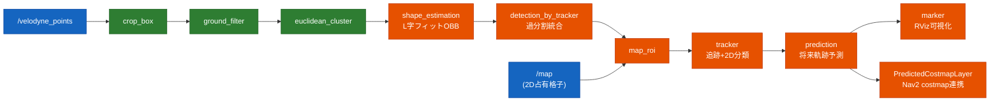
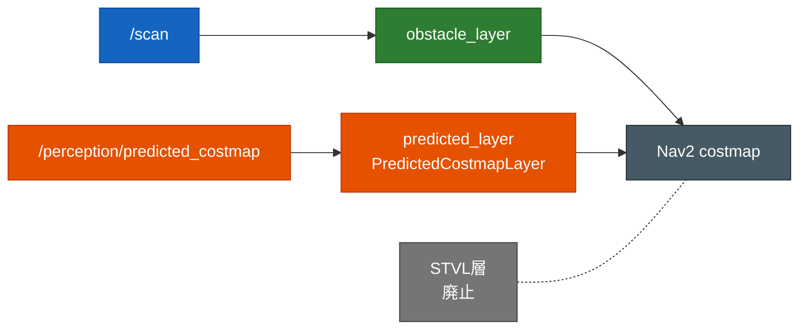

# susumu_object_perception

ROS 2 Humble + Gazebo Classic 11 上のシミュレーターパッケージ。**HuNavSim が制御する5人の歩行者**が動く
**カフェ（cafe world）**を、**3D LiDAR 搭載 TurtleBot3** が Nav2 で自律走行する。手動操縦／自動巡回ができる
**Teleop GUI** と、**Autoware 流の LiDAR perception パイプライン**（既定 ON、RViz 可視化）を備える。
perception の **prediction の予測のみ Nav2 costmap に連携**し、人の進路先を先回りで障害物化する。

- 設計（全体構造・状態遷移・シーケンス図・パラメータ・ディレクトリ構成）: [`docs/software_design.md`](docs/software_design.md)
- Nav2 の調整（パラメータ・症状別の指針・変更履歴）: [`docs/nav2_tuning.md`](docs/nav2_tuning.md)
- perception パイプライン詳細: [`docs/autoware_perception.md`](docs/autoware_perception.md)
- 構築の詳細手順・ハマりどころ: [`SETUP.md`](SETUP.md)
- Webots 版シミュレーション: [`docs/webots_simulation.md`](docs/webots_simulation.md)

---

## できること

| 機能 | 内容 | 備考 |
|---|---|---|
| カフェ + 5人の歩行者 | HuNavSim（Social Force Model）が5人をカフェ内に配置し歩き回らせる | `max_vel: 1.5`, `vel: 0.6`〜`0.8`（通常歩行速度） |
| 3D LiDAR TurtleBot3 | waffle に Velodyne VLP-16 相当の16ch 3D LiDAR を搭載 | `/velodyne_points`（PointCloud2）を出力 |
| Nav2 自律移動 | ゴール指定で人を含む障害物を避けて自律走行 | 現在位置回避は 2D `/scan`、進路先は予測コストマップ |
| Teleop / 自動巡回 GUI | 矢印（＋テンキー）で手動操縦、トグルで自動巡回、原点ワープ | tkinter |
| Autoware 流 perception | 3D LiDAR 点群から検出〜将来軌跡予測まで（下図） | 既定 ON、RViz 可視化が主 |
| 予測コストマップ連携 | prediction の予測だけ Nav2 costmap に焼く | 自作 C++ 層が max 合成、毎フレーム作り直し |

> 「人を検知して右隣を歩く」追従機能は持たない（旧 `susumu_lidar_perception` へ分離）。

---

## perception パイプライン

検出までは **Autoware 純正モジュール**、apt に無い段や HD 地図依存の段は **2D 占有格子地図と
Autoware アルゴリズムの踏襲で自作補完**している。



### 予測コストマップ連携

prediction が**人の現在位置 + 進路先**を予測 OccupancyGrid `/perception/predicted_costmap` として出し、
自作 C++ costmap 層 `susumu_object_perception::PredictedCostmapLayer` が **max 合成**で Nav2 costmap に焼く
（人の「これから行く先」を先回りで障害物化）。毎フレーム作り直すので移動軌跡が残らない。



詳細は [`docs/autoware_perception.md`](docs/autoware_perception.md) / [`docs/nav2_tuning.md`](docs/nav2_tuning.md)。

---

## world について

既定は **cafe world**。家（house world）の素材も同梱しているが、house は狭い通路・家具密集により
歩行者が固着しやすい（[`SETUP.md`](SETUP.md) Phase H）。人がよく動き回るのは cafe。house に切り替えるには
起動引数で `map`・`base_world`・`configuration_file` を house 用に渡す。

---

## 必要環境・依存

| 種別 | 内容 |
|---|---|
| ベース | ROS 2 Humble / Gazebo Classic 11 / Nav2 / TurtleBot3(waffle) |
| 外部クローン | HuNavSim `hunav_sim` / `hunav_gazebo_wrapper`（`v1.0-humble`）、`people_msgs`（ソース） |
| ヘッダlib | `lightsfm`（`/usr/local/include` へ `make install`） |
| Python | tkinter（GUI） |

セットアップ手順は [`SETUP.md`](SETUP.md) の「Phase 0」を参照。

---

## ビルド

```bash
cd ~/ros2_ws
colcon build --symlink-install        # または --packages-select susumu_object_perception hunav_* people_msgs

# ★ source は setup.bash ではなく local_setup.bash を使うこと（理由はSETUP.md参照）
source /opt/ros/humble/setup.bash
source ~/ros2_ws/install/local_setup.bash
export TURTLEBOT3_MODEL=waffle
```

---

## 実行

全部入り（カフェ + 5人 + 3D LiDAR TB3 + Nav2 + RViz2 + Teleop GUI）:

```bash
ros2 launch susumu_object_perception simulation.launch.py
```

- RViz2 の **"2D Goal Pose"** で目的地を指定 → 人を避けて自律移動。
- **Teleop GUI** ウィンドウ:
  - 矢印ボタンを「押している間」だけ走行（テンキー 8/2/4/6、矢印キーも同じ）。
  - **自動巡回** トグルを ON にすると、Nav2 でカフェ内を順番に自動巡回。
  - **原点へワープ** で、隅にハマって動けなくなったロボットを原点へ戻す。

GUI を出したくないときは `gui:=false`:

```bash
ros2 launch susumu_object_perception simulation.launch.py gui:=false
```

Webots 版（屋外街など）も用意している（詳細は [`docs/webots_simulation.md`](docs/webots_simulation.md)）:

```bash
ros2 launch susumu_object_perception webots_simulation.launch.py world:=outdoor
```

---

## launch（エントリポイント）

| ファイル | 役割 |
|---|---|
| `simulation.launch.py` | 全部入り（カフェ + 5人 + ロボット + Nav2 + RViz2 + GUI）。エントリポイント |
| `webots_simulation.launch.py` | Webots 版（`world:=outdoor.wbt`/`indoor.wbt`、`nav:`/`slam:` 付き）（[`docs/webots_simulation.md`](docs/webots_simulation.md)） |
| `webots_outdoor.launch.py` / `webots_indoor.launch.py` | 上記の world 固定ショートカット（引数 world 不要） |
| `webots_nav.launch.py` | Webots robot + Nav2 + SLAM フルスタック |
| `webots_city.launch.py` | Webots city_traffic（車 + SUMO、ROS2 連携なしの街デモ） |

`simulation.launch.py` の主な引数:

| 引数 | 既定 | 意味 |
|---|---|---|
| `use_nav2` | True | Nav2 スタックを起動する |
| `use_perception` | True | Autoware 流 perception パイプライン（検出・追跡・可視化）を起動する |
| `use_rviz` | True | RViz2 を起動する |
| `gui` | True | Teleop / 自動巡回 GUI を起動する |
| `map` | `maps/cafe.yaml` | マップ yaml のフルパス（house に戻すなら `maps/house.yaml`） |
| `params_file` | `config/nav2_params.yaml` | Nav2 パラメータ yaml のフルパス |
| `x_pose` / `y_pose` / `yaw` | 0.0 / 0.0 / 0.0 | ロボットの spawn 姿勢 |

> 起動順序や各部品の構成は
> [`docs/software_design.md`](docs/software_design.md#2-launch-構成と起動順序) を参照。

---

## ライセンス

MIT License（[`LICENSE`](LICENSE)）。TurtleBot3 モデルは ROBOTIS、HuNavSim は
robotics-upo に帰属。
