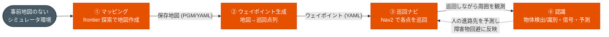

# susumu_object_perception

ROS 2 Humble のシミュレーター統合パッケージ。**3D LiDAR + 全天球カメラを載せた移動ロボット**が、
シミュレータ上の環境を**自律的に地図化し・巡回し・周囲の物体を検出/識別する**ところまでを一貫して扱う。

## 目指す構想

実機の自律移動ロボットに必要な「**地図を作る → 経路を巡る → 周囲を認識する**」のループを、
シミュレータ上で統合・検証することを目指す。

1. **環境を知る（マッピング）** — 事前地図のない環境を frontier 探索で自律的に動き回り SLAM 地図を作る
2. **環境を巡る（ナビゲーション）** — 作った地図から巡回ウェイポイントを生成し Nav2 で巡回する
3. **環境を理解する（認識）** — 巡回しながら LiDAR で物体を検出・追跡し、カメラ画像（YOLO）で種類を識別、
   信号も認識する。人の進路先は予測して Nav2 の障害物回避に先回りで反映する

---

## タスク一覧

このパッケージが扱う作業は、下表の **4 つのタスク**に分かれる。各タスクは前のタスクの成果物を
入力に取り、繋がって 1 つのループを成す。**ゴール条件・パラメータ・落とし穴などの詳細は
「タスク別ページ」**を参照（README には概要のみ記す）。

| # | タスク | やること | ゴール | タスク別ページ |
|---|---|---|---|---|
| 1 | **マッピング** | 事前地図のない環境を frontier 探索で動き回り SLAM 地図を作成・保存する | 到達可能な未踏領域を残さず広く開拓し、実 world の壁・障害物と一致した地図ができている | [`docs/webots_simulation.md`](docs/webots_simulation.md) |
| 2 | **ウェイポイント生成** | 保存地図から巡回ウェイポイントを自動生成・可視化する | 連結した到達可能領域を漏れなく巡る、Nav2 で完走できる点列ができている | [`docs/launch.md`](docs/launch.md) |
| 3 | **巡回ナビ** | 生成したウェイポイントを Nav2 で順に巡回する | 各点に到達（詰まってもスキップして一巡）し、転倒せず巡回しきる | [`docs/launch.md`](docs/launch.md) |
| 4 | **認識** | 巡回しながら LiDAR 物体検出・追跡・予測と、カメラの画像分類・信号認識を行う | 周囲の物体を検出/識別し、人の進路先を予測して Nav2 の障害物回避に反映できている | [`docs/autoware_perception.md`](docs/autoware_perception.md) |

### タスクのつながり



> ①マッピングと②③④は別タスク。マッピングは「地図そのものの品質」だけを対象にし、
> 巡回・認識はその合格した地図を前提に動く。各タスクの合格基準は [`AGENTS.md`](AGENTS.md) と
> 上記タスク別ページに定義する。

> 「人を検知して右隣を歩く」追従機能は持たない（旧 `susumu_lidar_perception` へ分離）。

---

## ドキュメント

| ドキュメント | 内容 |
|---|---|
| [`docs/webots_simulation.md`](docs/webots_simulation.md) | Webots 版シミュレーション（マッピングタスクの詳細を含む） |
| [`docs/launch.md`](docs/launch.md) | 各 launch が何を起動するか・全引数（ウェイポイント生成/巡回タスクの詳細を含む） |
| [`docs/autoware_perception.md`](docs/autoware_perception.md) | 認識タスクの詳細（perception パイプライン・予測コストマップ連携） |
| [`docs/node_topology.md`](docs/node_topology.md) | ノード接続図 / トピック I/O 一覧（Mermaid 図） |
| [`docs/software_design.md`](docs/software_design.md) | 設計（全体構造・状態遷移・シーケンス図・パラメータ・ディレクトリ構成） |
| [`docs/nav2_tuning.md`](docs/nav2_tuning.md) | Nav2 の調整（パラメータ・症状別の指針・変更履歴） |
| [`docs/traffic_light_recognition.md`](docs/traffic_light_recognition.md) | 信号認識（全天球画像の透視ビュー展開・色判定・3D 位置推定） |
| [`docs/omni_lidar_camera.md`](docs/omni_lidar_camera.md) | 全天球カメラ・色付き点群 |
| [`docs/semantic_object_memory.md`](docs/semantic_object_memory.md) | セマンティック物体メモリ |
| [`docs/mid360_lidar_research.md`](docs/mid360_lidar_research.md) | MID-360 LiDAR 調査・Webots マッピングの罠 |
| [`SETUP.md`](SETUP.md) | 構築の詳細手順・ハマりどころ |
| [`AGENTS.md`](AGENTS.md) | 作業ガイド（規約・制約・タスク合格基準） |

---

## world について

既定は **cafe world**。家（house world）の素材も同梱しているが、house は狭い通路・家具密集により
歩行者が固着しやすい（[`SETUP.md`](SETUP.md) Phase H）。人がよく動き回るのは cafe。house に切り替えるには
起動引数で `map`・`base_world`・`configuration_file` を house 用に渡す。Webots 系の world
（屋内外・街・室内）は [`docs/webots_simulation.md`](docs/webots_simulation.md) を参照。

---

## 必要環境・依存

| 種別 | 内容 |
|---|---|
| ベース | ROS 2 Humble / Gazebo Classic 11 / Nav2 / TurtleBot3(waffle) |
| 外部クローン | HuNavSim `hunav_sim` / `hunav_gazebo_wrapper`（`v1.0-humble`）、`people_msgs`（ソース） |
| ヘッダlib | `lightsfm`（`/usr/local/include` へ `make install`） |
| Python | tkinter（GUI） |

セットアップ手順は [`SETUP.md`](SETUP.md) の「Phase 0」を参照。

---

## ビルド・実行

```bash
cd ~/ros2_ws
colcon build --symlink-install
# ★ source は setup.bash ではなく local_setup.bash を使うこと（理由は SETUP.md 参照）
source /opt/ros/humble/setup.bash
source ~/ros2_ws/install/local_setup.bash
export TURTLEBOT3_MODEL=waffle

ros2 launch susumu_object_perception simulation.launch.py   # Gazebo 全部入り
```

**各 launch が何を起動するか・全引数・タスク別の起動手順は [`docs/launch.md`](docs/launch.md) を参照。**

---

## ロボット / LiDAR 構成と制約

Gazebo Classic の標準ロボットは TurtleBot3 Waffle に上部 3D LiDAR を載せた構成で、
URDF/SDF の識別子、topic、frame はセンサ製品名に依存しない汎用名にしている。LiDAR link は
`lidar_link`、点群 topic は `/lidar/points`。標準 `lidar_model:=mid360` は
`liblivox_mid360_sensor.so`（LCAS/livox_laser_simulation_ros2 由来、ODE MultiRayShape 方式）が
MID-360 の scan pattern CSV（`config/mid360_scan_patterns/mid360.csv`）を読み、`x,y,z,intensity,tag,line`
付き PointCloud2 を出す（frame は sensor 名 = `lidar_link`）。VLP-16 版は `models/turtlebot3_waffle_vlp16/` と
`urdf/turtlebot3_waffle_vlp16.urdf.xacro` に残してあり、`lidar_model:=vlp16` で使う。

Webots の標準 world は Webots 標準 `Lidar` による MID-360 近似で、device 名は `lidar3d`、
frame は `lidar_link`、topic は `/lidar/points/point_cloud`。

制約事項:

- Gazebo Classic 版 MID-360 は ODE MultiRayShape で CSV の非反復角度列に実 ray を撃つ。
  per-point timestamp は出さない（`x,y,z,intensity,tag,line`、tag/line はダミー 0）。
- Webots 標準 `Lidar` では Livox/MID-360 の非反復 scan pattern を直接指定できないため、FOV・レンジ・点密度の近似に留めている。
- Nav2/AMCL 用 `/scan` は 2D LiDAR ではなく、3D LiDAR 点群から `pointcloud_to_laserscan` で生成する。
- downstream の perception、色付き点群、GLIM 設定は汎用 topic/frame に寄せており、旧 `/velodyne_points` / `velodyne_link` 前提ではない。

詳細は [`docs/mid360_lidar_research.md`](docs/mid360_lidar_research.md)。

---

## ライセンス

MIT License（[`LICENSE`](LICENSE)）。TurtleBot3 モデルは ROBOTIS、HuNavSim は
robotics-upo に帰属。
