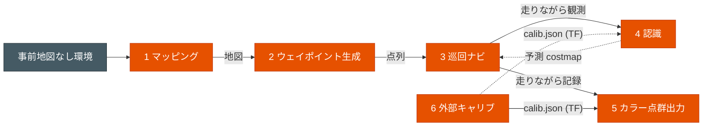

# susumu_object_perception

> [!WARNING]
> 注意：このリポジトリは生成AIで適当に作ってます。

ROS 2 Humble のシミュレーター統合パッケージ。3D LiDAR と全天球カメラを載せた移動ロボットが、
シミュレータ上で「地図を作る → 巡回する → 周囲を認識する → 点群をカラー化する」流れを検証する。

## 目指す構想

実機の自律移動ロボットに必要な一連のループを、Gazebo Classic / Webots 上で統合して確認する。

1. **環境を知る**: 事前地図のない環境を frontier 探索で自律的に地図化する
2. **環境を巡る**: 保存地図から巡回ウェイポイントを生成し、Nav2 で巡回する
3. **環境を理解する**: LiDAR と全天球カメラで物体・信号を認識し、人の進路先を Nav2 に反映する
4. **環境を記録する**: 全天球画像で LiDAR 点群に色を付け、カラー点群として出力・保存する

## タスク一覧

詳細なゴール条件、制約、確認手順は各タスクページに置く。README は全体の入口だけを扱う。
タスクごとの現在地・採用成果物・次に見る低成績箇所は [docs/tasks/README.md](docs/tasks/README.md)
にまとめる。

| # | タスク | やること | 成果物 / 主な出力 | 詳細 |
|---|---|---|---|---|
| 1 | **マッピング（屋内）** | 事前地図のない屋内 world を frontier 探索で動き回り、SLAM 地図を作る | `outputs/mapping_*/<world>.pgm/.yaml` | [docs/tasks/mapping_indoor.md](docs/tasks/mapping_indoor.md) |
| 1' | **マッピング（屋外）** | 屋外マッピング（**現状未対応**: 特徴の少ない広域屋外世界は両立する SLAM 設定が無い） | — | [docs/tasks/mapping_outdoor.md](docs/tasks/mapping_outdoor.md) |
| 2 | **ウェイポイント生成** | 保存地図から巡回ウェイポイントと確認 PNG を生成する | `outputs/waypoint_generation/<world>_waypoints.yaml/.png` | [docs/tasks/waypoint_generation.md](docs/tasks/waypoint_generation.md) |
| 3 | **巡回ナビ** | ウェイポイントを Nav2 `NavigateToPose` で順に巡回する | `/waypoint_nav/status`、`/waypoints/markers` | [docs/tasks/waypoint_navigation.md](docs/tasks/waypoint_navigation.md) |
| 4 | **認識** | LiDAR 検出・追跡・予測と、全天球画像の物体分類・信号認識を行う | `/perception/tracked_objects*`、`/perception/predicted_costmap`、`/perception/traffic_signals` | [docs/tasks/recognition.md](docs/tasks/recognition.md) |
| 5 | **カラー点群出力** | 全天球画像で LiDAR 点群に RGB を付け、必要なら SLAM/GLIM 座標に蓄積する | `/perception/colorized_points`、`/slam/*colorized_points_map`、PLY | [docs/tasks/colorized_pointcloud.md](docs/tasks/colorized_pointcloud.md) |
| 6 | **外部キャリブレーション（LiDAR × 全天球カメラ）** | AprilTag パネル world で全天球カメラと 3D LiDAR の外部 TF (`lidar_link → omni_camera_link`) を推定し、色付き点群・物体クロップに使う | `outputs/extrinsic_calibration/calib.json` | [docs/tasks/extrinsic_calibration.md](docs/tasks/extrinsic_calibration.md) |

## タスクのつながり



成果物の流れ:

| 前段 | 渡すもの | 次段 |
|---|---|---|
| マッピング | `outputs/mapping_*/<world>.yaml` | ウェイポイント生成 |
| ウェイポイント生成 | `outputs/waypoint_generation/<world>_waypoints.yaml` | 巡回ナビ |
| 巡回ナビ | 走行中の LiDAR/全天球画像 | 認識 / カラー点群出力 |
| 認識 | `/perception/predicted_costmap` | Nav2 costmap |
| 外部キャリブ | `outputs/extrinsic_calibration/calib.json` (`lidar_link → omni_camera_link`) | カラー点群出力 / 認識（物体クロップ） |

「人を検知して右隣を歩く」追従機能は持たない。旧実装は別パッケージ側の過去機能で、このパッケージの
現在の主対象ではない。

## ドキュメント構成

| 区分 | ドキュメント | 内容 |
|---|---|---|
| タスク | [タスク別ドキュメント](docs/tasks/README.md) | 各タスクの入口、現在地、採用成果物、低成績箇所 |
| タスク | [マッピング（屋内）](docs/tasks/mapping_indoor.md) | 屋内地図作成の実行、制約、合格基準 |
| タスク | [マッピング（屋外）](docs/tasks/mapping_outdoor.md) | 屋外マッピング（**現状未対応**） |
| タスク | [ウェイポイント生成](docs/tasks/waypoint_generation.md) | 保存地図から巡回点列を作る手順と判定 |
| タスク | [巡回ナビ](docs/tasks/waypoint_navigation.md) | Nav2 でウェイポイントを巡回する手順と判定 |
| タスク | [認識](docs/tasks/recognition.md) | 認識タスクの入口。詳細は Autoware perception / 信号認識へ分岐 |
| タスク | [カラー点群出力](docs/tasks/colorized_pointcloud.md) | 色付き点群とカラー点群地図の出力・保存 |
| 構成 | [world 一覧](docs/worlds.md) | Gazebo / Webots world の使い分け |
| 構成 | [ロボット / LiDAR 構成](docs/robot_lidar.md) | センサ、topic、frame、制約 |
| 構成 | [launch 一覧](docs/launch.md) | 各 launch が起動するものと引数 |
| 設計 | [software_design.md](docs/software_design.md) | 全体構造、状態遷移、シーケンス |
| 設計 | [node_topology.md](docs/node_topology.md) | ノード接続図、トピック I/O |
| 認識 | [autoware_perception.md](docs/autoware_perception.md) | LiDAR perception と prediction costmap |
| 認識 | [traffic_light_recognition.md](docs/traffic_light_recognition.md) | 全天球信号認識 |
| センサ | [omni_lidar_camera.md](docs/omni_lidar_camera.md) | 全天球カメラ、色付き点群、キャリブレーション |
| ナビ | [nav2_tuning.md](docs/nav2_tuning.md) | Nav2 パラメータの現在値と調整履歴 |
| 構築 | [SETUP.md](SETUP.md) | 構築の詳細手順・ハマりどころ |
| 作業規約 | [AGENTS.md](AGENTS.md) | AI エージェント / 新規参加者向け作業ガイド |

## 必要環境・依存

| 種別 | 内容 |
|---|---|
| ベース | ROS 2 Humble / Gazebo Classic 11 / Webots / Nav2 / TurtleBot3 |
| 外部クローン | HuNavSim `hunav_sim` / `hunav_gazebo_wrapper`（`v1.0-humble`）、`people_msgs` |
| ヘッダ lib | `lightsfm`（`/usr/local/include` へ `make install`） |
| Python | tkinter、YOLO 系依存、SciPy など |

セットアップ手順は [SETUP.md](SETUP.md) を参照。

## ビルド・最小起動

```bash
cd ~/ros2_ws
colcon build --packages-select susumu_object_perception --symlink-install
source /opt/ros/humble/setup.bash
source ~/ros2_ws/install/local_setup.bash
export TURTLEBOT3_MODEL=waffle

ros2 launch susumu_object_perception simulation.launch.py
```

各タスクの実行コマンドはタスクページを参照。各 launch の引数は [docs/launch.md](docs/launch.md) にまとめる。

## ライセンス

MIT License（[LICENSE](LICENSE)）。TurtleBot3 モデルは ROBOTIS、HuNavSim は robotics-upo に帰属。
