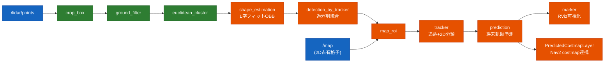
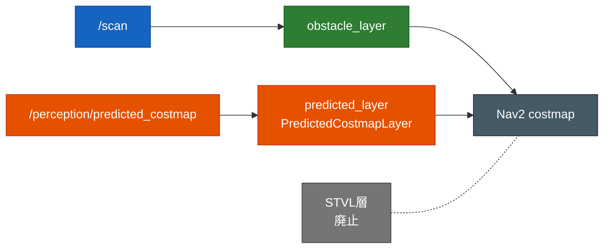

# susumu_object_perception

ROS 2 Humble + Gazebo Classic 11 上のシミュレーターパッケージ。**HuNavSim が制御する5人の歩行者**が動く
**カフェ（cafe world）**を、**3D LiDAR 搭載 TurtleBot3** が Nav2 で自律走行する。手動操縦／自動巡回ができる
**Teleop GUI** と、**Autoware 流の LiDAR perception パイプライン**（既定 ON、RViz 可視化）を備える。
perception の **prediction の予測のみ Nav2 costmap に連携**し、人の進路先を先回りで障害物化する。

- **ノード接続図 / トピック I/O 一覧**（どのノードがどのトピックで繋がっているか・Mermaid 図）: [`docs/node_topology.md`](docs/node_topology.md)
- 設計（全体構造・状態遷移・シーケンス図・パラメータ・ディレクトリ構成）: [`docs/software_design.md`](docs/software_design.md)
- Nav2 の調整（パラメータ・症状別の指針・変更履歴）: [`docs/nav2_tuning.md`](docs/nav2_tuning.md)
- perception パイプライン詳細: [`docs/autoware_perception.md`](docs/autoware_perception.md)
- 構築の詳細手順・ハマりどころ: [`SETUP.md`](SETUP.md)
- Webots 版シミュレーション: [`docs/webots_simulation.md`](docs/webots_simulation.md)

---

## できること

| 機能 | 内容 | 備考 |
|---|---|---|
| カフェ + 5人の歩行者 | HuNavSim（Social Force Model）が5人をカフェ内に配置し歩き回らせる | `max_vel: 1.5`, `vel: 0.6`〜`0.8`（通常歩行速度） |
| 3D LiDAR TurtleBot3 | waffle 上部に MID-360 近似の3D LiDAR を搭載。VLP-16版も別ファイルで保持 | `/lidar/points`（PointCloud2）を出力 |
| Nav2 自律移動 | ゴール指定で人を含む障害物を避けて自律走行 | 現在位置回避は 2D `/scan`、進路先は予測コストマップ |
| Teleop / 自動巡回 GUI | 矢印（＋テンキー）で手動操縦、トグルで自動巡回、原点ワープ | tkinter |
| Autoware 流 perception | 3D LiDAR 点群から検出〜将来軌跡予測まで（下図） | 既定 ON、RViz 可視化が主 |
| 予測コストマップ連携 | prediction の予測だけ Nav2 costmap に焼く | 自作 C++ 層が max 合成、毎フレーム作り直し |

> 「人を検知して右隣を歩く」追従機能は持たない（旧 `susumu_lidar_perception` へ分離）。

---

## perception パイプライン

検出までは **Autoware 純正モジュール**、apt に無い段や HD 地図依存の段は **2D 占有格子地図と
Autoware アルゴリズムの踏襲で自作補完**している。



### 予測コストマップ連携

prediction が**人の現在位置 + 進路先**を予測 OccupancyGrid `/perception/predicted_costmap` として出し、
自作 C++ costmap 層 `susumu_object_perception::PredictedCostmapLayer` が **max 合成**で Nav2 costmap に焼く
（人の「これから行く先」を先回りで障害物化）。毎フレーム作り直すので移動軌跡が残らない。



詳細は [`docs/autoware_perception.md`](docs/autoware_perception.md) / [`docs/nav2_tuning.md`](docs/nav2_tuning.md)。

---

## world について

既定は **cafe world**。家（house world）の素材も同梱しているが、house は狭い通路・家具密集により
歩行者が固着しやすい（[`SETUP.md`](SETUP.md) Phase H）。人がよく動き回るのは cafe。house に切り替えるには
起動引数で `map`・`base_world`・`configuration_file` を house 用に渡す。

---

## 必要環境・依存

| 種別 | 内容 |
|---|---|
| ベース | ROS 2 Humble / Gazebo Classic 11 / Nav2 / TurtleBot3(waffle) |
| 外部クローン | HuNavSim `hunav_sim` / `hunav_gazebo_wrapper`（`v1.0-humble`）、`people_msgs`（ソース） |
| ヘッダlib | `lightsfm`（`/usr/local/include` へ `make install`） |
| Python | tkinter（GUI） |

セットアップ手順は [`SETUP.md`](SETUP.md) の「Phase 0」を参照。

---

## ビルド

```bash
cd ~/ros2_ws
colcon build --symlink-install        # または --packages-select susumu_object_perception hunav_* people_msgs

# ★ source は setup.bash ではなく local_setup.bash を使うこと（理由はSETUP.md参照）
source /opt/ros/humble/setup.bash
source ~/ros2_ws/install/local_setup.bash
export TURTLEBOT3_MODEL=waffle
```

---

## 実行

全部入り（カフェ + 5人 + 3D LiDAR TB3 + Nav2 + RViz2 + Teleop GUI）:

```bash
ros2 launch susumu_object_perception simulation.launch.py
```

- RViz2 の **"2D Goal Pose"** で目的地を指定 → 人を避けて自律移動。
- **Teleop GUI** ウィンドウ:
  - 矢印ボタンを「押している間」だけ走行（テンキー 8/2/4/6、矢印キーも同じ）。
  - **自動巡回** トグルを ON にすると、Nav2 でカフェ内を順番に自動巡回。
  - **原点へワープ** で、隅にハマって動けなくなったロボットを原点へ戻す。

GUI を出したくないときは `gui:=false`:

```bash
ros2 launch susumu_object_perception simulation.launch.py gui:=false
```

Webots 版（屋外街など）も用意している（詳細は [`docs/webots_simulation.md`](docs/webots_simulation.md)）:

```bash
ros2 launch susumu_object_perception webots_simulation.launch.py world:=outdoor
```

VLP-16 版を明示して起動する場合:

```bash
ros2 launch susumu_object_perception simulation.launch.py lidar_model:=vlp16
ros2 launch susumu_object_perception webots_simulation.launch.py world:=outdoor_vlp16.wbt lidar_model:=vlp16
```

---

## launch（エントリポイント）

### 何が起動するか一覧

✅=既定で起動 / ○=引数で起動可 / —=起動しない。Sim 列は使うシミュレータ。

| launch | Sim | robot | Nav2 | SLAM | RViz | GUI | perception | 備考 |
|---|---|---|---|---|---|---|---|---|
| `simulation.launch.py` | Gazebo | ✅ | ✅ | — | ✅ | ✅ | ✅ | カフェ+5人歩行者。全部入りエントリ |
| `webots_simulation.launch.py` | Webots | ✅ | ✅ | ○ | ✅ | — | ✅ | `world:=outdoor.wbt`/`indoor.wbt` 指定 |
| `webots_outdoor.launch.py` | Webots | ✅ | ✅ | ○ | ✅ | — | ✅ | world=outdoor 固定ショートカット |
| `webots_indoor.launch.py` | Webots | ✅ | ✅ | ○ | ✅ | — | ✅ | world=indoor 固定ショートカット |
| `webots_nav.launch.py` | Webots | ✅ | ✅ | ✅ | ✅ | — | ✅ | robot+Nav2+SLAM フルスタック（自律走行可） |
| `webots_slam.launch.py` | — | — | — | ✅ | — | — | — | slam_toolbox を1個だけ起動する補助 |
| `webots_city.launch.py` | Webots | ✅ | ✅ | — | ✅ | — | ✅ | **既定 `ros2:=True`: city にセンサ付き TB3 を置き ROS2 認識（LiDAR + 全天球 + YOLO 物体分類 + 信号認識）。`ros2:=False` で SUMO 車100台の眺めるデモ**※ |

※ `webots_city ros2:=False` は SUMO 制御の車を眺めるだけで ROS2 連携しない（`/scan` 等は出ない）。
既定の `ros2:=True` は `city_robot.wbt`（車 BmwX5 + 歩行者 Pedestrian + 信号 + センサ付き TB3）を
起動し、`/cmd_vel` で対象に近づくと car/person/信号を認識する（遠方は全天球で小さく映り苦手）。

> **Webots のセンサ構成**: indoor/outdoor.wbt は **3D LiDAR（MID-360 近似）+ RGB カメラ**を搭載
> （2D LiDAR LDS-01 は廃止）。
> - 3D LiDAR → `/lidar/points/point_cloud`(PointCloud2, frame `lidar_link`)
> - カメラ → `/camera/image_raw/image_color`(Image, 1920×1080, Intel RealSense R200 相当)
> - `/scan` は `pointcloud_to_laserscan` が 3D 点群から生成（2D LiDAR の代替、Nav2/AMCL 用）
>
> **Webots の perception**: 上記 3D LiDAR を入力に Gazebo と同じ Autoware perception パイプライン
> （検出・追跡・予測・可視化）が既定 `perception:=True` で動く。RViz2 も既定 `rviz:=True`。
> 見るだけにしたいときは `perception:=False rviz:=False` を付ける。
>
> **Webots の nav/SLAM の住み分け**: `webots_simulation`/`outdoor`/`indoor` は `nav` 既定 `True`
> で Nav2(AMCL ベース)が立つが、自律走行には初期位置指定が要る。SLAM で地図を作りながら
> 完全自走したいときは `webots_nav.launch.py`（slam_toolbox 同梱）を使う。
> Webots を見るだけなら `nav:=False` を付ける。詳細は [`docs/webots_simulation.md`](docs/webots_simulation.md)。

### Webots 系 launch の引数

| 引数 | 既定 | 対象 | 意味 |
|---|---|---|---|
| `world` | `outdoor.wbt` | webots_simulation | `webots_worlds/` の world ファイル名（拡張子込み） |
| `lidar_model` | `mid360` | webots_simulation/outdoor/indoor/nav/calibration/SLAM | LiDAR profile。`mid360` または `vlp16` |
| `nav` | `True` | simulation/outdoor/indoor | Nav2 を起動（大文字必須。小文字 `true` は NameError） |
| `slam` | `False` | simulation/outdoor/indoor | Cartographer SLAM を起動（大文字必須） |
| `perception` | `True` | simulation/outdoor/indoor | Autoware perception を起動（3D LiDAR `/lidar/points/point_cloud` 入力） |
| `rviz` | `True` | simulation/outdoor/indoor | RViz2 を起動 |
| `mode` | `realtime` | webots 全般 | Webots 起動モード（realtime / fast / pause） |

### `simulation.launch.py`（Gazebo）の主な引数:

| 引数 | 既定 | 意味 |
|---|---|---|
| `use_nav2` | True | Nav2 スタックを起動する |
| `use_perception` | True | Autoware 流 perception パイプライン（LiDAR 検出・追跡・予測）を起動する |
| `image_recognition` | True | 画像認識（6面カメラ→全天球合成 + LiDAR 検出物体の YOLO 分類 + 全天球信号認識）を起動する。YOLO が重ければ False |
| `use_rviz` | True | RViz2 を起動する |
| `gui` | True | Teleop / 自動巡回 GUI を起動する |
| `lidar_model` | `mid360` | 3D LiDAR profile。`mid360`（標準）または `vlp16` |
| `map` | `maps/cafe.yaml` | マップ yaml のフルパス（house に戻すなら `maps/house.yaml`） |
| `params_file` | `config/nav2_params.yaml` | Nav2 パラメータ yaml のフルパス |
| `x_pose` / `y_pose` / `yaw` | 0.0 / 0.0 / 0.0 | ロボットの spawn 姿勢 |

> 起動順序や各部品の構成は
> [`docs/software_design.md`](docs/software_design.md#2-launch-構成と起動順序) を参照。

---

## ロボット / LiDAR 構成と制約

Gazebo Classic の標準ロボットは TurtleBot3 Waffle に上部 3D LiDAR を載せた構成で、
URDF/SDF の識別子、topic、frame はセンサ製品名に依存しない汎用名にしている。LiDAR link は
`lidar_link`、点群 topic は `/lidar/points`。標準 `lidar_model:=mid360` は
`liblivox_mid360_sensor.so`（LCAS/livox_laser_simulation_ros2 由来、ODE MultiRayShape 方式）が
MID-360 の scan pattern CSV（`config/mid360_scan_patterns/mid360.csv`）を読み、`x,y,z,intensity,tag,line`
付き PointCloud2 を出す（frame は sensor 名 = `lidar_link`）。VLP-16 版は `models/turtlebot3_waffle_vlp16/` と
`urdf/turtlebot3_waffle_vlp16.urdf.xacro` に残してあり、`lidar_model:=vlp16` で使う。

Webots の標準 world は Webots 標準 `Lidar` による MID-360 近似で、device 名は `lidar3d`、
frame は `lidar_link`、topic は `/lidar/points/point_cloud`。仰角中心を MID-360 の +22.5° に
合わせる `tiltAngle` を設定済み。VLP-16 用 world は `*_vlp16.wbt` として別に残している。

制約事項:

- Gazebo Classic 版 MID-360 は ODE MultiRayShape で CSV の非反復角度列に実 ray を撃つ。
  per-point timestamp は出さない（`x,y,z,intensity,tag,line`、tag/line はダミー 0）。
- Webots 標準 `Lidar` では Livox/MID-360 の非反復 scan pattern を直接指定できないため、FOV・レンジ・点密度の近似に留めている。
- Nav2/AMCL 用 `/scan` は 2D LiDAR ではなく、3D LiDAR 点群から `pointcloud_to_laserscan` で生成する。
- downstream の perception、色付き点群、GLIM 設定は汎用 topic/frame に寄せており、旧 `/velodyne_points` / `velodyne_link` 前提ではない。

---

## ライセンス

MIT License（[`LICENSE`](LICENSE)）。TurtleBot3 モデルは ROBOTIS、HuNavSim は
robotics-upo に帰属。
