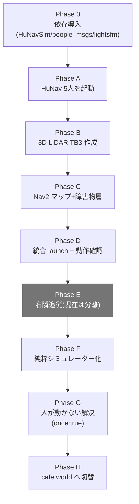
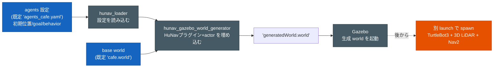
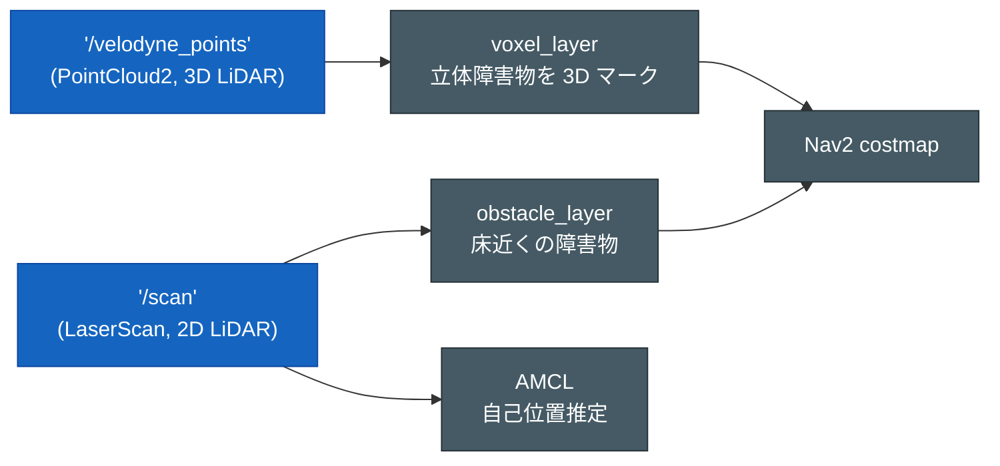

# susumu_object_perception 構築手順メモ

ROS2 Humble + Gazebo Classic 11 環境で、**HuNavSim で制御した5人**を **cafe world**（既定）で歩かせ、
**3D LiDAR搭載 TurtleBot3** が彼らを避けながら Nav2 で自律移動するシミュレーションを構築する手順の記録。
（house world は素材として同梱しており切替可能だが、人が固着しやすいため既定ではない。Phase H 参照。）

- 対象環境: ROS2 Humble / Gazebo Classic 11 / Nav2 / TurtleBot3
- ワークスペース: `/home/taro/ros2_ws`
- パッケージ: `susumu_object_perception`

> このファイルは Phase 0〜H の**時系列の構築履歴**。各フェーズのパスやコマンドは
> その時点のもの（例: launch は当初 `launch/` 直下、Phase F で `launch/include/` へ
> 移動）。**最新のディレクトリ構成・設計は [`docs/software_design.md`](docs/software_design.md)**、
> 使い方は [`README.md`](README.md) を参照（以降の各 Phase からはこれらを再掲しない）。

---

## Phase 全体フロー

各 Phase の依存関係。0（依存導入）が全ての前提で、A→B→C→D で段階的に統合 launch が完成、
E は今は分離した追従機能の履歴、F でシミュレーター化、G/H で歩行者固着問題を解決した。



| Phase | 一言サマリ | 主な成果物 |
|---|---|---|
| 0 | 依存パッケージ導入（HuNavSim v1.0-humble / people_msgs / lightsfm） | `hunav_*` ビルド |
| A | house world + HuNav 5人を起動（ロボットなし） | `hunav_house.launch.py` / `agents_house.yaml` |
| B | 3D LiDAR 搭載 TurtleBot3 を作成 | `model.sdf` / `*.urdf.xacro` / `spawn_robot.launch.py` |
| C | Nav2 マップ + 3D LiDAR 障害物回避構成 | `nav2_params.yaml` / `maps/` |
| D | 全要素を一括起動する統合 launch | `simulation.launch.py` |
| E | LiDAR で人を検知し右隣を歩く追従（**現在は別パッケージへ分離**） | （削除済み: `person_detector` / `follow_person`） |
| F | 追従を分離し純粋なシミュレーターへ。Teleop GUI 追加・launch 整理 | `teleop_gui_node.py` / `launch/include/` |
| G | 歩行者が動かない問題を `once: true` で解決 | `agents_house.yaml`（公式コピー） |
| H | house→cafe world へ切替で固着を最終解決 | `agents_cafe.yaml` / `cafe.{pgm,yaml}` |

---

## 全体構成

| 要素 | 採用 |
|---|---|
| シミュレータ | Gazebo Classic 11 |
| 場所 | **cafe**（既定。HuNav wrapper 同梱の `cafe.world` を使用）。house も同梱し切替可能（人が固着しやすく非推奨、Phase H 参照） |
| 人(歩行者) | HuNavSim 5人（既定 `agents_cafe.yaml`、Social Force Model で回避行動） |
| ロボット | TurtleBot3 waffle + 追加 3D LiDAR（Velodyne VLP-16相当 16ch）。**2D LiDAR は非搭載** |
| 3D LiDAR | Gazebo `gpu_ray` センサ + `gazebo_ros_ray_sensor` で `/velodyne_points`(PointCloud2, frame=`velodyne_link`) を出力 |
| 2D スキャン | `pointcloud_to_laserscan` が `/velodyne_points` から `/scan`(frame=`velodyne_link`) を生成（AMCL・obstacle_layer 用） |
| 自律移動 | Nav2（RViz2 でゴール指定 → 人を回避して移動）。人の現在位置 + 進路先は perception の予測コストマップ `/perception/predicted_costmap` を自作 C++ 層 `susumu_object_perception::PredictedCostmapLayer` が max 合成で焼く（旧 STVL は廃止） |
| perception | Autoware 流パイプライン（既定 ON）。crop_box→ground_filter→euclidean_cluster→shape_estimation→detection_by_tracker→map_roi_filter→object_tracker→prediction→perception_marker。検出・追跡は RViz 可視化が主、**prediction の予測のみ Nav2 costmap に連携**する |

### HuNavSim の動作原理（重要）

loader → generator → Gazebo の 3 段（タイマー連鎖）。ロボットは別 launch で後から spawn する。



> オリジナルの wrapper は **PMB2 ロボット**（PAL Robotics）を spawn する。
> 本プロジェクトでは PMB2 を **TurtleBot3 + 3D LiDAR** に置き換える。

---

## Phase 0: 依存パッケージの導入 ✅完了

### 0-1. HuNavSim のクローン（Gazebo Classic 用 v1.0-humble ブランチ）

```bash
cd ~/ros2_ws/src
git clone -b v1.0-humble https://github.com/robotics-upo/hunav_sim.git
git clone -b v1.0-humble https://github.com/robotics-upo/hunav_gazebo_wrapper.git
```

> ⚠️ `v2.0` ブランチは Gazebo Sim(Ignition Fortress)向け。本環境は Gazebo **Classic 11** なので **v1.0-humble** を使う。

### 0-2. people_msgs（apt に無いのでソースから）

```bash
cd ~/ros2_ws/src
git clone -b ros2 --depth 1 https://github.com/wg-perception/people.git people_repo
mv people_repo/people_msgs ./people_msgs
rm -rf people_repo
```

### 0-3. lightsfm（Social Force Model ヘッダライブラリ。これが無いと hunav_agent_manager がビルド不可）

```bash
cd ~/ros2_ws/third_party   # colcon の src 外に置く（colcon パッケージではないため）
git clone https://github.com/robotics-upo/lightsfm.git
cd lightsfm
sudo make install          # /usr/local/include/lightsfm/ にヘッダをコピー
```

### 0-4. rosdep & ビルド

```bash
cd ~/ros2_ws
rosdep install --from-paths src/people_msgs src/hunav_sim src/hunav_gazebo_wrapper --ignore-src -r -y
# behaviortree_cpp などが入る

source /opt/ros/humble/setup.bash
colcon build --packages-select people_msgs hunav_msgs --symlink-install
colcon build --packages-select hunav_agent_manager hunav_evaluator hunav_rviz2_panel hunav_gazebo_wrapper --symlink-install
```

ビルド成功で以下の実行ファイルが登録される:
- `hunav_agent_manager` / `hunav_loader`（hunav_agent_manager パッケージ）
- `hunav_gazebo_world_generator`（hunav_gazebo_wrapper パッケージ）

---

## Phase A: house world + 5人HuNav を起動 ✅完了

- wrapper 同梱の `scenarios/agents_house.yaml`（5人: agent1,2,7,4,5）を
  `susumu_object_perception/config/agents_house.yaml` にコピーして使用。
  - behavior: REGULAR / SURPRISED / CURIOUS / IMPASSIVE など混在、各部屋に配置、cyclic_goals。
- `susumu_object_perception/launch/hunav_house.launch.py` を作成（PMB2 spawn なし、HuNav部分のみ）。

### パッケージ構成

```
susumu_object_perception/
├── CMakeLists.txt / package.xml   # ament_cmake。launch/config/urdf/worlds/maps/rviz をinstall
├── config/agents_house.yaml       # 5人の歩行者設定
└── launch/hunav_house.launch.py   # hunav_loader → world_generator → gazebo → agent_manager
```

### 起動方法

```bash
cd ~/ros2_ws
colcon build --packages-select susumu_object_perception --symlink-install
source install/setup.bash
export TURTLEBOT3_MODEL=waffle
ros2 launch susumu_object_perception hunav_house.launch.py
```

### 動作確認結果

- 生成された `generatedWorld.world` に **actor 5体** + HuNavプラグインが埋め込まれることを確認。
- Gazebo起動、`/clock` `/human_states` `/people` トピックが publish される。
- `hunav_agent_manager` が BT ノード登録・起動。

### ⚠️ ハマりどころ（重要メモ）

1. **`from scripts import GazeboRosPaths` は使わない。**
   `GazeboRosPaths.get_paths()` は ament の全パッケージを走査するため、ワークスペース内に
   install ディレクトリが欠けた壊れたパッケージ（例: `susumu_object_tracker`）があると
   `PackageNotFoundError` で launch 全体が落ちる。→ 本launchでは get_paths() を使わず、
   `hunav_gazebo_wrapper` の models/media を `GAZEBO_MODEL_PATH`/`GAZEBO_RESOURCE_PATH` に
   直接追記する方式にした。

2. **`[hunav_plugin]: Robot model turtlebot3 not found` は Phase A では正常。**
   プラグインはロボットに対する social force を計算するためロボットを探すが、Phase A では
   まだロボットを spawn していないため出る。Phase B で TB3 を spawn すれば解消する。

3. world生成は loader 起動 → 2秒後に generator → さらに2秒後に Gazebo、という
   タイマー連鎖。起動直後はトピックが出ないので確認は ~15秒待ってから。

---

## Phase B: 3D LiDAR搭載 TurtleBot3 の作成 ✅完了

waffle の Gazebo プラグイン群は **SDF モデル**（`turtlebot3_gazebo/models/turtlebot3_waffle/model.sdf`）側に
あり、URDF にはない。そこで以下の2ファイルを作成した。

| ファイル | 役割 |
|---|---|
| `models/turtlebot3_waffle_3d/model.sdf` | waffle SDF をコピーし、上部に **VLP-16相当 16ch 3D LiDAR**（`gpu_ray` センサ）を追加。`libgazebo_ros_ray_sensor.so` で `/velodyne_points`(PointCloud2, frame=`velodyne_link`) を出力。Gazebo へ spawn する実体。 |
| `urdf/turtlebot3_waffle_3d.urdf.xacro` | 標準 waffle URDF を include し、`base_link -> velodyne_link` の TF フレームを追加。`robot_state_publisher` 用（TF専用、Gazeboプラグインは持たない）。 |

3D LiDAR 仕様: 水平 900 samples / 360°、垂直 16ch / ±15°、range 0.3〜30 m、10 Hz。

### 関連 launch

- `launch/spawn_robot.launch.py` … robot_state_publisher + spawn_entity（再利用部品）。
  `entity_name` のデフォルトは `turtlebot3`（HuNavプラグインが追跡する robot_name と一致させる）。
- `launch/test_robot_empty.launch.py` … 空world + ロボット spawn の単体確認用（`gui:=false`で headless）。

### 検証

- `gz sdf -k model.sdf` → **Check complete**（gpu_rayセンサ/プラグインが spec 適合）。
- `xacro turtlebot3_waffle_3d.urdf.xacro` → 展開成功、velodyne_link を含む。
- launch description のビルド成功（5アクション）。
- Gazebo `libGpuRayPlugin.so` / `libgazebo_ros_ray_sensor.so` 存在を確認。

### ⚠️ 超重要ハマりどころ: ワークスペースの source は `local_setup.bash` を使う

| 症状 | 原因 | 対処 |
|---|---|---|
| `ros2 launch susumu_object_perception ...` が "package not found" になる | `install/setup.bash` は**古いスナップショット**を指す prefix-chain で、新規追加した `susumu_object_perception` / `hunav_*` / `people_msgs` が**含まれない** | **必ず `install/local_setup.bash` を source する**（`_local_setup_util` 経由で最新のパッケージ一覧を持つ） |

```bash
source /opt/ros/humble/setup.bash
source ~/ros2_ws/install/local_setup.bash   # ★ setup.bash ではなく local_setup.bash
```

> 注: 本環境（サンドボックス）では Gazebo を起動する launch をバックグラウンド/timeout 付きで
> 回すと標準出力が取りこぼされることがある。実機（通常の端末）では問題なく出力される。
> ライブ確認は Phase D の統合 launch を通常端末で実行して行うのが確実。

## Phase C: Nav2マップ + 障害物回避構成 ✅完了

### マップ

- HuNav wrapper 同梱の house マップ（`house.pgm` / `house.yaml`）を
  `susumu_object_perception/maps/` にコピーして使用（SLAM 不要）。
  - resolution 0.05, origin `[-9.4, -5.57, 0]`, サイズ 375×222。

### Nav2 パラメータ（`config/nav2_params.yaml`）

TurtleBot3 `waffle.yaml` をベースに、**3D LiDAR を障害物回避に使う**よう改造:

当時の構成（当時は 2D LiDAR 搭載・3D は voxel_layer）:

| 設定 | 当時の値 | 役割 |
|---|---|---|
| **AMCL** | `scan_topic: scan`, `set_initial_pose: true` | 2D LiDAR で自己位置推定。spawn 位置で自動初期化（RViz の初期姿勢不要） |
| **costmap voxel_layer** | observation を `/scan`(LaserScan) → **`/velodyne_points`(PointCloud2)** に変更。`z_resolution: 0.1`, `z_voxels: 16`, height 0.05〜2.0 m | 歩いている人を含め、あらゆる高さの障害物を 3D で costmap にマーク |
| **obstacle_layer** | 2D `/scan` | 床近くの障害物を併用 |

> 役割分担（当時）: **2D LiDAR = 自己位置推定(AMCL) + 低い障害物**、
> **3D LiDAR = 立体的な動的障害物（人）の回避**。

> **【現状との差分】** この Phase 以降に構成が更新されている（以下は現状）:
> - **2D LiDAR は非搭載**。`/scan` は 3D 点群から `pointcloud_to_laserscan` で生成する
>   （AMCL・obstacle_layer はこの生成 `/scan` を使う。frame は `velodyne_link`）。
> - **3D の voxel_layer は廃止。STVL も廃止**（人の通過跡が `voxel_decay` 秒残り「移動軌跡の
>   コスト」が出たため）。動的障害物の現在位置 + 進路先は **perception の予測コストマップ**
>   `/perception/predicted_costmap` を自作 C++ 層 **`susumu_object_perception::PredictedCostmapLayer`**
>   が max 合成で焼く（[`docs/nav2_tuning.md`](docs/nav2_tuning.md) /
>   [`docs/autoware_perception.md`](docs/autoware_perception.md)「Nav2 連携」）。obstacle_layer は
>   生 `/scan` のまま。
> - **既定 world は cafe**（map=`cafe.yaml`）。house は素材のみ同梱。

### 当時の 2系統入力（2D `/scan` + 3D `/velodyne_points`）



## Phase D: 統合 launch + 動作確認 ✅完了

`launch/simulation.launch.py` で全要素を一括起動する。起動順（TimerActionで段階化）:

1. `hunav_house.launch.py` を include → Gazebo(house) + 5人HuNav 起動（`navigation:=True`
   なので static map->odom は出さず、Nav2/AMCL に任せる）。
2. +8秒: `spawn_robot.launch.py` を include → 3D LiDAR TB3 を spawn + robot_state_publisher。
3. +12秒: `nav2_bringup/bringup_launch.py` を include → AMCL + Nav2（map=house.yaml,
   params=nav2_params.yaml, slam=False, autostart=True）。
4. +12秒: RViz2（`rviz/simulation.rviz`、Velodyne PointCloud表示を追加済み）。

### フレーム/トピックの整合（確認済み）

| 項目 | ロボット(SDF) | Nav2(params) | 一致 |
|---|---|---|---|
| 速度司令 | `cmd_vel` (subscribe) | controller → `cmd_vel` | ✓ |
| オドメトリ | frame/topic `odom`, `publish_odom_tf:true` | odom_frame `odom` | ✓ |
| ベース | `base_footprint` | amcl base `base_footprint`, costmap base `base_link` | ✓ |
| 2D スキャン | `/scan` / frame `velodyne_link`（**2D LiDAR は非搭載**。`pointcloud_to_laserscan` が `/velodyne_points` から生成） | amcl scan_topic `scan`, obstacle_layer `/scan` | ✓ |
| 3D LiDAR | `/velodyne_points` / frame `velodyne_link` | Autoware perception 入力 + pointcloud_to_laserscan（→ /scan）。※ Nav2 costmap への 3D STVL 層は廃止 | ✓ |

### 検証

- 全 launch description のビルド成功（simulation: 12アクション）。
- `gz sdf -k` でモデル spec 適合、xacro 展開 OK、nav2/rviz の YAML 妥当。
- Phase A で HuNav+Gazebo パイプラインのライブ動作（プラグイン稼働）を確認済み。

> 本サンドボックス環境では Gazebo を起動する launch をバックグラウンド/timeout で回すと
> プロセスが即終了し標準出力が残らないため、**統合 launch のライブ目視確認は通常端末で**
> 実施すること（下記「実行方法」参照）。

---

## ▶ 実行方法（まとめ）

### 1. 初回セットアップ（一度だけ）

Phase 0 の依存（HuNavSim / people_msgs / lightsfm）を導入・ビルドする。

```bash
cd ~/ros2_ws
colcon build --symlink-install   # もしくは個別に susumu_object_perception と hunav_* を
```

### 2. 毎回の環境構築（★ setup.bash ではなく local_setup.bash）

```bash
source /opt/ros/humble/setup.bash
source ~/ros2_ws/install/local_setup.bash   # ★ local_setup.bash（理由は Phase B 参照）
export TURTLEBOT3_MODEL=waffle
```

### 3. 本体起動

```bash
ros2 launch susumu_object_perception simulation.launch.py              # 全部入り（GUI含む）
ros2 launch susumu_object_perception simulation.launch.py gui:=false   # GUI 無効
```

- 起動後 RViz2 の **"2D Goal Pose"** で目的地を指定 → TB3 が 3D LiDAR で 5人を避けながら
  自律移動。
- Teleop GUI（既定 ON）で矢印/テンキー手動操縦、AUTO トグルで Nav2 巡回、WARP で原点へワープ。
- perception（既定 ON）の検出・追跡・予測は RViz の `/perception/markers` で可視化。予測は
  Nav2 costmap に連携する（Phase C「現状との差分」参照）。

### 4. デバッグ（段階起動・確認コマンド）

```bash
# 人だけ（Phase A）
ros2 launch susumu_object_perception hunav_house.launch.py

# 空worldでロボット単体＋3D LiDAR確認（Phase B）
ros2 launch susumu_object_perception test_robot_empty.launch.py        # gui:=false で headless

# Nav2なしで人＋ロボットだけ
ros2 launch susumu_object_perception simulation.launch.py use_nav2:=false use_rviz:=true
```

```bash
ros2 topic echo /velodyne_points --once        # 3D点群（PointCloud2）
ros2 topic echo /people --once                 # HuNavの5人
ros2 topic list | grep -E "velodyne|scan|people|human_states|cmd_vel"
ros2 run tf2_tools view_frames                 # TFツリー（map->odom->base_footprint->...->velodyne_link）
```

---

## Phase E: LiDARのみで人を検知し「右隣を歩く」追従 ✅完了

> 要件: **HuNavSimの真値を覗かず**、LiDARデータから人を検知してNav2でついていく。
> その人の**進行方向の右隣**を歩く。

### ノード構成（`susumu_object_perception/` Pythonモジュール）

| ノード | 役割 |
|---|---|
| `person_detector_node.py` | `/velodyne_points` を TF で odom 系へ→高さ帯フィルタ→scipy.ndimage の XYグリッド連結成分クラスタリング→人サイズ抽出→簡易最近傍トラッキングで速度推定。動くクラスタ=人。出力 `/perception/persons`(PoseArray, 向き=進行方向) と `/perception/persons/markers`。**`/people`等のHuNav真値は不使用。** |
| `follow_person_node.py` | 起動時に最寄りの人をロックオン→毎周期 最近傍ゲーティングで同一ターゲット再同定→進行方向の右へ `side_offset` ずらした位置を算出→`navigate_to_pose`(Nav2)へ送信。ロスト時はその場待機し timeout で解除。出力 `/follow/goal_marker`。 |

### launch

- `launch/follow_person.launch.py` … 検知+追従の2ノード。
- `launch/simulation.launch.py` に **`follow:=true`** を追加（Nav2起動後 +18秒で追従開始）。

```bash
ros2 launch susumu_object_perception simulation.launch.py follow:=true
```

### ament_cmake で Python ノードを同梱する際の要点

- `CMakeLists.txt`: `ament_cmake_python` + `ament_python_install_package(${PROJECT_NAME})`
  + `install(PROGRAMS susumu_object_perception/*.py DESTINATION lib/${PROJECT_NAME})`。
- ⚠️ **ソースの .py に実行ビット(`chmod +x`)が必要**。無いと `ros2 run` が
  `No executable found` になる。
- 起動は **ファイル名**で: `ros2 run susumu_object_perception person_detector_node.py`。

### 検証

- 両ノードを rclpy で構築成功（subs/pubs/TF/action client OK）。
- **右側幾何の単体テスト**: 人が (2,0) で進行方向=東(+x) のとき、ゴールは (1.80, **−0.80**)
  = 人の**右** 0.8 m・後方 0.2 m。`y` が負＝進行方向の右側で正しい。
- 全 launch のビルド成功（simulation: 14アクション、follow: 6アクション）。

### ⚠️ 設計上の注意

- 検知は **`/velodyne_points` だけ**を入力にしている（要件の「HuNavを覗かない」を厳守）。
  HuNav の `/people` は答え合わせ用に echo するのは可だが、追従ロジックには絶対に使わない。
- 「右」= **人の進行方向に対する右**（heading の右法線 `(sin h, -cos h)`）。
  人がほぼ静止のときは直近の進行方向を流用する。

---

## 🔬 シミュレーターでの実動作確認（実施済み）

`simulation.launch.py follow:=true` をバックグラウンド起動し、実際のGazeboで検証した。

### ✅ 確認できたこと

- Gazebo(house+5人) 起動、3D LiDAR TB3 spawn 成功。
- Nav2 全ライフサイクル active（planner/controller/smoother/bt_navigator）。
- `person_detector`: `/velodyne_points` から **~9.3 Hz で 4〜6人を検知**・publish。
- `follow_person`: 人をロックオン → Nav2 が追従ゴールを実行（`Reached the goal` / 連続preemption）。
- ロボットが実際に移動し、算出した右側ゴールへ向かうことを odom で確認。

### 🐞 発見して修正したバグ

1. **Nav2 planner プラグイン名の形式不一致（致命的）**
   - 症状: `planner_server` が `[FATAL] ... class nav2_navfn_planner::NavfnPlanner does not exist`
     で落ち、navigation が起動しなかった。
   - 原因: ベースにした `turtlebot3_navigation2/param/waffle.yaml`(v2.3.6) は新しい Nav2 の
     **`::` 形式**プラグイン名を使うが、インストール済み Nav2 は **1.1.20**（`/` 形式）。
     パッケージ間のバージョン不整合。
   - 対処: `nav2_params.yaml` を **同バージョンの `nav2_bringup/params/nav2_params.yaml`
     (1.1.20)** をベースに作り直し（planner=`nav2_navfn_planner/NavfnPlanner` 等）、その上で
     3D LiDAR の voxel_layer 改造と AMCL `set_initial_pose` を再適用。

2. **追従ターゲットのロストが頻発（挙動改善）**
   - 症状: 7〜14秒ごとに `Target lost` し別人に乗り換わる。
   - 原因: follow ノードが「前回位置」中心の狭いゲート(1.0m)で再同定していたため、
     1 m/s 超で歩く人が次フレームでゲート外に出ていた。
   - 対処: ターゲットの**速度を推定し、予測位置中心でゲーティング**するよう変更。
     `lock_gate` 1.0→1.6m、`lost_timeout` 5→8s に調整。→ 1人を **~18秒以上**継続追従。

> どちらもシミュレーターを実際に動かさなければ顕在化しないバグだった（静的検証だけでは
> 検出できない）。実機確認の重要性の好例。

3. **ロボットが追従移動しない（検知が偽物をロック）**
   - 症状: ロボットがほぼ初期位置から動かない。
   - 原因: 検知ノードが **ロボット至近(0.89m)の自己点群/壁を「人」としてロック**していた。
     本物の人は2.9m以上先にいたのに、最寄り選択で偽物を掴み「既に右隣 → 動く必要なし」状態。
     加えて **全クラスタが速度0=静止判定**で、歩く人を見分けられていなかった。
   - 対処（`person_detector_node.py`）:
     - **センサ近傍フィルタ** `range_min=0.45m`（自己点群・至近誤検知を除外）
     - **速度推定を長基線化**（直近 vs 0.5秒前の履歴差分）→ 低速歩行をジッタから分離
     - **「動いている物体のみ」を `/perception/persons` に出力**（`publish_only_moving`）。
       要件の「動物体」に合致し、壁・家具・自己点群を自動除外。

---

## 📝 調整: 人の移動速度を1/3に + 確実な継続追跡

### 人の速度を1/3（`config/agents_house.yaml`）

| 項目 | 変更前 | 変更後 |
|---|---|---|
| `max_vel` | 1.5 | **0.5** |
| behavior `vel` | 0.6 / 0.8 | **0.2 / 0.27** |
| `once` | true（30〜40秒で behavior 失効→停止） | **false**（失効しない） |

> `cyclic_goals: true` と合わせ、**5人がゆっくり・無限に歩き続ける**。
> （`once: true` のままだと数十秒で止まり追跡対象が消える問題があった。）

> ⚠️ **【後日判明・重要】上記の `once: false` は誤り。** Phase F 以降の検証で、
> `once: false` だと**ほとんどのエージェントが数十秒で停止する**ことが分かった
> （HuNav の behavior 駆動が正しく回らない）。正しくは公式 house シナリオと同じ
> **`once: true` + `cyclic_goals: true`** で、これで5人が巡回し続ける。
> 詳細は [Phase G](#phase-g-人が動かない問題の解決once-true) を参照。

### 確実にずっと追跡（パラメータ調整）

- `person_detector`: `moving_speed` 0.10→**0.04**（低速でも人と認識）、
  `max_misses` 15→**30**（短時間のオクルージョンでトラックを維持）。
- `follow_person`: `lost_timeout` 8→**20s**、`select_max_range` 6→**8m**、
  `min_speed_for_heading` 0.12→**0.05**、`goal_eps` 0.25→**0.2**。

### 実機検証（実施済み）

- 人の移動速度が低下（真値で確認）。
- **約55秒間 ロスト0回**で同一人物を継続追跡（preemption 84回＝活発に追従、
  `No valid trajectory` エラー 0）。ロボットが人を追って継続移動することを odom で確認。

---

## 🔧 追加調整: 右側到達・方向転換・軌跡コストマップ

> **【現状では非該当・旧実装の履歴】** 以下は **追従機能（`person_detector` /
> `follow_person`）が本パッケージにあった頃の調整履歴**。追従機能は旧
> `susumu_lidar_perception` へ分離され、本パッケージには無い。`/velodyne_points_filtered`
> や `person_clear_radius` も現存しない。現在の歩く人の costmap 跡対策は **Nav2 の STVL
> 層（時間減衰 voxel）** が担う（[`docs/nav2_tuning.md`](docs/nav2_tuning.md)）。
> 当時の経緯として残す。

利用者からの実機フィードバックに基づく改善（課題 A〜D）。

| 課題 | 原因 | 対処 | 結果 |
|---|---|---|---|
| **A.** 人の進行方向の右側に行けない | 歩く人が 3D LiDAR で障害物検知され、**移動軌跡に沿って costmap に障害物の帯が残り**人の横へ回り込めない。加えて inflation が右側ゴール(0.8m)を覆っていた | ① 検知ノードが「動いている人」を除去した点群 `/velodyne_points_filtered` を publish（`person_clear_radius=0.5m`、センサ系 `velodyne_link` のまま）→ voxel_layer はこれを使い**人が帯を残さない**（壁など静止物は温存）。② `inflation_radius` 0.55→**0.35**、`side_offset` 0.8→**1.0m** | 実機で `Reached the goal` 複数回・`No valid trajectory` 0（以前は立ち往生） |
| **B.** ロボットの方向転換が多い | 追従ゴールの heading がターゲット速度のノイズで揺れ、右側位置が振れていた | `follow_person_node`: 速度を強平滑化（`vel_smoothing=0.8`）、**heading を角度ローパス**（`heading_smoothing=0.85`、wrap-safe）、`goal_eps` 0.25→0.35 でゴール再送抑制 | ゴール更新(preemption)が 84→約22/同程度時間 に減少 |
| **C.** 人(歩行者)の方向転換が多すぎる | 各エージェントが 3 ゴールの三角形を周回し各頂点で旋回＋social 力で互いに/ロボットを避けて蛇行 | `agents_house.yaml`: **social_force_factor 5.0→1.0 / other_force_factor 20.0→2.0 / obstacle_force_factor 10.0→4.0**（蛇行抑制）、**ゴール 3→2 個**（g2 除外。2点間を直線往復）、`goal_radius` 0.3→0.8 | 真値で進行方向がほぼ一定（往復）になることを確認 |
| **D.** 人の移動軌跡のコストマップが残り続ける | 3D 点群はフィルタ済みだが、**Nav2 の `obstacle_layer` が生の 2D `/scan` を使っていた**。2D は人を除去せず軌跡に帯をマークし続ける | ① 検知ノードが 2D scan からも人を除去し `/scan_filtered` を publish（各ビームのヒット点を odom 系へ変換、移動中トラックの `person_clear_radius` 内なら range を ∞。壁は温存）。② 両 costmap の `obstacle_layer` を `/scan` → **`/scan_filtered`**（AMCL は生 `/scan` のまま） | global costmap の lethal セルが増え続けず安定、`No valid trajectory` 0・復旧 0、人を追って継続移動（15秒で 3.1m） |

> まとめ: 「人を costmap に残さない」には **3D点群と2Dスキャンの両方**から人を
> 除去する必要がある。片方だけだと残ったセンサが軌跡の帯を作る。

---

## Phase F: 純粋なシミュレーター化（追従機能の分離）✅完了

> このパッケージを「人を検知して右隣を歩く」追従ロボットから、**純粋な
> シミュレーター**へ変更した。追従系（人検知・右側追従）は別パッケージ
> `susumu_lidar_perception` へ分離。

### やったこと

1. **追従ノードを削除**: `susumu_object_perception/follow_person_node.py`（右側追従）と
   `susumu_object_perception/person_detector_node.py`（LiDAR人検知＋人除去フィルタ）を削除。
   `launch/follow_person.launch.py` と `simulation.launch.py` の `follow:=true`
   パイプラインも削除。
2. **Nav2 を生センサに戻した**: `config/nav2_params.yaml` の costmap 入力を
   人除去済みの `/scan_filtered`・`/velodyne_points_filtered` から、生の
   `/scan`・`/velodyne_points` に戻した（検知ノードが消えてフィルタトピックが
   出なくなるため）。人も普通の障害物として costmap に乗る。
3. **歩行者を通常速度へ復元**: `config/agents_house.yaml` を、追従デモ用に
   落としていた値（`max_vel:0.5`, `vel:0.2`/`0.27`, 2ゴール, force factors
   4/1/2, `goal_radius:0.8`）から通常歩行（`max_vel:1.5`, `vel:0.6`/`0.8`,
   3ゴール三角ルート, force factors 10/5/20, `goal_radius:0.3`）へ戻した。
4. **Teleop GUI を追加**: `susumu_lidar_perception` を参考に
   `susumu_object_perception/teleop_gui_node.py`（tkinter）を追加。矢印/テンキー手動操縦＋
   AUTO トグルで部屋を Nav2 巡回＋原点ワープ。`simulation.launch.py` に
   `gui`（既定 True）引数で組み込み（Nav2 起動後 +15秒）。
5. **launch をサブフォルダへ整理**: エントリの `launch/simulation.launch.py` は
   そのまま、内部で include される部品 launch（`hunav_house` / `spawn_robot` /
   `test_robot_empty`）を **`launch/include/`** へ移動。`simulation.launch.py` と
   `test_robot_empty.launch.py` の include パスを `launch/include/...` に修正
   （`install(DIRECTORY launch ...)` はサブフォルダごと入るため CMakeLists は修正不要）。
6. **ドキュメント整備**: 設計を `docs/software_design.md`（表・Mermaid 状態遷移/
   シーケンス図）に集約。README はディレクトリ構成等をデザインへ移し、launch
   一覧とデザインへのリンクを掲載。`CLAUDE.md`（`@AGENTS.md`）を追加。
7. **ライセンスを MIT に**: `package.xml` を `MIT` に変更し `LICENSE` を追加。
8. **コメントを日本語化**: `teleop_gui_node.py` と全 launch のコメント・docstring・
   引数説明を日本語へ（ROS のトピック名やログ文字列は英語のまま）。

### 検証

```bash
rm -rf build/susumu_object_perception install/susumu_object_perception   # 削除/移動ファイルを install から消す
colcon build --packages-select susumu_object_perception --symlink-install
# → install/.../lib/susumu_object_perception には teleop_gui_node.py のみ、
#   follow_person.launch.py は消え、部品 launch は share/.../launch/include/ に
#   入っていることを確認
ros2 launch susumu_object_perception simulation.launch.py --show-args   # gui 引数が出る
```

---

## Phase G: 人が動かない問題の解決（`once: true`）✅完了

> 症状: full simulation で **5人中2〜3人（時に0〜1人）しか動かず**、止まった
> エージェントは init 付近や中央 (3,0.5) で固着。人だけ起動（ロボットなし）では
> `Robot model turtlebot3 not found` でアクターが崩壊し、**T ポーズ・床埋まり・空中**に
> なる（z 座標が -3.0〜+2.2 と異常値）。

### 切り分けでやったこと（いずれも効果なし）

- init_pose を家全体に分散（→ 家の外・壁・家具に埋まる別問題を誘発しただけ）
- 全 behavior を REGULAR に統一 → 改善せず
- ゴールの密集解消・家具回避 → 改善せず
- → **設定（init/goal/behavior）の調整では直らない**ことが複数回の実機検証で確定。

### 真因と解決

GitHub と HuNav 同梱シナリオを調査し、**動作実績のある公式設定**
`hunav_gazebo_wrapper/scenarios/agents_house.yaml` と比較したところ、決定的な違いは
**`once`** だった。`cyclic_goals` は両者 `true` で同じ。

| `once` | `cyclic_goals` | behavior 駆動 | 結果 |
|---|---|---|---|
| **false**（誤・旧設定） | true | 正しく回らない | ほとんどのエージェントが数十秒で停止 |
| **true**（正・公式） | true | 巡回し続ける | 5/5 全員が継続的に動き回る |

**対処**: 公式 `scenarios/agents_house.yaml` を `config/agents_house.yaml` に
そのままコピー（`cp`）。これで起動後 **5/5 全員が家の中を継続的に動き回る**ことを
実機で確認。

```bash
cp ~/ros2_ws/src/hunav_gazebo_wrapper/scenarios/agents_house.yaml \
   ~/ros2_ws/src/susumu_object_perception/config/agents_house.yaml
colcon build --packages-select susumu_object_perception --symlink-install
ros2 launch susumu_object_perception simulation.launch.py
# /people の各エージェント位置が継続的に変化することを確認
```

> 教訓: 設定をゼロから調整するより、**動作実績のある同梱シナリオをコピー**して
> 差分を見るのが最短だった。init_pose の z=1.25（agent5）も誤記ではなく公式通り。

---

## Phase H: house→cafe world へ切り替え（人が動く問題の最終解決）✅完了

> 症状: house world では、公式 `agents_house.yaml` をコピーしても、init/goal/behavior/
> once/duration/goal_radius をどう調整しても、**起動直後に5人中ほぼ全員が同じ場所で固着**
> （複数エージェントを置くと特に顕著）。十数回の実機検証で、設定調整では直らないことが確定。

### 原因

house world は**狭い通路・折戸・家具の密集**があり、複数エージェントの経路が中央リビング
付近で交差すると、Social Force Model の相互回避力でデッドロックして止まる。公式の cafe
シナリオは「動く」と報告されており（hunav_sim issue #7）、**house world 固有の問題**。

### world の比較（cafe を既定に採用）

| world | 環境 | 歩行者の挙動 | 採用 |
|---|---|---|---|
| **cafe**（既定） | 広い・障害物が少ない | 公式実績あり。各時点で 3〜4/5 が継続移動 | ◯ 既定 |
| house | 狭い通路・折戸・家具密集 | 中央リビングで経路が交差しデッドロック・固着 | 素材のみ同梱（非推奨） |

### 解決: cafe world へ切り替え

公式が動作実績を持つ **cafe シナリオ**に変更:

```bash
# マップと人設定を susumu_object_perception にコピー
cp ~/ros2_ws/src/hunav_gazebo_wrapper/maps/cafe.{pgm,yaml} ~/ros2_ws/src/susumu_object_perception/maps/
cp ~/ros2_ws/src/hunav_gazebo_wrapper/scenarios/agents_cafe.yaml \
   ~/ros2_ws/src/susumu_object_perception/config/
```

- `launch/include/hunav_house.launch.py`: `configuration_file` 既定を `agents_cafe.yaml`、
  `base_world` を `cafe.world` に変更。
- `launch/simulation.launch.py`: `map` 既定を `cafe.yaml` に変更。
- **spawn 遅延を 8→15 秒**に延長（cafe.world は house より重く、`/spawn_entity` サービスが
  立つ前に spawn しようとして `Was Gazebo started with GazeboRosFactory?` で失敗していた）。
  これに合わせ nav2/rviz を 12→20s、gui を 15→24s に後ろ倒し。

### 検証

```bash
colcon build --packages-select susumu_object_perception --symlink-install
ros2 launch susumu_object_perception simulation.launch.py
# /people を観察 → 起動後、各時点で 3〜4/5 が継続的に移動（顔ぶれは入れ替わる）。
# agent1 は 25秒で 4.29m 移動するなど、house の「全員固着」とは別物。
```

> house の素材（house.world / agents_house.yaml / house.{pgm,yaml}）は残してあるので、
> `map:=.../house.yaml` + `configuration_file:=agents_house.yaml` + `base_world:=house.world`
> で house に戻すことも可能（ただし人は固着しがち）。

---

## トラブルシュート memo

- `fatal error: lightsfm/sfm.hpp: No such file` → Phase 0-3 の lightsfm 未導入。
- `no rosdep rule for 'people_msgs'` → apt に無い。Phase 0-2 でソース導入。
- v2.0 を間違えて入れると Gazebo Sim 依存でビルド/起動に失敗する → v1.0-humble を使う。
- 人が起動直後に全員固着する → house world 固有のデッドロック。cafe world を使う（Phase H）。
- `Was Gazebo started with GazeboRosFactory?` で spawn 失敗 → world が重く spawn が早すぎ。
  `simulation.launch.py` の spawn TimerAction 遅延を増やす（cafe では 15 秒）。
- 人が全く動かない／T ポーズ／床埋まり → ロボット未 spawn が原因のことが多い
  （HuNav はロボット必須）。`Robot model turtlebot3 not found` がログに出ていないか確認。
