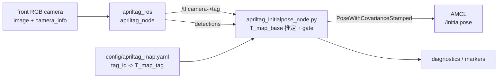

# AprilTag 位置合わせ導入メモ

## 目的

シミュレータ上でロボットの `map` 座標を既知ターゲットに合わせ、同じ考え方を実機の初期位置合わせにも使う。
対象は主に次の2つ。

- 保存済み地図 + AMCL で、起動時や自己位置喪失時に `/initialpose` を自動投入する。
- シミュレータの world 座標、SLAM 地図、実機の現場座標のずれを、既知タグの観測で定量評価する。

LiDAR-camera 外部キャリブレーションにも AprilTag 板は使えるが、このページではロボットの位置合わせを主対象にする。
外部キャリブレーションは既存の `docs/omni_lidar_camera.md` と `direct_visual_lidar_calibration` 導線を正本にする。

## 結論

導入は有効。ただし、最初から全天球画像へ直接入れない。
`apriltag_ros` は rectified なピンホール画像と同時刻の `CameraInfo` を前提に姿勢を出すため、初期実装は
既存の前方RGBカメラを使う。

| 項目 | 採用方針 |
|---|---|
| 検出器 | `ros-humble-apriltag-ros` を使う。自作検出器や独自 `.msg` は作らない |
| 入力画像 | まず `/camera/image_raw/image_color` + `/camera/image_raw/camera_info`。実機は `image_proc` 後の rectified 画像を推奨 |
| 出力利用 | `apriltag_ros` の TF / `apriltag_msgs/AprilTagDetectionArray` から既知タグを選び、`PoseWithCovarianceStamped` を `/initialpose` へ出す |
| TF 方針 | AMCL / slam_toolbox が出す `map->odom` と競合させない。AprilTag ノードが直接 `map->odom` を常時publishする構成は初期採用しない |
| 全天球対応 | 後続フェーズ。既存の信号認識と同じ透視ビュー分割を使い、仮想ピンホール画像ごとに検出する |
| 実機移行 | タグサイズ、ID、`map` 上のタグ姿勢、カメラ内部パラメータを同じ YAML 契約で管理する |

## 現状との相性

このパッケージには既に次がある。

- Webots: 前方RGBカメラ `/camera/image_raw/image_color` と camera_info、全天球カメラ、3D LiDAR。
- Gazebo Classic: 前方RGBカメラと6面カメラ。6面は `omni_image_node.py` で全天球へ合成している。
- Nav2/AMCL: `/initialpose` は `teleop_gui_node.py` の原点ワープで既に使っている。
- 評価系: Webots GPS/IMU truth と `map->base_footprint` を比較する `live_slam_truth_monitor.py` がある。

従って、AprilTag は「既知タグ観測から `/initialpose` を出す小さな橋渡しノード」として足すのが一番小さい。
既存の perception、costmap、prediction には混ぜない。

## データフロー案



姿勢計算は次の合成で十分。

```text
T_map_base = T_map_tag * inverse(T_camera_tag) * inverse(T_base_camera)
```

`T_camera_tag` は `apriltag_ros` が出す TF、`T_base_camera` は URDF/TF、`T_map_tag` は既知タグ地図から読む。
複数タグが見えた場合は、hamming、decision_margin、距離、視線角で gate し、残った候補をロバスト平均する。

## 実装フェーズ

### Phase 1: 前方カメラでAMCL初期姿勢を入れる

追加候補:

- `config/apriltag_front.param.yaml`
  - family、tag size、detector tuning、対象ID。
- `config/apriltag_map.yaml`
  - tag ID、family、size、`map` 座標の pose。
- `susumu_object_perception/apriltag_initialpose_node.py`
  - TF + `AprilTagDetectionArray` を読み、`/initialpose` をpublish。
  - 連続publishではなく、起動時、手動サービス、または品質が十分なときの単発補正にする。
- `launch/include/apriltag_localization.launch.py`
  - `apriltag_ros/apriltag_node` と上記ノードを起動。

合格条件:

- シミュレータで既知タグ前にロボットを置き、`/initialpose` 後の `map->base_footprint` が真値または既知起点に対し
  0.2 m / 5 deg 程度に入る。
- タグが見えない、ID不一致、品質不足、距離過大の場合に補正しない。
- `slam:=True` で AMCL が起動していないときは `/initialpose` を出さず、診断だけにする。

### Phase 2: Webots / Gazebo worldにタグ板を置く

Webots は `Solid` の薄い板に `ImageTexture` を貼る。Gazebo Classic は薄い model の visual material にタグ画像を貼る。
タグ板には `boundingObject` / collision を持たせるかは用途で分ける。

- 位置合わせ専用でナビ経路外に置くなら collision あり。
- 既存地図やcostmapを汚したくない検出評価だけなら、経路外に置くか、検証専用 world に分離する。

`calibration.wbt` は既に色板やランドマークがあり、検証 world として相性が良い。
通常巡回 world に入れる場合は、タスク条件が変わるため該当する `docs/tasks/` を更新する。

### Phase 3: 実機共通化

実機で必要な契約:

- 印刷したタグの family / id / 有効エッジ長[m]を固定する。
- AprilTag の有効サイズは外紙サイズではなく、検出コーナー間のタグエッジ長として測る。
- タグ面が反らない剛性板に貼る。
- `map` 上の `T_map_tag` を測量、または地図作成時にタグ位置を登録する。
- 実機カメラはキャリブレーション済みの `CameraInfo` を出し、`image_proc` の rectified 画像を検出に使う。
- タグが見える場所へロボットを一度向けてから `/initialpose` を入れる。走行中の連続補正は初期採用しない。

### Phase 4: 全天球対応

全天球画像の `CameraInfo` は標準的なピンホールモデルではないため、`apriltag_ros` にそのまま渡すと姿勢推定が壊れる。
全周でタグを拾いたい場合は、既存の `traffic_light_detector_node.py` と同様に全天球を複数の透視ビューへ展開し、
各ビューに仮想ピンホール `CameraInfo` と仮想 camera frame を与えて検出する。

これは初期位置合わせが安定してから行う。まずは前方RGBで十分。

## robot_localization との関係

`robot_localization` は `PoseWithCovarianceStamped` を入力にできるが、現状のNav2構成ではAMCLまたはslam_toolboxが
`map->odom` を担っている。ここに AprilTag 由来の絶対姿勢を別ノードで常時融合すると、TF発行元が競合しやすい。

初期採用では次の分担にする。

- AMCLあり: AprilTagは `/initialpose` を出すだけ。
- SLAM中: AprilTagは地図/真値の評価とログだけ。
- 将来の実機localization専用モード: AMCLを使わない構成を別launchに分け、`robot_localization` へ絶対姿勢として入れる。

## パラメータ初期値案

| 項目 | 初期値 |
|---|---|
| family | `36h11` で開始。恒久運用を新規設計する場合は `Standard41h12` も検討 |
| tag size | シミュレータ 0.20 m 以上、実機屋内 0.16-0.30 m 目安 |
| max_hamming | 0 |
| detector.decimate | 2.0。遠距離が弱ければ 1.0 |
| 補正距離 | 0.4-3.0 m から開始 |
| `/initialpose` covariance | x/y: 0.04、yaw: 0.03 程度から開始し、実測で広げる |
| 補正条件 | 同一タグを3フレーム以上、または複数タグ一致。走行速度が低いときだけ採用 |

## 参照した一次情報

- `apriltag_ros`: https://github.com/christianrauch/apriltag_ros
  - rectified image、`CameraInfo`、`/tf`、`apriltag_msgs/AprilTagDetectionArray` を使う。
- AprilRobotics AprilTag 3: https://github.com/AprilRobotics/apriltag
  - タグfamily、姿勢推定、タグサイズの測り方、検出パラメータ。
- AprilTag画像: https://github.com/AprilRobotics/apriltag-imgs
  - 事前生成タグ画像とSVG生成スクリプト。
- Nav2 AMCL configuration: https://docs.nav2.org/configuration/packages/configuring-amcl.html
  - `set_initial_pose` と初期姿勢パラメータ。
- Nav2 robot_localization setup guide: https://docs.nav2.org/setup_guides/odom/setup_robot_localization.html
  - `PoseWithCovarianceStamped` を含む複数センサ融合と `odom->base_link` の扱い。

## 次に実装するなら

1. `ros-humble-apriltag-ros` を依存に足す。
2. 前方カメラ用 `apriltag_front.param.yaml` と既知タグ地図 YAML を追加する。
3. `apriltag_initialpose_node.py` を追加し、`/initialpose` と診断ログだけを出す。
4. `calibration.wbt` 派生の検証 world にタグ板を置く。
5. `webots_calibration.launch.py apriltag:=True` のような opt-in 起動にする。
6. 真値監視で補正前後の誤差を記録して、通常worldへ入れるか判断する。
