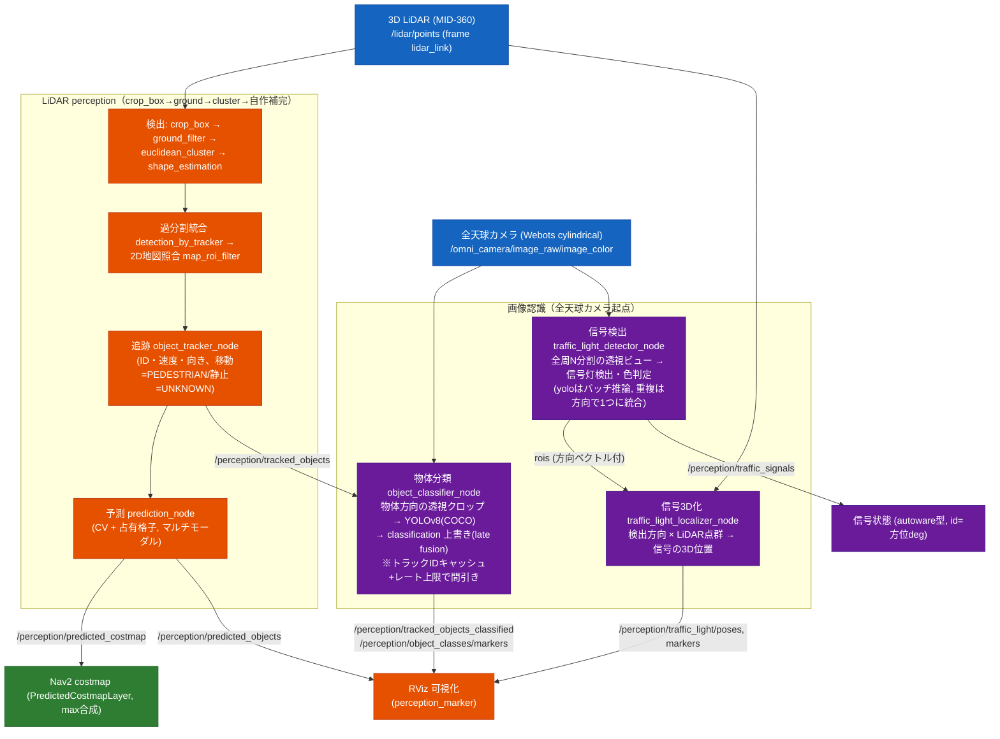

# LiDAR sensing/perception パイプライン

> これは [認識タスク](tasks/recognition.md) の詳細設計ページ。巡回しながら
> 周囲の物体を検出/識別し、人の進路先を予測して Nav2 の障害物回避に反映するまでを扱う。
> **ゴール**: 周囲の物体を検出/識別し、人の進路先を予測して Nav2 の障害物回避に反映できている。
>
> README にあった perception パイプライン図・予測コストマップ連携図は、このページの
> 「認識の全体フロー」と後半の「Nav2 連携」に集約している。

3D LiDAR の点群から周囲の物体（特に歩く人）を**検出・追跡**するパイプライン。
検出までは **Autoware 純正モジュール**を使い、Autoware 公式に存在するが apt で入手
できない**追跡（multi_object_tracker）・可視化は Python で自作**して補完する。

> 検出・追跡の結果は RViz の MarkerArray で可視化するのが主。**Nav2 連携は prediction の
> 予測のみ**: `prediction_node` が人の現在位置 + 進路先を OccupancyGrid
> `/perception/predicted_costmap` として出し、自作 C++ costmap 層
> `susumu_object_perception::PredictedCostmapLayer` が max 合成で焼く（下「Nav2 連携」）。検出・追跡そのものや
> 点群は costmap に焼かない。**かつて 3D 点群を STVL 層で costmap に焼いていたが、人の通過跡が
> 残る問題で廃止し、人の現在位置の障害物化も予測層に統合した**（Nav2 の現在位置回避は 2D
> `/scan` の obstacle_layer も担う）。

> HD 地図は使わない。Autoware の検出は本来 HD 地図（drivable area / ROI）で絞るが、
> ここでは点群ジオメトリのみで検出し、代わりに **2D 占有格子地図 `/map` と照合する
> `map_roi_filter_node.py`** で壁・地図外・未知に当たる検出を除外する（HD 地図 ROI の
> 2D 代替）。

## 認識の全体フロー（LiDAR + 全天球カメラ）

3D LiDAR（物体の有無・大きさ・速度・位置）と全天球カメラ（それが何か・信号の色）を組み合わせる
late fusion 構成。LiDAR perception 本線（緑/橙）に、全天球カメラ起点の画像認識（青）を足す。



> **役割分担**: LiDAR は「物体がどこに・どれだけの大きさ・どう動くか」、全天球カメラは「それが
> 何か（人/車/椅子…）・信号の色」を担う。画像認識（青）は LiDAR の検出/追跡を入力に、その方向の
> 全天球クロップを切って YOLO にかける late fusion。信号だけは LiDAR 非依存に全周検出し、3D 位置
> 推定時のみ LiDAR を併用する。画像認識は CPU 負荷が高いのでトラック ID キャッシュ・レート上限で
> 間引く（詳細は各ノード節）。

## データフロー（LiDAR perception パイプライン詳細）

```mermaid
flowchart LR
  IN["/lidar/points<br/>PointXYZI<br/>frame lidar_link"]
  P2A["pointcloud_to_autoware_node.py<br/>PointXYZI → PointXYZIRC"]
  CROP["autoware_crop_box_filter<br/>ROI クロップ"]
  GND["autoware_ground_filter<br/>地面除去"]
  CLU["autoware_euclidean_cluster<br/>クラスタ化"]
  SHP["shape_estimation_node.py<br/>OBB 形状推定"]
  DBT["detection_by_tracker_node.py<br/>過分割統合"]
  ROI["map_roi_filter_node.py<br/>2D 地図照合 ROI"]
  TRK["object_tracker_node.py<br/>フレーム間追跡"]
  PRD["prediction_node.py<br/>将来軌跡予測"]
  MRK["perception_marker_node.py<br/>RViz 可視化"]
  NAV["Nav2 costmap<br/>PredictedCostmapLayer<br/>max 合成"]

  IN --> P2A
  P2A -->|"/perception/points_autoware"| CROP
  CROP -->|"/perception/cropped/pointcloud"| GND
  GND -->|"/perception/no_ground/pointcloud"| CLU
  CLU -->|"/perception/detected_objects"| SHP
  SHP -->|"/perception/detected_objects_shaped"| DBT
  DBT -->|"/perception/detected_objects_merged"| ROI
  ROI -->|"/perception/detected_objects_in_map"| TRK
  TRK -->|"/perception/tracked_objects"| PRD
  PRD -->|"/perception/predicted_objects"| MRK
  PRD -->|"/perception/predicted_costmap"| NAV

  classDef aw fill:#2e7d32,stroke:#1b5e20,color:#fff;
  classDef own fill:#e65100,stroke:#bf360c,color:#fff;
  classDef hd fill:#1565c0,stroke:#0d47a1,color:#fff;
  class IN hd;
  class CROP,GND,CLU aw;
  class P2A,SHP,DBT,ROI,TRK,PRD,MRK,NAV own;
```



| ノード | 種別 | 入力 → 出力 | 役割 |
|---|---|---|---|
| `pointcloud_to_autoware_node.py` | 自作Py | `/lidar/points` → `/perception/points_autoware` | PointXYZI → PointXYZIRC 変換（ground_filter は ring/channel 必須、後述） |
| `autoware_crop_box_filter` | Autoware | `points_autoware` → `/perception/cropped/pointcloud` | ROI クロップ（±13m=店内, z -0.5..2.0） |
| `autoware_ground_filter` | Autoware | `cropped/pointcloud` → `/perception/no_ground/pointcloud` | Scan Ground Filter で地面除去 |
| `autoware_euclidean_cluster_object_detector` | Autoware | `no_ground/pointcloud` → `/perception/detected_objects` | クラスタ化 |
| `shape_estimation_node.py` | 自作Py | `detected_objects` → `/perception/detected_objects_shaped` | OBB 形状推定（Autoware L字フィット踏襲） |
| `detection_by_tracker_node.py` | 自作Py | `detected_objects_shaped` → `/perception/detected_objects_merged` | 過分割統合（Cluster Merger 踏襲） |
| `map_roi_filter_node.py` | 自作Py | `detected_objects_merged` → `/perception/detected_objects_in_map` | 2D 地図照合 ROI（壁/地図外/未知を除外） |
| `object_tracker_node.py` | 自作Py | `detected_objects_in_map` → `/perception/tracked_objects` | フレーム間追跡（TrackedObjects） |
| `prediction_node.py` | 自作Py | `tracked_objects` → `/perception/predicted_objects` ＋ `/perception/predicted_costmap` | 将来軌跡予測（2D 占有格子で CV 予測 + 壁回避）。予測 OccupancyGrid を Nav2 costmap の自作 `predicted_layer` が max 合成（下「Nav2 連携」） |
| `perception_marker_node.py` | 自作Py | `predicted_objects` 他 → `/perception/markers` | RViz 可視化（MarkerArray） |
| `object_classifier_node.py` | 自作Py | `tracked_objects` ＋ 全天球画像 → `/perception/tracked_objects_classified` ＋ `/perception/object_classes/markers` | **LiDAR 検出物体の画像分類**。各物体方向の全天球クロップを YOLOv8(COCO) で分類し、COCO クラスを Autoware `ObjectClassification`（PEDESTRIAN/CAR/BICYCLE/ANIMAL...）にマップして classification を上書き。LiDAR は「物体の有無・大きさ・速度」、カメラは「それが何か」を担う late fusion。クロップ中心から大きく外れた YOLO bbox は背景物体として捨てる。YOLO 初期化失敗時は classic 等に勝手に落とさず `[FATAL]` 終了 |

上 3 つの Autoware モジュールは composable node なので 1 つの `component_container`
（`autoware_perception_container`）にまとめてロードする（intra-process 通信）。
自作 Python ノードは rclpy なので通常 Node として別プロセスで起動する。

起動は `launch/include/autoware_perception.launch.py`。`simulation.launch.py` から
`use_perception:=True`（既定）で robot spawn の後（+18s）に TimerAction で起動する。
追跡は `odom ← lidar_link` の TF を使うため robot/TF が揃ってから起動する必要がある。

## 使う Autoware パッケージ（apt）

```bash
sudo apt-get install -y \
  ros-humble-autoware-crop-box-filter \
  ros-humble-autoware-ground-filter \
  ros-humble-autoware-euclidean-cluster-object-detector \
  ros-humble-autoware-vehicle-info-utils \
  ros-humble-autoware-perception-msgs
```

| モジュール | plugin（component） | 役割 |
|---|---|---|
| `autoware_crop_box_filter` | `autoware::crop_box_filter::CropBoxFilterNode` | ROI クロップ |
| `autoware_ground_filter` | `autoware::ground_filter::GroundFilterComponent` | 地面除去（Scan Ground Filter） |
| `autoware_euclidean_cluster_object_detector` | `autoware::euclidean_cluster::EuclideanClusterNode` | クラスタ化 → DetectedObjects |

plugin 名は `ros2 component types` で実体を確認して確定した（後述の落とし穴参照）。

## 自作モジュール（Python）の設計と Autoware ソースとの対応

apt に **`autoware_multi_object_tracker`（追跡）と `autoware_shape_estimation`（形状推定）が
無い**ため Python で補完する。実装は Autoware 公式ソース
（`github.com/autowarefoundation/autoware.universe` の `perception/autoware_multi_object_tracker`）
を読み、設計判断とパラメータ既定値を踏襲した**縮小版**。

### object_tracker_node.py（multi_object_tracker の縮小版）

| 観点 | Autoware の実装 | 本実装の選択と根拠 |
|---|---|---|
| 追跡フレーム | `world_frame_id: map` | `odom`。地図前提を避ける。固定フレームならロボット自己移動を見かけ速度から除ける |
| モーションモデル | 歩行者は CTRV `[x,y,yaw,v,ω]` | 等速 CV `[x,y,vx,vy]`。点群重心の追跡では向き推定が不安定。屋内低速なら CV で十分 |
| 速度上限 | `cv_motion_model.hpp` の `max_vx/vy` | `max_vel`（既定 2.78m/s、歩行者上限）で毎ステップ速度をクランプし発散を防ぐ |
| アソシエーション | GNN / Mu-SSP（大域最適） | ハンガリアン法 `scipy.optimize.linear_sum_assignment`。同じ大域最適でクロスに強い |
| 距離尺度・ゲート | 非車両はマハラノビス距離 + χ²(2自由度) 閾値 **11.62**（99.6%） | 予測共分散からマハラノビス距離を計算し、同じ 11.62 でゲート。保険にユークリッド距離ゲートも併用 |
| existence_probability | Bayes 更新（測定 TP=0.9/FP=0.2、非測定は半減期 **0.5s** で指数減衰） | 同式で更新。`tp/fp/decay_half_life` をパラメータ化 |
| トラック削除 | `isExpired`：経過時間 1.0s / 確率下限 / 共分散 | 経過時間 `max_age_sec`（1.0s）と確率下限 `min_existence` で削除 |
| プロセスノイズ | 位置小・速度大（加速度吸収） | `q_pos=0.025, q_vel=2.0`（Autoware の傾向を踏襲、屋内向けに調整） |
| is_stationary | トラッカー型（StaticTracker）で決定 | 型分割を持たないので **速度 + 累積変位の二段判定**で代替（静止什器の誤動的化を防ぐ） |
| **classification** | HD マップの walkable-area / crosswalk 上の物体を歩行者と推定 | **2D 占有格子で代替**。出力段に来たトラックは `_track_blocked_on_map` 通過済み＝地図の free space にいる。検出器がラベルを付けていればそれを尊重し、`UNKNOWN` のときだけ **free space で移動 → `PEDESTRIAN`（prob 0.7）/ 静止 → `UNKNOWN`** と推定。可視化はマゼンタで区別 |
| ちらつき抑制 | 確率クランプ・確信度判定 | `min_hits`（既定 2）未満のトラックは出力しない |
| 壁際 FP 除去 | （地図照合は持たない） | **出力段で 2D 地図照合**。壁近傍に張り付く静止トラック（壁上の緑ボックス）を消す。下記参照 |

出力は Autoware 標準型 `autoware_perception_msgs/TrackedObjects`。`object_id`(UUID) は
内部 ID 先頭 4 バイトに埋め込み、可視化側で復元する。独自メッセージは作らない。
診断時は `object_tracker_debug:=True` で `/perception/object_tracker/debug`
(`diagnostic_msgs/DiagnosticArray`) を出し、各 track が `published` / `min_hits` / `map_blocked` の
どの理由で扱われたかを確認できる。controlled comparison 用に `object_tracker_min_hits` も launch から
差し替えられるが、既定は `2` のまま。壁際静止物体の切り分け用に
`object_tracker_wall_margin_moving_cells` / `object_tracker_wall_margin_static_cells` も launch から
差し替え可能にした。既定はノード内既定と同じ `6` / `22` で、通常起動の挙動は変えない。

#### トラッカー出力段の 2D 地図照合（壁際の緑ボックス対策）

検出段の `map_roi_filter_node.py` で壁検出を弾いても、散発的に通った壁付近の検出を
トラッカーが予測ドリフトで生かし続け、**壁際に張り付く静止トラック（壁上の緑ボックス）**
として残る。これを出力段でも 2D 地図（`/map`）と照合して断つ。`_track_blocked_on_map`
がトラック位置を map 座標へ変換し、占有セル近傍なら出力しない。

ground truth（シミュ内の人・机の真値位置）で検証した結果、机とゴーストは
hits/existence/変位では区別できない（どちらも不動・高 existence）が、**壁からの距離**で
分離できる（ゴーストは壁 0.5〜1.4m、机は壁 1.5m 以上）。そこで壁 margin を二段にする:

- **移動トラック（歩行者）**: `wall_margin_moving_cells`（既定 6 = 0.30m）。壁ぎりぎりを
  歩く人を取りこぼさないよう狭く保つ。
- **静止トラック**（`_is_stationary` が真）: `wall_margin_static_cells`（既定 22 = 1.10m）。
  壁から離れた不動ゴーストまで壁扱いにして消す。机は壁から 1.5m 以上離れているため
  この margin でも巻き込まれず残る。

Fridge など壁近傍の静止家具を診断するときは
`object_tracker_min_hits:=1 object_tracker_wall_margin_static_cells:=3` のように launch 引数で比較する。
ただし `wall_margin_static_cells=22` は壁際静止ゴースト抑制の採用値なので、通常巡回 F1 / extra を
再評価するまでは既定値を下げない。

加えて、SLAM 地図 `maps/cafe.pgm` には机も薄く占有セルとして焼き込まれているため、
margin を広げると机検出まで壁判定で消えてしまう。そこで **`maps/clear_tables.py` で机
5卓の周辺 0.5m を free 化した地図**を使う（机は 2D `/scan` の obstacle_layer で障害物化
されるので static から消しても Nav2 の衝突回避は効く。※ かつては 3D LiDAR → STVL 層で
障害物化していたが STVL は廃止した）。

ground truth 検証（cafe world, 歩行者5・机5）: 当初 壁 FP 10個 → 二段 margin + 机消去地図で
**常駐 1個 + 散発 1〜2個**まで削減。人 5・机 4 は安定して残存。残る常駐 1個は最奥小部屋の
壁 1.4m 地点のゴーストで、机の最寄り壁 1.51m と差が小さく、これ以上 margin を上げると机を
巻き込むため現状で許容する。

### perception_marker_node.py（自作可視化）

可視化は自作の `perception_marker_node.py`（標準 `visualization_msgs/MarkerArray`）で行う。
Autoware 純正 `autoware_perception_rviz_plugin` も使えるが、表示方法・色を自由に
作り込みたいので自作する。RViz では `/perception/markers` を MarkerArray Display で表示。

- 青（半透明）: 検出クラスタ `/perception/detected_objects_in_map`（壁除去後）
- 赤: 追跡中かつ**移動**物体（`is_stationary=false`）
- 緑: 追跡中だが**静止**物体（壁・什器）
- 白テキスト: `<ラベル名>  <速度>[km/h]`（Autoware 純正プラグインと同じ文字列。
  ラベル名は classification を `UNKNOWN`/`PEDESTRIAN`/`CAR` 等に対応づけ）
- 黄矢印: 速度ベクトル（移動物体のみ）

> 純正プラグインを使う場合は `autoware_perception_rviz_plugin/DetectedObjects`・
> `/TrackedObjects` を .rviz に置き、`Object Fill Type: Fill`（既定 skeleton は細線で
> 見えにくい）、クラス色は `UNKNOWN: {Color, Alpha}` で .rviz 上書き可能（実機検証済み）。
> 本構成では自作マーカーを採用しているため未使用。

### shape_estimation（OBB 形状推定、`shape_estimation_node.py`）

OBB（有向境界ボックス）の寸法・向き推定は **Autoware の L字フィット
アルゴリズムを公式ソース（`autoware_shape_estimation/lib/model/bounding_box.cpp`）から
踏襲して自作**した（`shape_estimation_node.py`）。

**なぜ apt/universe をそのまま使わないか:**
- apt（autoware_core 1.8.0 系）に `autoware_shape_estimation` は**無い**
  （core perception は ground_filter / euclidean_cluster / objects_converter の3つだけ）。
- universe の `autoware_shape_estimation` は入出力が旧世代の
  `tier4_perception_msgs::DetectedObjectsWithFeature` 型前提。一方この環境の
  euclidean_cluster は `autoware_perception_msgs/DetectedObjects`（新世代）を出すため
  **型の世代が合わず、そのままでは繋がらない**。
- そこで型インターフェースは標準型 + autoware_perception_msgs で自作し、**幾何
  アルゴリズムだけ Autoware と同一**にした。

**アルゴリズム**（Zhang et al., IV 2017, Closeness Criterion 法。Autoware と同一）:
1. euclidean_cluster の DetectedObjects は位置のみで shape が空。各検出の中心から
   半径 `cluster_radius`(0.6m) 内の `/perception/no_ground/pointcloud` 点を集める。
2. 角度 θ を 1°刻みで grid search（`optimize`）、各 θ で点を直交 2 軸に射影し
   closeness criterion（`calcClosenessCriterion`、d_min=0.1²/d_max=0.4² クランプ）を最大化。
3. θ* から 4 辺の直線を立て交点で中心・寸法・yaw を出す（`fitLShape`）。
4. 点が `min_points`(6) 未満なら人サイズの既定 BBox にフォールバック。
5. 出力 `/perception/detected_objects_shaped` を map_roi_filter の入力にする。

> 歩行者を Cylinder（最小外接円）で出す Autoware の挙動は未移植（BBox のみ）。
> 必要なら同様に追加できる。壁際の細長クラスタ（例 0.04×1.15m）も幾何的に正しく
> フィットされるが、後段の map_roi_filter が壁判定で除去する。

### detection_by_tracker（過分割統合、`detection_by_tracker_node.py`）

Autoware の `autoware_detection_by_tracker` の **過分割統合（Cluster Merger）の 2D 版**。
euclidean クラスタリングは 1 人を複数の小クラスタに割る（over-segmentation）ことがあり、
検出が分裂・点滅する。Autoware は **1 フレーム前の tracker の位置・サイズを参照**して、
同一トラックに対応する複数検出を 1 つに統合し検出を安定化する。本実装は過分割統合のみ
踏襲（under-segmentation の IoU 反復分割は未実装＝第2段）。

**循環構造**（Autoware と同じ）: tracker の最新出力を購読し、次フレームの検出統合に使う。
tracker 未起動（初回）/TF 不在時は検出を素通し（パイプラインを止めない）。

**アルゴリズム**:
1. tracker の各トラックを検出フレーム(lidar_link)へ TF 変換し、位置と OBB 半径を得る。
2. 各検出を最近傍トラック（中心間距離が `assign_radius`(0.4m) + トラック半径以内）に割り当て。
3. 同一トラックに 2 個以上の検出が割り当たったら統合。**統合後の shape は包含 BBox では
   なく、統合領域の no_ground 点群を L字フィットで再推定**する（包含 BBox だと離れた検出を
   覆って巨大化するため。Autoware 本家も点群を shape_estimation で再フィットし tracker
   サイズを参照する）。点群不足/失敗時は tracker サイズにフォールバック。
4. どのトラックにも属さない検出はそのまま通す（新規物体を消さない）。

入力 `/perception/detected_objects_shaped` → 出力 `/perception/detected_objects_merged`。

> **巨大化バグの教訓**: 初版は「複数検出を包含する BBox」にしていて、離れた検出を覆って
> オブジェクトが巨大化した。Autoware 本家を確認し、**点群再フィット + tracker サイズ参照**
> に修正（長辺最大 1.2m / 巨大>1.5m が 0% に改善）。
> shape の再フィットは `shape_estimation_node.fit_l_shape` を再利用している。

### prediction（2D 将来軌跡予測、`prediction_node.py`）

Autoware の perception 第3段 `map_based_prediction` の **2D 占有格子版**。Autoware は
HD 地図のレーン / crosswalk に沿って予測パスを出すが、屋内には crosswalk が無いので
HD 地図要素の代わりに **2D 占有格子地図 `/map`** を使う。

**アルゴリズム（CV + 壁回避 + マルチモーダル）:**
1. **CV 予測**: 各 tracked_object の現在速度で等速直線。`prediction_horizon`(3.0s) を
   `time_step`(0.5s) 刻みでサンプリングして `PredictedPath` の Pose 列にする
   （Autoware の既定挙動「現在速度で予測パス長を計算」と同じ）。
2. **マルチモーダル**（Autoware の crosswalk マルチパスの 2D 版）: 進行方向を中心に
   複数角度 `angle_offsets_deg`（既定 -40/-20/0/+20/+40°）で扇状に複数の予測パスを出す。
   分岐路で「人がどっちに行くか」の複数候補を表現できる。
3. **2D マップ壁回避**: 各パスの予測点を順にたどり、地図の occupied セル（>= `occupied_thresh`）に
   入ったらそこで打ち切る（壁にめり込む非現実的な予測を防ぐ）。地図外/未知は通す。
4. **confidence**: 直進(off=0)を最高に、外側ほど `cos(off)` で減衰。free で最後まで伸びた
   パスは加点、壁ですぐ切れたパスは減点し、全候補で正規化する。
5. **静止物体**（速度 < `min_speed`）は予測パスを出さない（現在位置のみ）。

出力 `/perception/predicted_objects`(PredictedObjects)。可視化は黄の LINE_STRIP。

座標系: tracked は odom、map は map。予測点(odom)を map セルに変換して occupied を
見るため map<-odom の TF（AMCL/Nav2 提供）が要る。TF 不在時は壁回避を無効化して素の
CV 予測だけ出す（perception は止めない設計。map_roi_filter と同方針）。

> **今後の拡張**: 角度オフセット固定でなく、2D 占有格子から実際の通路方向（free space の
> 連結方向）を抽出してその方向にだけパスを出すと、より地図に忠実なマルチモーダルになる。

#### Nav2 連携: 予測コストマップ（`/perception/predicted_costmap` + 自作 costmap 層）

prediction は「人の現在位置 + これから行く先」を **OccupancyGrid `/perception/predicted_costmap`
(frame=map)** として publish する。それを **自作 C++ costmap 層 `susumu_object_perception::PredictedCostmapLayer`**
が **max 合成**で costmap に乗せる。**Nav2 costmap の STVL 層は廃止**したので、人の現在位置の
障害物化もこの予測層が担う（STVL は人の通過跡を `voxel_decay` 秒残して「移動軌跡のコスト」が
出る問題があった。毎フレーム全消去のこの方式なら軌跡が残らない）。検出・追跡そのものは
costmap に焼かない。

**予測 OccupancyGrid の作り方（`prediction_node._publish_predicted_costmap`）:**
1. 静的 `/map` と同じ解像度・原点・サイズの格子を**毎フレーム全セル 0(free) から作り直す**
   （蓄積しない＝軌跡が残らない）。
2. 人ごとに**ポリライン**を作る: 起点 = 現在位置（全トラック）、続き = 移動トラック（速度
   ≥ `min_speed`）の**最有力 1 本**の予測パスの近傍 `predcost_max_horizon`(2.0s) 以内。
   **confidence しきいは設けない**（移動トラックなら進路を必ず焼く＝出たり出なかったりを無くす）。
3. ポリラインを map セルに変換する。
4. **各点を `predcost_inflate_cells`(8=0.4m) 円盤膨張 + 連続点間を Bresenham 線分で繋いで**焼く
   （点を独立円で焼くと点間隔>円径で隙間＝飛び石になるため線分補間）。膨張は人幅 + tracker
   推定方向と実進行方向のズレ吸収ぶん。マルチモーダル全 5 方向は焼かない（扇状に広がり
   costmap が埋まるため。可視化マーカーは全パスを出す）。

**なぜ標準 costmap 層でなく自作 C++ 層か（ライブ検証で判明した失敗の記録）:**

| 層方式 | 蓄積 | 壁保持 | 軌跡 | 結果 | 採用 |
|---|---|---|---|---|---|
| ObstacleLayer / STVL（点群方式） | あり（raytrace clearing は観測線上のみ） | ○ | 残る | 古い予測が蓄積し costmap がぐちゃぐちゃ（LETHAL 55%、ナビ不能）。STVL の極短 decay でも残像 | 不採用 |
| StaticLayer（OccupancyGrid 方式） | なし | ✕（後段層が前段を上書き） | — | 予測層（ほぼ全 free）が壁の static_layer を消し壁消失（LETHAL 0%、真っ白でナビ不能） | 不採用 |
| 自作 `PredictedCostmapLayer`（max 合成） | なし（毎フレーム最新格子で置換） | ○（他層を壊さない） | 残らない | 「他層を壊さず・蓄積せず」を両立 | **採用** |

- 採用層は `updateCosts` で予測 OccupancyGrid の占有セルだけを **`max` で master costmap に
  乗せる**（他層を壊さない＝壁が消えない）。毎フレーム最新格子で置換するので前回の占有セルは
  今回 0 になり max でも乗らず**古い予測は蓄積しない**。CMakeLists で C++ プラグインをビルドし
  pluginlib export。

**真値検証（cafe world, 歩行者5人, global_costmap。STVL 廃止 + 現在位置統合 + 線分描画後）:**
| 項目 | 結果 | 判定 |
|---|---|---|
| 壁が残るか（/map 壁セルの costmap LETHAL 率） | **100%** | StaticLayer 方式の壁消失（0%）を解決 |
| costmap 全体 LETHAL 率 | **25%** | 点群方式のぐちゃぐちゃ（55%）を解決。健全 |
| 人の現在位置 占有率 | **95%** | STVL 廃止後も人の現在位置を焼けている |
| 予測進路が出るフレーム | **100%** | confidence 撤廃で「出たり出なかったり」を解消 |
| 移動中の人の進路上（0〜1.2m）連続性 | **77%** | 線分描画で飛び石（円の隙間）を改善 |
| 移動中の人の進路 0.5m 先 占有率 | **54〜60%** | 予測が効いている |
| 移動軌跡（人の後方）の予測層占有率 | **1%** | 毎フレーム全消去で軌跡が残らない（STVL の問題を解消） |
| NavigateToPose ゴール受理 | **OK** | ナビ可能（経路を引ける） |

→ **「壁を壊さず・ぐちゃぐちゃにならず・軌跡を残さず・現在位置と進路を焼く」を全て満たした**。
進路の連続性が 100% にならない/進路先占有が頭打ちなのは tracker の速度推定方向と実進行方向の
ズレが主因で、膨張をこれ以上増やすと costmap 全体が太り健全性を損なうため現状がバランス点。
`predcost_*` パラメータと costmap 層は `config/nav2_params.yaml`、`docs/nav2_tuning.md` も参照。

> **教訓**: costmap に「毎フレーム入れ替えたいデータ（予測）」を入れるとき、標準層は不適
> （ObstacleLayer/STVL=蓄積、StaticLayer=他層上書き）。max 合成で乗せる自作層が要る。

### object_classifier（LiDAR 検出物体の画像分類、`object_classifier_node.py`）

LiDAR は「物体の有無・大きさ・速度」は分かるが「何か」は分からない。各 `tracked_objects` の
3D 位置をカメラ方向に変換し、全天球画像から透視クロップを切って **YOLOv8(COCO)** で分類、
最大信頼度のクラスを採って COCO→Autoware `ObjectClassification`（PEDESTRIAN/CAR/BICYCLE/
ANIMAL...）にマップし classification を上書きする（LiDAR×カメラの late fusion）。Webots 屋内
既定は `yolov8s-seg.pt` を使い、bbox だけでなく segmentation mask がクロップ中心 ROI に乗る
候補だけを採る。Webots 系 launch では `object_yolo_weights:=...` で `yolo.weights` を差し替えられるが、
2026-06-20 の屋内フル巡回で `yolov8m-seg.pt` は false association が増え、採用中の
`yolov8s-seg.pt` より評価が悪化したため実験用に留める。出力は
`/perception/tracked_objects_classified` と 3D クラス名 `…/object_classes/markers`、デバッグ用
`…/object_classes/image_annotated`。`min_accept_conf`(既定 0.3) 未満は採らず元の分類を保つ。
Webots 系 launch では `object_yolo_imgsz:=...` で Ultralytics 推論の `imgsz`、`object_crop_fovs_deg`
で複数クロップ画角を渡せる。空文字のときは従来通り単一 `crop_fov_deg` だけを使う。2026-06-21 の
屋内フル巡回では `object_crop_fovs_deg:=75,55,40 object_yolo_imgsz:=960` が Table/Sofa 除外 F1 を
`0.727` から `0.167` へ悪化させた。追加改善9で複数FOV時の代表選択は confidence 最大ではなく、
FOV 間の同一 class 系統 support と center/mask overlap を加点する方式に変更し、同条件の
Table/Sofa 除外 F1 は map support なし評価で `0.471` まで戻った。ただし採用値 `0.727` には届かず、
source 側 `maps/indoor.pgm` 欠落で map support / overlay 評価も未再現のため、既定は
`imgsz=640` + 単一クロップのままにする。
LiDAR 対象方向がクロップ中心に来る前提なので、`center_tolerance_frac`(既定 0.45) より
中心から外れた YOLO bbox は背景検出として捨てる。これにより、クロップ端の家具や壁面物体を
LiDAR 対象へ誤付与して semantic DB に余分な物体が増える問題を抑える。`require_mask_center` は
segment weight 使用時だけ有効で、`mask_center_window_frac` と `min_mask_center_overlap` で中心 ROI
上の mask 被覆を確認する。通常の detect weight では mask が無いため無効にする。植物系ラベル
（`potted plant` / `vase` / `umbrella`）には `plant_color_min_frac` で緑/黄色系画素の最低比率も
要求でき、壁片や家具の植物誤認をさらに抑える。
複数FOV時の代表選択には `multi_fov_agreement_bonus`,
`multi_fov_center_overlap_weight`, `multi_fov_mask_overlap_weight` を使うが、通常は
`object_crop_fovs_deg` を空にして単一クロップで運用する。
さらに `min_consistent_hits` 回（既定 1、余分検出をさらに減らす実験では 2 以上）同系統クラスが続くまで
`/perception/object_fine_classes` へ細クラスを出さない。分類済みトラックの定期再確認は
`reclassify_interval_sec` を正値にすると有効になるが、屋内フル巡回の実測では一時的な YOLO miss で
正解記憶の hits が伸びにくくなったため既定は `0.0`（無効）。分類が不安定化した UUID は
`publish_unknown_fine_class_clears:=True` で副チャネルから明示的に消せるが、屋内認識の既定では
細クラス TTL による自然失効に任せる。
`publish_debug_diagnostics:=True`（Webots launch では `object_classifier_debug:=True`）を有効にすると、
`/perception/object_classifier/debug` に YOLO 候補ごとの採否理由を
`diagnostic_msgs/DiagnosticArray` で出す。`message` は `accepted` / `box_area` /
`center_tolerance` / `center_window_overlap` / `mask_center_overlap` / `plant_color` /
`no_yolo_detection` のいずれかで、values に conf、面積、中心ずれ、mask overlap、植物色比率を入れる。
これは未検出対象の gate 調整用で、分類結果そのものは変えない。ROS 2 標準の diagnostic_msgs は
ロボット状態/コンポーネント診断用のメッセージ群で、DiagnosticArray は DiagnosticStatus の配列を
送る用途のため、独自 msg を増やさない本パッケージの方針と合う。
参考: <https://docs.ros.org/en/humble/p/diagnostic_msgs/>、
<https://index.ros.org/p/diagnostic_msgs/>。multi-FOV 合意選択の根拠は、Autoware の
image projection based fusion / ROI cluster fusion が 2D ROI と LiDAR cluster の対応で分類を
refine する考え方、および Ultralytics segmentation results が instance ごとに mask / class /
confidence / box を持つ仕様を踏まえた。参考:
<https://autowarefoundation.github.io/autoware_universe/main/perception/autoware_image_projection_based_fusion/>、
<https://autowarefoundation.github.io/autoware_universe/main/perception/autoware_image_projection_based_fusion/docs/roi-cluster-fusion/>、
<https://docs.ultralytics.com/tasks/segment>。
YOLO 初期化失敗時は classic 等へ勝手に落とさず `[FATAL]` 終了（信号検出ノードと同方針）。

**間引き（CPU 実用化のため）**: tracked_objects は ~10Hz × 物体数ぶん来るが、物体の種類は急に
変わらないので推論を間引く。①`max_rate_hz`(既定 2.0) で推論レートを上限。②**トラック ID
(`object_id.uuid`) キャッシュ**で分類を保持する。`reclassify_interval_sec` は実験用で、
正値にすると分類済みトラックも再確認する。
キャッシュは `cache_ttl_sec`(既定 10) で失効。
間引き中もキャッシュ済み classification は当てて素通しするので物体情報は失わない。検証では
入力 ~190Hz に出力が追従し処理が詰まらないことを確認（キャッシュ無しなら CPU YOLO の数 Hz に
律速されるはず）。CPU 実測（i7-13700F, 640×480/view）: yolov8n 30ms, s 70ms, m 150ms /view。
2026-06-20 の屋内巡回改善で、cycle 内の未分類/再分類対象クロップを `max_inferences_per_cycle`
（Webots 既定 4）まで集め、YOLO の list 入力を `batch` 指定付きで 1 回の `predict()` にまとめる
batch 推論に変更した。これにより Python 呼び出し回数とモデル前後処理の重複を減らしつつ、1 cycle に
複数トラックの fine class を更新できる。COCO 細クラスは Autoware label では `UNKNOWN` に丸まるため、
分類 cache の有効判定は Autoware label ではなく `coco_name` の有無で行う。これを間違えると
`potted plant` / `chair` / `dining table` が cache に入っても次フレームで副チャネルから落ち、
object_memory の hits が伸びない。

2026-06-20 の追加改善で、semantic object memory 側に互換クラス統合を入れた。LiDAR の部分クラスタと
全天球クロップの見え方で、同じ Armchair が `chair` と `couch` に割れる場合があったため、
`static_compatible_class_groups:='chair,couch'`、`static_cross_class_merge_dist:=0.75` を屋内認識の
採用値にする。統合は連結成分単位で行い、座標・サイズは hit-weighted average、existence は複数の
正観測として合成する。`dining table` まで互換群に入れると Table/Sofa 周辺で副作用が出たため採用しない。
これは semantic mapping で問題になる instance duplication を抑えるための物体メモリ側の改善であり、
world 真値を使った評価後処理ではない。

同日の未採用実験として、`yolov8m-seg.pt` への重み変更と、DB 検出位置を保存地図の occupied 成分へ
単純スナップする後処理を試した。前者は屋内通常巡回で throughput は保てたが Table/Sofa 除外 F1 が
`0.727` から `0.000` まで悪化し、後者も `0.667` または `0.615` へ下がった。したがって現時点では
「重い重みに替える」「地図へ後処理で寄せる」より、LiDAR クラスタと全天球クロップの対応付け、
クラス別ゲート、同一物体統合を改善対象にする。
2026-06-21 には複数クロップ画角（75/55/40deg）と `imgsz=960` も試したが、全対象 F1 `0.118`、
Table/Sofa 除外 F1 `0.167` で、背景物体の高信頼検出を採る副作用が大きかった。複数FOVは
信頼度最大選択のまま採用せず、次に使う場合は FOV 間の同一クラス合意や LiDAR クラスタ投影との
重なりを選択条件に加える。

方針参考: Autoware Universe の image projection based fusion は、画像の 2D 検出と LiDAR の
点群/クラスタ/box を統合して認識精度を上げる設計で、`roi_cluster_fusion` は 2D ROI と
LiDAR クラスタを重ね、物体らしくないクラスタのフィルタとラベル上書きを行う。本実装は全天球
クロップ方式なので完全な ROI 投影ではないが、「画像ラベルを LiDAR クラスタへ付ける前に整合を
確認する」方針を踏襲する。Ultralytics 公式の instance segmentation は bbox に加えて object mask
を返すため、屋内の余分な植物誤認を減らす目的で中心 mask gate に使っている。
参考: <https://autowarefoundation.github.io/autoware_universe/main/perception/autoware_image_projection_based_fusion/>、
<https://autowarefoundation.github.io/autoware_universe/main/perception/autoware_image_projection_based_fusion/docs/roi-cluster-fusion/>、
<https://docs.ultralytics.com/tasks/segment/>、
<https://docs.ultralytics.com/modes/predict/>、
<https://docs.ultralytics.com/usage/cfg/>、
<https://arxiv.org/abs/2011.06895>、
<https://www.mdpi.com/1424-8220/22/14/5308>

#### 多数物体での分類性能（2026-06-18 検証）

> **注（2026-06-19）**: 検証に使った `kitchen_test.wbt` は、大量のリモート EXTERNPROTO で
> world ロードが重く `<extern>` コントローラ接続が安定しないため**削除した**。室内検証用 world は
> 軽量な `webots_worlds/break_room.wbt`（Webots indoor サンプルにロボットを組み込んだもの）に
> 置き換えている。以下の評価結果は kitchen_test 当時のもの（YOLO 分類の傾向は引き続き参考になる）。

検証用 world `kitchen_test.wbt`（Webots 同梱 `kitchen.wbt` に本パッケージの
TurtleBot3＝全天球カメラ + MID-360 を組み込んだもの。chair6 / bottle8 / orange8 / apple3 /
can2 / wineglass / bowl / spoon 等が並ぶ）で評価した。

YOLO 単体（全天球 8 ビュー × 2 仰角で分類）の傾向:

- 検出できた: `chair`(明瞭・多数), `bottle`, `dining table`, `cup` — **大きく輪郭の出る物体**。
- 誤検出: `book` / `stop sign` / `person` / `tv` を各 1〜4（壁の模様や小物の誤分類）。
- 未検出: `orange` / `apple` / `can` / `wineglass` / `spoon` — **小さい物体は拾えない**。
- 同一物体が視野の重なるビューに重複して出る。

LiDAR 検出 → クロップ → 分類のパイプライン（kitchen 物体方向に置いた 9 物体で評価）:

- **7/9 を分類**: `chair`×4（conf 0.36〜0.82）, `bottle`×3（conf 0.84〜0.86）。方位を変えても安定。
- 2/9 は `unknown`（明瞭な物体が画角に無い／小物で未検出）。

YOLO 重みによる精度比較（同じ kitchen 全天球画像、全周 8 ビュー × 2 仰角、conf 0.25）:

| クラス | yolov8n | yolov8s | yolov8m | 実物体数 |
|---|---:|---:|---:|---:|
| chair | 15 | 17 | 18 | 6 |
| dining table | 4 | 5 | 11 | 2 |
| bottle | 4 | 5 | 4 | 8 |
| cup | 2 | 8 | 8 | 有 |
| refrigerator | 0 | 1 | **8** | 1 |
| oven | 0 | 0 | **3** | 1 |
| bowl | 0 | 1 | 0 | 2 |
| **総検出** | **32** | **55** | **82** | |
| ユニーククラス | 8 | 12 | 10 | |

- **重みを上げると検出力が上がる**。n では見えなかった `cup`(2→8)、`refrigerator`、`oven`、`bowl`、
  `vase` を s/m が拾う。特に m はキッチン家電（冷蔵庫・オーブン）を確実に検出。
- ただし**重複・誤検出も増える**（同一の椅子が視野の重なるビューで多重計上され実 6 → 15〜18、
  `book` の誤検出が n4 → m26）。重みを上げるほど「拾うが重複も増える」ので、後段で
  方位・距離による重複統合（NMS 相当）を入れると実用性が上がる。
- `orange`/`apple`/`can`/`wineglass`/`spoon` などの**極小物体は m でも拾えない**。全天球カメラが
  ロボット上部 0.75m にあり、画像の大半が床・天井で、机上の小物は遠く小さく映るのが主因
  （重みでなくセンサ配置・解像度・距離の限界）。

結論と限界:

- **椅子・ボトル・机・キッチン家電など大きめの物体は分類できる。重みを n→s→m と上げると
  カバレッジ（拾えるクラス）が広がる**。果物・食器・カトラリーなどの小物は重みを上げても
  全天球の歪み + 距離で**ほぼ拾えない**（重みより配置・解像度の制約）。
- 精度を上げるには ① 物体・world ごとに YOLO 重みを controlled comparison する、② クロップ解像度・
  画角を物体サイズに合わせる（`crop_fov_deg` を小物では狭める）、③ COCO に無い品物は専用学習重みを
  `yolo.weights` で差し替える、が要る。重みを大きくするだけでは屋内フル巡回の誤対応が増えることが
  あるため、採用可否は recognition task の world 評価で決める。
- なお kitchen のような密な室内では euclidean_cluster の `max_cluster_size:2000` /
  `tolerance:0.4` が屋外 cafe 向けのままだと壁・床・家具が 1 つの巨大クラスタに繋がり
  `tracked_objects` が 0 になる。室内で LiDAR 検出を出すにはクラスタ param の調整が要る
  （この検証では classifier 経路自体は方向指定の物体で確認した）。

## パラメータ（`config/`）

| ファイル | 対象 | 屋内向けの主な調整 |
|---|---|---|
| `autoware_crop_box.param.yaml` | crop_box | ±15m / z -0.5..2.0。frame は lidar_link（launch で個別指定） |
| `autoware_ground_filter.param.yaml` | ground_filter | `grid_mode_switch_radius: 8.0`、`grid_size_m: 0.3`、`non_ground_height_threshold: 0.15` |
| `autoware_euclidean_cluster.param.yaml` | euclidean_cluster | `tolerance: 0.4`、`min_cluster_size: 5`、`use_height: false` |
| `autoware_vehicle_info.param.yaml` | vehicle_info | 乗用車サイズ → TurtleBot3 waffle の極小値（自車近傍の人を消さない） |

ground_filter / cluster はチューニング対象。値を変えたら本表も更新すること。

## ビルド・実行

```bash
cd ~/ros2_ws
colcon build --packages-select susumu_object_perception --symlink-install
source /opt/ros/humble/setup.bash
source ~/ros2_ws/install/local_setup.bash
export TURTLEBOT3_MODEL=waffle

# 全部入り（perception 既定 ON、可視化は RViz の "Perception Markers" / "No-Ground Cloud"）
ros2 launch susumu_object_perception simulation.launch.py

# perception だけ切る
ros2 launch susumu_object_perception simulation.launch.py use_perception:=false
```

確認トピック:

```bash
ros2 topic hz /perception/no_ground/pointcloud   # 地面除去後の点群
ros2 topic echo /perception/detected_objects --once   # クラスタ検出
ros2 topic echo /perception/tracked_objects --once    # ID・速度付き追跡
```

## 自動巡回（Nav2 costmap）と地面除去

**症状（ライブで判明）:** 自動巡回が全く動かない。原因は Nav2 の costmap が地面を
障害物として焼き、local_costmap の **約 90% が LETHAL** で埋まっていたこと。プランナー
が経路を引けない。

**根本原因:** Nav2 costmap が**生の `/lidar/points`（地面点を 46% 含む）**と、地面
すれすれの高さ帯で作った `/scan` を入力にしていた。lidar_link は地面 +0.21m に
あり、`min_obstacle_height` などの高さフィルタも lidar_link 基準で評価されるため、
地面（z≈-0.21）が障害物高さ帯に入って床全面が障害物化していた。

**対処:**
1. costmap の 3D 障害物層の mark 入力を `/lidar/points` →
   **`/perception/no_ground/pointcloud`（Autoware で地面除去済み）**に変更。高さ帯は
   lidar_link 基準で `min -0.18 / max 1.8`。（当時は Nav2 標準 voxel_layer → 後に STVL に
   置換 → **現在はその 3D 障害物層自体を廃止**し、人は予測層 + 2D `/scan` で扱う。
   [`nav2_tuning.md`](nav2_tuning.md)）
2. `/scan`（obstacle_layer / AMCL 用）の生成高さ帯を `min_height -0.20 → 0.0`（地面
   +0.21m 以上）に上げ、地面を 2D スキャンからも除外（`spawn_robot.launch.py`）。

**結果:** local_costmap LETHAL 90% → 37%（残りは地図の壁=static_layer）。プランナーで
経路生成成功（(0,0)→(0,3) で 138 waypoints）、NavigateToPose でゴール到達を確認。
（※ この検証は当時の 3D 障害物層ありの構成。現在は予測層 + 2D scan 構成で LETHAL 25% 前後。）
→ **「ちゃんと地面除去できているか」は costmap の LETHAL 率で確認するのが早い**
（`/local_costmap/costmap` の data>=99 の割合）。90% 近ければ地面が焼かれている。

## 2D 地図照合 ROI フィルタ（map_roi_filter_node.py）

検出のうち 2D 占有格子地図 `/map` 上で「壁(占有)／地図外／未知」に当たるものを除外し、
地図内フリースペースの物体だけ通す。HD 地図 ROI フィルタの 2D 代替。

- 各検出重心を map 座標へ TF 変換し、乗るセルの占有値で判定。
- `wall_margin_cells`（既定 3、地図 res 0.05m なら ±15cm）で壁周辺も占有扱いにし、壁に
  貼り付いた静止クラスタ（壁上の緑ボックス）を落とす。人は壁から離れるので残る。
- ライブ確認: 生検出 18 → 照合後 10（margin=3）。移動トラック 6（人）は残存。
- map<-lidar_link の TF が要る（map->odom は AMCL/Nav2 提供）。Nav2 無し起動時は
  TF 不在で**素通し**にして perception を止めない。

## 試行錯誤・落とし穴の記録

| 症状 | 原因 | 対策 |
|---|---|---|
| **【最重要・ライブ起動で判明】地面除去以降が一切流れない**（静的検証・component ロード確認では気付けず、実点群を流して初めて出る） | `autoware_ground_filter` は ring/channel を持つ Autoware 独自型 `PointXYZIRC` / `PointXYZIRCAEDT` を要求するが、Gazebo の生 `/lidar/points` は古典的 `PointXYZI`(point_step=16, x/y/z/intensity 全て float)。下記ログを出す（後述） | 自作 `pointcloud_to_autoware_node.py` をパイプライン先頭に入れ `PointXYZIRC` へ変換（後述） |
| plugin 名の誤り | `ground_filter.launch.py` のコメントや別資料の `ScanGroundFilterComponent` は誤り | `ros2 component types` で実登録名を確認。ground_filter=`GroundFilterComponent`、crop_box=`CropBoxFilterNode`、cluster=`EuclideanClusterNode` |
| **【2026-06-18 調査・解決済み】component がロードされず perception 全体が無出力に見える**。`ros2 component list` に container だけで中身が無く、`/perception/cropped/pointcloud` 以降が出ない。手動 `ros2 component load`（param 無し）だと `statically typed parameter 'min_x' must be initialized` | **コードのバグではなく、検証時に前回起動の古いノードが残っていた汚染が原因**だった。確認手順:①`autoware_perception.launch.py` 単体起動 → crop_box/ground/cluster とも正常 `Loaded node`、`min_x=-13.0` 適用済み。②最小 launch で param file 渡し → 正常ロード。③Webots 経由でも、**全プロセスを完全 kill → `ros2 daemon stop/start` → 単一起動**すると Publisher 1 個・Subscription 1 個で crop_box 17Hz、no_ground 3110 点、detected/tracked 4 個まで正常に流れた。汚染時は `points_autoware` の Publisher が 5 個（pointcloud_to_autoware 多重起動）で discovery/QoS が混乱していた | **再検証の作法**: perception を起動し直すときは、`ps` で `component_container`/`pointcloud_to_autoware`/`webots-bin` 等を**完全に kill** してから単一起動する（古いノードが残ると無出力・多重 Publisher で誤った「不具合」に見える）。`ros2 topic info -v <topic>` の Publisher count が想定より多ければ残骸を疑う |
| crop_box の frame がパラメータファイルで渡せない | param file は範囲と `negative` のみ | `input_frame` / `output_frame` / `input_pointcloud_frame` を launch でノードパラメータとして個別に渡す。入力は lidar_link なので 3 つとも lidar_link で無変換処理 |
| euclidean_cluster 出力が固定フレームでない | EuclideanClusterNode（非 voxel 版）は `input_frame` を持たず、出力 DetectedObjects は入力点群の frame(lidar_link)を引き継ぐ | 追跡は固定フレームが要るので tracker 側で `odom ← lidar_link` を TF 変換してから追跡 |
| TurtleBot3 周辺の人の点まで消える恐れ | vehicle_info が乗用車デフォルト（wheel_base 2.74m など）だと ground_filter 等が自車サイズで足元点を除外 | vehicle_info を waffle の極小値にする |
| tracker が何も出さない | `odom ← lidar_link` の TF が無いと変換に失敗（robot spawn 前起動） | robot spawn より後に起動。simulation.launch.py は robot(+15s) の後 +18s で perception 起動。遅延値をむやみに詰めない |
| `No executable found` | `--symlink-install` でノードを増やした際の登録漏れ | 実行ビット（`chmod +x`）を立て、CMakeLists の `install(PROGRAMS)` に追加 |

**PointXYZIRC 変換の詳細（上表 1 行目）:** ground_filter は `PointXYZI` を渡すと

```
[ground_filter]: The pointcloud layout is not compatible with PointXYZIRCAEDT or PointXYZIRC. Aborting
[ground_filter]: The pointcloud layout is compatible with PointXYZI. You may be using legacy code/data
```

を出して止まる。`pointcloud_to_autoware_node.py` は各点の仰角 `atan2(z, hypot(x,y))` を
16 等分して `channel`(ring) を復元し、`intensity` を uint8 化、`return_type=1` を付けて
`PointXYZIRC`（offset: x@0 y@4 z@8 intensity@12 return_type@13 channel@14、point_step=16）へ
変換する。numpy 構造化 dtype の itemsize がちょうど 16 でパディングが入らないことを確認済み
（点ごとの struct ループは数万点で遅いので構造化配列で一括 tobytes する）。

## 検証状況

- Autoware 3 モジュール: apt インストール後 `ros2 component types` で plugin 登録を確認。
- 自作 tracker のコアロジック: Gazebo なしで単体テスト済み。
  - 等速 1.0m/s 追跡で速度推定 ≈1.0m/s
  - 静止点は低速判定（誤動的化なし）
  - 速度クランプ（max_vel 2.78 で頭打ち）
  - existence の半減期 decay（0.8 → 0.5s 後 0.4）
  - マハラノビスゲート通過
  - すれ違い（クロス）時の ID 取り違えなし（ハンガリアン法）
- launch パース: `ros2 launch ... --show-args` で確認済み。
- **Gazebo 実起動でのライブ確認済み（cafe world + HuNav 歩行者5人）:**
  - パイプライン全段が ~9Hz で流れる: `/lidar/points`(9.2) →
    `/perception/points_autoware`(9.2) → `/perception/cropped/pointcloud`(9.2) →
    `/perception/no_ground/pointcloud`(9.1) → `/perception/detected_objects`(9.2)。
  - `/perception/tracked_objects` で 30+ トラックを追跡、`frame_id=odom`。
  - 定常状態で **移動 4〜5 / 静止 29 前後**に分離（cafe の歩行者5人に一致）。移動
    トラックの速度 1.0〜2.5m/s は HuNav の歩行速度（vel 0.6〜0.8, max_vel 1.5）と整合。
  - `/perception/markers`（自作可視化）で検出=青 / 移動=赤 / 静止=緑、テキストは
    `<ラベル名>  <速度>[km/h]`。
  - **ライブで判明した実問題と対処:** (1) ground_filter が PointXYZI を拒否 →
    `pointcloud_to_autoware_node.py` で PointXYZIRC へ変換（上記「落とし穴」参照）。
    (2) 静止什器がクラスタの揺れで「移動」と誤判定 → 移動判定を初期位置からの累積
    ではなく直近 `disp_window`(2.0s) 窓内の実移動量に変更し、閾値を vel 0.3 / disp 0.7
    に引き上げて収束。
- 残課題（可視化フェーズのスコープ外）: クラスタの分裂・融合で短命の移動トラックが
  一時的に湧く。euclidean_cluster のチューニングや人サイズフィルタ追加で軽減可能。
