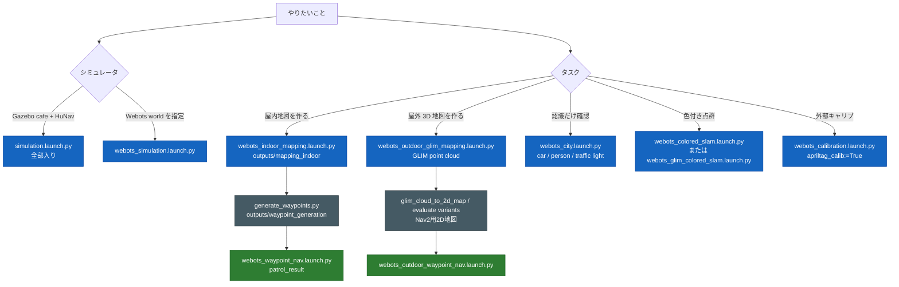

# launch（エントリポイント）一覧と引数

各 launch が何を起動するか、および引数の一覧。タスク別の目的・合格基準・確認手順は
[`tasks/`](tasks/) 配下を参照。

## 何が起動するか一覧

✅=既定で起動 / ○=引数で起動可 / —=起動しない。Sim 列は使うシミュレータ。

| launch | Sim | robot | Nav2 | SLAM | RViz | GUI | perception | 備考 |
|---|---|---|---|---|---|---|---|---|
| `simulation.launch.py` | Gazebo | ✅ | ✅ | — | ✅ | ✅ | ✅ | カフェ+5人歩行者。全部入りエントリ |
| `webots_simulation.launch.py` | Webots | ✅ | ✅ | ○ | ✅ | — | ✅ | `world:=outdoor.wbt`/`indoor.wbt` 指定 |
| `webots_outdoor.launch.py` | Webots | ✅ | ✅ | ○ | ✅ | — | ✅ | world=outdoor 固定ショートカット |
| `webots_indoor.launch.py` | Webots | ✅ | ✅ | ○ | ✅ | — | ✅ | world=indoor 固定ショートカット |
| `webots_nav.launch.py` | Webots | ✅ | ✅ | ✅ | ✅ | — | ✅ | robot+Nav2+SLAM フルスタック（自律走行可） |
| `webots_indoor_mapping.launch.py` | Webots | ✅ | ✅ | ✅ | ○ | — | ○ | **屋内 world の frontier 探索自律マッピング**。`world:=<屋内wbt> map_name:=<name>`。完了時 `outputs/mapping_indoor/` に自動保存。屋外 world は未対応 |
| `webots_outdoor_glim_mapping.launch.py` | Webots | ✅ | — | GLIM | ✅ | ✅ | ○ | **屋外本線: GLIM で3D点群を作る**。終了後 PLY を `glim_cloud_to_2d_map.py` で2D map化 |
| `webots_outdoor_mapping.launch.py` | Webots | ✅ | ✅ | ✅ | ○ | — | ○ | 旧 `slam_toolbox` 屋外実験。GLIM-first 方針では本線から外す |
| `webots_outdoor_waypoint_nav.launch.py` | Webots | ✅ | ✅ | — | ○ | — | ○ | **屋外保存地図 + waypoint 巡回**。`map_file:=village_square_trimmed.yaml waypoints:=village_square_trimmed_waypoints.yaml`。屋外専用 params を使う |
| `webots_outdoor_gps_nav.launch.py` | Webots | ✅ | — | — | — | — | — | sparse outdoor 用 GPS/IMU global localization 過去実験。本線ではない |
| `webots_outdoor_gps_nav2.launch.py` | Webots | ✅ | ✅ | — | — | — | — | sparse outdoor 用 GPS/IMU + Nav2 navigation 過去実験。本線ではない |
| `webots_waypoint_nav.launch.py` | Webots | ✅ | ✅ | ✅ | ✅ | — | ○ | **保存ウェイポイントを Nav2 で巡回**。`world:=<wbt> waypoints:=<world>_waypoints.yaml`。`perception:=True` で巡回中の物体認識も |
| `webots_colored_slam.launch.py` | Webots | ✅ | ✅ | ✅ | ○ | — | ○ | **全天球画像で LiDAR 点群に色を付け、2D SLAM/odom 座標へ蓄積**。`/slam/colorized_points_map` |
| `webots_glim_colored_slam.launch.py` | Webots | ✅ | — | GLIM | ○ | — | ○ | **GLIM の補正済み 3D 座標へ色付き点群を蓄積**。`/slam/glim_colorized_points_map` |
| `webots_slam.launch.py` | — | — | — | ✅ | — | — | — | slam_toolbox を1個だけ起動する補助 |
| `webots_city.launch.py` | Webots | ✅ | ✅ | — | ✅ | — | ✅ | **既定 `ros2:=True`: city にセンサ付き TB3 を置き ROS2 認識（LiDAR + 全天球 + YOLO 物体分類 + 信号認識）。`ros2:=False` で SUMO 車100台の眺めるデモ**※ |
| `webots_city_patrol.launch.py` | Webots | ✅ | ✅ | ✅ | ○ | — | ○ | **事前 wp 無しの自動巡回**: SLAM が育てる `/map` 自由空間から `auto_patrol_node` がウェイポイントを毎周自動算出して Nav2 `FollowWaypoints` で巡回 (city_robot.wbt)。 屋外広域 world では bootstrap が exhaust することがある (iter38 実機観察)。 屋内 or 事前マップ済み world 向き |
| `webots_calibration.launch.py` | Webots | ○ | — | — | — | ✅ | ○ | **外部キャリブレーション**: calibration.wbt (4 方位 AprilTag 36h11 パネル + 全天球カメラ + LiDAR) で AprilTag 検出 + LiDAR 平面フィット → `T_lidar_camera` を `outputs/extrinsic_calibration/calib.json` に出力。 `apriltag_calib:=True` で実行。 `colored_slam:=True omni_calibration_json:=...` で得たキャリブを使った色付き点群も同 launch で起動可能 |

※ `webots_city ros2:=False` は SUMO 制御の車を眺めるだけで ROS2 連携しない（`/scan` 等は出ない）。
既定の `ros2:=True` は `city_robot.wbt`（車 BmwX5 + 歩行者 Pedestrian + 信号 + センサ付き TB3）を
起動し、`/cmd_vel` で対象に近づくと car/person/信号を認識する（遠方は全天球で小さく映り苦手）。

> センサ構成・topic/frame は [`robot_lidar.md`](robot_lidar.md)、world の使い分けは
> [`worlds.md`](worlds.md)、Webots の詳しい起動手順は [`webots_simulation.md`](webots_simulation.md) を参照。

## 代表的なタスクフロー

事前地図なし環境を地図化し、巡回する最小フロー。詳細な合格基準は
[`tasks/mapping_indoor.md`](tasks/mapping_indoor.md)、[`tasks/waypoint_generation.md`](tasks/waypoint_generation.md)、
[`tasks/waypoint_navigation.md`](tasks/waypoint_navigation.md) を参照。



```bash
# 屋内: 事前地図なしの環境を frontier 探索で自律マッピング（完了時 outputs/mapping_indoor/<name> に自動保存）
#    ★ mode は realtime 必須。fast は odom が ~21% 過大積算しドリフト→地図が崩れる
#      （docs/mid360_lidar_research.md / メモリ参照）。break_room なら world:=break_room.wbt map_name:=break_room
ros2 launch susumu_object_perception webots_indoor_mapping.launch.py world:=indoor.wbt map_name:=indoor mode:=realtime

# 屋外: village_center をトリミングした特徴豊富な world を GLIM で3D点群化し、
#       点群から Nav2 用2D地図を作る
#    ★ *_gt.yaml は world 由来の正解データで、作成済み地図の評価専用。
#      map_file や waypoint 生成の入力には使わない。
ros2 launch susumu_object_perception webots_outdoor_glim_mapping.launch.py \
  world:=village_square_trimmed.wbt mode:=realtime rviz:=True

# 別端末で、走行中の GLIM pose を TUM trajectory として保存する。
ros2 run susumu_object_perception save_pose_trajectory_to_tum.py \
  --topic /glim_ros/pose_corrected \
  --out experiments/mapping_outdoor/glim/village_square_trimmed_pose.tum \
  --duration-sec 600 \
  --timeout-sec 660 \
  --min-poses 100 \
  --qos reliable

# GLIM 点群が十分に育ったら、現在の colorized GLIM map topic を PLY として保存する。
ros2 run susumu_object_perception save_pointcloud2_to_ply.py \
  --topic /slam/glim_colorized_points_map \
  --out experiments/mapping_outdoor/glim/village_square_trimmed_points.ply \
  --timeout-sec 30 \
  --min-points 5000 \
  --qos sensor_data

# loop closure 後の高品質出力を使う場合は、offline_viewer で /tmp/dump を開き、
# Export Points した PLY を同じパスへ保存する。軌跡も loop closure 後にするなら
# --trajectory を /tmp/dump/traj_lidar.txt に差し替える。
ros2 run glim_ros offline_viewer

# 同じPLYを trajectory なし / topic pose / GLIM dump trajectory で横並び評価する。
# GLIM dump がある場合は `--trajectory dump=/tmp/dump/traj_lidar.txt` も追加する。
ros2 run susumu_object_perception evaluate_glim_map_variants.py \
  --cloud experiments/mapping_outdoor/glim/village_square_trimmed_points.ply \
  --wbt webots_worlds/village_square_trimmed.wbt \
  --out-prefix experiments/mapping_outdoor/village_square_trimmed_glim2d_eval \
  --trajectory topic_pose=experiments/mapping_outdoor/glim/village_square_trimmed_pose.tum \
  --adopt-prefix outputs/mapping_outdoor/village_square_trimmed_glim2d \
  --waypoints-out outputs/waypoint_generation/village_square_trimmed_glim2d_waypoints.yaml \
  --waypoint-max-segment-length 4.0

# `--waypoint-route-clearance 0.75` は edge 安全余裕の実験用。
# live評価で悪化したため、屋外既定にはしていない。

ros2 run susumu_object_perception generate_webots_ground_truth_map.py \
  --wbt webots_worlds/village_square_trimmed.wbt \
  --out outputs/mapping_outdoor/village_square_trimmed_gt.yaml \
  --preview experiments/mapping_outdoor/village_square_trimmed_gt.png

ros2 run susumu_object_perception check_map_vs_world.py \
  --wbt webots_worlds/village_square_trimmed.wbt \
  --map outputs/mapping_outdoor/village_square_trimmed_glim2d.yaml \
  --out experiments/mapping_outdoor/village_square_trimmed_glim2d_vs_world.png \
  --report experiments/mapping_outdoor/village_square_trimmed_glim2d_vs_world.json \
  --object-report experiments/mapping_outdoor/village_square_trimmed_glim2d_vs_world.csv

# 保存地図から巡回ウェイポイントを生成（屋外は上の --waypoints-out で同時生成）
ros2 run susumu_object_perception generate_waypoints.py \
  --map outputs/mapping_indoor/indoor.yaml --out outputs/waypoint_generation/indoor_waypoints.yaml --spacing 1.5 --clearance 0.4

# ウェイポイントに沿って Nav2 で巡回 (iter89 で default ペアを indoor.wbt + indoor_waypoints.yaml に変更)
ros2 launch susumu_object_perception webots_waypoint_nav.launch.py \
  world:=indoor.wbt waypoints:=indoor_waypoints.yaml mode:=realtime \
  perception:=True omni_perception:=True image_recognition:=True
ros2 launch susumu_object_perception webots_outdoor_waypoint_nav.launch.py \
  world:=village_square_trimmed.wbt \
  map_file:=$HOME/ros2_ws/src/susumu_object_perception/outputs/mapping_outdoor/village_square_trimmed_glim2d.yaml \
  waypoints:=$HOME/ros2_ws/src/susumu_object_perception/outputs/waypoint_generation/village_square_trimmed_glim2d_waypoints.yaml \
  mode:=realtime loop:=False
```

> **注**: 連続したクリーン再起動で FastRTPS の共有メモリトランスポートが壊れ `/scan` が出なく
> なることがある（`open_and_lock_file failed` が多発し SLAM が地図を作れない）。その場合は SHM を
> 無効化した FastRTPS プロファイル（UDP 強制）を `FASTRTPS_DEFAULT_PROFILES_FILE` で指定して起動する。

## Webots 系 launch の引数

| 引数 | 既定 | 対象 | 意味 |
|---|---|---|---|
| `world` | `outdoor.wbt` | webots_simulation | `webots_worlds/` の world ファイル名（拡張子込み） |
| `lidar_model` | `mid360` | webots_simulation/outdoor/indoor/nav/calibration/SLAM | LiDAR profile。`mid360` または `vlp16` |
| `nav` | `True` | simulation/outdoor/indoor | Nav2 を起動（大文字必須。小文字 `true` は NameError） |
| `slam` | `False` | simulation/outdoor/indoor | SLAM(slam_toolbox)を起動（大文字必須） |
| `perception` | `True` | simulation/outdoor/indoor | Autoware perception を起動（3D LiDAR `/lidar/points/point_cloud` 入力） |
| `omni_perception` | `True` | webots_nav 等 | 全天球色付き点群/全天球クロップ補助を起動する |
| `image_recognition` | 入口による | webots_simulation/outdoor/indoor/nav/city/waypoint/SLAM 等 | YOLO 物体分類 + 全天球信号認識を起動する。通常入口は `True`、巡回/色付き点群/キャリブレーション系は既定 `False` |
| `traffic_light_method` | `classic` | webots_simulation/nav/waypoint_nav/simulation | 信号認識バックエンド (iter94 追加、 iter108 chain 横展開)。 `classic` (HSV+円形度、 学習不要) または `yolo` (YOLOv8、 `traffic_light_weights` 必須、 初期化失敗で FATAL 終了) |
| `traffic_light_weights` | `yolov8n.pt` | webots_simulation/nav/waypoint_nav/simulation | `traffic_light_method:=yolo` のときに使う重み。 相対パスは ultralytics デフォルト探索 |
| `object_memory_delete_thresh` | `0.25` | webots_simulation/nav/waypoint_nav | object_memory の Bayes 削除しきい値 (iter95 追加、 iter107 chain 横展開)。 巡回中に DB が空になる時は `0.05〜0.10` に下げる |
| `object_memory_miss_tp` / `miss_fp` | `0.2` / `0.6` | webots_simulation/nav/waypoint_nav | object_memory の miss 観測時 TP/FP 確率。 `miss_tp` 上げ or `miss_fp` 下げで減衰が緩む |
| `colored_slam` | `True` | webots_simulation/nav | `/perception/colorized_points` を SLAM/odom 座標へ蓄積し `/slam/colorized_points_map` を出す |
| `rviz` | `True` | simulation/outdoor/indoor | RViz2 を起動 |
| `mode` | `realtime` | webots 全般 | Webots 起動モード（realtime / fast / pause） |
| `nav_params_file` | （空） | webots_simulation/nav | Nav2 params 差し替え（探索は `config/nav2_params_webots_explore.yaml`） |

## 屋外マッピング / 巡回 launch の主な引数

| launch | 引数 | 既定 | 意味 |
|---|---|---|---|
| `webots_outdoor_mapping.launch.py` | `world` | `village_square_trimmed.wbt` | 特徴豊富な trimmed 屋外 world。正解データを見ずに SLAM 地図を作る |
| `webots_outdoor_mapping.launch.py` | `map_name` | `village_square_trimmed` | 保存する `outputs/mapping_outdoor/<name>.yaml/.pgm` |
| `webots_outdoor_mapping.launch.py` | `explore_radius` | `14.0` | frontier 探索を初期位置から半径 R[m] に制限 |
| `webots_outdoor_mapping.launch.py` | `goal_timeout_sec` | `120.0` | 屋外 frontier の 1 goal 到達猶予。10m 級 goal を早く諦めすぎない |
| `webots_outdoor_mapping.launch.py` | `mode` | `realtime` | 採用評価は realtime |
| `webots_outdoor_waypoint_nav.launch.py` | `world` | `village_square_trimmed.wbt` | 巡回する屋外 world |
| `webots_outdoor_waypoint_nav.launch.py` | `map_file` | `village_square_trimmed.yaml` | AMCL/map_server に読む保存地図。`outputs/mapping_outdoor/` 配下の filename または絶対パス |
| `webots_outdoor_waypoint_nav.launch.py` | `waypoints` | `village_square_trimmed_waypoints.yaml` | `outputs/waypoint_generation/` 配下の waypoint YAML、または絶対パス |
| `webots_outdoor_waypoint_nav.launch.py` | `nav_params_file` | `nav2_params_webots_explore_outdoor.yaml` | 屋外専用 Nav2 params |
| `webots_outdoor_waypoint_nav.launch.py` | `goal_timeout_sec` | `120.0` | 各 outdoor waypoint の NavigateToPose 到達猶予 |
| `webots_outdoor_waypoint_nav.launch.py` | `report_prefix` | 空 | 指定すると `<prefix>.json/.csv/.md` に reached/missed を保存 |
| `webots_outdoor_waypoint_nav.launch.py` | `mission_timeout_sec` | `0.0` | 0 以下なら無効。wall-clock で巡回評価全体を打ち切る |
| `webots_outdoor_waypoint_nav.launch.py` | `costmap_monitor` | `False` | 評価時だけ `nav2_pose_costmap_monitor_node.py` を起動し、pose/static/global/local costmap/plan/scan と waypoint edge / path error / robot trace を記録 |
| `webots_outdoor_waypoint_nav.launch.py` | `costmap_monitor_prefix` | 空 | `costmap_monitor:=True` のとき `<prefix>.json/.csv/.md/.png` に診断と軌跡重畳画像を保存 |
| `webots_outdoor_waypoint_nav.launch.py` | `behavior_tree` | 空 | `NavigateToPose` goal に渡す BT XML。空なら Nav2 既定 recovery BT。`behavior_trees/outdoor_patrol_replanning_no_recovery.xml` は悪化確認済みのため診断用 |
| `webots_outdoor_waypoint_nav.launch.py` | `safe_pose_guard` | `False` | 診断用。True で現在姿勢が global costmap 高コストセルに入ったら最後の安全AMCL姿勢へ戻る goal を挟む。live評価で悪化したため既定未採用 |
| `webots_outdoor_waypoint_nav.launch.py` | `safe_pose_cost_threshold` | `80` | `safe_pose_guard` の危険判定 costmap 値 |
| `webots_outdoor_waypoint_nav.launch.py` | `safe_pose_safe_threshold` | `40` | `safe_pose_guard` が最後の安全姿勢として記録する最大 costmap 値 |
| `webots_outdoor_waypoint_nav.launch.py` | `safe_pose_hold_sec` | `1.0` | 危険 cost が継続したとみなす保持時間[s] |
| `webots_outdoor_waypoint_nav.launch.py` | `safe_pose_recovery_timeout_sec` | `25.0` | 最後の安全姿勢へ戻る `NavigateToPose` recovery goal の timeout[s] |

`generate_webots_ground_truth_map.py` が出す `outputs/mapping_outdoor/*_gt.yaml` は評価専用の正解データ。
`webots_outdoor_waypoint_nav.launch.py map_file:=...` には渡さない。

## 屋外 GPS launch の主な引数（過去実験）

| 引数 | 既定 | 意味 |
|---|---|---|
| `world` | `outdoor.wbt` | sparse outdoor GPS 実験で使う Webots world |
| `mode` | `realtime` | Webots 起動モード。採用評価は `realtime` |
| `run_follower` | `True` | `True` なら GPS localization に加えて地図なし smoke follower も起動 |
| `waypoints` | `outputs/waypoint_generation/outdoor_gps_smoke_waypoints.yaml` | 初期 GPS 位置からの相対 waypoint |
| `output_prefix` | `/tmp/outdoor_gps_nav` | follower の JSON/CSV/Markdown 出力先 prefix |

詳細と評価値は [`tasks/mapping_outdoor.md`](tasks/mapping_outdoor.md) を参照。

## 屋外 GPS + Nav2 launch の主な引数

| 引数 | 既定 | 意味 |
|---|---|---|
| `world` | `outdoor.wbt` | sparse outdoor Nav2 実験で使う Webots world |
| `mode` | `realtime` | Webots 起動モード。採用評価は `realtime` |
| `run_waypoints` | `True` | `True` なら Nav2 起動後に smoke waypoint を `NavigateToPose` で順に送る |
| `waypoints` | `outputs/waypoint_generation/outdoor_gps_smoke_waypoints.yaml` | 初期 GPS 位置からの相対 waypoint |
| `output_prefix` | `/tmp/outdoor_nav2_gps_nav` | Nav2 waypoint runner の JSON/CSV/Markdown 出力先 prefix |
| `nav2_params` | `config/nav2_params_outdoor_gps.yaml` | static map なし rolling costmap の Nav2 params |
| `goal_timeout_sec` | `90.0` | 各 `NavigateToPose` goal の wall-clock timeout。sim time 初期ジャンプの影響を避けるため runner 内では wall clock で判定 |
| `mission_timeout_sec` | `300.0` | waypoint runner 全体の wall-clock timeout |

比較用に `config/nav2_params_outdoor_gps_smac_rpp.yaml` もあるが、`outdoor_gps_5m_waypoints.yaml`
では reached `1/4` に悪化したため未採用。通常は `config/nav2_params_outdoor_gps.yaml` を使う。

詳細と評価値は [`tasks/mapping_outdoor.md`](tasks/mapping_outdoor.md) を参照。

## 色付き点群系 launch の主な引数

| launch | 引数 | 既定 | 意味 |
|---|---|---|---|
| `webots_colored_slam.launch.py` | `world` | `calibration.wbt` | 色付き点群を確認する world |
| `webots_colored_slam.launch.py` | `mode` | `fast` | Webots 起動モード。厳密検証は `realtime` |
| `webots_colored_slam.launch.py` | `perception` | `False` | Autoware perception を併走するか |
| `webots_colored_slam.launch.py` | `image_recognition` | `False` | YOLO 物体分類 + 全天球信号認識を併走するか |
| `webots_colored_slam.launch.py` | `omni_calibration_json` | 空 | LiDAR-camera 外部キャリブレーション結果 |
| `webots_outdoor_glim_mapping.launch.py` | `world` | `village_square_trimmed.wbt` | GLIM で3D点群地図を作る屋外 world |
| `webots_outdoor_glim_mapping.launch.py` | `teleop_gui` | `True` | 手動走行用 GUI を起動する |
| `webots_outdoor_glim_mapping.launch.py` | `glim_config_path` | `config/glim_webots` | GLIM 設定ディレクトリ |
| `webots_glim_colored_slam.launch.py` | `glim_config_path` | `config/glim_webots` | GLIM 設定ディレクトリ |
| `webots_glim_colored_slam.launch.py` | `image_recognition` | `False` | YOLO 物体分類 + 全天球信号認識を併走するか |
| `webots_glim_colored_slam.launch.py` | `lidar_model` | `mid360` | LiDAR model metadata |

詳細は [`tasks/colorized_pointcloud.md`](tasks/colorized_pointcloud.md) を参照。

## `simulation.launch.py`（Gazebo）の主な引数

| 引数 | 既定 | 意味 |
|---|---|---|
| `use_nav2` | True | Nav2 スタックを起動する |
| `use_perception` | True | Autoware 流 perception パイプライン（LiDAR 検出・追跡・予測）を起動する |
| `image_recognition` | True | 画像認識（6面カメラ→全天球合成 + LiDAR 検出物体の YOLO 分類 + 全天球信号認識）を起動する。YOLO が重ければ False |
| `use_rviz` | True | RViz2 を起動する |
| `gui` | True | Teleop / 自動巡回 GUI を起動する |
| `lidar_model` | `mid360` | 3D LiDAR profile。`mid360`（標準）または `vlp16` |
| `map` | `outputs/mapping_indoor/cafe.yaml` | マップ yaml のフルパス（house に戻すなら `outputs/mapping_indoor/house.yaml`） |
| `params_file` | `config/nav2_params.yaml` | Nav2 パラメータ yaml のフルパス |
| `x_pose` / `y_pose` / `yaw` | 0.0 / 0.0 / 0.0 | ロボットの spawn 姿勢 |

> 起動順序や各部品の構成は
> [`software_design.md`](software_design.md#2-launch-構成と起動順序) を参照。
