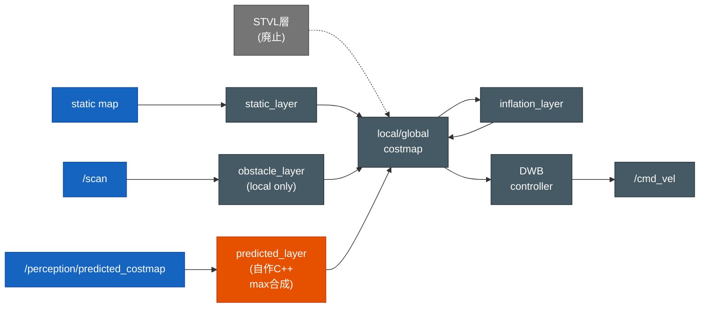

# Nav2 調整ガイド — susumu_object_perception

`config/nav2_params.yaml` の調整に関する設計意図・現在値・調整の指針・採用判断をまとめる。

> ## ⚠️ 運用ルール（最重要）
>
> **`config/nav2_params.yaml` を変更したら、必ず本ドキュメントを更新してから完了とする。**
>
> - [§2 現在値](#2-現在値要点) の表に新しい値を反映する。
> - [§5 調整履歴サマリ](#5-調整履歴サマリ) に採用/未採用の判断を簡潔に反映する。
>
> 値だけ変えてここを放置すると、なぜその値にしたのかが失われ、次の調整で振り出しに戻る。

関連: 全体設計は [`software_design.md`](software_design.md)、構築履歴は
[`../SETUP.md`](../SETUP.md)。

---

## 1. 構成の前提

| 項目 | 値 | 備考 |
|---|---|---|
| Nav2 バージョン | 1.1.20（Humble 同梱） | プラグイン名は `/` 形式（`::` 形式の新形式は不可） |
| ベース params | `nav2_bringup/params/nav2_params.yaml` | TurtleBot3 waffle 向けに調整 |
| ローカライズ | AMCL（`slam:=False`） | 生 `/scan` を使用 |
| プランナ | `nav2_smac_planner/SmacPlanner2D` | 2D costmap 上のA*系グリッドプランナ。Navfn の再計画失敗を避けるため採用 |
| コントローラ | `dwb_core::DWBLocalPlanner` | DWB ローカルプランナ |
| ロボット | TurtleBot3 waffle | 最大 0.26 m/s / 1.82 rad/s |

### コストマップ層の構成（入力 → 層 → costmap → 制御）

各 costmap（local / global）は次の層を重ねて合成する。生センサ `/scan` は障害物層、
perception の予測 OccupancyGrid は自作 `predicted_layer` が受け持つ。STVL 層は廃止済み
（[§2.1 層の遍歴](#21-3d-障害物層の遍歴1表に集約) 参照）。

---

## 2. 現在値（要点）

`config/nav2_params.yaml` の調整対象になりやすいパラメータ。**変更時はこの表も更新する。**

### AMCL（保存地図 `slam:=False` の自己位置推定）

| パラメータ | 現在値 | 意味 / 調整の効果 |
|---|---|---|
| `laser_model_type` | `likelihood_field` | 地図の likelihood field で `/scan` 観測を評価する |
| `max_beams` | 90 | 1 scan から AMCL 更新に使う最大ビーム数。60 から増やし、狭い屋内終盤の向きずれを抑える |
| `update_min_d` | 0.10 | この距離 [m] 以上移動したら AMCL filter を更新する。0.25 から詰めて、低速巡回中の補正間隔を短くする |
| `update_min_a` | 0.10 | この回転 [rad] 以上で AMCL filter を更新する。0.20 から詰めて、旋回中の補正を早める |
| `min_particles` / `max_particles` | 500 / 2000 | particle 数の下限 / 上限 |
| `pf_err` / `pf_z` | 0.05 / 0.99 | KLD sampling の誤差・信頼度 |
| `laser_likelihood_max_dist` | 2.0 | 障害物からの距離を likelihood field へ反映する最大距離 [m] |

### コントローラ（`controller_server` / `FollowPath` = DWB）

| パラメータ | 現在値 | 意味 / 調整の効果 |
|---|---|---|
| `controller_frequency` | 20.0 | 制御ループ周波数 [Hz] |
| `max_vel_x` | 0.26 | 前進最大速度 [m/s]（waffle 上限） |
| `max_vel_theta` | 1.0 | 旋回最大速度 [rad/s] |
| `min_vel_x` | 0.0 | 後退は無効 |
| `sim_time` | 1.7 | 軌道予測の先読み時間 [s]。短いと近視眼的、長いと滑らか |
| `xy_goal_tolerance` | 0.25 | ゴール到達判定の位置許容 [m] |
| `yaw_goal_tolerance` | 0.25 | ゴール到達判定の角度許容 [rad] |
| `BaseObstacle.scale` | 0.08 | DWB が障害物近傍の軌道を嫌う重み。壁際へ寄りすぎる場合は上げる |

### コストマップ共通（`local_costmap` / `global_costmap`）

| パラメータ | 現在値 | 意味 / 調整の効果 |
|---|---|---|
| `robot_radius` | 0.22 | ロボット半径 [m]。膨張の基準 |
| `resolution` | 0.05 | コストマップ解像度 [m/cell] |
| `inflation_layer.inflation_radius` | 0.45 | 障害物膨張半径 [m]。大きいほど壁から離れる／狭所を通れなくなる |
| `inflation_layer.cost_scaling_factor` | 2.0 | 膨張コストの減衰。大きいほど壁際コストが急減。低めにすると通路全体に緩いポテンシャルが残る |
| `local_costmap.plugins` | `obstacle_layer`, `predicted_layer`, `inflation_layer` | 近傍の即時障害物は local で回避する |
| `global_costmap.plugins` | `static_layer`, `predicted_layer`, `inflation_layer` | 保存地図ベースの大域計画を安定させるため、global には `/scan` の `obstacle_layer` を入れない |
| `local_costmap.obstacle_layer` 入力 | `/scan` | 2D 障害物。高さ帯 `min_height 0.0`（地面+0.21m以上）で地面を除外 |
| `local_costmap.obstacle_layer.footprint_clearing_enabled` | true | ロボット足元は現在存在している自由空間としてセンサ由来障害物を clear する |
| `local_costmap.obstacle_layer.observation_persistence` | 0.0 | 2D scan は**最新フレームの観測だけ**で costmap を作る（古い観測を貯めない） |
| `local_costmap.obstacle_layer.raytrace/obstacle_max_range` | 6.0 / 5.0 | raytrace（clear）距離 ≥ mark 距離。人が動いて空いた空間を確実に clear するため clear を mark より広く取る |
| `global_costmap.update/publish_frequency` | 3.0 / 2.0 | 動的予測層を早く反映するため global を高頻度更新（既定 1.0/1.0 から引き上げ） |
| **予測コストマップ層** | **`predicted_layer`（自作 `susumu_object_perception::PredictedCostmapLayer`）** | perception 連携。`prediction_node` の予測 OccupancyGrid `/perception/predicted_costmap`(map) を `max` 合成で costmap に乗せる。人の**現在位置**（全トラック）と**進路先**（移動トラック）の両方をこの層が担う（STVL 廃止後の唯一の動的障害物層） |
| `predicted_layer` 入力 | `/perception/predicted_costmap` | prediction が毎フレーム作り直す予測格子。現在位置（全トラック）+ 最有力予測パス（移動トラック、近傍2s、confidence しきい無し＝移動なら必ず焼く）。点列は**線分補間**で繋ぎ（飛び石防止）、人幅+方向ズレ吸収ぶん **8 セル円盤膨張** |
| `predicted_layer.occupied_threshold` | 50 | 予測格子のこの値以上のセルを LETHAL で焼く |
| `transform_tolerance` (local_costmap) | **patrol 0.5** / **explore 0.2** | TF lookup の許容遅延 [s]。 patrol 専用 (`nav2_params_webots_patrol.yaml`) は 0.5 に上げて SLAM の `map→odom` TF 遅延 (`Transform data too old`) で controller が abort するのを防ぐ。 マッピング (`nav2_params_webots_explore.yaml`) は 0.2 のまま (frontier 探索中の地図変化に応じる)。 iter5 で patrol 18/18 完走実現の鍵 |

### プランナ（`planner_server` / `GridBased`）

| パラメータ | 現在値 | 意味 / 調整の効果 |
|---|---|---|
| `plugin` | `nav2_smac_planner/SmacPlanner2D` | 保存地図AMCL巡回で Navfn が free な目標への再計画に失敗したため、屋内探索で実績のある Smac 2D に統一 |
| `tolerance` | 0.5 | 目標近傍探索の許容 [m] |
| `allow_unknown` | true | unknown を通行候補に含める。保存地図の端・未確定セルで詰まりにくくする |
| `max_planning_time` | 3.5 | 1回の計画に使う最大時間 [s] |
| `cost_travel_multiplier` | 5.0 | コストの高いセルを避ける重み。大きいほど壁際や障害物近傍を避ける |
| `use_final_approach_orientation` | false | 最終接近姿勢を強制しない。巡回点では向きより到達を優先 |

> 障害物層は**人を除去しない**（人も普通の障害物として避ける）が、**地面は除去する**。
> 生 `/lidar/points` は地面点を 46% 含み、costmap の ~90% が LETHAL になって経路が
> 引けなくなる。Autoware ground_filter の出力 `/perception/no_ground/pointcloud` を使う
> ことで地面だけを除き、壁・人・什器は障害物として残す。
> 「地面除去できているか」は `/local_costmap/costmap` の LETHAL(>=99) 率で確認できる
> （90% 近ければ地面が焼かれている。正常時は 30〜40% 程度＝地図の壁が主）。

### 2.1 3D 障害物層の遍歴（1表に集約）

動的障害物（人）を costmap に乗せる層は3世代を経て、現在は自作 `predicted_layer` に確定した。
各方式の入力・蓄積特性・壁保持・通過跡・結果を比較する（判断の要約は [§5 調整履歴サマリ](#5-調整履歴サマリ)）。

> 注: 以下の比較表に出てくる `/velodyne_points` は当時のトピック名。2026-06-18 の
> MID-360 化で 3D LiDAR トピックは `/lidar/points`、frame は `lidar_link` に改名済み。記録は
> 当時の事実として原文のまま残す。現行の入力トピックは `/lidar/points` 系で読み替えること。

| 時期 | 層 | 入力 | 蓄積 | 壁保持 | 軌跡（通過跡） | 結果 |
|---|---|---|---|---|---|---|
| ～2026-06-14 | `voxel_layer`（Nav2 標準） | 生 `/velodyne_points`（地面除去前） | する | 維持 | 残る | 地面点 46% を焼き LETHAL ~90% で経路不能 → 入力を地面除去点群に変更 |
| 2026-06-15 | `stvl_layer`（STVL） | mark=`/perception/no_ground/pointcloud`、clear=生 `/velodyne_points`、`voxel_decay:3.0` | 時間減衰（3s） | 維持 | **`voxel_decay`(3s) 残る**＝移動軌跡のコストが出る | レイ非到達領域も寿命切れで消えるが、人の通過跡が3秒残る欠点 → **廃止** |
| ～試行 | `predicted_layer`（ObstacleLayer 点群方式） | 予測点群 | する | 維持 | 蓄積 | 古い予測が蓄積し LETHAL **55%** でぐちゃぐちゃ → 不採用 |
| ～試行 | `predicted_layer`（StaticLayer 方式） | 予測 OccupancyGrid | 置換 | **壁消失（LETHAL 0%）** | 残らない | 他層を上書きして壁が消える → 不採用 |
| **現在** | **`predicted_layer`（自作 C++ `susumu_object_perception::PredictedCostmapLayer`、max 合成）** | **`/perception/predicted_costmap`** | **毎フレーム置換（蓄積しない）** | **100% 維持** | **残らない**（毎フレーム全消去） | **壁 100%・全体 22%（健全）・進路 0.5m 先占有 58%・ナビ可。標準層では実現不能だったため自作** |

> **なぜ標準層では不可だったか**: ObstacleLayer/STVL（点群方式）は古い予測が蓄積し costmap が
> ぐちゃぐちゃに、StaticLayer（OccupancyGrid 方式）は他層を上書きして壁を消す。自作層だけが
> 「予測の占有セルだけを **max 合成**で乗せ（壁を壊さない）＋毎フレーム最新格子で置換（蓄積しない）」
> を両立できた。真値検証の詳細は `docs/autoware_perception.md`「Nav2 連携」。

---

## 3. よくある症状と調整指針

| 症状 | 疑うパラメータ | 調整方向 |
|---|---|---|
| 壁/家具に寄りすぎてこすり抜けで詰まる | `inflation_radius` / `robot_radius` | 上げる（障害物から離れる） |
| 狭いドア・通路を通れない | `inflation_radius` | 下げる（膨張を薄く）／`cost_scaling_factor` を上げる |
| ゴール手前で止まる・到達しない | `xy_goal_tolerance` / `yaw_goal_tolerance` | 上げる（判定を緩める） |
| カクついて方向転換が多い | `sim_time` | 上げる（先読みを長く） |
| `No valid trajectories`（立ち往生） | `inflation_radius` / スポーン位置 | 膨張を下げる／開けた場所へ |
| 動的障害物（人）の軌跡が残る | （STVL 廃止で解決済み） | 旧 STVL の `voxel_decay`(3s) 残留問題は廃止で解消（[§2.1](#21-3d-障害物層の遍歴1表に集約)）。現在は `predicted_layer` が毎フレーム焼き直すため軌跡は残らず、2D `/scan` の obstacle_layer も raytrace clearing で消える |
| 自己位置がずれて誤計画 | AMCL（`max_beams`, `update_min_d`, `update_min_a`, `/initialpose`） | まず `truth_monitor:=True` で Webots GPS/IMU truth と `map->base_footprint` を評価する。大きくずれる場合は AMCL 更新頻度・ビーム数・初期姿勢を疑う。GUI の「原点へワープ」で再初期化 |
| AMCL 調整後も短周期の姿勢・速度が揺れる | `robot_localization` EKF（wheel odom twist + `/imu` yaw） | Nav2/REP-105 では AMCL が `map->odom`、オドメトリ系が `odom->base_link` を担う。`robot_localization` は `odom->base_link` の平滑化として評価し、AMCL の代替にしない。真値 `/gps` は評価専用で、EKF 入力には使わない。採用中の評価設定は twist + IMU yaw。pose+twist EKF、EKF TF の通常既定化、wheel radius multiplier `1.046` は悪化または不安定化のため未採用 |

> **歩行者（HuNav）が動かない問題は Nav2 ではない。** これは `config/agents_house.yaml`
> 側（init_pose / goals が壁・家具・別部屋にある等）の問題。Nav2 調整では直らないので
> 切り分けること（[software_design.md](software_design.md) の歩行者設定を参照）。

---

## 4. 調整の手順

1. 変更前の値と症状を記録（下の「調整履歴サマリ」に反映）。
2. `config/nav2_params.yaml` を編集。
3. `colcon build --packages-select susumu_object_perception --symlink-install` で install に反映。
4. ライブ起動して `/cmd_vel`・costmap・到達ログで効果を確認。
   - 起動中なら `ros2 param set /controller_server FollowPath.<param> <値>` で
     一部パラメータは再起動なしに試せる（恒久化は yaml 編集が必要）。
5. **本ドキュメントの「現在値」表と「調整履歴サマリ」を更新**してコミット。

---

## 5. 調整履歴サマリ

履歴は個別サイクルではなく、現行判断に必要な単位で集約する。

| 領域 | 採用 | 未採用 / 注意 |
|---|---|---|
| 自己位置評価 | `amcl.max_beams=90`, `update_min_d/a=0.10`。truth monitor で waypoint/odom/filtered を評価。EKF 評価は twist + IMU yaw を標準ケースにする | pose+twist EKF、EKF TF の通常既定化、wheel radius multiplier `1.046` は悪化または不安定化のため通常設定にしない |
| 屋外 local costmap | 屋外既定は `obstacle_layer + inflation_layer` | local static layer は切り分けには有効だが、到達率が悪化したため既定未採用 |
| 保存地図巡回 | Smac 2D、global は `static_layer + predicted_layer + inflation_layer`、local footprint clearing、inflation/cost tuning を採用。屋内保存地図巡回は `reached=22/22` | Navfn では free な目標でも再計画失敗を繰り返すケースがあり未採用 |
| 動的障害物 | 人の現在位置と進路先は `predicted_layer` が毎フレーム焼き直す | STVL は `voxel_decay` 分の通過跡が残るため廃止 |
| 予測 costmap | 自作 `susumu_object_perception::PredictedCostmapLayer` が `/perception/predicted_costmap` を max 合成。壁保持 100%、軌跡残りなし | ObstacleLayer 点群方式は予測が蓄積し、StaticLayer 方式は他層を上書きして壁が消えるため不採用 |
| 地面処理 | costmap 入力は地面除去済み点群を使い、2D `/scan` は obstacle/raytrace 用に残す | 生 3D 点群を voxel_layer へ入れると地面が焼かれ、LETHAL 率が過大になる |

> 構築・調整の詳細な経緯は [`../SETUP.md`](../SETUP.md) を参照。

## 6. 参照した一次情報

- Nav2 AMCL configuration: https://docs.nav2.org/configuration/packages/configuring-amcl.html
- Nav2 tuning guide: https://docs.nav2.org/tuning/index.html
- Nav2 AMCL source (`shouldUpdateFilter`): https://github.com/ros-navigation/navigation2/blob/main/nav2_amcl/src/amcl_node.cpp
- Nav2 Smoothing Odometry using Robot Localization: https://docs.nav2.org/setup_guides/odom/setup_robot_localization.html
- Nav2 Transform setup / REP-105 summary: https://docs.nav2.org/setup_guides/transformation/setup_transforms.html
- ROS 2 Control diff_drive_controller parameters: https://control.ros.org/humble/doc/ros2_controllers/diff_drive_controller/doc/userdoc.html
- ROS 2 Launch design / process orchestration: https://design.ros2.org/articles/roslaunch.html
- robot_localization EKF example parameters: https://github.com/cra-ros-pkg/robot_localization/blob/ros2/params/ekf.yaml
- Webots TurtleBot3Burger PROTO wheel radius: https://raw.githubusercontent.com/cyberbotics/webots/R2022b/projects/robots/robotis/turtlebot/protos/TurtleBot3Burger.proto
- nav_msgs/Odometry frame contract: https://docs.ros2.org/foxy/api/nav_msgs/msg/Odometry.html
