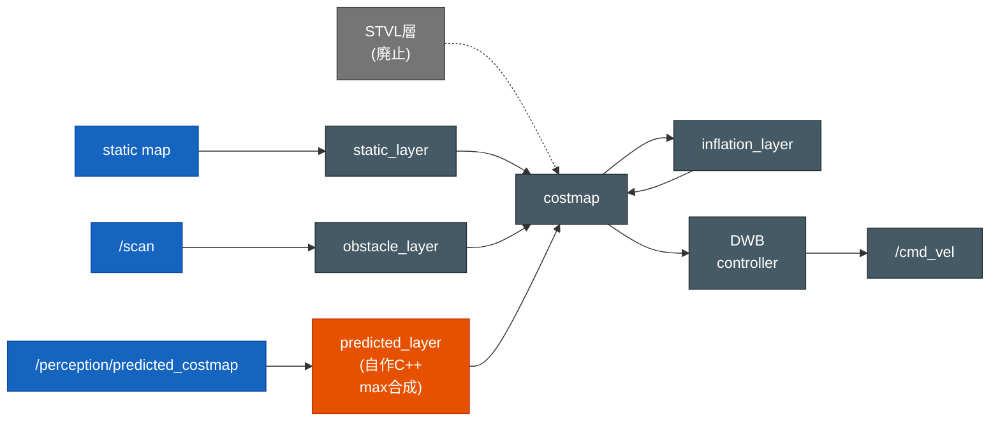

# Nav2 調整ガイド — susumu_object_perception

`config/nav2_params.yaml` の調整に関する設計意図・現在値・調整の指針・変更履歴をまとめる。

> ## ⚠️ 運用ルール（最重要）
>
> **`config/nav2_params.yaml` を変更したら、必ず本ドキュメントを更新してから完了とする。**
>
> - [§2 現在値](#2-現在値要点) の表に新しい値を反映する。
> - [§5 調整履歴](#5-調整履歴) に「日付 / 変更 / 理由・結果」を1行追記する。
>
> 値だけ変えてここを放置すると、なぜその値にしたのかが失われ、次の調整で振り出しに戻る。

関連: 全体設計は [`software_design.md`](software_design.md)、構築履歴は
[`../SETUP.md`](../SETUP.md)。

---

## 1. 構成の前提

| 項目 | 値 | 備考 |
|---|---|---|
| Nav2 バージョン | 1.1.20（Humble 同梱） | プラグイン名は `/` 形式（`::` 形式の新形式は不可） |
| ベース params | `nav2_bringup/params/nav2_params.yaml` | TurtleBot3 waffle 向けに調整 |
| ローカライズ | AMCL（`slam:=False`） | 生 `/scan` を使用 |
| プランナ | `nav2_navfn_planner/NavfnPlanner` | グリッドベース最短経路 |
| コントローラ | `dwb_core::DWBLocalPlanner` | DWB ローカルプランナ |
| ロボット | TurtleBot3 waffle | 最大 0.26 m/s / 1.82 rad/s |

### コストマップ層の構成（入力 → 層 → costmap → 制御）

各 costmap（local / global）は次の層を重ねて合成する。生センサ `/scan` は障害物層、
perception の予測 OccupancyGrid は自作 `predicted_layer` が受け持つ。STVL 層は廃止済み
（[§2.1 層の遍歴](#21-3d-障害物層の遍歴1表に集約) 参照）。

---

## 2. 現在値（要点）

`config/nav2_params.yaml` の調整対象になりやすいパラメータ。**変更時はこの表も更新する。**

### コントローラ（`controller_server` / `FollowPath` = DWB）

| パラメータ | 現在値 | 意味 / 調整の効果 |
|---|---|---|
| `controller_frequency` | 20.0 | 制御ループ周波数 [Hz] |
| `max_vel_x` | 0.26 | 前進最大速度 [m/s]（waffle 上限） |
| `max_vel_theta` | 1.0 | 旋回最大速度 [rad/s] |
| `min_vel_x` | 0.0 | 後退は無効 |
| `sim_time` | 1.7 | 軌道予測の先読み時間 [s]。短いと近視眼的、長いと滑らか |
| `xy_goal_tolerance` | 0.25 | ゴール到達判定の位置許容 [m] |
| `yaw_goal_tolerance` | 0.25 | ゴール到達判定の角度許容 [rad] |

### コストマップ共通（`local_costmap` / `global_costmap`）

| パラメータ | 現在値 | 意味 / 調整の効果 |
|---|---|---|
| `robot_radius` | 0.22 | ロボット半径 [m]。膨張の基準 |
| `resolution` | 0.05 | コストマップ解像度 [m/cell] |
| `inflation_layer.inflation_radius` | 0.35 | 障害物膨張半径 [m]。大きいほど壁から離れる／狭所を通れなくなる |
| `inflation_layer.cost_scaling_factor` | 3.0 | 膨張コストの減衰。大きいほど壁際コストが急減 |
| `obstacle_layer` 入力 | `/scan` | 2D 障害物。高さ帯 `min_height 0.0`（地面+0.21m以上）で地面を除外 |
| `obstacle_layer.observation_persistence` | 0.0 | 2D scan は**最新フレームの観測だけ**で costmap を作る（古い観測を貯めない） |
| `obstacle_layer.raytrace/obstacle_max_range` | 6.0 / 5.0 | raytrace（clear）距離 ≥ mark 距離。人が動いて空いた空間を確実に clear するため clear を mark より広く取る |
| `global_costmap.update/publish_frequency` | 3.0 / 2.0 | 動的障害物（人）の跡を早く消すため global を高頻度更新（既定 1.0/1.0 から引き上げ） |
| **予測コストマップ層** | **`predicted_layer`（自作 `susumu_object_perception::PredictedCostmapLayer`）** | perception 連携。`prediction_node` の予測 OccupancyGrid `/perception/predicted_costmap`(map) を `max` 合成で costmap に乗せる。人の**現在位置**（全トラック）と**進路先**（移動トラック）の両方をこの層が担う（STVL 廃止後の唯一の動的障害物層） |
| `predicted_layer` 入力 | `/perception/predicted_costmap` | prediction が毎フレーム作り直す予測格子。現在位置（全トラック）+ 最有力予測パス（移動トラック、近傍2s、confidence しきい無し＝移動なら必ず焼く）。点列は**線分補間**で繋ぎ（飛び石防止）、人幅+方向ズレ吸収ぶん **8 セル円盤膨張** |
| `predicted_layer.occupied_threshold` | 50 | 予測格子のこの値以上のセルを LETHAL で焼く |

> 障害物層は**人を除去しない**（人も普通の障害物として避ける）が、**地面は除去する**。
> 生 `/velodyne_points` は地面点を 46% 含み、costmap の ~90% が LETHAL になって経路が
> 引けなくなる。Autoware ground_filter の出力 `/perception/no_ground/pointcloud` を使う
> ことで地面だけを除き、壁・人・什器は障害物として残す。
> 「地面除去できているか」は `/local_costmap/costmap` の LETHAL(>=99) 率で確認できる
> （90% 近ければ地面が焼かれている。正常時は 30〜40% 程度＝地図の壁が主）。

### 2.1 3D 障害物層の遍歴（1表に集約）

動的障害物（人）を costmap に乗せる層は3世代を経て、現在は自作 `predicted_layer` に確定した。
各方式の入力・蓄積特性・壁保持・通過跡・結果を比較する（時系列の経緯は [§5 調整履歴](#5-調整履歴)）。

| 時期 | 層 | 入力 | 蓄積 | 壁保持 | 軌跡（通過跡） | 結果 |
|---|---|---|---|---|---|---|
| ～2026-06-14 | `voxel_layer`（Nav2 標準） | 生 `/velodyne_points`（地面除去前） | する | 維持 | 残る | 地面点 46% を焼き LETHAL ~90% で経路不能 → 入力を地面除去点群に変更 |
| 2026-06-15 | `stvl_layer`（STVL） | mark=`/perception/no_ground/pointcloud`、clear=生 `/velodyne_points`、`voxel_decay:3.0` | 時間減衰（3s） | 維持 | **`voxel_decay`(3s) 残る**＝移動軌跡のコストが出る | レイ非到達領域も寿命切れで消えるが、人の通過跡が3秒残る欠点 → **廃止** |
| ～試行 | `predicted_layer`（ObstacleLayer 点群方式） | 予測点群 | する | 維持 | 蓄積 | 古い予測が蓄積し LETHAL **55%** でぐちゃぐちゃ → 不採用 |
| ～試行 | `predicted_layer`（StaticLayer 方式） | 予測 OccupancyGrid | 置換 | **壁消失（LETHAL 0%）** | 残らない | 他層を上書きして壁が消える → 不採用 |
| **現在** | **`predicted_layer`（自作 C++ `susumu_object_perception::PredictedCostmapLayer`、max 合成）** | **`/perception/predicted_costmap`** | **毎フレーム置換（蓄積しない）** | **100% 維持** | **残らない**（毎フレーム全消去） | **壁 100%・全体 22%（健全）・進路 0.5m 先占有 58%・ナビ可。標準層では実現不能だったため自作** |

> **なぜ標準層では不可だったか**: ObstacleLayer/STVL（点群方式）は古い予測が蓄積し costmap が
> ぐちゃぐちゃに、StaticLayer（OccupancyGrid 方式）は他層を上書きして壁を消す。自作層だけが
> 「予測の占有セルだけを **max 合成**で乗せ（壁を壊さない）＋毎フレーム最新格子で置換（蓄積しない）」
> を両立できた。真値検証の詳細は `docs/autoware_perception.md`「Nav2 連携」。

---

## 3. よくある症状と調整指針

| 症状 | 疑うパラメータ | 調整方向 |
|---|---|---|
| 壁/家具に寄りすぎてこすり抜けで詰まる | `inflation_radius` / `robot_radius` | 上げる（障害物から離れる） |
| 狭いドア・通路を通れない | `inflation_radius` | 下げる（膨張を薄く）／`cost_scaling_factor` を上げる |
| ゴール手前で止まる・到達しない | `xy_goal_tolerance` / `yaw_goal_tolerance` | 上げる（判定を緩める） |
| カクついて方向転換が多い | `sim_time` | 上げる（先読みを長く） |
| `No valid trajectories`（立ち往生） | `inflation_radius` / スポーン位置 | 膨張を下げる／開けた場所へ |
| 動的障害物（人）の軌跡が残る | （STVL 廃止で解決済み） | 旧 STVL の `voxel_decay`(3s) 残留問題は廃止で解消（[§2.1](#21-3d-障害物層の遍歴1表に集約)）。現在は `predicted_layer` が毎フレーム焼き直すため軌跡は残らず、2D `/scan` の obstacle_layer も raytrace clearing で消える |
| 自己位置がずれて誤計画 | AMCL（`/initialpose`） | GUI の「原点へワープ」で再初期化 |

> **歩行者（HuNav）が動かない問題は Nav2 ではない。** これは `config/agents_house.yaml`
> 側（init_pose / goals が壁・家具・別部屋にある等）の問題。Nav2 調整では直らないので
> 切り分けること（[software_design.md](software_design.md) の歩行者設定を参照）。

---

## 4. 調整の手順

1. 変更前の値と症状を記録（下の「調整履歴」に追記）。
2. `config/nav2_params.yaml` を編集。
3. `colcon build --packages-select susumu_object_perception --symlink-install` で install に反映。
4. ライブ起動して `/cmd_vel`・costmap・到達ログで効果を確認。
   - 起動中なら `ros2 param set /controller_server FollowPath.<param> <値>` で
     一部パラメータは再起動なしに試せる（恒久化は yaml 編集が必要）。
5. **本ドキュメントの「現在値」表と「調整履歴」を更新**してコミット。

---

## 5. 調整履歴

新しいものを上に追記する。

| 日付 | 変更 | 理由 / 結果 |
|---|---|---|
| 2026-06-15 | **STVL 層（`stvl_layer`）を local/global から削除**。人の現在位置の障害物化を `predicted_layer`（予測層）に統合し、`prediction_node` が全トラックの現在位置 + 移動トラックの進路先を予測 OccupancyGrid に焼く。予測パスは confidence しきい撤廃（移動なら必ず焼く）、点列を**線分補間**で連続描画、膨張 6→8 セル | **STVL は人の通過跡を `voxel_decay`(3s) 残すので「移動軌跡のコスト」が出る**問題。予測層は毎フレーム全消去するので軌跡が残らない。これで現在位置・進路先を一括で担う。検証: 進路が出るフレーム 95%→**100%**、進路上の連続性 60%→**77%**、costmap 全体 LETHAL 25%（健全）、壁 100% 維持、ナビ可能 |
| 2026-06-15 | **予測コストマップ層を自作 C++ プラグイン `susumu_object_perception::PredictedCostmapLayer` に確定**（local/global）。`prediction_node` の予測 OccupancyGrid `/perception/predicted_costmap`(map) を `max` 合成で乗せる。`occupied_threshold:50` | **perception を Nav2 に連携する初の層**。当初 ObstacleLayer 点群方式 → **古い予測が蓄積し costmap が LETHAL 55% でぐちゃぐちゃ**になりナビ不能。次に StaticLayer(OccupancyGrid)方式 → **他層を上書きして壁が消失(LETHAL 0%)**。最終的に **max 合成の自作 C++ 層**で「他層を壊さず(壁100%維持)・蓄積せず(全体22%健全)」を両立。真値検証で移動中の人の進路 0.5m 先占有 58%、NavigateToPose ゴール受理 OK。**標準層では毎フレーム入れ替えデータを costmap に入れられない（ObstacleLayer=蓄積/StaticLayer=上書き）のが教訓** |
| 2026-06-15 | **3D 障害物層を Nav2 標準 `voxel_layer` → STVL（`spatio_temporal_voxel_layer/SpatioTemporalVoxelLayer`）に置換**（local/global 両方）。`voxel_decay:3.0`(線形)。mark=`/perception/no_ground/pointcloud`、clear=生 `/velodyne_points`(VLP16 frustum, `model_type:1`)。`ros-humble-spatio-temporal-voxel-layer` を apt 導入。2D `obstacle_layer`（/scan）と static_layer は未変更 | **persistence:0 + raytrace だけでは歩く人の跡が消えきらない**（人がレイを遮った背後はクリアされず残る）問題への対策。STVL は voxel に観測時刻を持たせ `voxel_decay` 秒で**時間減衰により自動消去**するため、レイが当たらない領域も寿命切れで消える。動的環境向けの定番手法を既存パッケージ（新規開発なし）で採用 |
| 2026-06-14 | voxel_layer 入力を `/velodyne_points` → `/perception/no_ground/pointcloud`（Autoware 地面除去済み）に変更、高さ帯 min/max=-0.18/1.8。`/scan` の生成高さ帯 min_height -0.20→0.0 | **自動巡回が動かなかった**原因が、生点群の地面（46%）を costmap が障害物化し local_costmap の 90% が LETHAL だったこと。地面除去点群に切替で 90%→37% になり経路生成・ゴール到達を確認 |
| 2026-06-14 | obstacle_layer/voxel_layer の入力を生 `/scan`・`/velodyne_points` に設定 | 純粋シミュレーター化に伴い、人も普通の障害物として costmap に乗せる |

> 構築・調整の詳細な経緯は [`../SETUP.md`](../SETUP.md) を参照。
