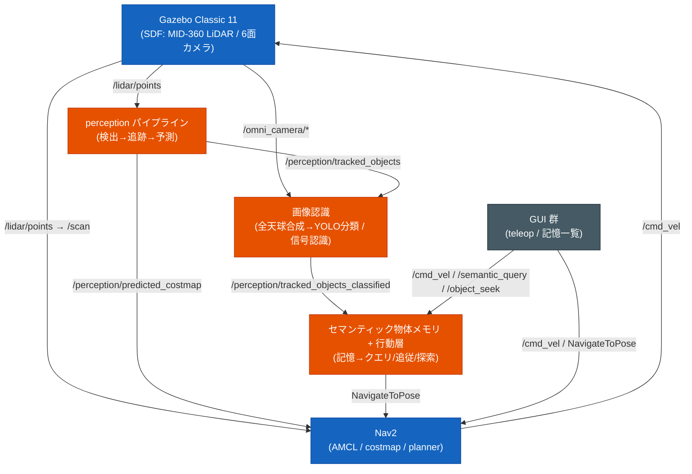
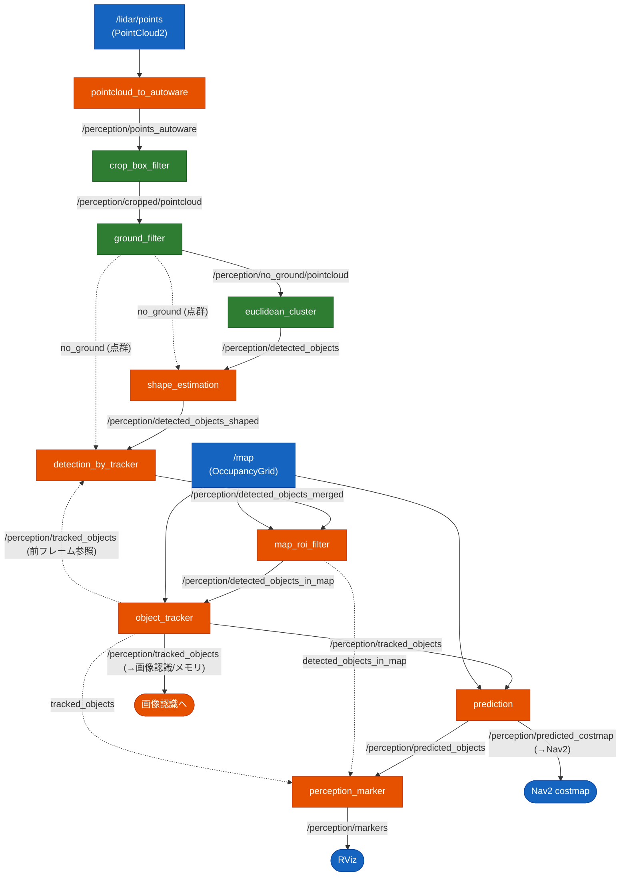
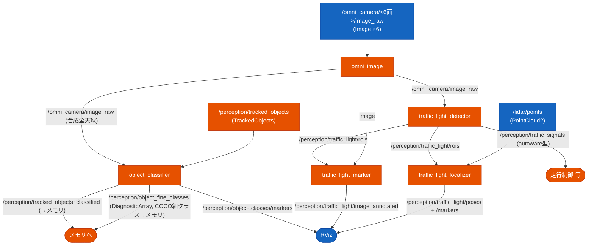
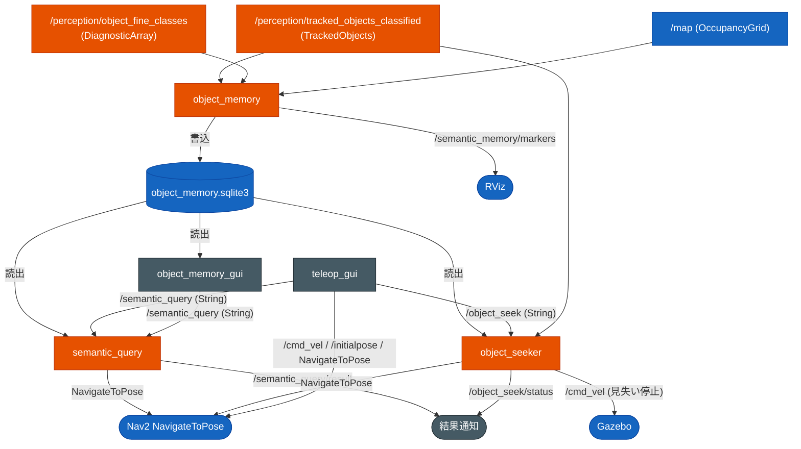

# ノード接続図 / トピック I/O 一覧

このパッケージの ROS 2 ノードのつながりと、各ノードの入力・出力トピックをまとめる。
ノードが増えて全体像が見えにくくなったため、**どのノードがどのトピックで繋がっているか**を
一望できるようにしたもの。各ノードの内部設計は [`software_design.md`](software_design.md)、
セマンティック物体メモリ系は [`semantic_object_memory.md`](semantic_object_memory.md) を参照。

> 凡例: 図中の色は **緑=Autoware 純正モジュール / オレンジ=自作 Python ノード /
> 青=外部（Gazebo/Nav2/地図）/ 灰=GUI・補助**。トピック名は `simulation.launch.py` の
> 既定配線（`semantic_memory:=True image_recognition:=True`）に準拠。

---

## 全体像（サブシステム間の流れ）

---

## 1. perception パイプライン（LiDAR 検出 → 追跡 → 予測）

`launch/include/autoware_perception.launch.py` が起動。Autoware 純正 3 モジュール（緑）と
自作 Python ノード（オレンジ）が直列に繋がる。

> `detection_by_tracker` は `object_tracker` の前フレーム出力を参照する循環構造（破線）。

---

## 2. 画像認識（全天球合成 → YOLO 物体分類 / 信号認識）

`image_recognition:=True` で起動。Gazebo の 6 面カメラを全天球に合成し、その画像で
LiDAR 検出物体（tracked_objects）を YOLO 分類し、信号も認識する。

> COCO 細クラス（chair 等）は Autoware label に無いため、`object_classifier` が
> `object_id→COCO名` を `/perception/object_fine_classes`（DiagnosticArray）で副配信し、
> メモリが什器を区別して記憶する。詳細は [`semantic_object_memory.md`](semantic_object_memory.md)。

---

## 3. セマンティック物体メモリ + 行動層

`semantic_memory:=True` で起動。検出物体を map 座標で永続記憶し、自然語クエリで移動・
追従・探索する。SQLite DB（`~/.ros/object_memory.sqlite3`）を介して疎結合。

---

## ノード別 I/O 一覧表

`…/` は `susumu_object_perception/`。型は ROS 2 メッセージ型。

### perception パイプライン

| ノード | 入力 | 出力 |
|---|---|---|
| `pointcloud_to_autoware` | `/lidar/points` (PointCloud2) | `/perception/points_autoware` (PointCloud2) |
| `crop_box_filter`(AW) | `/perception/points_autoware` | `/perception/cropped/pointcloud` |
| `ground_filter`(AW) | `/perception/cropped/pointcloud` | `/perception/no_ground/pointcloud` |
| `euclidean_cluster`(AW) | `/perception/no_ground/pointcloud` | `/perception/detected_objects` (DetectedObjects) |
| `shape_estimation` | `/perception/detected_objects` + `/perception/no_ground/pointcloud` | `/perception/detected_objects_shaped` |
| `detection_by_tracker` | `…_shaped` + `/perception/tracked_objects`(前F) + `no_ground` | `/perception/detected_objects_merged` |
| `map_roi_filter` | `/perception/detected_objects_merged` + `/map` | `/perception/detected_objects_in_map` |
| `object_tracker` | `/perception/detected_objects_in_map` + `/map` | `/perception/tracked_objects` (TrackedObjects) |
| `prediction` | `/perception/tracked_objects` + `/map` | `/perception/predicted_objects` + `/perception/predicted_costmap` |
| `perception_marker` | `…_in_map` + `tracked_objects` + `predicted_objects` | `/perception/markers` (MarkerArray) |

### 画像認識 / 信号

| ノード | 入力 | 出力 |
|---|---|---|
| `omni_image` | `/omni_camera/<6面>/image_raw` (Image) | `/omni_camera/image_raw` (合成) ほか |
| `object_classifier` | `/omni_camera/image_raw` + `/perception/tracked_objects` | `/perception/tracked_objects_classified` + `/perception/object_fine_classes` (DiagnosticArray) + `/perception/object_classes/markers` + `…/image_annotated` |
| `object_image_crop` | `/omni_camera/image_raw` + `/perception/tracked_objects` | `/perception/object_crops/image_rect` |
| `traffic_light_detector` | `/omni_camera/image_raw` | `/perception/traffic_signals` + `/perception/traffic_light/rois` |
| `traffic_light_marker` | `image` + `…/rois` | `/perception/traffic_light/image_annotated` |
| `traffic_light_localizer` | `/lidar/points` + `…/rois` | `/perception/traffic_light/poses` + `…/markers` |
| `colorized_pointcloud` | `/omni_camera/image_raw` + `/lidar/points` | `/perception/colorized_points` |
| `pointcloud_intensity` | `/lidar/points` | `/lidar/points_intensity` |

### セマンティック物体メモリ / 行動層 / GUI

| ノード | 入力 | 出力・接続 |
|---|---|---|
| `object_memory` | `/perception/tracked_objects_classified` + `/perception/object_fine_classes` + `/map` + TF | `/semantic_memory/markers` + **DB 書込** |
| `semantic_query` | `/semantic_query` (String) + **DB 読** + TF | `/semantic_query/result` (String) + **NavigateToPose** |
| `object_seeker` | `/object_seek` (String) + `/perception/tracked_objects_classified` + **DB 読** + TF | `/object_seek/status` (String) + `/cmd_vel` + **NavigateToPose** |
| `object_memory_gui` | **DB 読** | `/semantic_query` (String) |
| `teleop_gui` | (GUI 操作) | `/cmd_vel` + `/initialpose` + `/semantic_query` + `/object_seek` + **NavigateToPose** |

> `patrol_waypoints.py` はモジュール（ノードではない）。`PATROL_WAYPOINTS`（cafe 巡回 8 点）を
> `teleop_gui`（自動巡回）と `object_seeker`（SEARCH モード）が import して共有する。

### 外部・補助

| トピック | 供給 | 利用 |
|---|---|---|
| `/scan` (LaserScan) | pointcloud_to_laserscan（`/lidar/points` から生成） | AMCL / Nav2 obstacle_layer |
| `/perception/predicted_costmap` (OccupancyGrid) | prediction | Nav2 `PredictedCostmapLayer`（C++ 層） |
| `navigate_to_pose` (Action) | Nav2 | teleop_gui / semantic_query / object_seeker |
