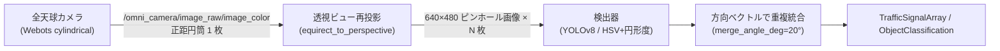
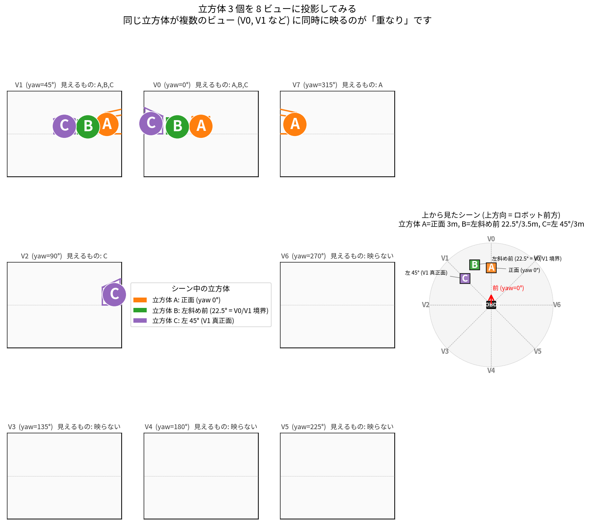
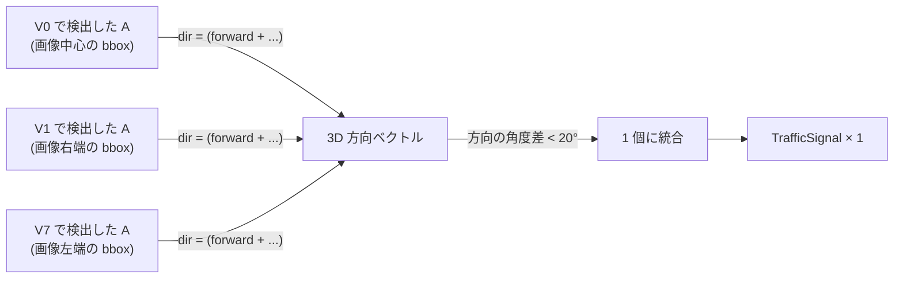

# 全天球カメラによる画像認識のしくみ

ロボット上部の全天球カメラ 1 台で「ロボットの周りに何があるか」を画像から認識する
仕組みの解説。実装ノードのリファレンスは
[`traffic_light_recognition.md`](traffic_light_recognition.md)、ハードウェアと
TF/トピックの一覧は [`omni_lidar_camera.md`](omni_lidar_camera.md) を参照。
ここでは「なぜそうしているか」「どう見えているか」を図で説明する。

## 全体像

全天球カメラから流れてくる 1 枚の正距円筒画像を、認識器に渡す直前で「ふつうの
カメラ画像（透視投影）」に**再投影**してから検出する。これが本プロジェクトでの
全天球画像認識の中心アイデア。



このページは主に上図の **「再投影」** が何をしているのか、**なぜ N 分割するのか**、
**境界の重なりは何のためにあるのか**、を図で説明する。

## 用途は 2 系統ある

全天球画像を使う認識ノードは目的別に 2 つある。**入力は同じ全天球画像**だが、
処理の作り方が違う。

| ノード | 役割 | 切り出し方 |
|---|---|---|
| `traffic_light_detector_node` | **信号機認識** (赤/黄/青) | 全周を **N 等分** の透視ビューに展開し、各ビューで検出 |
| `object_classifier_node` | **物体分類** (LiDAR で検出済みの tracked_objects に COCO ラベルを付与) | 各 tracked_object の方向に **1 個ずつ** クロップを切り出す |

信号は「どこにあるかわからない」ので**全周まんべんなく走査**する。物体分類は
「位置はすでに LiDAR が知っている」のでその**方向だけ**ピンポイントで切り出せばよい。
切り方が違うのは目的が違うため。

このページは前者（信号認識で使う N 分割方式）を中心に解説する。後者は
[`traffic_light_recognition.md`](traffic_light_recognition.md) の最後と
[`recognition.md`](tasks/recognition.md) を参照。

## なぜパノラマのまま検出器に突っ込まないのか

全天球カメラから来るのは横長 1 枚の正距円筒画像 (例 1920×480) で、これをそのまま
YOLO に渡せば一見シンプルに見える。実際には以下の 3 つの理由で **N 枚の透視ビューに
展開してから検出する** ことにしている。

### 1. 正距円筒画像は学習データの分布から外れる

YOLO (COCO 学習) も HSV/円形度判定も、**ピンホール (透視投影) 画像で学習・調整**
されている。正距円筒画像は

- 信号機の縦支柱が画像上で S 字に曲がる
- 信号灯の丸が上下端ほど横長の楕円に潰れる
- 「円形度 ≥ 0.55」 のような閾値が成立しなくなる

検出器の入力分布から外れた像を渡すと、未学習の歪みで confidence が落ちる。
透視ビューに戻してから渡せば**「ふつうのカメラ画像」になり、学習時の分布と
一致**する。

### 2. 横長 1 枚にすると入力リサイズで小物体が消える

YOLOv8 の既定入力は 640×640 など正方形に近い形なので、1920×480 を 1 枚で渡すと:

```
1920×480 → 640×160 にリサイズ
↓
信号灯が画像内 12×12 px だったものが 4×4 px に潰れる
↓
小物体は閾値未満で検出不可
```

`traffic_light_detector_node.py:428-431` のコメントにもこのトレードオフが書かれている
(8 ビューを 1 枚に結合する案を不採用にした理由)。

### 3. 端の継ぎ目で物体が分断される

正距円筒画像は方位 yaw が −180°/+180° で連続しているのに、画像としては左端と右端で
切れている。後方に信号があると **真後ろの信号が左右 2 つの半月に分断**されて、
両方とも閾値未満で落ちるか、 2 個の信号として誤検出される。

透視ビュー展開は `cv2.remap(..., BORDER_WRAP)` で **継ぎ目を跨いで取り出せる** ので、
後方の信号も 1 個の正常な像として見える。

## どう分割しているか

全周 360° を **8 等分** (45° 刻み) して、それぞれをビュー中心方位 yaw とする透視
投影画像を作る。実装は `traffic_light_detector_node.py` の `_detect_omni()` と
`equirect_to_perspective()`。

### 既定値

| パラメータ | 既定値 | 意味 |
|---|---|---|
| `omni.num_views` | **8** | 分割数 (= 45° 刻み) |
| `omni.view_fov_deg` | 75° | 各ビューの**垂直** FOV (`perspective_directions` の縦半角基準) |
| `omni.view_pitch_deg` | 0° | ビュー中心の仰角。信号が高所なら上向きに振れる |
| `omni.view_width × view_height` | 640 × 480 | 各ビュー解像度 |
| `omni.projection_model` | `webots_cylindrical` | 元パノラマの投影モデル |

`omni.view_fov_deg=75°` (垂直) と aspect 4:3 から、**水平 FOV は約 91.3°**
(`2·atan(tan(37.5°)·4/3) ≈ 91.3°`) になる。45° 刻みに対して水平 FOV 91.3° なので、
**隣り合うビューは約 46° 重なる**。

### 垂直の見える範囲

view_pitch_deg=0° のとき、垂直 FOV ±37.5° (= 75° / 2) が見える。

```
                          +37.5°  ← 視野上端
                          ／
                        ／
                      ／
   ROBOT ●━━━━━━━━━━━━━→  0°  (view_pitch_deg = 0)
                      ＼
                        ＼
                          ＼
                          −37.5°  ← 視野下端
```

信号機が高所にあるなら `omni.view_pitch_deg` を + に振ることで視野ごと持ち上げ
られる (例: +10° で −27.5°〜+47.5°)。垂直方向には**広げる代わりに振る**しかない
ことに注意 (FOV を上げると視錐台の歪みが増える)。

## 図で見る「重なり」 — 立方体を 3 個置いてみる

文章だけでは分かりにくい「重なり」を、実際に立方体 3 個をシーンに置いて 8 ビュー
全てに透視投影した図で示す。



### 図の見方

**シーン** (右の上面図、画面上方向 = ロボット前方):

- 立方体 **A** (オレンジ) = 正面 3m、yaw 0° (V0 の真正面)
- 立方体 **B** (緑) = 左斜め前 22.5°、3.5m (**V0 と V1 のちょうど境界**)
- 立方体 **C** (紫) = 左 45°、3m (V1 の真正面)

**8 ビューパネル** (3×3 グリッド、V0 が常に上中央):

| ビュー | 見えるもの | 何が起きているか |
|---|---|---|
| **V0** (前) | **A, B, C 全部** | FOV ±45.6° 内なので C も右端ギリギリで写る |
| **V1** (左斜め前) | **A, B, C 全部** | 同じく FOV ±45.6° で A も右端ギリギリで写る |
| V2 (真左) | C のみ | C だけが視野端に入る |
| V3〜V5 | 映らない | 全立方体が後方/横にあり視野外 |
| V6 (真右) | 映らない | 同上 |
| V7 (右斜め前) | A のみ | A は前方なので右斜め前にも入る |

これが**重なりの正体** — 同じ物体が複数のビューに同時に写る:

- **A**: V0, V1, V7 の **3 ビュー**に同時に写る
- **B**: V0, V1 の **2 ビュー**に写る (境界に置いたため両方の真ん中近くで見える)
- **C**: V0, V1, V2 の **3 ビュー**に写る

V0 と V1 の中の A と C の位置関係に対称性が見える点に注目:

- **V0** では「A 真ん中、C 右端」
- **V1** では「C 真ん中、A 右端」

これが「水平 FOV 91.3° に対して中心角 45°」 という設定の意味で、
A も C も両ビューから観測されていることを表す。

### 重なりが必要な理由

「重なりがあるなら無駄では？」 と思えるが、 むしろ**重なりこそが境界に物体が
あっても見落とさないための工夫**になっている。 もし水平 FOV を 45° ピッタリに
詰めると、 境界 (22.5°、 67.5°、…) に置いた立方体 B のような物体は **両方の
ビューの端で切れて検出できない** 可能性が高い。 46° の重なりがあれば B は両方の
ビューの **比較的中央** に写るので、 どちらか (または両方) で確実に検出できる。

### 重複検出をどう 1 つに統合するか

物体 A が 3 ビューに写るからといって**結果としても 3 個の信号機**が出ては困る。
本実装は **検出時の bbox 中心画素 → 方向ベクトル → 統合** の流れで重複を吸収する。



実装ポイント:

- `_view_pixel_to_dir()` (`traffic_light_detector_node.py:383`) が **bbox 中心の正規化
  画素**から、 透視ビューの forward/right/up とロボット座標系で **3D 方向ベクトル** を
  逆算する。 これにより「ビュー番号 + bbox 内の位置」 が「ロボット座標系の正確な
  方位・仰角」 に戻る。
- 集めた検出を `_merge_detections()` で **方向ベクトル間の角度差**で凝集する。
  既定 `merge_angle_deg=20°` 未満なら同一物体とみなす (全天球で 1 箇所の信号 →
  最終結果も 1 個)。
- 色違い (例えば V0 で RED 判定、 V1 で AMBER 判定) は `merge_cross_color` で
  扱いを切り替えられる。 GREEN とそれ以外が競合した場合は `green_conflict_margin`
  で GREEN を採用する閾値を厳しくしている (GO 指示の誤判定を抑える)。

## 検出器バックエンド (classic / yolo)

各透視ビューに対して以下のいずれかで検出する。 切替えは `method:=classic|yolo`。

### classic (HSV + 円形度)

- 学習不要、 OpenCV のみ。 シミュレータの発光信号や、 はっきり点灯した実信号に有効。
- 赤/黄/青それぞれの HSV マスク → 輪郭抽出 → 面積/円形度/アスペクト比で信号灯候補を絞る。
- 重要パラメータ: `classic.min_circularity` (既定 0.55), `classic.min_area` (既定 20),
  `classic.min_confidence` (既定 0.5)。
- HSV しきい値は world ごとに調整余地あり (`config/traffic_light_webots.param.yaml`)。

### yolo (YOLOv8)

- 8 ビューを **1 回の `predict` でバッチ推論** (`detect_batch`)。 個別 8 回呼ぶより
  オーバーヘッドが小さい。
- YOLO は「検出 (bbox)」 を担い、 色判定は bbox 内を classic の HSV にかける
  (Autoware の detector → classifier 2 段に倣う構成)。
- 既定の重みは COCO 学習済み YOLOv8n (class 9 = 'traffic light')。
- `yolo` を指定したのに重み読み込みに失敗したら **classic に自動フォールバック
  しない** — `[FATAL]` でノードを落とす (検出器が黙って入れ替わると挙動が変わり、
  気付かず精度が落ちる事故を防ぐため)。 必要なら明示的に `method:=classic` で起動する。

## 物体分類との違い (補足)

[`recognition.md`](tasks/recognition.md) で詳述する `object_classifier_node` は、
**LiDAR 検出済みの tracked_object 各個体の方向に 1 個ずつクロップを切り出す**
late fusion 方式で、 全周分割は行わない。

- LiDAR がもう **どこに何があるか** を出している (tracked_objects に 3D 位置が乗る)
- その方向だけ全天球画像から透視クロップを切り出し YOLO に渡す
- 全周 8 分割するより、 物体数ぶんのクロップで済むので **CPU 的に軽い**
- 同じトラック ID にキャッシュ + `max_rate_hz` で間引いて実用速度を確保

「信号は位置がわからないので全周走査、 物体は位置がわかるので方向クロップ」 と
**目的に応じて切り方を変えている**のがこのプロジェクトの設計判断。

## 移動しながら使う場合の速度目安

市販の全天球カメラを移動ロボットに載せる場合、認識が崩れる主因はカメラ画角そのものより
**露光中の像ブレ**、**ローリングシャッター歪み**、**画像・TF・LiDAR トラックの時刻ずれ**
になる。このプロジェクトでは直進 `0.26m/s`、旋回 `0.5rad/s` を通常巡回の上限にしており、
この速度帯では移動中の誤分類が実用範囲に収まることを確認している。

| 要因 | 起きること | 効きやすい条件 |
|---|---|---|
| 露光中の像ブレ | 小さい信号灯や遠方物体の輪郭が潰れ、YOLO/HSV の confidence が落ちる | 暗所、長露光、近距離対象、高速直進/旋回 |
| ローリングシャッター | 透視ビュー展開後に支柱や輪郭が曲がり、円形度・bbox が揺れる | 市販 360 カメラ、速い旋回、振動 |
| 時刻ずれ | LiDAR が出した物体方向と画像上のクロップ中心がずれ、別物体や空白を分類する | 画像 publish 遅延、低処理レート、高速移動 |

信号認識の既定透視ビューは幅 640px、水平 FOV 約 91.3° なので **1° が約 7px** に相当する。
露光時間を 1/30 秒、対象距離を 1m と仮定すると、近距離対象や旋回での像ブレは次の程度になる。
露光が 1/60 秒なら半分、1/120 秒なら 1/4 と見ればよい。

| 動き | 角速度目安 | 1/30 秒の像ブレ | 判断 |
|---|---:|---:|---|
| 直進 `0.26m/s`、対象 1m | 14.9°/s | 約 3.5px | 現行巡回の基準。通常認識はこの近辺を推奨 |
| 直進 `0.5m/s`、対象 1m | 28.6°/s | 約 6.7px | 条件付き上限。明るさ・短露光・同期が必要 |
| 直進 `1.0m/s`、対象 1m | 57.3°/s | 約 13.4px | 近距離物体や小さい信号は破綻しやすい |
| 旋回 `0.5rad/s` | 28.6°/s | 約 6.7px | 現行の旋回上限。移動認識の実用ライン |
| 旋回 `1.0rad/s` | 57.3°/s | 約 13.4px | 誤分類・同期ずれが出やすく、通常巡回では避ける |

運用上の目安は次の通り。

| 用途 | 推奨速度 | 備考 |
|---|---|---|
| 物体分類・信号認識を動かした通常巡回 | 直進 `0.2`〜`0.3m/s`、旋回 `0.5rad/s` 以下 | LOVOT のような家庭内低速ロボットと同じ速度帯。現行設定はここ |
| 認識を保ったまま急ぐ場合 | 直進 `0.5m/s` 程度まで | 実機では露光固定、十分な照明、画像時刻同期を確認してから採用 |
| 近距離小物体・信号灯を安定して拾う場合 | 直進 `0.3m/s` 以下 | 1m 以内では画素ブレが効きやすい |
| 色付き点群・キャリブレーション・地図蓄積 | 原則停止、または `stationary_only` | 色ずれ/ghosting を避けるため、移動フレームの蓄積は品質が落ちる |

`object_classifier_node` は画像バッファと `image_sync_max_dt=0.5s` で時刻ずれを抑えるが、
速度を上げればクロップ中心のずれも増える。実機カメラへ置き換えるときは、まず
`ros2 topic hz /omni_camera/image_raw/image_color`、画像ヘッダ時刻、露光設定、`/cmd_vel`
実測を同時に確認し、上表の 0.3m/s 前後から詰める。

## チューニング指針

| 困りごと | 試すパラメータ |
|---|---|
| 信号が小さくて検出されない | `omni.view_width / view_height` を上げる (例 800×600)。 ただし YOLO の推論コストも上がる |
| 高所の信号が垂直視野から外れる | `omni.view_pitch_deg` を +10°〜+20° に振る |
| 隣接ビューで同じ信号が分かれて 2 個出る | `merge_angle_deg` を増やす (既定 20° → 30°) |
| ID が方位ジッタで毎フレーム変わる | `signal_id_quant_deg` を粗くする (既定 5°) |
| CPU が苦しい | `max_rate_hz` を下げる (既定 3.0Hz)、 `method:=classic` に切替 |
| 後方しか映らない信号が後方ビューで切れる | `omni.num_views` を増やす (8 → 12) で重複度を上げる |
| 移動中に誤分類や空白クロップが出る | 直進速度を `0.3m/s` 前後、旋回を `0.5rad/s` 以下に抑え、画像時刻同期ログを確認 |

## 関連ドキュメント

- 信号認識ノードの全 API・トピック契約・パラメータ早見表: [`traffic_light_recognition.md`](traffic_light_recognition.md)
- 全天球カメラ自体のハードウェア・TF・トピック構成: [`omni_lidar_camera.md`](omni_lidar_camera.md)
- 物体認識 (LiDAR + 画像 late fusion) のタスク仕様: [`tasks/recognition.md`](tasks/recognition.md)
