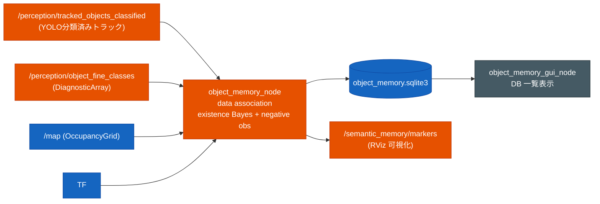

# セマンティック物体メモリ

検出済み物体を `map` 座標で永続記憶し、見えなくなった物体を確率的に忘却するための補助機能。
現在の用途は **認識結果の記録・RViz 可視化・DB 確認** に限定する。物体名を問い合わせて移動する機能、
物体を探索する機能、追従する機能は持たない。



独自 `.msg` は作らない。入力は `TrackedObjects` と `DiagnosticArray`、可視化は `MarkerArray`、
永続化は SQLite DB に閉じる。

## `object_memory_node.py`

`tracked_objects_classified` の各物体を `map` 座標へ変換し、SQLite の永続 object DB に記憶する。

| 段 | 実装 |
|---|---|
| data association | 同じ `class_name` の近傍距離ゲートで既存 object に統合し、無ければ新規登録 |
| 座標更新 | 一致 object は位置を LPF で更新し、フレームごとの揺れを抑える |
| existence 引き上げ | 検出された object は Bayes 更新で存在確率を上げる |
| negative observation | 視野内・レンジ内・非遮蔽なのに検出されない object だけ存在確率を下げる |
| 削除 | existence が `delete_thresh` 未満になった object を DB から削除する |
| 遮蔽判定 | センサから物体への線分を `/map` 上でレイサンプリングし、occupied セルがあれば遮蔽扱いにする |

出力:

- `/semantic_memory/markers`: RViz 用 `MarkerArray`
- `~/.ros/object_memory.sqlite3`: 既定 DB。`reset_db:=True` で起動時に初期化する

## 什器クラスの記憶

Autoware `ObjectClassification.label` は `chair` / `couch` / `dining table` などの COCO 細クラスを
表現できないため、`object_classifier_node` が `object_id(UUID hex) -> COCO名` を
`/perception/object_fine_classes`（`DiagnosticArray`）で副配信する。
`object_memory_node` はその情報を優先して `class_name` に保存する。

現在の正規化:

- `person` -> `pedestrian`
- `sofa` -> `couch`
- `table` -> `dining table`
- `fridge` -> `refrigerator`
- `vase` / 屋内静的認識時の一部 `umbrella` -> `potted plant`

これは分類結果の揺れを DB 上で同一物体に統合するための **検出クラス正規化** であり、
ユーザー入力の synonym 辞書ではない。

## 起動

```bash
ros2 launch susumu_object_perception simulation.launch.py semantic_memory:=True

ros2 topic echo /semantic_memory/markers
```

`gui:=True` かつ `semantic_memory:=True` のとき、`object_memory_gui_node.py` が DB の一覧を表示する。
GUI は読み取り専用で、選択物体への移動や探索コマンド送信は行わない。

## 主なパラメータ

| パラメータ | 既定 | 意味 |
|---|---:|---|
| `assoc_dist` | 1.0 | data association 近傍ゲート [m] |
| `pos_lpf_alpha` | 0.3 | 座標更新の移動平均係数 |
| `visible_range` | 8.0 | negative observation で「見えるはず」とみなす最大レンジ [m] |
| `tp` / `fp` | 0.9 / 0.2 | 検出時の existence Bayes 更新 |
| `miss_tp` / `miss_fp` | 0.2 / 0.6 | negative observation 時の引き下げ |
| `delete_thresh` | 0.25 | この existence 未満で DB から削除 |
| `min_hits` | 3 | 可視化に出す最小検出回数 |
| `require_fine_class` | False | True のとき YOLO 細クラスが届いた物体だけを DB 登録する |
| `min_fine_conf` | 0.0 | `require_fine_class` 時に採用する細クラス信頼度の下限 |
| `require_map_support` | False | True のとき近傍に occupied セルが無い静的物体候補を登録しない |
| `map_support_dist` | 0.55 | `require_map_support` の occupied セル探索半径 [m] |
| `static_class_geometry_filter` | False | True のとき静的物体向けにクラス別の平面サイズ・縦横比ゲートを DB 登録前に適用する |
| `static_duplicate_merge_dist` | 0.0 | 正値のとき同じ semantic class の近接 DB object を統合する距離 [m] |
| `static_cross_class_merge_dist` | 0.0 | 正値のとき互換クラス群内の近接候補も統合する距離 [m] |
| `static_compatible_class_groups` | `''` | `chair,couch` のようなカンマ区切り互換クラス群。複数群は `;` 区切り |
| `static_merge_class_priority` | `''` | 互換統合で hits/existence が同等だった場合の class_name 優先順 |
| `decay_period` | 1.0 | negative observation の評価周期 [s] |
| `reset_db` | True | 起動時に DB を消す |

## 制約

- DB は認識結果の記録用で、ナビゲーション goal 生成には使わない。
- COCO 既定語彙に無い対象は、評価から外すか専用学習重みを用意する必要がある。
- negative observation は全天球カメラ前提のレンジ + 壁遮蔽近似であり、小物や柱の陰では過小評価し得る。
- 遮蔽判定は 2D `/map` の occupied セルに依存するため、地図品質の影響を受ける。

関連: [`autoware_perception.md`](autoware_perception.md)
