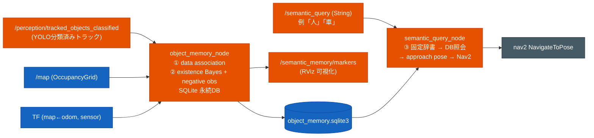

# セマンティック物体メモリ（実装 / MVP）

「YOLO 等で検出した物体の 3D 座標を地図に記憶し、無くなったものは消し、自然語で問われた
物体の場所へ移動する」システムの **MVP 実装**。設計調査は
[`semantic_object_memory_research.md`](semantic_object_memory_research.md) と
[`semantic_object_memory_comparison.md`](semantic_object_memory_comparison.md) を参照。
調査の結論「重い統合 SLAM を移植せず、既存 perception に独立モジュールを足す」を実装したもの。

## 何を作ったか

調査記録の 3 段（① 座標を記憶 / ② 無くなったら消す / ③ 問い合わせ→移動）を、**新規 2 ノード**
で実現する。既存 perception の `tracked_objects_classified`（map 照合済み・YOLO 分類済み・
existence_probability 付き）を入力にすることで、研究記録が前提にしていた **RGB-D 追加を省き**、
MVP を軽くしている。



独自 `.msg` は作らない（AGENTS.md の方針）。入力は `TrackedObjects`、可視化は `MarkerArray`、
クエリ/結果は `std_msgs/String`、移動は `nav2_msgs/NavigateToPose`。

## ノード

### 什器クラスの記憶（COCO 細クラス副チャネル）

Autoware `ObjectClassification.label` は enum で `chair`/`couch`/`dining table` 等の什器を
表現できず `UNKNOWN` に丸まる。そこで `object_classifier_node` が **object_id(UUID hex)→COCO名**
を `diagnostic_msgs/DiagnosticArray`（`/perception/object_fine_classes`、name=UUID hex /
message=COCO名）で副配信し、`object_memory_node` がそれを引いて `class_name` を COCO 細クラスで
埋める。独自 `.msg` は作らない方針のための標準型の流用。

- メモリの data association・クエリ照合は **`class_name`（COCO 名）ベース**。chair と
  dining table を別物として扱う。ただし片方が `unknown` なら一致とみなし、後から分類が
  確定したとき二重登録せず `class_name` を具体名へ昇格させる。
- 認識タスクの静的物体レビューでは `require_fine_class:=True` を使い、YOLO 細クラスが
  付いた物体だけを記憶する。これにより tracker の速度/地図推定だけで付いた `pedestrian`
  などが semantic DB に残るのを避ける。
- `object_classifier_node` が細クラス未確定を clear status として明示した UUID は、
  `object_memory_node` 側の UUID→細クラス対応から即削除する。屋内認識の既定では
  `publish_unknown_fine_class_clears:=False` とし、通常は `fine_class_ttl` による自然失効に任せる。
- `vase` は `potted plant` に正規化し、同じ観葉植物がフレームごとに `vase` / `potted plant`
  と揺れても同一物体として統合する。Webots indoor の PottedTree は YOLO が `umbrella` と見る
  ことがあるため、静的認識メモリでは `umbrella` も `potted plant` に寄せる。
  `person` は `pedestrian`、`sofa` は `couch`、`table` は `dining table`、`fridge` は
  `refrigerator` に寄せる。
- `static_class_geometry_filter:=True` では、クラス別の平面サイズ・縦横比ルールがある静的対象だけを
  記憶する。ルール未定義の `bench` / `bed` / `tv` などは、屋内認識レビューでは余分検出として
  残りやすいため DB 登録前に落とす。現在の屋内レビュー向けルールは plant / couch / table /
  chair / refrigerator を対象にする。
- `static_duplicate_merge_dist` を正値にすると、同じ semantic class の近接 DB object を hit-weighted
  average で統合する。LiDAR クラスタ過分割や視点差で同一静的物体が複数 ID に分かれる屋内認識レビュー
  向けの整理で、通常の動的物体メモリでは 0.0 のまま無効にする。
- 画像分類側は Webots 屋内既定で `yolov8s-seg.pt` の segmentation mask gate と植物色ゲートを使う。
  `object_yolo_weights:=...` で差し替え可能だが、2026-06-20 の屋内フル巡回では `yolov8m-seg.pt` が
  false association を増やしたため採用していない。object_memory はその後段として、fine class が届いた
  候補だけを map support と幾何ルールで記憶する。
- これで「椅子どこ？」「机に行って」が機能する（`QUERY_DICT` に椅子/机/ソファ/植物/TV/
  ノートPC/冷蔵庫 を登録済み）。什器が記憶されるには `image_recognition:=True`（YOLO 分類）
  が必要。素の `tracked_objects` 入力では pedestrian/car 等の Autoware label のみ。

### `object_memory_node.py` — 記憶（①②）

`tracked_objects_classified` の各物体を map 座標へ変換し、SQLite の永続 object DB に記憶する。

| 段 | 実装 | 踏襲元 |
|---|---|---|
| ① data association | 同クラスの近傍距離ゲート（既定 τ=1.0m）。最近傍 object に統合、無ければ新規 | LTC-Mapping τmax=1m |
| ① 座標更新 | 一致 object は位置を LPF（α=0.3）で更新し揺れを抑える | — |
| ② existence 引き上げ | 検出された object は Bayes 更新（TP=0.9/FP=0.2） | object_tracker_node.py / Dengler et al. |
| ② negative observation | 「視野内（センサから visible_range 以内・壁で遮蔽されない）なのに非検出」の object のみ Bayes 引き下げ（miss_tp/miss_fp） | LTC-Mapping の遮蔽 vs 不在判定 |
| ② 削除 | existence < delete_thresh(0.25) で DB から削除 | Dengler et al. Li<0.25 |
| 遮蔽判定 | センサ→物体の視線を map 上でレイサンプリングし occupied セルがあれば「遮蔽」とみなし negative にカウントしない（誤消去回避） | LTC-Mapping Z-buffer の 2D 版 |

出力: `/semantic_memory/markers`（CUBE=物体・色は existence、TEXT=`#id class existence`）。
DB は既定 `~/.ros/object_memory.sqlite3`（`reset_db:=True` で起動毎にまっさら）。

### `semantic_query_node.py` — 問い合わせ→移動（③）

`/semantic_query`（String, 例「人」「車」）を受け、固定辞書でクラス名に変換し、
object_memory の DB（read-only で open）から existence 最大の object を引き、**物体の手前
（approach_offset=0.8m）に approach pose** を作って `NavigateToPose` に投げる。結果は
`/semantic_query/result`（String）に流す。

> MVP は固定辞書（日本語・英語 → Autoware/COCO クラス名）。曖昧語は既知クラスの synonym 辞書を
> 明示的に増やして扱う。辞書語は `QUERY_DICT` 参照（人/車/トラック/バス/自転車/バイク）。

### `object_seeker_node.py` — 追従 / 探索接近（行動層）

`semantic_query` が「1回向かって終わり」なのに対し、こちらは**対象を継続的に追う/探す**行動層。
`/object_seek`（String）で指定クラスを FOLLOW（追従）または SEARCH（探索接近）する。

- **FOLLOW（人追従）**: `tracked_objects_classified` から対象クラスの最近傍をリアルタイムに
  選び、その手前（`follow_distance`）へ周期的（`follow_resend_sec`）に NavigateToPose を
  再送して動く対象についていく。`lost_timeout_sec` 見失うと SEARCH に戻る。
- **SEARCH（物体探索）**: まずメモリ DB と現フレームに対象が居れば接近。居なければ
  `patrol_waypoints`（teleop_gui の巡回と共有）を回りながら探し、対象が現れたら接近に遷移。
- **状態機械**: `IDLE → SEARCHING → APPROACHING → FOLLOWING/ARRIVED`。`/object_seek/status`
  に状態を通知。「停止」コマンドで IDLE に戻る。
- 動詞で切替（`追って`/`follow`→FOLLOW、それ以外→SEARCH）。什器(label=UNKNOWN)はトラック
  側 label で識別できないため、SEARCH のメモリ seed 経由でのみ接近する（FOLLOW は人/車等のみ）。

## 起動・使い方

```bash
# semantic_memory:=True で 2 ノードを追加起動（既定 OFF）。image_recognition:=True 推奨
# （YOLO 分類済み tracked_objects_classified を入力に使う。OFF なら素の tracked_objects）。
ros2 launch susumu_object_perception simulation.launch.py semantic_memory:=True

# GUI（teleop_gui）の下部に「物体へ行く」入力欄と「追従/探索」欄が出る。
# CLI でも投げられる:
ros2 topic pub --once /semantic_query std_msgs/msg/String "{data: '人'}"
ros2 topic echo /semantic_query/result          # 結果（どの object へ向かったか）
ros2 topic echo /semantic_memory/markers        # 記憶中の物体

# 追従/探索（object_seeker）:
ros2 topic pub --once /object_seek std_msgs/msg/String "{data: '人を追って'}"   # 動く人を追従
ros2 topic pub --once /object_seek std_msgs/msg/String "{data: '椅子を探して'}" # 巡回→発見→接近
ros2 topic pub --once /object_seek std_msgs/msg/String "{data: '停止'}"         # 中止
ros2 topic echo /object_seek/status             # 状態（SEARCHING/APPROACHING/FOLLOWING/ARRIVED）
```

RViz の MarkerArray Display に `/semantic_memory/markers` を追加すると記憶が見える。

## 主なパラメータ（`object_memory_node`）

| パラメータ | 既定 | 意味 |
|---|---|---|
| `assoc_dist` | 1.0 | data association 近傍ゲート [m] |
| `pos_lpf_alpha` | 0.3 | 座標更新の移動平均係数 |
| `visible_range` | 8.0 | negative observation で「見えるはず」とみなす最大レンジ [m] |
| `tp` / `fp` | 0.9 / 0.2 | 検出時の existence Bayes 更新 |
| `miss_tp` / `miss_fp` | 0.2 / 0.6 | negative observation 時の引き下げ |
| `delete_thresh` | 0.25 | この existence 未満で DB から削除 |
| `min_hits` | 3 | 可視化に出す最小検出回数 |
| `require_fine_class` | False | True のとき YOLO 細クラスが届いた物体だけをDB登録する |
| `min_fine_conf` | 0.0 | `require_fine_class` 時に採用する細クラス信頼度の下限 |
| `require_map_support` | False | True のとき近傍に occupied セルが無い静的物体候補を登録しない |
| `map_support_dist` | 0.55 | `require_map_support` の occupied セル探索半径[m] |
| `static_class_geometry_filter` | False | True のとき静的物体向けにクラス別の平面サイズ・縦横比ゲートを DB 登録前に適用する |
| `static_duplicate_merge_dist` | 0.0 | 正値のとき同じ semantic class の近接 DB object を統合する距離[m] |
| `static_cross_class_merge_dist` | 0.0 | 正値のとき `static_compatible_class_groups` 内の別 semantic class 近接候補も統合する距離[m] |
| `static_compatible_class_groups` | `''` | `chair,couch` のようなカンマ区切り互換クラス群。複数群は `;` 区切り |
| `static_merge_class_priority` | `''` | 互換統合で hits/existence が同等だった場合の class_name 優先順 |
| `decay_period` | 1.0 | negative observation の評価周期 [s] |
| `reset_db` | True | 起動時に DB を消す |

`semantic_query_node`: `approach_offset`(0.8m), `min_existence`(0.4), `robot_frame`(base_footprint)。

屋内認識レビューの最終成果物では、巡回中は `map_support_dist:=0.55` で recall を保って蓄積し、
最後に `filter_object_memory_db.py` で保存地図に対する support 0.45m と静的幾何ルールを再適用する。
この最終整理は world 真値を使わず、認識DBと地図だけで余分な静的候補を落とす。Armchair のように
同じ座席が `chair` / `couch` に割れる場合は、`static_compatible_class_groups:='chair,couch'` と
`static_cross_class_merge_dist:=0.75` で同一静的物体候補として統合する。`dining table` まで互換群に
入れると Table/Sofa 周辺のラベル副作用が出たため、屋内採用値では座席系に限定する。

## 既知の制約・今後の課題

- **固定辞書のみ**: 曖昧語（「座るもの」→ chair）は未対応。必要な語は class synonym 辞書へ追加する。
- **クラスは Autoware/COCO 語彙に丸め**: chair/table/couch/refrigerator/potted plant など
  COCO にある静的物体は fine class 副チャネルで記憶できる。一方、radiator/cabinet/cardboard box/
  floor light など COCO 既定語彙に無い対象は評価から外すか、専用学習重みを用意する必要がある。
  小物・遮蔽物・クロップ背景に弱い点は [`autoware_perception.md`](autoware_perception.md) 分類段の制約と同根。
- **negative observation の視野は全周レンジ近似**: 全天球カメラ前提で角度ゲートを省き、
  レンジ + 壁遮蔽のみで判定。柱の陰の小物などは過小評価し得る。
- **2D 地図依存**: 遮蔽判定を 2D `/map` の occupied セルで行うため、地図品質に依存
  （object_tracker / map_roi_filter と同じ前提）。
- **MVP は単一候補**: クエリは existence 最大の 1 個へ向かう。複数候補の提示・選択は未実装。

## 関連

- 設計調査: [`semantic_object_memory_research.md`](semantic_object_memory_research.md) /
  [`semantic_object_memory_comparison.md`](semantic_object_memory_comparison.md)
- 入力元の分類: [`autoware_perception.md`](autoware_perception.md)（object_classifier / object_tracker）
