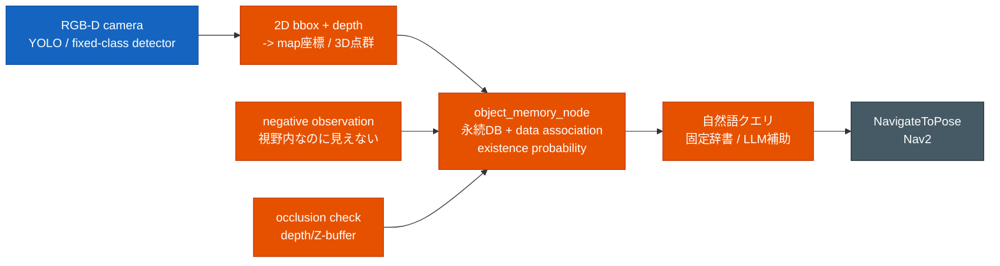
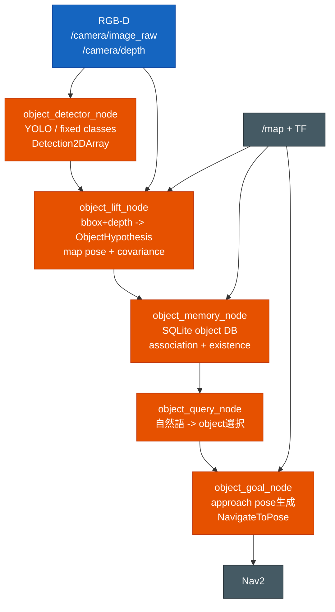

# 物体記憶方式の比較 — 精度・頑健性重視

「YOLO + RGB-D で見つけた物体の座標を記憶し、無くなったら消し、自然語で聞かれた物体の場所へ
Nav2 で移動する」機能について、実装方式を比較した記録。前提は
[`semantic_object_memory_research.md`](semantic_object_memory_research.md) と同じく
ROS2 Humble、Nav2、2D OccupancyGrid、RGB-D カメラ追加、自然語/LLM クエリ。

評価の最優先軸は **精度・頑健性**。ここでは単純な認識精度だけでなく、長期運用での
重複登録、誤消去、遮蔽時の消失、地図座標のズレ、Nav2 連携時の破綻しにくさを重視する。
ROS2 Humble 対応可否は一要素に留め、**評判・採用実績・GitHub の活動度・issue 傾向・論文での
扱われ方**を別軸で見る。

## 結論

このプロジェクトで最も実用的なのは、**RTAB-Map など成熟した基盤は座標安定化の参考/補助にしつつ、
物体の永続記憶・削除・自然語移動は軽量 self-built object memory として作る**方式。

理由:

- **誤消去を制御できる**: 「見えなかった」だけで消さず、視野内・距離内・非遮蔽の
  negative observation のときだけ existence を下げられる。
- **既存資産と合う**: `object_tracker_node.py` は既に Bayes 更新、ハンガリアン法、
  マハラノビスゲート、existence probability を持つ。これを永続メモリ側に拡張しやすい。
- **評判リスクを分散できる**: RTAB-Map は成熟度・利用実績が強い一方、ConceptGraphs/ReMEmbR は
  研究/デモとしては魅力的だが実装運用上の未成熟さが残る。中核 DB を自作しておくと依存先を
  差し替えやすい。
- **精度問題を切り分けられる**: 座標化、同一物体統合、消去判定、自然語解釈を別々に検証できる。

ただし、素朴な「YOLO 検出を SQLite に保存」では不十分。実用ラインにするには、
少なくとも **多視点統合、negative observation、遮蔽判定、確率的な削除、Nav2 goal pose の
到達可能性チェック**が必要。

## 評判・レビュー軸込みの比較表

| 方式 | 評判/成熟度 | 採用実績 | 開発の活発度 | 精度・頑健性 | 実装運用リスク | 自然語対応 | 判定 |
|---|---:|---:|---:|---:|---:|---:|---|
| A. 軽量 self-built object memory | 中 | 低 | 中 | 中〜高 | 中 | 中〜高 | **中核に推奨** |
| B. RTAB-Map + semantic 後処理 | **高** | **高** | **高** | 中〜高 | 中 | 低 | **補助基盤として有力** |
| C. ConceptGraphs 系 3D scene graph | 高 | 中 | 中 | 高 | 高 | **高** | 自然語/表現の参考 |
| D. ReMEmbR 系 VLM/LLM memory | 中 | 低〜中 | 低〜中 | 中 | 高 | **高** | クエリ層の参考 |
| E. Hydra/Kimera など統合 3D scene graph | 高 | 中 | 中〜高 | 高 | 高 | 中 | 研究/将来候補 |
| F. POCD/Perpetua 型 change detection | 中 | 低 | 低〜中 | 高 | 中〜高 | 低 | 消去ロジックの参考 |

## 評判・レビュー情報からの読み取り

| 実装/研究 | ポジティブな評判シグナル | ネガティブ/注意シグナル | この用途での見立て |
|---|---|---|---|
| RTAB-Map / `rtabmap_ros` | GitHub 規模が大きい（`rtabmap` 約 3.8k stars / 3,654 commits、`rtabmap_ros` 約 1.4k stars / 1,877 commits）。ROS2 package として RGB-D、3D LiDAR、Nav2 例が公式に揃う。2024 論文でも long-term online operation 向け OSS として整理されている | issue 数も多く、map offset、data drop、LiDAR-only drift、Nav2 連携など実運用系の相談が継続的に出ている。多機能なぶん調整対象が多い。commits/issues とも継続的で、開発の活発度は高い | **成熟度は最上位**。ただし「物体が無くなったら消す」「自然語で行く」は中核機能ではないので、座標安定化/SLAM補助として使うのが現実的 |
| ConceptGraphs | ICRA 2024 系の代表的 3D scene graph。GitHub 約 887 stars / 52 commits。自然語・抽象クエリ系の表現力は強い。real-time/streamlined branch や Jackal 実装も示されている | issue には CUDA/conda、LLaVA 互換、camera trajectory/depth/object point cloud misalignment、frame 不整合、Docker 要望など実装依存の問題が目立つ。研究コードとしては動きがあるが、汎用ライブラリ並みの保守活発度ではない | **研究評価と表現力は高いが、運用基盤としては重い**。自然語検索設計の参考にする |
| ReMEmbR | NVIDIA-AI-IOT の実装で、LLM/VLM memory から goal pose を返す流れが明確。`Where can I sit?` のようなクエリ例が用途に近い | GitHub は約 342 stars / 13 commits と若い。issue には Jetson/fastattention2、rosbag、NavQA eval、Milvus、依存エラー、Nova 固有パスなど導入・評価まわりの相談が多い。開発の活発度はまだ限定的 | **自然語→場所のデモ設計はかなり参考になる**。ただし object instance の削除/存在確率は別に作る必要がある |
| Hydra | MIT-SPARK/Carlone 系で研究評価が高く、約 1.1k stars / 588 commits。3D scene graph のリアルタイム構築として論文・実装ともに存在感がある | issue には「scene graph の取り出し方」「実データでの動かし方」「visualizer build」「config/extrinsics」「object bounding-box」など利用ハードルを示す質問が多い。研究基盤としては継続的に動いている | **将来の高機能3D空間表現として強い**。今回の「YOLO物体を覚えて行く」MVPには大きすぎる |
| POCD / Perpetua | object-level change detection / object permanence の研究として筋が良い。誤消去・誤残存の理論面では重要 | 汎用 ROS2 ナビ統合ライブラリというより研究実装寄り。自然語・Nav2 連携は別問題 | **削除判定の理論だけ採用**。中核フレームワークとしては採用しない |

## 実用評価軸

「実際にこのパッケージへ入れて運用できるか」を見るため、次の 5 軸を追加で評価する。

| 評価軸 | 見る内容 |
|---|---|
| 導入難易度 | 依存、GPU、Docker、モデル DL、ビルド/設定の重さ |
| リアルタイム性 | ロボットが走りながら online に使えるか、offline 後処理寄りか |
| 地図更新能力 | 物体の移動・消失・再出現を扱えるか |
| デバッグ性 | なぜ登録/統合/削除/選択されたか追跡できるか |
| Nav2 連携 | object pose から到達可能な approach pose を作りやすいか |

| 方式 | 導入難易度 | リアルタイム性 | 地図更新能力 | デバッグ性 | Nav2 連携 | 実用評価 |
|---|---:|---:|---:|---:|---:|---|
| A. 軽量 self-built object memory | **高** | **高** | **高** | **高** | **高** | **最有力** |
| B. RTAB-Map + semantic 後処理 | 中 | 中〜高 | 低〜中 | 中 | 中 | SLAM 補助向き |
| C. ConceptGraphs 系 3D scene graph | 低 | 中 | 中 | 低〜中 | 低〜中 | 表現/検索の参考 |
| D. ReMEmbR 系 VLM/LLM memory | 低〜中 | 中 | 低 | 中 | 中 | クエリ層の参考 |
| E. Hydra/Kimera など統合 3D scene graph | 低 | 高 | 中 | 低〜中 | 低〜中 | 将来候補 |
| F. POCD/Perpetua 型 change detection | 低〜中 | 中 | **高** | 中 | 低 | 消去ロジックの参考 |

評価理由:

- **A. 軽量 self-built object memory**: 自作なので導入は最小化できる。SQLite の object DB、
  association score、hit/miss、existence、negative observation 理由をログ化すれば、
  登録・削除・自然語選択の説明可能性も高い。Nav2 とは `NavigateToPose` と 2D OccupancyGrid
  の free cell 探索だけで接続できる。
- **B. RTAB-Map + semantic 後処理**: SLAM と再訪問整合性は強いが、物体削除や自然語 query は
  本体機能ではない。リアルタイム SLAM としては実績がある一方、semantic object memory は
  追加実装が必要。
- **C. ConceptGraphs**: 自然語検索は強いが、依存が重く、処理の内訳も foundation
  model / multi-view association / LLM にまたがる。誤統合や座標ずれを現場で追う難度が高い。
- **D. ReMEmbR**: 自然語から goal pose を返す形は参考になるが、caption memory 中心なので
  「その物体が今も存在するか」の地図更新能力は低い。object DB と組み合わせる前提。
- **E. Hydra/Kimera**: 3D scene graph を online 構築する力はあるが、導入・設定・実データ投入の
  ハードルが高い。Nav2 の 2D goal へ落とす接続はこのプロジェクト側で設計が要る。
- **F. POCD/Perpetua**: 地図更新・消去判定の理論は強い。反面、自然語や Nav2 goal generation
  とは直接つながらないため、change detection 部品として取り込むのが妥当。

## レビュー/比較記事・関連論文

実ユーザーのブログレビューは分野全体で多くないため、ここでは **レビュー寄りの論文、比較評価論文、
実装紹介論文、周辺方式を比較している記事**を含める。日付は arXiv / 公開ページで確認できる
公開日を YYYY-MM-DD で記す。

| 対象 | 記事/論文 | 日付 | リンク | 概要 | 評価への反映 |
|---|---|---:|---|---|---|
| RTAB-Map | RTAB-Map as an Open-Source Lidar and Visual SLAM Library for Large-Scale and Long-Term Online Operation | 2024-03-10 | https://arxiv.org/abs/2403.06341 | RTAB-Map の実装背景、LiDAR/Visual SLAM 対応、複数実データセットでの定量/定性比較を整理した実装紹介・評価論文。long-term online operation と memory management を明示的に扱う | RTAB-Map の成熟度・採用実績・SLAM 補助としての評価を上げる根拠。ただし semantic object deletion や自然語 query は主題ではない |
| RTAB-Map | Evaluation of RGB-D SLAM in Large Indoor Environments | 2022-12-12 | https://arxiv.org/abs/2212.05980 | 大規模屋内環境で RTAB-Map と Voxgraph を比較。低オドメトリノイズでは高品質 map を作れる一方、高ノイズでは失敗傾向があること、RTAB-Map は memory 消費が重めであることを報告 | RTAB-Map を「万能中核」ではなく、座標安定化/再訪問整合性の補助に留める根拠 |
| Hydra | Foundations of Spatial Perception for Robotics: Hierarchical Representations and Real-time Systems | 2023-05-11 | https://arxiv.org/abs/2305.07154 | 3D spatial perception のレビュー/総説寄り論文。階層表現、3D scene graph、loop closure、long-term correction を整理し、Hydra を統合システム例として位置付ける | Hydra の研究評価・将来性を高く見る根拠。一方、今回の MVP には表現が大きいという判断は維持 |
| Hydra | Hydra: A Real-time Spatial Perception System for 3D Scene Graph Construction and Optimization | 2022-01-31 | https://arxiv.org/abs/2201.13360 | Hydra 本体の実装紹介論文。ESDF、場所/部屋抽出、3D scene graph optimization を online で行い、batch offline 相当の精度を real-time に近づける | リアルタイム性を高めに評価する根拠。ただし導入難易度・Nav2 連携の低さは issue 傾向から別評価 |
| ConceptGraphs / language-grounded 3D graph | Hierarchical 3D Scene Graphs for Language-Grounded Robot Navigation | 2024-03-26 | https://arxiv.org/abs/2403.17846 | HOV-SG。floor/room/object の階層 3D scene graph を language-grounded navigation に使う。dense feature map より表現サイズを抑える比較も示す | ConceptGraphs 系の自然語対応・表現力を高く評価する根拠。長距離ナビには階層化が重要という補助根拠 |
| ConceptGraphs / queryable 3D graph | 3D Scene Graphs from Point Clouds with Queryable Objects and Open-Set Relationships | 2024-02-19 | https://arxiv.org/abs/2402.12259 | 3D scene graph を queryable object / relationship へ拡張する研究。固定ラベルだけでなく関係問い合わせを扱う | 自然語・関係推論の将来拡張候補として評価。ただし object permanence や Nav2 接続は別問題 |
| ReMEmbR | ReMEmbR: Building and Reasoning Over Long-Horizon Spatio-Temporal Memory for Robot Navigation | 2024-09-20 | https://arxiv.org/abs/2409.13682 | ロボットの長時間走行履歴を VLM/LLM で検索可能な時空間メモリにし、NaVQA dataset と実機デモで評価。空間・時間・画像を使った質問応答を扱う | 自然語 query 層の評価を高くする根拠。ただし object instance の存在/削除管理ではないため、地図更新能力は低く評価 |
| object memory / map update | Online Object-Oriented Semantic Mapping and Map Updating | 2020-11-13 | https://arxiv.org/abs/2011.06895 | RGB-D 検出から object-oriented semantic map を online 更新する研究。data association、誤対応の refinement、existence likelihood による false positive/false negative 対応を扱い、10Hz 超の実行を報告 | 軽量 self-built object memory の設計に最も近い参考。existence probability、negative observation、重複/誤対応対策の根拠 |
| POCD / change detection | POCD: Probabilistic Object-Level Change Detection and Volumetric Mapping in Semi-Static Scenes | 2022-05-02 | https://arxiv.org/abs/2205.01202 | semi-static scene の map maintenance 研究。object state として stationarity score と TSDF change measure を持ち、幾何・意味情報を Bayes 更新する | 地図更新能力・誤消去耐性を評価する理論根拠。Nav2/自然語とは直接つながらないので部品扱い |
| object-level change detection | LiSTA: Geometric Object-Based Change Detection in Cluttered Environments | 2024-03-04 | https://arxiv.org/abs/2403.02175 | 複数ミッションの LiDAR SLAM、volumetric differencing、object instance descriptor で追加/削除/位置変化を検出する研究。実環境の産業施設データも扱う | 長期運用で「物体が変わる」問題の重要性を補強。RGB-D YOLO memory とはセンサ構成が違うため直接採用ではなく参考 |
| ROS2 navigation 全般 | From the Desks of ROS Maintainers: A Survey of Modern & Capable Mobile Robotics Algorithms in ROS 2 | 2023-07-28 | https://arxiv.org/abs/2307.15236 | ROS2 mobile robotics/navigation のサーベイ。Navigation maintainers 視点で、実装が研究から製品寄りへ移る際の観点を整理する | Nav2 連携・実装運用リスクを見る補助資料。object memory そのものの比較ではない |
| 3D scene understanding | OGScene3D: Incremental 3D Gaussian Scene Graph Mapping for Scene Understanding | 2026-03-17 | https://arxiv.org/abs/2603.16301 | incremental 3D semantic mapping / scene graph construction の新しめの研究。confidence-based Gaussian semantic representation と長期 global optimization を扱う | ConceptGraphs 系の次世代動向。新しく研究寄りなので、現時点では実用中核ではなく将来候補 |

### A. 軽量 self-built object memory（推奨）

RGB-D 画像から YOLO 検出 bbox を取り、bbox 内の深度点群を `map` に TF 変換して物体候補を作る。
同一クラス・近傍・3D overlap・見た目特徴で既存 object DB に対応付け、観測が増えるほど
座標と existence probability を安定させる。

実装の核:

| 部品 | 推奨 |
|---|---|
| 2D 検出 | YOLOv8/YOLO系。必要なら固定クラスの専用学習重みを追加する |
| 3D 座標化 | bbox 内 depth の中央値/点群クラスタ。中心1点の深度だけにしない |
| data association | 同クラス + 距離ゲート + 3D IoU/楕円ゲート + appearance embedding |
| 記憶 | SQLite か YAML/JSONL ではなく、更新頻度を考えて SQLite 推奨 |
| existence | hit/miss の Bayes 更新。miss は「見えるはず」の時だけ数える |
| 消去 | `existence < threshold` かつ `last_seen` 古い場合に削除/非active化 |
| 自然語 | まず class synonym 辞書。必要な場合だけ LLM を補助的に使う |
| 移動 | object pose そのものではなく、近傍 free cell から approach pose を生成 |

精度・頑健性で効く点:

- 物体座標は単発 bbox 中心ではなく、複数観測の robust 平均/中央値で更新する。
- 不検出をすぐ削除に使わない。視野内、検出可能距離内、手前に遮蔽物が無いときだけ
  negative observation とする。
- 物体を直接 goal にしない。Nav2 costmap 上で到達可能な手前位置を goal にする。
- `map_roi_filter_node.py` と同じ 2D OccupancyGrid 判定を使い、壁内・地図外の object を登録しない。

この repo での接続点:

| 既存資産 | 使い道 |
|---|---|
| `object_tracker_node.py` | Bayes 更新、ゲート、existence の設計を object memory に転用 |
| `map_roi_filter_node.py` | map 座標化した物体の壁/地図外除外 |
| `teleop_gui_node.py` | `NavigateToPose` 送信の既存実装を流用 |
| `traffic_light_detector_node.py` | YOLO/classic 切替、`vision_msgs/Detection2DArray` 出力の前例 |
| `PredictedCostmapLayer` | OccupancyGrid を Nav2 に max 合成する実装パターンの参考 |

注意点:

- RGB-D の外部キャリブレーションと TF がズレると、DB は静かに壊れる。
- bbox 内 depth は背景を拾いやすい。物体点群抽出は中央値、depth 範囲クラスタ、必要なら
  segmentation mask を併用する。
- 「椅子」など可動物を消すには negative observation が要るが、「棚」など半固定物は
  消えにくくするクラス別寿命が必要。

### B. RTAB-Map + semantic 後処理

RTAB-Map はこの候補群の中では成熟度・採用実績が最も強い。公式 `rtabmap_ros` は
RGB-D、3D LiDAR、Nav2 連携例を持ち、長期 online operation 向けの OSS SLAM として
2024 年の整理論文もある。

向いている用途:

- RGB-D SLAM/loop closure を使い、カメラ座標から `map` 座標への安定性を上げる。
- offline に `.db` を処理して物体ランドマークを作る。
- 既存 AMCL/2D map より 3D の再訪問整合性を重視する。

弱い点:

- 「過去に見た物体が今無いから消す」という online object permanence は別途必要。
- RTABMap_Semantic_Mapping は YOLO + `.db` 後処理寄りで、実運用の逐次 object DB としては
  そのままでは足りない。
- このプロジェクトは既に 2D map + AMCL + Nav2 が主軸なので、RTAB-Map を中核にすると
  localization/nav 構成全体の責務が増える。

判定: **SLAM/再訪問整合性を強化する補助には良いが、今回の中核にはしない**。

### C. ConceptGraphs 系 3D scene graph

ConceptGraphs は 2D foundation model の出力を 3D に multi-view association で融合し、
object-level graph を作る。抽象クエリや自然語検索は非常に強い。

強い点:

- 「座るもの」「机の上のもの」のような自然語・関係推論に強い。
- 物体単位のグラフなので、点ごとの特徴マップより検索しやすい。
- real-time/streamlined branch や Jackal 実装があり、研究コードとしては参考価値が高い。

弱い点:

- GPU/依存/LLM API/データフローが重く、Humble package としてそのまま入れるには大きい。
- object permanence、誤消去、遮蔽時の扱いはこのプロジェクト向けに追加設計が要る。
- 既存 2D Nav2 map と object DB の責務が重複しやすい。

判定: **自然語検索と scene graph の設計参考にする。中核実装として丸ごと採用しない**。

### D. ReMEmbR 系 VLM/LLM memory

ReMEmbR は VLM caption と pose/time を memory item として保存し、LLM で推論して goal pose を返す。
README でも `MemoryItem(caption, time, position, theta)` を MilvusDB に入れ、
`Where can I sit?` のようなクエリで `response.position` を得る流れが示されている。

強い点:

- 自然語クエリから goal pose を返す流れが、やりたい③に近い。
- LLM/VLM/ベクトルDBの構成例として実装が具体的。
- Nav2/実機デモの参考になる。

弱い点:

- caption 記憶中心で、明示的な object instance / existence / deletion とは別物。
- 「椅子が移動した」「無くなった」を正しく消すには object mapping 層が必要。
- MilvusDB、VILA、Ollama、LangGraph など依存が重い。

判定: **問い合わせ層だけ参考。物体地図の中核にはしない**。

### E. Hydra/Kimera など統合 3D scene graph

Hydra/Kimera 系は 3D geometry、場所、部屋、物体を一体で扱えるため、研究としては綺麗。
ただしこの repo は Gazebo Classic + Nav2 + 2D map で既に動いており、統合 3D scene graph を
中核にすると移植と検証範囲が大きくなる。

強い点:

- 3D 空間構造、部屋階層、物体関係まで統一的に扱える。
- 複雑な屋内ナビや高レベル計画には筋が良い。

弱い点:

- 依存・設定・実データ投入で詰まりやすい。
- 既存 AMCL/Nav2/2D map と二重管理になりやすい。
- 「YOLOで見たものを覚えて聞いたら行く」という初期目標に対して実装量が過大。

判定: **将来の上位地図としては候補。今の実装フェーズでは非推奨**。

### F. POCD/Perpetua 型 change detection

POCD は semi-static scene の object state を確率的に扱い、stationarity score と TSDF change を
Bayes 更新する。Perpetua は persistence/emergence filter で object permanence を形式化する。
どちらも「消す判断」の研究としては重要。

強い点:

- 誤消去・誤残存を減らす理論的な枠組みがある。
- 長期運用、半固定物、環境変化に強い。

弱い点:

- TSDF/volumetric map など、この repo の 2D OccupancyGrid 主軸とは実装の粒度が違う。
- 自然語クエリや Nav2 goal generation は別途必要。
- いきなり導入すると実装・検証コストが高い。

判定: **existence update と negative observation の設計だけ取り込む**。

## 推奨アーキテクチャ

最初の実装単位:

1. **object_lift_node**: `vision_msgs/Detection2DArray` + depth + TF から `map` 座標の候補を出す。
2. **object_memory_node**: 候補を SQLite に統合し、`MarkerArray` と一覧 topic/service を出す。
3. **negative observation**: 視野内に入った既知 object が非検出かつ非遮蔽なら existence を下げる。
4. **query + nav**: まず固定辞書で「座るもの -> chair」。選択 object の近傍 free cell へ
   `NavigateToPose`。
5. **辞書拡張**: class synonym 辞書を増やし、必要な場合だけ LLM 補助を後付けする。

メッセージ型は新規 `.msg` を作らない方針に合わせる。初期は次で足りる:

| 用途 | 型 |
|---|---|
| 2D 検出 | `vision_msgs/Detection2DArray` |
| 3D 候補 | `visualization_msgs/MarkerArray` + service/action は既存型中心 |
| 永続DB | SQLite 内部表現。ROS topic に DB 全体を無理に流さない |
| goal | `nav2_msgs/action/NavigateToPose` |

## 実装時の成功条件

精度・頑健性を測るには、最低限次をログ化する。

| 指標 | 目安 |
|---|---|
| duplicate rate | 同じ物体が複数IDに割れる割合 |
| false deletion | 遮蔽/視野外なのに消した回数 |
| stale object rate | 無くなった物体が残り続ける割合 |
| position error | 再観測時の object DB 座標との距離 |
| query success | 自然語クエリで正しい object が選ばれた割合 |
| nav success | object 近傍 goal に到達できた割合 |

評価シナリオ:

- 椅子/箱/机などを 3〜5 個置く。
- 同じ物体を複数方向から観測して重複しないか確認する。
- 物体を一時的に遮蔽して、消えないことを確認する。
- 物体を移動/削除して、数回の negative observation 後に active から落ちることを確認する。
- 「座るもの」「赤いもの」「最後に見た箱」などを問い合わせ、Nav2 goal が到達可能位置に出るか確認する。

## 採用判断

最初から ConceptGraphs/Hydra/ReMEmbR を丸ごと入れるより、以下の段階構成が実用的。

| フェーズ | 方針 | 理由 |
|---|---|---|
| MVP | self-built object memory + 固定クラス/辞書 | 物体座標・重複・削除の堅牢性を先に固める |
| 実用化 | negative observation + occlusion + approach pose | 誤消去と到達不能 goal が実運用の主な破綻点 |
| 高度化 | class synonym / LLM query、ConceptGraphs/ReMEmbR の一部導入 | 自然語の柔軟性を後から足す |
| 将来 | RTAB-Map 連携 / 3D scene graph | 再訪問整合性・部屋階層・大規模化が必要になってから |

よって、このプロジェクトでは **A を中核、B は座標安定化/再訪問整合性の補助、C/D/F は部品として参照、
E は将来検討**が妥当。

## 参照情報

GitHub の stars/issues/commits は 2026-06-17 時点で確認。

- RTAB-Map ROS2: https://github.com/introlab/rtabmap_ros
- RTAB-Map core: https://github.com/introlab/rtabmap
- RTABMap_Semantic_Mapping: https://github.com/gjcliff/RTABMap_Semantic_Mapping
- ConceptGraphs: https://concept-graphs.github.io/ / https://github.com/concept-graphs/concept-graphs
- ReMEmbR: https://github.com/NVIDIA-AI-IOT/remembr
- Hydra: https://github.com/MIT-SPARK/Hydra
- POCD: https://arxiv.org/abs/2205.01202
- Perpetua: https://github.com/montrealrobotics/perpetua-code
