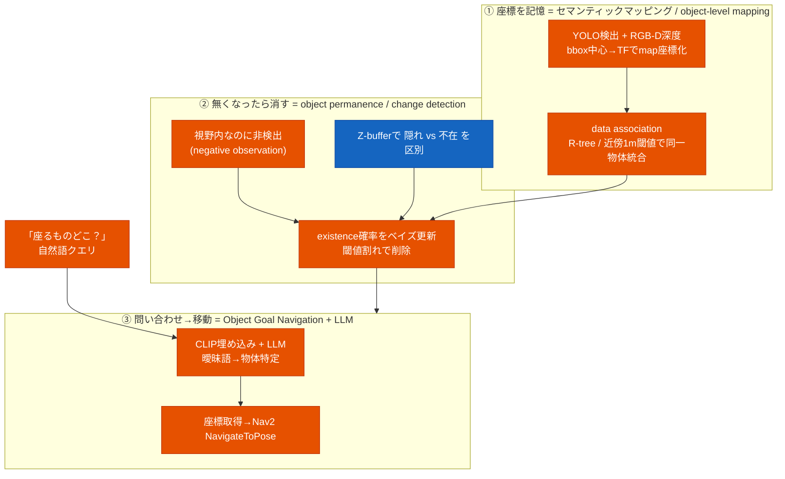

# 物体の記憶・鮮度管理・自然言語ナビ — 技術調査記録

「YOLO 等で検出した物体の 3D 座標を地図に記憶し、無くなったものは地図から消し、自然言語で
問われた物体の場所を答えてそこへ移動する」システムを作るにあたり、**どういう研究分野で、
先行研究・実装済み ROS2 ライブラリは何があるか**を調査した記録。多源 Web 調査 + 反証検証
（各主張を 3 票の敵対的検証）で裏取りした。

> 前提（調査時に確定）: 座標化は **RGB-D（深度カメラ）追加**前提、問い合わせは
> **自然語/LLM**（例「座るもの」→ chair）。構成は ROS2 Humble + Nav2 + 自作 perception
> （YOLO 信号認識 / LiDAR 検出追跡）+ 2D 占有格子。

## 結論（要点）

- やりたいことは **3 つの確立した分野の組み合わせ**:
  ① セマンティックマッピング ② object permanence / 変化検出 ③ Object Goal Navigation + LLM。
- ⚠️ **主要研究の多くが ROS2 Humble で動かない**（Hydra=Iron 以降、Voxblox++=ROS1）。
  重い統合 SLAM をそのまま使うのは非現実的。
- ✅ **推奨は「軽量 self-built object map」方式**。本プロジェクトの既存 perception が
  必要部品をほぼ持っており（特に **object permanence は object_tracker の existence
  probability ベイズ更新が既に同じ仕組み**）、Hydra 等の移植より自然な拡張になる。

## 全体像

## ① 座標を記憶 — Semantic / Object-level Mapping（確度: 高）

「YOLO 検出物体の 3D 座標を地図に記憶」= **metric-semantic / object-level mapping** という分野。

| 手法 | 中身 | ROS2 Humble |
|---|---|---|
| Kimera | リアルタイム metric-semantic VI-SLAM（2D 意味ラベルを 3D メッシュに融合） | C++ |
| Voxblox++ | RGB-D→TSDF instance-aware semantic map + 3D object discovery | ❌ ROS1 のみ |
| Hydra (MIT-SPARK) | リアルタイム 3D Scene Graph（objects/places/rooms 階層） | ❌ **Iron 以降のみ＝Humble 不可** |
| ConceptGraphs | open-vocabulary 3D scene graph + CLIP + GPT-4 | GPU 重い |
| RTABMap_Semantic_Mapping (gjcliff) | RTAB-Map `.db` + Ultralytics/YOLO | ✅ **Humble で動く** |
| object-level-mapping (benchun123) | Voxblox++ ベース。association 設計は明確だが**公開コードは未完**（global 化未実装） | ❌ ROS1・未完 |

**data association（同一物体の対応付け・重複防止）の実装テンプレ**:
- **Dengler et al.**（ECMR2021, arXiv:2011.06895）: 同クラスの重複ポリゴンを **R-tree** で探索→点群 merge。
  過剰 merge は Euclidean 再クラスタリングで undo。
- **LTC-Mapping**（Sensors2022）: bbox 最近傍頂点ペアの**平均ユークリッド距離（閾値 τmax=1m）**で照合。

## ② 無くなったら消す — Object Permanence / Change Detection（確度: 高）

**核心ロジック**: 物体が削除されるのは「**視野内に居るはずなのに検出されない**（negative /
non-detection）」時に **existence 確率（尤度）をベイズ的に下げ、閾値割れで消す**方式。
再検出時のみ更新する素朴な方法と違い、物体の移動・消失に追従できる。

- **隠れ(occlusion) vs 真の不在の区別**: **Z-buffering** で再投影頂点の深度を比較
  （視野内か・遮蔽かを判定）。LTC-Mapping の手法。
- **閾値例**: Dengler et al. は existence likelihood を hits/misses で更新し `Li < 0.25` で削除。
- **先進研究**: POCD（RSS2022, stationarity score + TSDF 変化のベイズ更新）、
  **Perpetua**（IROS2025, persistence/emergence フィルタ混合の形式的ベイズ、**コード公開**
  github.com/montrealrobotics/perpetua-code）。

## ③ 問い合わせ→移動 — Object Goal Navigation + LLM robot memory（確度: 高）

| 実装 | 中身 |
|---|---|
| **ConceptGraphs**（ICRA2024） | 各 3D 物体に **CLIP 埋め込み**。open-set テキストは CLIP 類似度、**曖昧クエリ（例「座るもの」）は GPT-4 推論**で解決→ planning へ。「open-vocabulary 物体マッピング」の代表 |
| **ReMEmbR**（NVIDIA-AI-IOT） | LLM+VLM の長期時空間メモリ。「Where can I sit?」等に **goal pose を返す→ナビへ**。command-r + Ollama + LangGraph + MilvusDB。Nova Carter 実機動作。**自然語→場所→移動のエンドツーエンド参照** |

> 注意: ReMEmbR は VLM caption ベースのメモリで、明示的な物体クラス/座標を持たない設計。
> 「無くなった物体を消す」(object permanence) には別途 mapping 層（①②）が要る。

## このプロジェクトへの含意 — 推奨は「軽量 self-built object map」

調査の結論は、**重い統合 SLAM（Kimera/Hydra）を移植するより、独立モジュールの組合せを
既存 perception に段階追加する**のが Humble 適合的、というもの。本プロジェクトは部品の大半を既に持つ:

| 必要な部品 | 既存資産（susumu_object_perception） |
|---|---|
| bbox→3D 座標化 | `shape_estimation_node.py`（bbox→3D OBB、L字フィット） |
| data association | `object_tracker_node.py`（ハンガリアン法 + マハラノビス χ²ゲート） |
| **existence 確率のベイズ更新（②の核心）** | **`object_tracker_node.py` が既に existence_probability の Bayes 更新 + 半減期 decay を実装済み** |
| 2D 地図照合（地図外・壁除外） | `map_roi_filter_node.py` |
| 3D LiDAR 物体検出/追跡 | 既存 perception パイプライン一式 |
| Nav2 移動 | `teleop_gui_node.py` の NavigateToPose |

→ **②「消す判断」は、object_tracker の existence_probability ベイズ更新とほぼ同じ仕組み**。
新規に必要なのは主に次の 3 点:

1. **記憶の永続化**: 追跡（一時的・フレーム間）を「記憶」（永続 object DB: クラス/map 座標/
   existence 確率）に拡張。RGB-D bbox→深度→TF(map) で 3D 座標化（既存 shape_estimation と同流）。
2. **open-vocab クエリ層**: 物体に CLIP 埋め込みを保存し、LLM（command-r/GPT-4）で曖昧語→物体選択。
3. **クエリ→移動の接続**: 選択物体の座標→`NavigateToPose`（teleop_gui の巡回機構を流用可）。

接続点の候補: 既存の `/perception/tracked_objects`（TrackedObjects, existence_probability 付き）
を入力に、永続 object DB ノードを足すのが最小コスト。

## 未確定事項（今後の調査・検証余地）

- Hydra/Voxblox++ を ROS2 Humble にバックポートした非公式フォークの有無（移植コストの実態）。
- ConceptGraphs 公開コードを ROS2 ノード化できるか、GPU 要件・リアルタイム性が屋内で実用か。
- object permanence（existence likelihood / Perpetua / POCD）を **Nav2 costmap 更新へ反映**する
  既存 ROS2 実装はあるか、mapping 層止まりか。
- **屋外つくばチャレンジ級**（広域 2D 占有格子 + 動的）での open-vocabulary semantic mapping 事例。
- 既存自作 perception（`tracked_objects` 等）に RGB-D semantic object mapping を最小コストで
  接続する最適点（トピック流用可否）。

## 出典（一次情報中心）

- セマンティック/オブジェクトマッピング: github.com/ethz-asl/voxblox-plusplus、
  github.com/MIT-SPARK/Hydra、concept-graphs.github.io、github.com/gjcliff/RTABMap_Semantic_Mapping、
  github.com/benchun123/object-level-mapping、Kimera(arXiv:1910.02490)
- data association / object permanence: arXiv:2011.06895（Dengler et al.）、
  MDPI Sensors 2022 5308（LTC-Mapping）、arXiv:2205.01202（POCD）、
  arXiv:2507.18808 + github.com/montrealrobotics/perpetua-code（Perpetua）
- 自然語ナビ / LLM memory: concept-graphs.github.io（ConceptGraphs, arXiv:2309.16650）、
  github.com/NVIDIA-AI-IOT/remembr（ReMEmbR, arXiv:2409.13682）

> 関連: 信号認識の調査は [`traffic_light_recognition.md`](traffic_light_recognition.md)、
> Autoware/HD 地図の調査は [`autoware_hd_map_research.md`](autoware_hd_map_research.md)。
> 方式比較と推奨構成は [`semantic_object_memory_comparison.md`](semantic_object_memory_comparison.md)。
