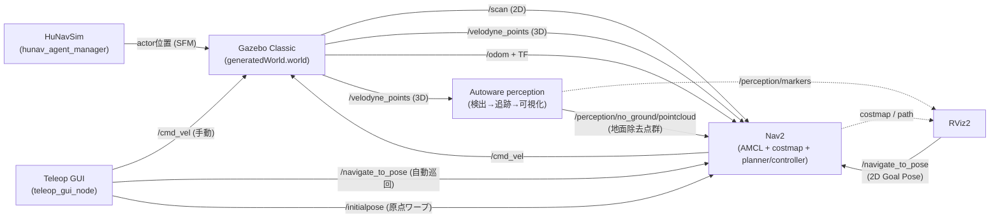
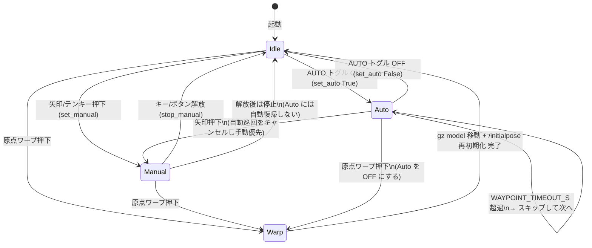
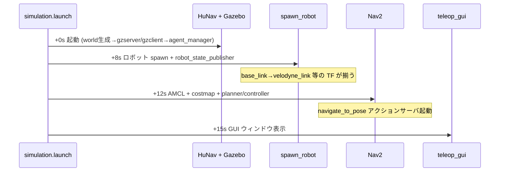
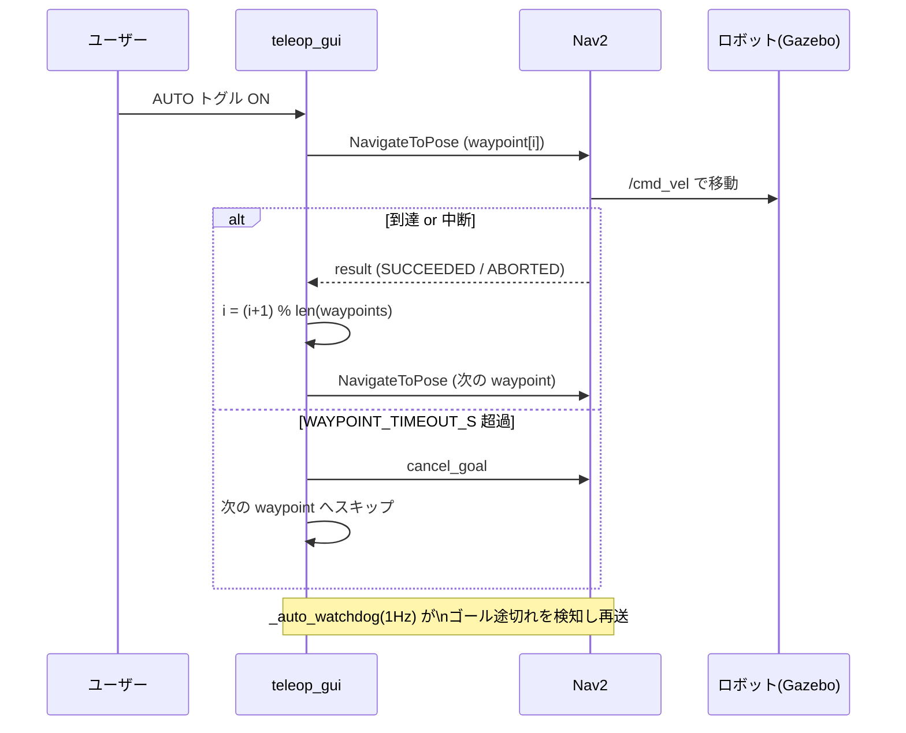
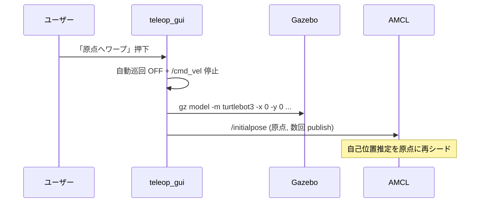
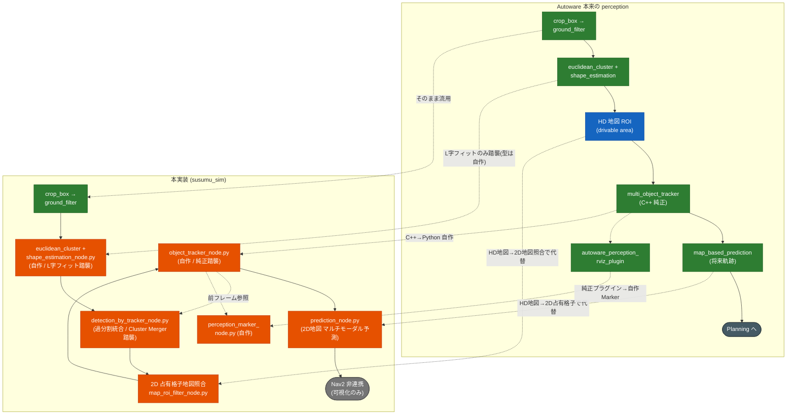

# ソフトウェアデザイン — susumu_sim

ROS 2 Humble + Gazebo Classic 11 上で、HuNavSim 制御の歩行者が動く家を 3D-LiDAR
TurtleBot3 が走り回る**シミュレーター**の設計ドキュメント。Nav2 自律移動と、手動操縦
／部屋自動巡回を行う Teleop GUI を備える。

利用方法・起動コマンドは [`../README.md`](../README.md)、構築の詳細手順・ハマりどころは
[`../SETUP.md`](../SETUP.md) を参照。

## 目次

- [1. 全体構造](#1-全体構造)
- [2. launch 構成と起動順序](#2-launch-構成と起動順序)
- [3. ノード／プロセス詳細](#3-ノードプロセス詳細)
- [4. トピック・フレーム・座標系](#4-トピックフレーム座標系)
- [5. 主なパラメータ](#5-主なパラメータ)
- [6. Teleop GUI の状態遷移](#6-teleop-gui-の状態遷移)
- [7. シーケンス図](#7-シーケンス図)
- [8. Autoware perception パイプラインとの違い](#8-autoware-perception-パイプラインとの違い)
- [9. ディレクトリ構成](#9-ディレクトリ構成)
- [10. 設計上の判断・既知の制約](#10-設計上の判断既知の制約)

---

## 1. 全体構造

このパッケージは**シミュレーター**（既定は cafe world で HuNav 歩行者 5 人）。「人を検知して
右隣を歩く」追従機能は持たない（旧 `susumu_lidar_perception` の追従は分離・本パッケージには
含まれない）。Nav2 は人を除去したフィルタ済みトピックではなく、**生のセンサトピック**
（`/scan`・`/velodyne_points`）を障害物入力に使う（人も普通の障害物として costmap に乗る）。

これに加えて **Autoware LiDAR perception パイプライン**（既定 ON）を載せている。3D LiDAR
点群から物体（特に歩く人）を検出・追跡し RViz に可視化する。Autoware 純正モジュールで検出し、
apt に無い段は Python 自作で補完する。**perception は Nav2 とは連携しない**（可視化のみ。
ただし地面除去済み点群は costmap の動的障害物層に流用）。詳細は
[8 章](#8-autoware-perception-パイプラインとの違い)・[`autoware_perception.md`](autoware_perception.md)。



> Autoware perception の内部段（crop_box→ground_filter→cluster→自作 ROI/追跡/可視化）と
> Autoware 本来のパイプラインとの違いは [8 章](#8-autoware-perception-パイプラインとの違い)。

設計方針:

| 方針 | 内容 |
|---|---|
| メッセージは標準型のみ | `Twist` / `LaserScan` / `PointCloud2` / `PoseWithCovarianceStamped` / `nav2_msgs/NavigateToPose`。独自 msg は持たない |
| Gazebo は Classic 11 | Ignition/Gazebo Sim ではない。HuNavSim は `v1.0-humble` ブランチ必須（`v2.0` は Gazebo Sim 用） |
| Nav2 の障害物層 | 現在位置は `/scan`（obstacle_layer, 2D）。人の現在位置 + 進路先は perception の予測 OccupancyGrid を自作 `predicted_layer`（`PredictedCostmapLayer`）が max 合成で焼く。AMCL も生 `/scan`。※ 旧 3D 障害物層（STVL）は人の通過跡が残るため廃止（[`nav2_tuning.md`](nav2_tuning.md)） |
| 段階起動 | プロセス間に順序依存があるため `TimerAction` で遅延起動する（[2章](#2-launch-構成と起動順序)） |
| GUI と Nav2 は /cmd_vel を共有 | 手動入力時は自動巡回を OFF にして Nav2 ゴールをキャンセルし、Twist を直接 publish（手動優先） |

---

## 2. launch 構成と起動順序

`simulation.launch.py` が全体のエントリポイント。内部で他の launch を include し、
`TimerAction` で段階的に起動する。

### launch ファイル一覧

`simulation.launch.py` が `launch/` 直下のエントリポイント。それが内部で取り込む
部品 launch は `launch/include/` に置く。

| ファイル | 役割 | 単体起動 |
|---|---|---|
| `launch/simulation.launch.py` | 全部入り（下記すべて + RViz2 + GUI）。エントリポイント | ○ |
| `launch/include/hunav_house.launch.py` | Gazebo（house world）+ HuNavSim 歩行者5人 | ○ |
| `launch/include/spawn_robot.launch.py` | 3D-LiDAR TurtleBot3 を spawn + robot_state_publisher | ○（要 Gazebo 起動済み） |
| `launch/include/test_robot_empty.launch.py` | 空 world + ロボット単体（3D LiDAR / TF 確認用）。`simulation` からは include されない検証専用 | ○ |

### 起動タイムライン

| 時刻 | 起動対象 | 遅延の理由 |
|---|---|---|
| +0s | Gazebo（house world）+ HuNavSim 5人 | — |
| +8s | ロボット spawn + robot_state_publisher | Gazebo が先に立ち上がっている必要がある |
| +12s | Nav2（AMCL + costmap + planner/controller） | ロボット／TF が揃っている必要がある |
| +12s | RViz2 | — |
| +15s | Teleop GUI | navigate_to_pose アクションサーバ（Nav2）が存在する必要がある |

> 遅延値はプロセス間の順序依存（robot が居ないと Nav2 の TF が揃わない等）を満たすための
> 値。むやみに詰めると初期化レースで起動に失敗する。

### 主な launch 引数（`simulation.launch.py`）

| 引数 | 既定 | 意味 |
|---|---|---|
| `use_nav2` | True | Nav2 スタックを起動する |
| `use_perception` | True | Autoware perception パイプラインを起動する（[8 章](#8-autoware-perception-パイプラインとの違い)） |
| `use_rviz` | True | RViz2 を起動する |
| `gui` | True | Teleop / 自動巡回 GUI を起動する |
| `map` | `maps/cafe.yaml` | マップ yaml のフルパス（既定は cafe world。house に戻すなら `maps/house.yaml`） |
| `params_file` | `config/nav2_params.yaml` | Nav2 パラメータ yaml のフルパス |
| `x_pose` / `y_pose` / `yaw` | 0.0 / 0.0 / 0.0 | ロボットの spawn 姿勢（マップの空きスペース） |

---

## 3. ノード／プロセス詳細

| プロセス | パッケージ | 役割 |
|---|---|---|
| `hunav_loader` | hunav_agent_manager | `agents_cafe.yaml`（既定）を読み込む |
| `hunav_gazebo_world_generator` | hunav_gazebo_wrapper | world（既定 cafe）+ エージェント → `generatedWorld.world` を生成 |
| `gzserver` / `gzclient` | gazebo_ros | 生成したワールドを実行（HuNav プラグイン入り） |
| `hunav_agent_manager` | hunav_agent_manager | エージェント behavior を駆動（Social Force Model） |
| `robot_state_publisher` | robot_state_publisher | URDF から TF を publish（`base_link → velodyne_link` 等） |
| `spawn_entity.py` | gazebo_ros | SDF モデルを spawn（diff_drive / laser / 3D velodyne gpu_ray / imu / camera プラグイン） |
| Nav2 スタック | nav2_bringup | AMCL + costmap + planner + controller + bt_navigator |
| `teleop_gui` | susumu_sim | Teleop / 部屋自動巡回 GUI（[6章](#6-teleop-gui-の状態遷移)） |
| Autoware perception | autoware_* + susumu_sim | crop_box / ground_filter / euclidean_cluster（純正）+ 自作 4 ノード（[8章](#8-autoware-perception-パイプラインとの違い)） |

### teleop_gui_node の内部構造

tkinter のウィンドウをメインスレッドで動かし、rclpy を別スレッドで spin する。

| 要素 | 内容 |
|---|---|
| `_tick`（10Hz タイマ） | 手動コマンドが有効な間、`/cmd_vel` に `Twist` を再 publish（diff_drive は連続送信が必要） |
| `_auto_watchdog`（1Hz タイマ） | 自動巡回 ON の間、常にゴールが飛んでいる状態を維持。`WAYPOINT_TIMEOUT_S` 超過で次へスキップ |
| `set_manual` / `stop_manual` | GUI ボタン／キーから呼ばれる手動操縦。手動入力で自動巡回を OFF にする |
| `set_auto` / `_send_next_waypoint` | `PATROL_WAYPOINTS` を Nav2（NavigateToPose）で順に巡回 |
| `warp_to_origin` | `gz model` でロボットを原点へ移動し、`/initialpose` で AMCL を再初期化 |

---

## 4. トピック・フレーム・座標系

### 主要トピック

| トピック | 型 | 向き | 説明 |
|---|---|---|---|
| `/velodyne_points` | `sensor_msgs/PointCloud2` | Gazebo→perception/RViz | 3D LiDAR 点群（perception 入力。pointcloud_to_laserscan で /scan 生成） |
| `/scan` | `sensor_msgs/LaserScan` | p2l→AMCL/Nav2 | 3D 点群から pointcloud_to_laserscan で生成（AMCL 自己位置 + obstacle_layer 入力） |
| `/cmd_vel` | `geometry_msgs/Twist` | Nav2/GUI→ロボット | 速度司令（Nav2 と GUI 手動操縦が共有） |
| `/navigate_to_pose` | `nav2_msgs/NavigateToPose` | RViz/GUI→Nav2 | ゴール指定（RViz 2D Goal Pose / GUI 自動巡回） |
| `/initialpose` | `geometry_msgs/PoseWithCovarianceStamped` | GUI→AMCL | 原点ワープ時の AMCL 再初期化 |
| `/odom` | `nav_msgs/Odometry` | Gazebo→Nav2 | diff_drive のオドメトリ |
| `/perception/no_ground/pointcloud` | `sensor_msgs/PointCloud2` | perception→RViz | Autoware ground_filter の地面除去点群（後段の検出・形状推定の入力） |
| `/perception/predicted_costmap` | `nav_msgs/OccupancyGrid` | perception→Nav2 | prediction が出す予測コストマップ（人の現在位置 + 進路先）。自作 `predicted_layer` が max 合成で焼く |
| `/perception/tracked_objects` | `autoware_perception_msgs/TrackedObjects` | tracker→marker | 追跡結果（ID・速度・向き付き） |
| `/perception/markers` | `visualization_msgs/MarkerArray` | marker→RViz | perception 可視化（検出=青/移動=赤/静止=緑、`#ID 速度[km/h]`） |

### フレーム／トピックの約束（変更時は両側を揃える）

| 役割 | 値 | 定義場所 |
|---|---|---|
| 速度司令 | `cmd_vel` | SDF diff_drive ↔ nav2 controller / teleop_gui |
| オドメトリ | frame/topic `odom`（`publish_odom_tf:true`） | SDF diff_drive ↔ amcl odom_frame |
| ベース | `base_footprint`(amcl) / `base_link`(costmap) | SDF / URDF / nav2_params |
| 2D スキャン | `/scan`, frame `velodyne_link` | pointcloud_to_laserscan（/velodyne_points→/scan）↔ amcl ↔ nav2 obstacle_layer |
| 3D LiDAR | `/velodyne_points`, frame `velodyne_link` | SDF gpu_ray ↔ perception ↔ pointcloud_to_laserscan（→ /scan）。※ Nav2 への 3D STVL 層は廃止 |
| HuNav 追跡対象 | robot_name=`turtlebot3`（spawn entity 名と一致必須） | hunav_house / spawn_robot |

---

## 5. 主なパラメータ

### Teleop GUI（`susumu_sim/teleop_gui_node.py`、モジュール定数）

| 定数 | 既定 | 意味 |
|---|---|---|
| `LINEAR_SPEED` | 0.22 | 手動前後進の速度 [m/s]（waffle 最大 ~0.26） |
| `ANGULAR_SPEED` | 0.9 | 手動旋回速度 [rad/s] |
| `PUBLISH_HZ` | 10.0 | 手動 Twist の再送レート [Hz] |
| `PATROL_WAYPOINTS` | 11点 | 自動巡回するルーム中心の経路（部屋を順に巡る） |
| `WAYPOINT_TIMEOUT_S` | 25.0 | 1ウェイポイントで詰まったら次へ進むまでの時間 [s] |
| `ROBOT_ENTITY` | `turtlebot3` | 原点ワープ時に動かす Gazebo モデル名（spawn 名と一致必須） |

### 歩行者（`config/agents_house.yaml`、各エージェント）

公式 `hunav_gazebo_wrapper/scenarios/agents_house.yaml` のコピー（動作実績あり）。
5人は通常歩行速度で**巡回し続ける**設定（**`once: true` + `cyclic_goals: true`**、
各3ゴールの三角ルート）。速度や経路を変えたいときはこのファイルを編集する。

> ⚠️ `once: false` にすると HuNav の behavior 駆動が回らず、ほとんどのエージェントが
> 数十秒で停止する。歩かせ続けたいときも **`once: true`** のままにすること。

| パラメータ | 値 | 意味 |
|---|---|---|
| `max_vel` | 1.5 | エージェントの最大速度 [m/s] |
| `behavior.vel` | 0.6〜0.8 | 目標巡航速度 [m/s] |
| `goal_radius` | 0.3 | ゴール到達判定半径 [m] |
| `obstacle_force_factor` | 10.0 | 障害物回避力の係数 |
| `social_force_factor` | 5.0 | 対人社会力の係数 |
| `other_force_factor` | 20.0 | その他の力の係数 |
| `once` / `cyclic_goals` | **true** / true | ゴール列を巡回し続ける（`false` にすると停止するので注意） |

### Nav2（`config/nav2_params.yaml`、抜粋）

| 項目 | 値 | 意味 |
|---|---|---|
| obstacle_layer.scan.topic | `/scan` | 2D 障害物入力（3D 点群から生成した /scan） |
| 予測コストマップ層 | `predicted_layer`（自作 `susumu_sim::PredictedCostmapLayer`） | perception の予測 OccupancyGrid `/perception/predicted_costmap`（人の現在位置 + 進路先）を max 合成で焼く。毎フレーム作り直すので軌跡が残らない。※ 旧 3D STVL 層は廃止（[`nav2_tuning.md`](nav2_tuning.md)） |
| planner | `nav2_navfn_planner/NavfnPlanner` | Nav2 1.1.20 と整合する `/` 形式のプラグイン名 |
| amcl.scan_topic | `scan` | AMCL は /scan（3D 点群から生成）で自己位置推定 |

> Nav2 パラメータの調整指針・症状別の対処・変更履歴は
> [`nav2_tuning.md`](nav2_tuning.md) にまとめている。**Nav2 を調整したら必ず更新すること。**

---

## 6. Teleop GUI の状態遷移

`teleop_gui_node` は「停止」「手動操縦」「自動巡回」の3状態を持つ。手動入力は常に
自動巡回より優先される。



| 状態 | /cmd_vel | Nav2 ゴール | 説明 |
|---|---|---|---|
| Idle | 停止（空 Twist） | なし | 待機 |
| Manual | 押下中の Twist を 10Hz 再送 | キャンセル済み | 手動操縦。自動巡回より優先 |
| Auto | Nav2 controller が出力 | NavigateToPose（巡回） | 部屋を順に自動巡回 |
| Warp | 停止 | キャンセル | ロボットを原点へワープし AMCL 再初期化 |

---

## 7. シーケンス図

### 起動シーケンス（`simulation.launch.py`）



### 自動巡回（AUTO ON 時の1サイクル）



### 原点ワープ



---

## 8. Autoware perception パイプラインとの違い

本パッケージの perception は **Autoware 本来の物体認識パイプラインを部分的に再現**した
もの。検出の前処理〜クラスタ化までは **Autoware 純正モジュールをそのまま使う**が、apt で
入手できない段（追跡など）や本シミュレーターに不要な段は、**Python 自作で代替**するか
**省略**している。HD 地図も使わず、2D 占有格子地図 `/map` 照合で代替する。
詳細は [`autoware_perception.md`](autoware_perception.md)。

下図は **Autoware 本来の構成（上段）** と **本実装（下段）** を段ごとに対応させたもの。



| 色 | 意味 |
|---|---|
| 🟩 緑 | **Autoware 純正モジュールをそのまま使用**（crop_box / ground_filter / euclidean_cluster） |
| 🟧 橙 | **Python で自作代替**（map_roi_filter / object_tracker / perception_marker） |
| 🟦 青 | **HD 地図依存**（本実装では 2D 占有格子地図照合で代替） |
| ⬜ 灰 | **非連携**（perception は Nav2 とは連携せず可視化のみ） |

段ごとの対応:

| 段階 | Autoware 本来 | 本実装 | 差分の理由 |
|---|---|---|---|
| 前処理 | crop_box → ground_filter | 同じ（純正） | 屋内向けパラメータのみ調整。`ground_filter` は ring/channel 必須のため `pointcloud_to_autoware_node.py` で PointXYZIRC へ変換して投入 |
| 検出 | euclidean_cluster + shape_estimation | euclidean_cluster（純正）+ `shape_estimation_node.py`（自作） | apt に shape_estimation 無し、universe 版は型（tier4_perception_msgs）が世代不整合。L字フィット（rotating calipers + closeness criterion）の**アルゴリズムだけ Autoware 公式（bounding_box.cpp）を踏襲**し、型は標準型で自作。no_ground 点群から各検出近傍を集めて OBB 推定 |
| 過分割統合 | detection_by_tracker（Cluster Merger + IoU 分割） | `detection_by_tracker_node.py`（自作、過分割統合のみ） | 前フレームの tracker 位置・サイズを参照し、1 物体が複数クラスタに割れた検出を統合（Autoware Cluster Merger 踏襲）。統合後の shape は**包含 BBox ではなく点群を L字フィットで再推定**（巨大化回避＝Autoware と同じ）。under-segmentation の IoU 反復分割は未実装 |
| ROI 絞り | HD 地図（drivable area） | 2D 占有格子地図 `/map` 照合（自作） | HD 地図を持たないため。壁・地図外・未知に当たる検出を `map_roi_filter_node.py` で除外 |
| 追跡 | multi_object_tracker（C++ 純正） | `object_tracker_node.py`（自作 Python） | apt に無い。Autoware のソース（ハンガリアン法＋マハラノビス χ²＋existence_probability Bayes 更新）を踏襲して再実装 |
| 分類 | HD マップの walkable-area 上の物体を歩行者と推定 | `object_tracker_node.py` 内で **2D 占有格子で代替** | HD マップが無いので、地図の free space で移動する物体を `PEDESTRIAN`、静止を `UNKNOWN` と推定（tracker 出力段）。可視化はマゼンタで区別 |
| 予測 | map_based_prediction（HD 地図のレーン/crosswalk に沿う。crosswalk マルチパス） | `prediction_node.py`（自作、2D 占有格子版） | HD 地図が無いので **2D 占有格子で代替**。等速 CV 予測 + 予測点が occupied セルなら打ち切り（壁めり込み回避）。**マルチモーダル化**: 進行方向を中心に複数角度で扇状に複数パスを出し（crosswalk マルチパスの 2D 版）、直進ほど高 confidence・伸びた長さで重み付け。出力 `/perception/predicted_objects`（PredictedObjects） |
| 可視化 | autoware_perception_rviz_plugin | `perception_marker_node.py`（自作 MarkerArray） | 表示方法・色を自由に作り込むため。spencer / leg_tracker など Nav2 系プラグインの作法に合わせた |
| 下流 | Planning | Nav2 非連携（可視化のみ） | perception の確立・可視化が目的。Nav2 は従来どおり生センサ（`/scan`・`/velodyne_points`）で動く。ただし地面除去済み点群 `/perception/no_ground/pointcloud` は costmap の STVL 層に流用 |

---

## 9. ディレクトリ構成

```
susumu_sim/
├── launch/
│   ├── simulation.launch.py        # 全部入り エントリポイント（gui:=false でGUI無効）
│   └── include/                    # simulation が取り込む部品 launch
│       ├── hunav_house.launch.py      # world + 5人HuNav のみ（cafe/house 切替）
│       ├── spawn_robot.launch.py      # 3D LiDAR TB3 spawn + robot_state_publisher
│       ├── autoware_perception.launch.py # Autoware perception パイプライン（8章）
│       └── test_robot_empty.launch.py # 空world + ロボット単体（3D LiDAR確認用）
├── susumu_sim/
│   ├── teleop_gui_node.py            # Teleop / 部屋自動巡回 GUI
│   ├── pointcloud_to_autoware_node.py # PointXYZI → PointXYZIRC（ground_filter 用）
│   ├── shape_estimation_node.py      # OBB 推定（Autoware L字フィット踏襲、自作）
│   ├── detection_by_tracker_node.py  # 過分割統合（Autoware Cluster Merger 踏襲、自作）
│   ├── map_roi_filter_node.py        # 2D 地図照合 ROI（壁/地図外/未知の検出を除外）
│   ├── object_tracker_node.py        # DetectedObjects → TrackedObjects 追跡（自作）
│   ├── prediction_node.py            # 2D 将来軌跡予測（CV+壁回避、自作）
│   └── perception_marker_node.py     # Detected/Tracked/Predicted → MarkerArray 可視化（自作）
├── config/
│   ├── agents_cafe.yaml           # HuNav 5人（cafe、既定）
│   ├── agents_house.yaml          # HuNav 5人（house）
│   ├── autoware_*.param.yaml      # crop_box / ground_filter / euclidean_cluster 等
│   └── nav2_params.yaml           # Nav2（obstacle_layer=/scan、3D 障害物層=STVL）
├── models/turtlebot3_waffle_3d/   # waffle + 3D LiDAR の Gazebo SDF
├── urdf/turtlebot3_waffle_3d.urdf.xacro  # TF用URDF
├── maps/cafe.{pgm,yaml}           # cafe のマップ（既定）
├── maps/house.{pgm,yaml}          # house のマップ
├── rviz/simulation.rviz           # RViz設定（3D点群 + perception 可視化付き）
├── docs/software_design.md        # 本ドキュメント
├── docs/autoware_perception.md    # perception パイプライン詳細
├── docs/nav2_tuning.md            # Nav2 調整ガイド
├── LICENSE                        # MIT License
├── README.md / AGENTS.md / CLAUDE.md / SETUP.md
└── CMakeLists.txt / package.xml
```

---

## 10. 設計上の判断・既知の制約

| 項目 | 内容 |
|---|---|
| source は `local_setup.bash` | `install/setup.bash` は古いスナップショットを指す prefix-chain で、新規パッケージが見えず `package not found` になる |
| Python ノードはファイル名で起動 | console_scripts ではない。`ros2 run susumu_sim teleop_gui_node.py`。ノード追加時は CMakeLists の `install(PROGRAMS ...)` に追加し実行ビットを立てる |
| HuNavSim は `v1.0-humble` 必須 | `v2.0` は Gazebo Sim 依存でビルド／起動に失敗する |
| Nav2 params のベース | `turtlebot3_navigation2` の waffle.yaml は `::` 形式で Nav2 1.1.20 と不整合。同梱バージョンと一致する `nav2_bringup/params/nav2_params.yaml` をベースにする |
| 歩行者が動かない | `agents_house.yaml` の `once: false` だと HuNav の behavior 駆動が回らず数十秒で停止する。**`once: true` + `cyclic_goals: true`**（公式 house シナリオと同じ）が正解。HuNav はロボット必須で、人だけ起動すると T ポーズ・床埋まりになる |
| GUI(tkinter) はヘッドレス不可 | X 環境がないと import に失敗し GUI は起動しない。不要時は `gui:=false` |
| `--symlink-install` の削除漏れ | colcon は削除ファイルを install から消さない。ノード／launch を消したら `rm -rf build/susumu_sim install/susumu_sim` してから再ビルドする |
```
