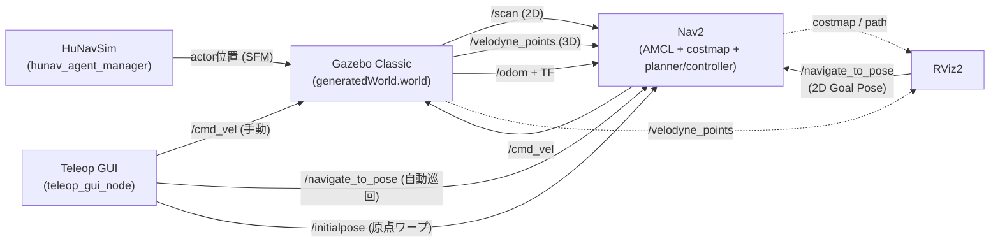
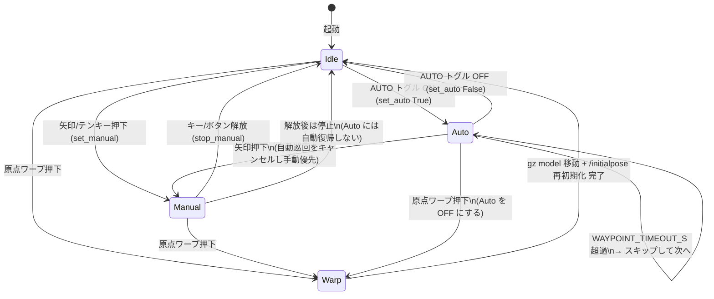
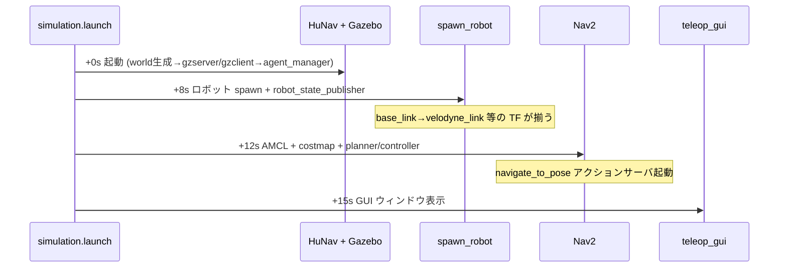
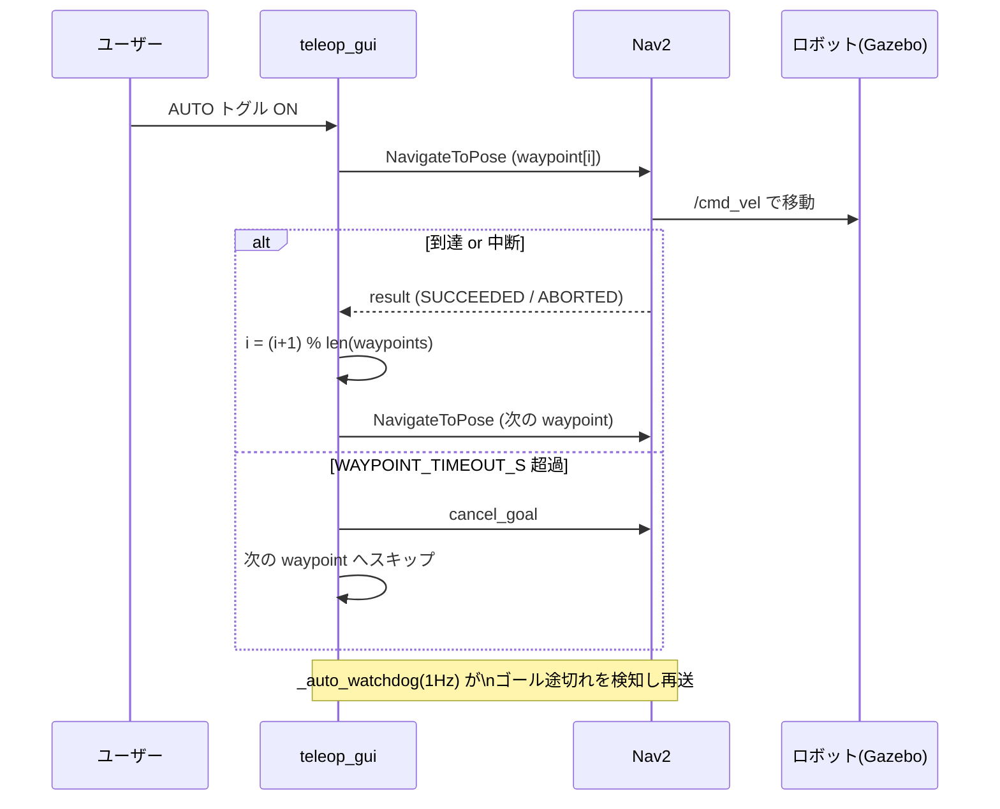
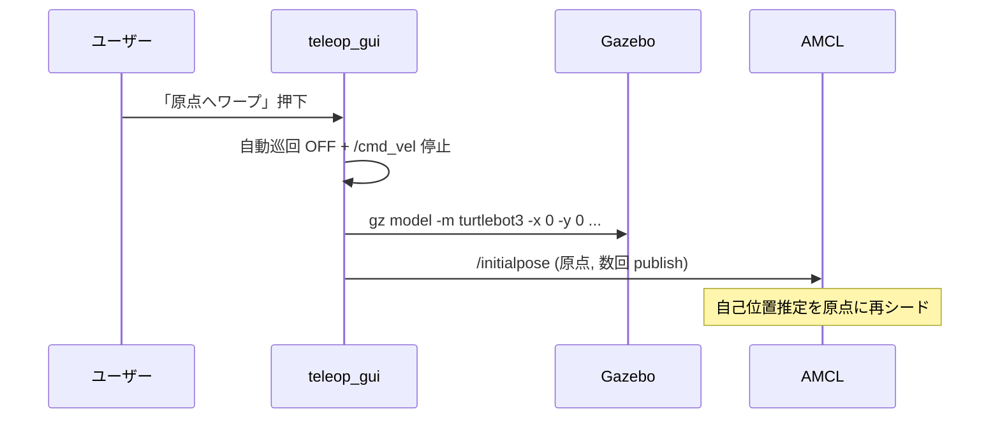

# ソフトウェアデザイン — susumu_sim

ROS 2 Humble + Gazebo Classic 11 上で、HuNavSim 制御の歩行者が動く家を 3D-LiDAR
TurtleBot3 が走り回る**シミュレーター**の設計ドキュメント。Nav2 自律移動と、手動操縦
／部屋自動巡回を行う Teleop GUI を備える。

利用方法・起動コマンドは [`../README.md`](../README.md)、構築の詳細手順・ハマりどころは
[`../SETUP.md`](../SETUP.md) を参照。

## 目次

- [1. 全体構造](#1-全体構造)
- [2. launch 構成と起動順序](#2-launch-構成と起動順序)
- [3. ノード／プロセス詳細](#3-ノードプロセス詳細)
- [4. トピック・フレーム・座標系](#4-トピックフレーム座標系)
- [5. 主なパラメータ](#5-主なパラメータ)
- [6. Teleop GUI の状態遷移](#6-teleop-gui-の状態遷移)
- [7. シーケンス図](#7-シーケンス図)
- [8. ディレクトリ構成](#8-ディレクトリ構成)
- [9. 設計上の判断・既知の制約](#9-設計上の判断既知の制約)

---

## 1. 全体構造

このパッケージは**純粋なシミュレーター**。「人を検知して右隣を歩く」追従機能は別パッケージ
`susumu_lidar_perception` へ分離されており、ここには含まれない。Nav2 は人を除去した
フィルタ済みトピックではなく、**生のセンサトピック**（`/scan`・`/velodyne_points`）を
障害物入力に使う（人も普通の障害物として costmap に乗る）。



設計方針:

| 方針 | 内容 |
|---|---|
| メッセージは標準型のみ | `Twist` / `LaserScan` / `PointCloud2` / `PoseWithCovarianceStamped` / `nav2_msgs/NavigateToPose`。独自 msg は持たない |
| Gazebo は Classic 11 | Ignition/Gazebo Sim ではない。HuNavSim は `v1.0-humble` ブランチ必須（`v2.0` は Gazebo Sim 用） |
| Nav2 は生センサを使用 | 障害物層は `/scan`（obstacle_layer）と `/velodyne_points`（voxel_layer）。AMCL も生 `/scan` |
| 段階起動 | プロセス間に順序依存があるため `TimerAction` で遅延起動する（[2章](#2-launch-構成と起動順序)） |
| GUI と Nav2 は /cmd_vel を共有 | 手動入力時は自動巡回を OFF にして Nav2 ゴールをキャンセルし、Twist を直接 publish（手動優先） |

---

## 2. launch 構成と起動順序

`simulation.launch.py` が全体のエントリポイント。内部で他の launch を include し、
`TimerAction` で段階的に起動する。

### launch ファイル一覧

`simulation.launch.py` が `launch/` 直下のエントリポイント。それが内部で取り込む
部品 launch は `launch/include/` に置く。

| ファイル | 役割 | 単体起動 |
|---|---|---|
| `launch/simulation.launch.py` | 全部入り（下記すべて + RViz2 + GUI）。エントリポイント | ○ |
| `launch/include/hunav_house.launch.py` | Gazebo（house world）+ HuNavSim 歩行者5人 | ○ |
| `launch/include/spawn_robot.launch.py` | 3D-LiDAR TurtleBot3 を spawn + robot_state_publisher | ○（要 Gazebo 起動済み） |
| `launch/include/test_robot_empty.launch.py` | 空 world + ロボット単体（3D LiDAR / TF 確認用）。`simulation` からは include されない検証専用 | ○ |

### 起動タイムライン

| 時刻 | 起動対象 | 遅延の理由 |
|---|---|---|
| +0s | Gazebo（house world）+ HuNavSim 5人 | — |
| +8s | ロボット spawn + robot_state_publisher | Gazebo が先に立ち上がっている必要がある |
| +12s | Nav2（AMCL + costmap + planner/controller） | ロボット／TF が揃っている必要がある |
| +12s | RViz2 | — |
| +15s | Teleop GUI | navigate_to_pose アクションサーバ（Nav2）が存在する必要がある |

> 遅延値はプロセス間の順序依存（robot が居ないと Nav2 の TF が揃わない等）を満たすための
> 値。むやみに詰めると初期化レースで起動に失敗する。

### 主な launch 引数（`simulation.launch.py`）

| 引数 | 既定 | 意味 |
|---|---|---|
| `use_nav2` | True | Nav2 スタックを起動する |
| `use_rviz` | True | RViz2 を起動する |
| `gui` | True | Teleop / 自動巡回 GUI を起動する |
| `map` | `maps/house.yaml` | マップ yaml のフルパス |
| `params_file` | `config/nav2_params.yaml` | Nav2 パラメータ yaml のフルパス |
| `x_pose` / `y_pose` / `yaw` | 0.0 / 0.0 / 0.0 | ロボットの spawn 姿勢（house マップの空きスペース） |

---

## 3. ノード／プロセス詳細

| プロセス | パッケージ | 役割 |
|---|---|---|
| `hunav_loader` | hunav_agent_manager | `agents_house.yaml` を読み込む |
| `hunav_gazebo_world_generator` | hunav_gazebo_wrapper | `house.world` + エージェント → `generatedWorld.world` を生成 |
| `gzserver` / `gzclient` | gazebo_ros | 生成したワールドを実行（HuNav プラグイン入り） |
| `hunav_agent_manager` | hunav_agent_manager | エージェント behavior を駆動（Social Force Model） |
| `robot_state_publisher` | robot_state_publisher | URDF から TF を publish（`base_link → velodyne_link` 等） |
| `spawn_entity.py` | gazebo_ros | SDF モデルを spawn（diff_drive / laser / 3D velodyne gpu_ray / imu / camera プラグイン） |
| Nav2 スタック | nav2_bringup | AMCL + costmap + planner + controller + bt_navigator |
| `teleop_gui` | susumu_sim | 本パッケージ唯一の自作ノード（[6章](#6-teleop-gui-の状態遷移)） |

### teleop_gui_node の内部構造

tkinter のウィンドウをメインスレッドで動かし、rclpy を別スレッドで spin する。

| 要素 | 内容 |
|---|---|
| `_tick`（10Hz タイマ） | 手動コマンドが有効な間、`/cmd_vel` に `Twist` を再 publish（diff_drive は連続送信が必要） |
| `_auto_watchdog`（1Hz タイマ） | 自動巡回 ON の間、常にゴールが飛んでいる状態を維持。`WAYPOINT_TIMEOUT_S` 超過で次へスキップ |
| `set_manual` / `stop_manual` | GUI ボタン／キーから呼ばれる手動操縦。手動入力で自動巡回を OFF にする |
| `set_auto` / `_send_next_waypoint` | `PATROL_WAYPOINTS` を Nav2（NavigateToPose）で順に巡回 |
| `warp_to_origin` | `gz model` でロボットを原点へ移動し、`/initialpose` で AMCL を再初期化 |

---

## 4. トピック・フレーム・座標系

### 主要トピック

| トピック | 型 | 向き | 説明 |
|---|---|---|---|
| `/velodyne_points` | `sensor_msgs/PointCloud2` | Gazebo→Nav2/RViz | 3D LiDAR 点群（voxel_layer 入力） |
| `/scan` | `sensor_msgs/LaserScan` | p2l→AMCL/Nav2 | 3D 点群から pointcloud_to_laserscan で生成（AMCL 自己位置 + obstacle_layer 入力） |
| `/cmd_vel` | `geometry_msgs/Twist` | Nav2/GUI→ロボット | 速度司令（Nav2 と GUI 手動操縦が共有） |
| `/navigate_to_pose` | `nav2_msgs/NavigateToPose` | RViz/GUI→Nav2 | ゴール指定（RViz 2D Goal Pose / GUI 自動巡回） |
| `/initialpose` | `geometry_msgs/PoseWithCovarianceStamped` | GUI→AMCL | 原点ワープ時の AMCL 再初期化 |
| `/odom` | `nav_msgs/Odometry` | Gazebo→Nav2 | diff_drive のオドメトリ |

### フレーム／トピックの約束（変更時は両側を揃える）

| 役割 | 値 | 定義場所 |
|---|---|---|
| 速度司令 | `cmd_vel` | SDF diff_drive ↔ nav2 controller / teleop_gui |
| オドメトリ | frame/topic `odom`（`publish_odom_tf:true`） | SDF diff_drive ↔ amcl odom_frame |
| ベース | `base_footprint`(amcl) / `base_link`(costmap) | SDF / URDF / nav2_params |
| 2D スキャン | `/scan`, frame `velodyne_link` | pointcloud_to_laserscan（/velodyne_points→/scan）↔ amcl ↔ nav2 obstacle_layer |
| 3D LiDAR | `/velodyne_points`, frame `velodyne_link` | SDF gpu_ray ↔ nav2 voxel_layer |
| HuNav 追跡対象 | robot_name=`turtlebot3`（spawn entity 名と一致必須） | hunav_house / spawn_robot |

---

## 5. 主なパラメータ

### Teleop GUI（`susumu_sim/teleop_gui_node.py`、モジュール定数）

| 定数 | 既定 | 意味 |
|---|---|---|
| `LINEAR_SPEED` | 0.22 | 手動前後進の速度 [m/s]（waffle 最大 ~0.26） |
| `ANGULAR_SPEED` | 0.9 | 手動旋回速度 [rad/s] |
| `PUBLISH_HZ` | 10.0 | 手動 Twist の再送レート [Hz] |
| `PATROL_WAYPOINTS` | 11点 | 自動巡回するルーム中心の経路（部屋を順に巡る） |
| `WAYPOINT_TIMEOUT_S` | 25.0 | 1ウェイポイントで詰まったら次へ進むまでの時間 [s] |
| `ROBOT_ENTITY` | `turtlebot3` | 原点ワープ時に動かす Gazebo モデル名（spawn 名と一致必須） |

### 歩行者（`config/agents_house.yaml`、各エージェント）

公式 `hunav_gazebo_wrapper/scenarios/agents_house.yaml` のコピー（動作実績あり）。
5人は通常歩行速度で**巡回し続ける**設定（**`once: true` + `cyclic_goals: true`**、
各3ゴールの三角ルート）。速度や経路を変えたいときはこのファイルを編集する。

> ⚠️ `once: false` にすると HuNav の behavior 駆動が回らず、ほとんどのエージェントが
> 数十秒で停止する。歩かせ続けたいときも **`once: true`** のままにすること。

| パラメータ | 値 | 意味 |
|---|---|---|
| `max_vel` | 1.5 | エージェントの最大速度 [m/s] |
| `behavior.vel` | 0.6〜0.8 | 目標巡航速度 [m/s] |
| `goal_radius` | 0.3 | ゴール到達判定半径 [m] |
| `obstacle_force_factor` | 10.0 | 障害物回避力の係数 |
| `social_force_factor` | 5.0 | 対人社会力の係数 |
| `other_force_factor` | 20.0 | その他の力の係数 |
| `once` / `cyclic_goals` | **true** / true | ゴール列を巡回し続ける（`false` にすると停止するので注意） |

### Nav2（`config/nav2_params.yaml`、抜粋）

| 項目 | 値 | 意味 |
|---|---|---|
| obstacle_layer.scan.topic | `/scan` | 2D 障害物入力（3D 点群から生成した /scan） |
| voxel_layer.pointcloud.topic | `/velodyne_points` | 3D 障害物入力（生点群） |
| planner | `nav2_navfn_planner/NavfnPlanner` | Nav2 1.1.20 と整合する `/` 形式のプラグイン名 |
| amcl.scan_topic | `scan` | AMCL は /scan（3D 点群から生成）で自己位置推定 |

> Nav2 パラメータの調整指針・症状別の対処・変更履歴は
> [`nav2_tuning.md`](nav2_tuning.md) にまとめている。**Nav2 を調整したら必ず更新すること。**

---

## 6. Teleop GUI の状態遷移

`teleop_gui_node` は「停止」「手動操縦」「自動巡回」の3状態を持つ。手動入力は常に
自動巡回より優先される。



| 状態 | /cmd_vel | Nav2 ゴール | 説明 |
|---|---|---|---|
| Idle | 停止（空 Twist） | なし | 待機 |
| Manual | 押下中の Twist を 10Hz 再送 | キャンセル済み | 手動操縦。自動巡回より優先 |
| Auto | Nav2 controller が出力 | NavigateToPose（巡回） | 部屋を順に自動巡回 |
| Warp | 停止 | キャンセル | ロボットを原点へワープし AMCL 再初期化 |

---

## 7. シーケンス図

### 起動シーケンス（`simulation.launch.py`）



### 自動巡回（AUTO ON 時の1サイクル）



### 原点ワープ



---

## 8. ディレクトリ構成

```
susumu_sim/
├── launch/
│   ├── simulation.launch.py        # 全部入り エントリポイント（gui:=false でGUI無効）
│   └── include/                    # simulation が取り込む部品 launch
│       ├── hunav_house.launch.py      # 家 + 5人HuNav のみ
│       ├── spawn_robot.launch.py      # 3D LiDAR TB3 spawn + robot_state_publisher
│       └── test_robot_empty.launch.py # 空world + ロボット単体（3D LiDAR確認用）
├── susumu_sim/
│   └── teleop_gui_node.py         # Teleop / 部屋自動巡回 GUI（唯一の自作ノード）
├── config/
│   ├── agents_house.yaml          # HuNav 5人の設定（通常歩行速度）
│   └── nav2_params.yaml           # Nav2（生 /scan + /velodyne_points を障害物層へ）
├── models/turtlebot3_waffle_3d/   # waffle + 3D LiDAR の Gazebo SDF
├── urdf/turtlebot3_waffle_3d.urdf.xacro  # TF用URDF
├── maps/house.{pgm,yaml}          # 家のマップ
├── rviz/simulation.rviz           # RViz設定（3D点群表示付き）
├── docs/software_design.md        # 本ドキュメント
├── LICENSE                        # MIT License
├── README.md / AGENTS.md / CLAUDE.md / SETUP.md
└── CMakeLists.txt / package.xml
```

---

## 9. 設計上の判断・既知の制約

| 項目 | 内容 |
|---|---|
| source は `local_setup.bash` | `install/setup.bash` は古いスナップショットを指す prefix-chain で、新規パッケージが見えず `package not found` になる |
| Python ノードはファイル名で起動 | console_scripts ではない。`ros2 run susumu_sim teleop_gui_node.py`。ノード追加時は CMakeLists の `install(PROGRAMS ...)` に追加し実行ビットを立てる |
| HuNavSim は `v1.0-humble` 必須 | `v2.0` は Gazebo Sim 依存でビルド／起動に失敗する |
| Nav2 params のベース | `turtlebot3_navigation2` の waffle.yaml は `::` 形式で Nav2 1.1.20 と不整合。同梱バージョンと一致する `nav2_bringup/params/nav2_params.yaml` をベースにする |
| 歩行者が動かない | `agents_house.yaml` の `once: false` だと HuNav の behavior 駆動が回らず数十秒で停止する。**`once: true` + `cyclic_goals: true`**（公式 house シナリオと同じ）が正解。HuNav はロボット必須で、人だけ起動すると T ポーズ・床埋まりになる |
| GUI(tkinter) はヘッドレス不可 | X 環境がないと import に失敗し GUI は起動しない。不要時は `gui:=false` |
| `--symlink-install` の削除漏れ | colcon は削除ファイルを install から消さない。ノード／launch を消したら `rm -rf build/susumu_sim install/susumu_sim` してから再ビルドする |
```
