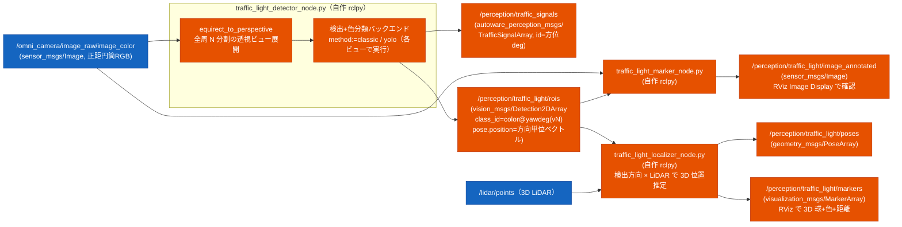

# 交通信号認識（traffic light recognition）設計

カメラ画像から交通信号を検出・色判定し、`autoware_perception_msgs/TrafficSignalArray`
として出す認識パイプラインの設計。**まず認識（perception）に注力**し、停止/発進制御
（behavior 連携）と黄信号ジレンマ判断は後続フェーズで扱う（末尾「ロードマップ」参照）。

設計は Autoware の traffic_light recognition と、ROS2 で信号認識を実践している例を
参照して決めた。要点と根拠は「設計判断の根拠」に記す。

## スコープ（このフェーズ）

- 入力: **全天球カメラ画像**（既定 `/omni_camera/image_raw/image_color`、Webots cylindrical の
  正距円筒画像）。通常の前方カメラ（`/camera/image_raw`）も `omni_mode:=false` で使える。
- 処理: 全天球画像を**全周 N 分割の透視投影ビュー**に展開し、各ビューで信号灯を**検出**して
  **赤/黄/青（+ 形・点滅）を分類**する。
- 出力: 信号状態 `autoware_perception_msgs/TrafficSignalArray`（全天球モードでは
  `traffic_signal_id` に方位[deg]を載せる）と、可視化用の ROI。
- **このフェーズでは走行制御に介入しない**（認識結果を出すところまで）。

> **なぜ全天球前提か**: ロボット上部の全天球カメラ 1 台で全方位を見るため、交差点で進行方向
> 以外（左右・斜め）の信号も同じセンサで拾える。ただし信号灯の検出（円形度・YOLO・灯位置
> 判定）は**透視投影前提**なので、正距円筒画像のまま検出すると信号が歪んで精度が落ちる。
> そこで全周を複数の透視ビューに展開してから検出する（実装は色付き点群の
> `equirect_to_perspective` と同じ Webots cylindrical shader 互換投影を使う）。

## 実行例

```bash
# 前提: Webots を信号付き world で起動（全天球カメラ = /omni_camera/image_raw/image_color）
ros2 launch susumu_object_perception webots_simulation.launch.py world:=outdoor.wbt \
  perception:=False rviz:=false nav:=False slam:=False mode:=fast

# (iter94) launch 引数で classic / yolo を切替えて起動できる。
# simulation.launch.py / webots_simulation.launch.py 共通で:
#   traffic_light_method:=classic  ... 学習不要、 既定
#   traffic_light_method:=yolo traffic_light_weights:=<path>/yolov8n.pt ... YOLO 検出
ros2 launch susumu_object_perception webots_simulation.launch.py world:=outdoor.wbt \
  perception:=False rviz:=false nav:=False slam:=False mode:=fast \
  traffic_light_method:=yolo

# (A) classic バックエンド（学習不要・既定 omni）。Webots 色プロファイルを渡す
ros2 run susumu_object_perception traffic_light_detector_node.py --ros-args \
  --params-file install/susumu_object_perception/share/susumu_object_perception/config/traffic_light_webots.param.yaml

# (B) yolo バックエンド + 灯位置判定（赤=橙でも RED と判定できる、推奨）
ros2 run susumu_object_perception traffic_light_detector_node.py --ros-args \
  -p method:=yolo -p yolo.weights:=<path>/yolov8n.pt \
  -p position_aware:=true -p lamp_layout:=vertical \
  --params-file .../config/traffic_light_webots.param.yaml

# 全周ビュー数や視野を調整したい場合
ros2 run susumu_object_perception traffic_light_detector_node.py --ros-args \
  -p omni.num_views:=12 -p omni.view_fov_deg:=70 \
  --params-file .../config/traffic_light_webots.param.yaml

# 通常（前方単一）カメラに戻す場合
ros2 run susumu_object_perception traffic_light_detector_node.py --ros-args \
  -p omni_mode:=false -p input_image:=/camera/image_raw/image_color

# 可視化（注釈画像を RViz の Image Display で見る。全天球は方位帯マーカーで重畳）
ros2 run susumu_object_perception traffic_light_marker_node.py
# 確認: ros2 topic echo /perception/traffic_signals   # color: RED=1 AMBER=2 GREEN=3
#       traffic_signal_id = 方位[deg]（全天球モード）
```

20s 統計を再生成する場合:

```bash
ros2 run susumu_object_perception record_traffic_light_stats.py \
  --topic /perception/traffic_signals \
  --duration 20 \
  --world city_robot.wbt \
  --backend classic \
  --omni-views 8 \
  --out outputs/traffic_light_recognition/city_traffic_stats.json

ros2 run susumu_object_perception summarize_traffic_light_stats.py \
  --stats outputs/traffic_light_recognition/city_traffic_stats.json \
  --json-out outputs/traffic_light_recognition/city_traffic_stats_summary.json \
  --md-out outputs/traffic_light_recognition/city_traffic_stats.md \
  --require-pass
```

## アーキテクチャ

Autoware は「検出（map_based + fine_detector）→ 分類（classifier）」の多段だが、
**map_based_detector は HD 地図（Lanelet2）必須**。本プロジェクトは HD 地図を持たない
（2D 占有格子のみ）ため、地図起点の ROI 生成は使えず、**カメラ全画面から検出する自作
検出器**で置き換える（地図無し構成の定石）。最終出力型だけ Autoware と揃える。



> 全天球モード（`omni_mode:=true`、既定）では、正距円筒画像を `omni.num_views` 分の透視ビュー
> （方位 yaw=0, 360/N, ... 度を中心、各 `omni.view_fov_deg` の画角）に展開し、各ビューで検出
> バックエンドを実行する。検出には所属ビュー方位(`yaw_deg`)に加え、bbox 中心から復元した
> 実方位(`dir_yaw_deg`)と方向ベクトル(`dir`)が付く。`traffic_signal_id` と ROI の `class_id`
> には `dir_yaw_deg` を使うため、同じ信号が隣接ビューに移っても ID がビュー中心へ飛びにくい。
> ただし Autoware 本来の `traffic_signal_id` は地図上の信号 ID として安定しているのに対し、
> 本構成は HD map が無いため方位を ID 代わりにする。bbox 中心の微小揺れで ID が毎フレーム
> 変わらないよう、`signal_id_quant_deg`（既定 5deg）で方位 ID を量子化する。
> `omni_mode:=false` にすると入力画像をそのまま 1 枚として検出する（従来の前方カメラ動作）。
>
> **バッチ推論**: yolo バックエンドは全ビューを 1 回の `predict` でまとめて推論する
> （`YoloDetector.detect_batch`）。呼び出し/前処理オーバーヘッドが減り、GPU では並列化で大きく
> 速くなる（CPU でも物体の多い画像では改善。検証では個別 8 回と検出数が一致）。classic(HSV) は
> バッチの恩恵が無いので個別処理。**「8 ビューを 1 枚に結合して 1 回で認識」は採らない**:
> YOLO は入力を固定サイズ(640)へリサイズするため、横結合(例 5120×480)だと解像度が落ちて
> 小物体・信号灯を取りこぼす（実測で横結合は検出 0、2×4 格子も激減）。個別ビューのままバッチに
> 渡すのが、解像度を保ちつつ呼び出しを 1 回にまとめる最善策。
>
> **重複統合（全天球で 1 箇所 → 認識結果 1 つ）**: 全周を N ビューに分けると視野が重なり、同じ
> 信号機が隣接ビューに重複検出される（例: 前方の信号が yaw 0°/45°/315° の 3 ビューで 3 個）。
> そこで `_detect_omni` の最後で `_merge_detections` を呼び、各検出の方向ベクトル(`dir`)を見て
> **角度差 < `merge_angle_deg`(既定 20°)** の検出を 1 グループにする（方位ベースの NMS 相当）。
> `merge_cross_color:=true`（既定）では、同一方向で red/amber/green に揺れた検出も 1 つにまとめる。
> 代表色は色ごとの最高信頼度から選び、GREEN は誤 GO を避けるため RED/AMBER より
> `green_conflict_margin` 倍以上強い場合だけ採用する。これで「全天球 → N 分割 → 複数認識 →
> 方向で 1 つに統合」となり、1 箇所の信号は結果 1 つになる。`merge_angle_deg:=0` で無効。

検出バックエンドは **`method` パラメータで切替**（Autoware の classifier が `classifier_type`
で HSV/CNN を選べるのと同じ思想）。

> **classic への自動フォールバックはしない**: `method:=yolo` を指定したのに ultralytics/torch の
> 初期化や重み読込に失敗した場合、黙って classic に切り替えず、`[FATAL]` を出してノードを
> 終了する。信号機の物体検出（yolo）が色起点検出（classic）にすり替わると挙動が変わり、
> 気付かず精度が落ちるため。yolo を使うなら依存と重みを用意する。classic を使うなら
> 明示的に `method:=classic` で起動する。

| method | 検出 | 色分類 | 依存 | 用途 |
|---|---|---|---|---|
| `classic`（既定） | HSV 色マスク + 輪郭の円形度 | マスク占有色 | OpenCV のみ | 学習不要・即動作。シミュ発光信号の MVP |
| `yolo` | YOLOv8（既定 COCO の class 9='traffic light'） | **bbox 内 HSV**（色クラス付き重みなら優先） | ultralytics + 重み | 実環境向け。検出が頑健（信頼度高） |

> **yolo 構成の実装**（Autoware の detector→classifier 2 段に対応）: YOLO は信号の「検出
> （bbox）」を担い、色は ClassicDetector の HSV 判定を bbox 内に適用して決める。専用学習
> （BSTLD 等で色クラス付き）重みを `yolo.weights` で与えれば色も YOLO で判定。
> 既定重みは COCO `yolov8n.pt`（traffic light クラスあり、自動 DL）。
> ⚠️ torch 2.6+ は `torch.load` の `weights_only` 既定が True で ultralytics 旧版の重み読込が
> 失敗するため、ノード内で `weights_only=False` にパッチする（公式/自前の信頼できる重み前提）。

## 色判定の堅牢化: 色プロファイル + 灯位置判定

**発光色は国・機種・シミュレータで異なる**（実測: Webots GenericTrafficLight の赤灯は
HSV で H≈23 の橙色に発光し、純赤前提の閾値では AMBER に誤判定された）。色相だけに頼ると脆い
ため、2 軸で決める（Autoware も lamp の配置情報を併用する）:

| 軸 | 内容 | 強み | 弱み |
|---|---|---|---|
| 色相（HSV） | 発光色そのもの | 直感的 | 国・機種で色がぶれる。黄と赤が近接 |
| 灯位置 | 信号機内の点灯位置（縦型=上:赤/下:青、横型=左:赤/右:青） | 発光色に依存せず堅牢 | 信号機 bbox と並び方向の把握が要る |

### (1) 色プロファイル（config YAML）
HSV しきい値（`classic.*`）を `config/traffic_light_<profile>.param.yaml` に切り出し、起動時に
`--params-file` でファイルを選んで切替える（専用の `color_profile` パラメータは持たない）。
例: `webots`（赤=H0〜30 を含む橙赤プロファイル）/ `real`（純赤プロファイル）。
信号種が変わったら閾値 YAML を差し替えればよい（コード変更不要）。

### (2) 灯位置判定（併用）
信号機 bbox 内で**点灯灯の相対位置**を見て色を確証・補正する。色相が曖昧でも位置で決まる。
- `position_aware` パラメータで ON/OFF。
- 並び方向 `lamp_layout`（`vertical`=上赤下青 / `horizontal`=左赤右青）。
- bbox 内の点灯塊の重心が上(縦型)/左(横型) なら RED、下/右 なら GREEN、中央付近は AMBER。
- **yolo バックエンドと相性が良い**（信号機全体の bbox が得られるため）。classic は色塊を
  個別検出するので bbox=信号機枠の概念が弱く、位置判定は yolo 併用が前提。
- 色相判定と位置判定が食い違う場合は、安全側（GREEN を疑い RED/UNKNOWN 寄り）に倒す
  （precision 優先 = 誤 GO 回避）。

## メッセージ型（独自定義しない方針に従い既存型を使う）

[[AGENTS]] の「メッセージ型は自作せず既存を使う」に従い、**ローカルに存在する既存型**を使う。

| 用途 | 型 | 備考 |
|---|---|---|
| 信号状態出力 | `autoware_perception_msgs/msg/TrafficSignalArray` | ローカル存在・既存 perception が依存済み。地図無しでも使える |
| ROI / bbox 可視化 | `vision_msgs/msg/Detection2DArray` | ローカル存在。bbox + class_id + score |
| RViz マーカー | `visualization_msgs/msg/MarkerArray` | 既存 `perception_marker_node` 流儀 |

`TrafficSignalArray` の構造（地図無しでの使い方）:
```
TrafficSignalArray
  builtin_interfaces/Time stamp
  TrafficSignal[] signals
    int64 traffic_signal_id          # 地図リンクID。地図無しなら 0 / 検出インデックスでよい
    TrafficSignalElement[] elements  # 1灯の点灯要素（赤丸+右矢印=2要素 等）
      uint8 color    # UNKNOWN=0 RED=1 AMBER=2 GREEN=3 WHITE=4
      uint8 shape    # CIRCLE=1 LEFT_ARROW=2 RIGHT_ARROW=3 UP_ARROW=4 ... CROSS=10
      uint8 status   # SOLID_OFF=1 SOLID_ON=2 FLASHING=3
      float32 confidence
```

> 注: Autoware 内部段が使う `tier4_perception_msgs/TrafficLightRoiArray` 等は **未インストール**
> なので使わない。最終出力型 `autoware_perception_msgs/TrafficSignalArray` を直接出す
> （依存を増やさない）。Autoware は TrafficSignal → TrafficLightGroup へ移行中だが、
> カメラ認識のみなら軽量な TrafficSignalArray で足りる。

## ノード I/O

### `traffic_light_detector_node.py`（検出・色分類、rclpy）

| 種別 | 名前 | 型 / 値 |
|---|---|---|
| sub | `/omni_camera/image_raw/image_color`（既定。param `input_image`、`omni_mode:=false` で `/camera/image_raw`） | `sensor_msgs/Image` |
| pub | `/perception/traffic_signals` | `autoware_perception_msgs/TrafficSignalArray`（`traffic_signal_id`=方位[deg]） |
| pub | `/perception/traffic_light/rois` | `vision_msgs/Detection2DArray`（`class_id`=`color@yawdeg(vN)`） |
| param | `omni_mode` | 全天球 N 分割検出の ON/OFF（既定 true） |
| param | `omni.num_views` | 全周の透視ビュー数（既定 8） |
| param | `omni.view_fov_deg` | 各ビューの水平画角[deg]（既定 75。ビューが重なるよう 360/N より大きめ） |
| param | `omni.view_pitch_deg` | ビュー中心の仰角[deg]（既定 0。信号が高所なら上向きに振る） |
| param | `omni.view_width` / `omni.view_height` | 各透視ビューの解像度（既定 640/480） |
| param | `omni.projection_model` | `webots_cylindrical`（既定）/ `equirectangular` |
| param | `max_rate_hz` | **処理レート上限[Hz]（既定 3.0、0 以下で無効）**。画像は 15Hz 等で来るが信号は急変しないので間引く。前回処理から 1/max_rate_hz 秒経つまで画像をスキップ（全周 N ビューぶん YOLO/HSV を回すと CPU で重いため）。実時間(monotonic)で計測 |
| param | `merge_angle_deg` | **重複統合のマージ角[deg]（既定 20.0、0 以下で無効）**。視野の重なる隣接ビューに重複検出される同一信号を、方向ベクトルの角度差 < この値なら 1 つに統合（全天球で 1 箇所 → 認識結果 1 つ） |
| param | `merge_cross_color` | 方向が近い検出を色違いでも 1 グループに統合する（既定 true）。false で従来互換の同色のみ統合 |
| param | `green_conflict_margin` | 同一方向グループで GREEN と RED/AMBER が競合したとき、GREEN を採用するために必要な信頼度比（既定 1.25）。誤 GO を避けるため、GREEN が十分強くない場合は RED/AMBER 側を採る |
| param | `signal_id_quant_deg` | HD map なし構成で `traffic_signal_id` に入れる方位[deg]の量子化幅（既定 5.0）。0 以下で従来互換の 1deg 丸め。bbox 揺れによる ID チャタリングを抑える |
| param | `method` | `classic`（既定）/ `yolo` |
| param | `classic.{red1_lo,red1_hi,red2_lo,red2_hi,amber_lo,amber_hi,green_lo,green_hi}` | 各色の HSV 下限/上限 [H,S,V]（H は 0..179）。色プロファイルで差し替え |
| param | `classic.{min_area,min_circularity,min_confidence}` | 検出の最小面積/円形度/信頼度（※検出は輪郭の円形度で行う。Hough は不使用） |
| param | `yolo.weights` | 重みパス（既定 `yolov8n.pt`=COCO、自動 DL） |
| param | `yolo.conf` | YOLO 信頼度しきい値（既定 0.3） |
| param | `position_aware` | 灯位置判定の ON/OFF（既定 true、yolo バックエンドで有効） |
| param | `lamp_layout` | `vertical`（上赤下青、既定）/ `horizontal`（左赤右青） |

> **色プロファイルの切替方法**: HSV しきい値（`classic.*`）は `config/traffic_light_<profile>.param.yaml`
> を `--params-file` で渡して差し替える（`color_profile` という専用パラメータは持たず、
> どの YAML を読むかでプロファイルを選ぶ方式）。`webots`=橙赤 / `real`=純赤 を用意。

### `traffic_light_marker_node.py`（可視化、rclpy）

| 種別 | 名前 | 型 |
|---|---|---|
| sub | `/omni_camera/image_raw/image_color`（既定。param `input_image`、`omni_mode`） | `sensor_msgs/Image` |
| sub | `/perception/traffic_light/rois` | `vision_msgs/Detection2DArray` |
| pub | `/perception/traffic_light/image_annotated` | `sensor_msgs/Image`（全天球モードは方位帯マーカー + 色 + 方位 + 信頼度、通常モードは bbox を重畳） |
| param | `omni_mode` | true（既定）: class_id の方位から全天球画像上に縦帯マーカーを描く。false: bbox を重畳 |

> 全天球モードでは detector の bbox は「透視ビュー内座標」なので、可視化は class_id に載った
> 方位(yaw_deg)を全天球画像上の x（縦帯）にマッピングして重畳する（正確な逆投影はせず軽量優先）。
> カメラトピックはシミュレータ/構成で異なる: Gazebo 前方=`/camera/image_raw`、
> Webots 前方=`/camera/image_raw/image_color`、Webots 全天球=`/omni_camera/image_raw/image_color`。
> 両ノードとも `omni_mode` と `input_image` で吸収する。

### `traffic_light_localizer_node.py`（3D 位置推定、rclpy）

検出（方位・方向ベクトル）と 3D LiDAR 点群を組み合わせ、各信号の 3D 位置（ロボット座標）を
出す。全天球カメラの検出は「方向」しか持たず、その方向のどの距離に信号があるかは画像だけでは
決まらないため、LiDAR で距離を引いて 3D 化する。

| 種別 | 名前 | 型 / 値 |
|---|---|---|
| sub | `/perception/traffic_light/rois` | `vision_msgs/Detection2DArray`（`results[0].pose.position`=検出方向の単位ベクトル） |
| sub | `/lidar/points`（Webots は `/lidar/points/point_cloud`、param `points_topic`） | `sensor_msgs/PointCloud2` |
| pub | `/perception/traffic_light/poses` | `geometry_msgs/PoseArray`（信号の 3D 位置、frame=LiDAR フレーム） |
| pub | `/perception/traffic_light/markers` | `visualization_msgs/MarkerArray`（色付き球 + `色 距離` テキスト） |
| param | `angle_tol_deg` | 検出方向に対する許容角（円錐半頂角、既定 8） |
| param | `use_direction_pitch` | 検出方向の仰角も使うか（既定 false。全天球が信号を急角度で見上げる配置では pitch が灯火の真方向とずれるため、既定は方位のみで絞り縦は高さ帯で絞る） |
| param | `min_height` / `max_height` | 信号機構造物の高さ帯[m]（地面・低い物体を除外。既定 0.7〜6.0） |
| param | `cluster_depth` | 距離まとまりの厚み[m]（最近点からこの範囲を 1 信号とみなす、既定 1.0） |
| param | `min_points` | 有効とみなす最小点数（既定 4） |

3D 位置の決め方:
1. 検出方向（方位、`use_direction_pitch:=true` なら仰角も）に許容角内の点を集める。
2. 高さ帯 `min_height`〜`max_height` で地面・低い物体を除外する。
3. **最近傍の距離まとまり**（最近点から `cluster_depth` 以内）の重心を信号位置にする。
   信号機は背景（建物・壁）より手前にあるのが普通なので、点数最多の最頻距離帯ではなく
   最近傍まとまりを採る（背景の壁に引っ張られないため）。

> 信号機が背景より奥にある／背景と同距離の構図では、最近傍まとまりだと手前の別物体を拾う
> ことがある。その場合は `min_height` を信号灯の高さに上げる、`angle_tol_deg` を狭める、
> `use_direction_pitch:=true` にする等で調整する。

## 検証サマリ

| 項目 | 結果 |
|---|---|
| ノード単体 | 合成信号画像で `classic` が RED/AMBER/GREEN を分類できる |
| シミュレータ接続 | `GenericTrafficLight` を Webots world に置き、カメラ入力で赤/青遷移を認識できる |
| YOLO backend | COCO `yolov8n.pt` の bbox 検出 + bbox 内色判定が classic より頑健 |
| 色プロファイル | Webots の橙寄り赤灯は `traffic_light_webots.param.yaml` + `position_aware` で RED/AMBER/GREEN 判定できる。実環境は `traffic_light_real.param.yaml` に差し替える |
| 全天球対応 | `/omni_camera/image_raw/image_color` を全周 N 分割の透視ビューへ展開し、前方信号を検出できる。信号が上端寄りに小さく映る配置では `omni.view_pitch_deg` を調整する |
| LiDAR 3D 位置推定 | 検出方位 + 高さ帯 + 最近傍まとまりで、奥の建物に引っ張られず信号位置を分離できる |
| 色違い重複統合 | 合成検出で、近接方向の GREEN(0.62) + RED(0.60) は 1 信号に統合し、`green_conflict_margin=1.25` により RED を採用。離れた GREEN(40°) は別信号として維持。`merge_cross_color:=false` では従来どおり色別に分かれる |

制約: Webots `GenericTrafficLight` は細いポールと小さい灯火筐体のため、MID-360 相当 LiDAR の点が少ない。
検出方向の pitch も全天球クロップの切れ方でずれることがあるため、既定では pitch を使わず
方位 + 高さ帯で絞る（`use_direction_pitch:=false`）。

### 可視化（実装済み）

`traffic_light_marker_node.py`（rclpy）: `rois`(Detection2DArray) + カメラ画像を購読し、
bbox + 色ラベル + 信頼度を重畳した注釈画像 `/perception/traffic_light/image_annotated`
（`sensor_msgs/Image`）を出す。RViz の Image Display で確認できる。信号は地図無しでは 3D
位置を持たないため、LiDAR perception の MarkerArray ではなく画像注釈で可視化する。

## ライブ動作確認 (iter36、 2026-06-26)

`webots_city.launch.py mode:=realtime` で classic backend のライブ動作を確認した。

実行: city_robot.wbt (ロボット原点、 GenericTrafficLight @ (4.5, 0)、 周辺に PottedTree x4 と
SimpleBuilding x2)。 全 traffic_light_* ノード起動成功、 5 トピック (`rois`, `signals`,
`poses`, `markers`, `image_annotated`) が publish される。

20s 統計 (TrafficSignalArray subscribe):

| 指標 | 値 |
|---|---|
| frames | 47 (= ~2.4 Hz) |
| unique signal IDs (方位 ID) | 2 |
| color hist (1=red/2=yellow/3=green) | red 21 / yellow 8 / green 18 |
| shape hist (circle=1) | 47 全て circle |
| status hist (`SOLID_ON`=2) | 47 全て solid |
| confidence | mean=0.61 median=0.60 min=0.57 max=0.64 |

観察:
- **同じ信号 (の方位 ID) で frame ごとに色判定が揺れる** (red 21 / green 18 / yellow 8)。
  これは classic backend の HSV 円形度判定の精度限界。 docs の YOLO + 灯位置判定推奨
  (`method:=yolo position_aware:=true`) が改善余地。
- confidence は mean=0.61 と安定だが特に高くはない。 classic では本質的な改善は難しく
  YOLO への切替えが王道。
- 信号自体は安定検知できている (47/47 frames で何か検出)、 false negative は無い。

判定: 起動・トピック出力・基本検知は OK。 **精度面では yolo backend が次の最適化目標**。
ライブログは scratchpad に保存。

### iter62: outputs/traffic_light_recognition/ に成果物を contracts 化

ループ運用の「PNG 必須」 方針を traffic_light にも適用。 webots_city.launch.py で
ライブ実行し以下を `outputs/traffic_light_recognition/` に保存:

- `city_traffic_annotated.png` (2.3 MB、 2048×1024 全天球パノラマ、 ROI + 色ラベル重畳)
- `city_traffic_stats.json` (20s 統計、 frames=48 / rate=2.4 Hz / unique_ids=2 /
  confidence mean=0.615)
- `city_traffic_stats_summary.json` / `city_traffic_stats.md` (enum 数値の
  `color_hist` / `shape_hist` / `status_hist` を名前付き histogram へ展開し、
  stop-like/green 比率と confidence を後追いレビューできる summary)

iter36 とほぼ同じ classic backend での結果 (color hist: red 20 / yellow 7 /
green 21) で、 信号認識ノードが安定動作していることを確認。 PNG 例外を .gitignore
に追加 (`!outputs/traffic_light_recognition/*.png`)。

### iter: 色違い重複と方位 ID の安定化 (2026-06-26)

iter36/62 の live 統計では、同じ信号方向で red/yellow/green が frame ごとに揺れていた。原因の
一部は classic backend の色判定限界だが、実装上も「近い方向かつ同色」だけを統合していたため、
隣接ビューで別色に判定された同一信号が複数 `TrafficSignal` として残り得た。

変更:
- `merge_cross_color:=true`（既定）で、近い方向の検出は色違いでも 1 グループに統合する。
- グループ内で GREEN と RED/AMBER が競合した場合、GREEN は `green_conflict_margin` 倍以上
  強い場合だけ採用し、それ以外は RED/AMBER 側を採る（誤 GO 回避）。
- `traffic_signal_id` と ROI `class_id` の方位は、所属ビュー中心ではなく bbox 中心から復元した
  `dir_yaw_deg` を使う。
- HD map なしの方位 ID は `signal_id_quant_deg=5.0` で量子化し、bbox 中心が数度未満で揺れても
  同じ `traffic_signal_id` に入るようにした。`signal_id_quant_deg<=0` なら従来互換の 1deg 丸め。

単体確認:
- 方向差 5°の GREEN(0.62) + RED(0.60) と、40°離れた GREEN(0.80) を入力。
- `merge_cross_color:=true`: 出力は 2 信号。近接グループは RED、遠方 GREEN は維持。
- `merge_cross_color:=false`: 従来互換で GREEN/RED が色別に残る。

live smoke:
- `webots_simulation.launch.py world:=city_robot.wbt nav:=False slam:=False perception:=False
  omni_perception:=False image_recognition:=True rviz:=False` で短時間起動。
- `/perception/traffic_signals` の 1 メッセージを取得し、`traffic_signal_id: 0`,
  `color: RED`, `confidence: 0.614` を確認。
- 方位 ID 量子化の単体確認では、`1.9°` と `2.1°` がどちらも `0`、`3.0°` が `5` になり、
  0/360 境界も `359.0° -> 0` として扱えることを確認。

### iter: traffic stats summary の名前付き化 (2026-06-26)

既存の `city_traffic_stats.json` は Autoware `TrafficSignalElement` の enum 値をそのまま
histogram key にしており、`"3": 21` が GREEN だと毎回読み替える必要があった。
`scripts/summarize_traffic_light_stats.py` を追加し、raw stats から名前付き summary を生成する。

出力:
- `city_traffic_stats_summary.json`: `color_hist_named`, `shape_hist_named`, `status_hist_named`,
  `signal_id_hist`, `signal_id_color_hist_named`, `top_signal_id`, `top_signal_ratio`,
  `stop_like_ratio`, `green_ratio`, `dominant_color`, `confidence` を含む機械可読 summary。
- `city_traffic_stats.md`: 同じ内容のレビュー用 Markdown。
iter37 以降、summary JSON は `schema_version: 3`、`validation_passed`、短い `summary`、`criteria` を持つ。
既定 criteria は frames>=1、detections>=1、unique_signal_ids>=1、confidence_mean>=0.0。
任意 criteria として `max_unique_signal_ids` と `min_top_signal_ratio` を指定でき、HD map なしで
方位量子化 ID を代用する構成の ID チャタリングを検出できる。
`--require-pass` で NG 時に非ゼロ終了し、`validate_contracts.py` は
`city_traffic_stats_summary.json` の `validation_passed=true`、`summary`、`schema_version>=3`、
`signal_id_hist`、`top_signal_id` の存在まで検査する。
iter35 以降、`scripts/run_all_tasks.sh` は object recognition 巡回後に
`run_signal_stats_summary` を実行し、既存 `city_traffic_stats.json` から summary JSON/Markdown を
再生成して `--require-pass` で検査する。iter37 以降は
`--max-unique-signal-ids 8 --min-top-signal-ratio 0.25` も指定する。raw stats が無い場合や
summary が NG の場合は全タスク実行を止める。

既存成果物での確認:
- `RED=20`, `AMBER=7`, `GREEN=21`, `CIRCLE=48`, `SOLID_ON=48`
- `stop_like_ratio=0.5625`, `green_ratio=0.4375`, `confidence.mean=0.615`

### iter: traffic stats recorder の追加 (2026-06-26)

`city_traffic_stats.json` は最終成果物だが、従来は同じ形式を再生成する専用コマンドが無かった。
`scripts/record_traffic_light_stats.py` を追加し、`/perception/traffic_signals`
(`TrafficSignalArray`) を指定秒数購読して、frames / rate / unique IDs / color・shape・status
histogram / signal_id histogram / signal_id ごとの色 histogram / confidence を raw JSON として保存できるようにした。`summarize_traffic_light_stats.py`
と組み合わせることで、live run から raw stats と名前付き summary を一貫して再生成できる。

## 設計判断の根拠

参照した一次情報:
- Autoware Universe `autoware_traffic_light_map_based_detector`: <https://autowarefoundation.github.io/autoware_universe/main/perception/autoware_traffic_light_map_based_detector/>
- Autoware Universe `autoware_traffic_light_fine_detector`: <https://autowarefoundation.github.io/autoware_universe/main/perception/autoware_traffic_light_fine_detector/>
- Autoware Universe `autoware_traffic_light_classifier`: <https://autowarefoundation.github.io/autoware_universe/main/perception/autoware_traffic_light_classifier/>

- **Autoware は地図前提**: 認識は `map_based_detector`（HD 地図の信号位置を
  camera_info で画像投影し ROI 生成）→ `fine_detector`（YOLOX-s で精緻化）→
  `classifier`（EfficientNet-b1/MobileNet-v2 ~99.8%、HSV ルールも選択可）。地図は
  ①ROI 絞り ②「どの信号が自分用か」特定 の 2 役。**地図無しの全画面検出モジュールは
  Autoware に無い**→自作が要る。
- **色空間**: DL 検出では HSV より **RGB が最良**（Kim 2018）。一方、古典の色マスクは
  HSV が扱いやすい（用途で使い分け）。
- **安全原則**: 誤った「青(GO)」が最も危険 → **precision 優先**（確信なければ UNKNOWN/赤扱い）。
- **実践例**: ROS2 では YOLOv8 で「検出＝色分類を一発」or「検出→色分類 2 段」が主流
  （`darknet_ros` を使う構成も）。データセットは Bosch Small Traffic Lights (BSTLD) 等。
- **シミュ信号**: Webots に `GenericTrafficLight` / `CrossRoadsTrafficLight` PROTO があり、
  controller で実際に赤黄青が遷移する。
- **全天球カメラでの検出**: 信号検出器（円形度・YOLO・灯位置判定）はいずれも透視投影画像を
  前提にしている。正距円筒画像のまま入れると信号が横に伸び、円形度や bbox 縦横比が崩れる。
  そこで全周を複数の透視ビューに展開してから既存検出器を適用する（detector→classifier の
  前段に「投影展開」を挟む構成）。これは Autoware が map_based_detector で「3D 信号位置を
  画像投影して ROI を作る」のと役割は違うが、「検出器に渡す前に画像を正規化する」点で同じ思想。
  全天球を選ぶ利点は、進行方向以外（交差点の左右・斜め）の信号も 1 センサで拾えること。

## ロードマップ（後続フェーズ）

認識が固まった後に着手する。詳細設計は別途。

1. **停止/発進制御**: 認識結果 + 停止線（map 座標 YAML で保持）+ 自車位置(TF) +
   速度で STOP/GO 判定 → Nav2 を停止/再開（最小は twist_mux で `/cmd_vel` 0 割り込み、
   または `nav2_msgs/SpeedLimit` を 0% で publish）。Autoware の停止線手前 `stop_margin`、
   `tl_state_timeout`（未検出=通過/検出後タイムアウト=停止）、`stop_time_hysteresis`
   （チャタリング抑制）を踏襲。
2. **黄信号・ジレンマ判断**: 低速ロボットは停止距離が極小（1.0m/s で停止距離 ~1.5m）で
   ジレンマゾーンが事実上消えるため、**「赤/黄なら止まる、ただし交差点進入済みなら抜ける」**
   の単純ルールで本質を満たす。τ（黄残り時間）が画像のみで不明な場合は保守側
   （黄=もうすぐ赤）に倒す。
