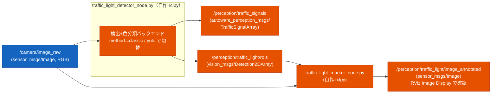

# 交通信号認識（traffic light recognition）設計

カメラ画像から交通信号を検出・色判定し、`autoware_perception_msgs/TrafficSignalArray`
として出す認識パイプラインの設計。**まず認識（perception）に注力**し、停止/発進制御
（behavior 連携）と黄信号ジレンマ判断は後続フェーズで扱う（末尾「ロードマップ」参照）。

設計は Autoware の traffic_light recognition と、ROS2 で信号認識を実践している例を
参照して決めた。要点と根拠は「設計判断の根拠」に記す。

## スコープ（このフェーズ）

- 入力: カメラ画像（`/camera/image_raw`、cv_bridge で OpenCV へ）
- 処理: 画像から信号灯を**検出**し、**赤/黄/青（+ 形・点滅）を分類**
- 出力: 信号状態 `autoware_perception_msgs/TrafficSignalArray` と、可視化用の ROI
- **このフェーズでは走行制御に介入しない**（認識結果を出すところまで）

## 実行例

```bash
# 前提: Webots を信号付き world で起動（TB3 カメラ = /camera/image_raw/image_color）
ros2 launch susumu_object_perception webots_outdoor.launch.py perception:=False rviz:=false nav:=False

# (A) classic バックエンド（学習不要）。Webots 色プロファイルを渡す
ros2 run susumu_object_perception traffic_light_detector_node.py --ros-args \
  -p input_image:=/camera/image_raw/image_color \
  --params-file install/susumu_object_perception/share/susumu_object_perception/config/traffic_light_webots.param.yaml

# (B) yolo バックエンド + 灯位置判定（赤=橙でも RED と判定できる、推奨）
ros2 run susumu_object_perception traffic_light_detector_node.py --ros-args \
  -p input_image:=/camera/image_raw/image_color \
  -p method:=yolo -p yolo.weights:=<path>/yolov8n.pt \
  -p position_aware:=true -p lamp_layout:=vertical \
  --params-file .../config/traffic_light_webots.param.yaml

# 可視化（注釈画像を RViz の Image Display で見る）
ros2 run susumu_object_perception traffic_light_marker_node.py --ros-args \
  -p input_image:=/camera/image_raw/image_color
# 確認: ros2 topic echo /perception/traffic_signals   # color: RED=1 AMBER=2 GREEN=3
```

## アーキテクチャ

Autoware は「検出（map_based + fine_detector）→ 分類（classifier）」の多段だが、
**map_based_detector は HD 地図（Lanelet2）必須**。本プロジェクトは HD 地図を持たない
（2D 占有格子のみ）ため、地図起点の ROI 生成は使えず、**カメラ全画面から検出する自作
検出器**で置き換える（地図無し構成の定石）。最終出力型だけ Autoware と揃える。



検出バックエンドは **`method` パラメータで切替**（Autoware の classifier が `classifier_type`
で HSV/CNN を選べるのと同じ思想）。

| method | 検出 | 色分類 | 依存 | 用途 |
|---|---|---|---|---|
| `classic`（既定） | HSV 色マスク + 輪郭の円形度 | マスク占有色 | OpenCV のみ | 学習不要・即動作。シミュ発光信号の MVP |
| `yolo` | YOLOv8（既定 COCO の class 9='traffic light'） | **bbox 内 HSV**（色クラス付き重みなら優先） | ultralytics + 重み | 実環境向け。検出が頑健（信頼度高） |

> **yolo 構成の実装**（Autoware の detector→classifier 2 段に対応）: YOLO は信号の「検出
> （bbox）」を担い、色は ClassicDetector の HSV 判定を bbox 内に適用して決める。専用学習
> （BSTLD 等で色クラス付き）重みを `yolo.weights` で与えれば色も YOLO で判定。
> 既定重みは COCO `yolov8n.pt`（traffic light クラスあり、自動 DL）。
> ⚠️ torch 2.6+ は `torch.load` の `weights_only` 既定が True で ultralytics 旧版の重み読込が
> 失敗するため、ノード内で `weights_only=False` にパッチする（公式/自前の信頼できる重み前提）。

## 色判定の堅牢化: 色プロファイル + 灯位置判定

**発光色は国・機種・シミュレータで異なる**（実測: Webots GenericTrafficLight の赤灯は
HSV で H≈23 の橙色に発光し、純赤前提の閾値では AMBER に誤判定された）。色相だけに頼ると脆い
ため、2 軸で決める（Autoware も lamp の配置情報を併用する）:

| 軸 | 内容 | 強み | 弱み |
|---|---|---|---|
| 色相（HSV） | 発光色そのもの | 直感的 | 国・機種で色がぶれる。黄と赤が近接 |
| 灯位置 | 信号機内の点灯位置（縦型=上:赤/下:青、横型=左:赤/右:青） | 発光色に依存せず堅牢 | 信号機 bbox と並び方向の把握が要る |

### (1) 色プロファイル（config YAML）
HSV しきい値（`classic.*`）を `config/traffic_light_<profile>.param.yaml` に切り出し、起動時に
`--params-file` でファイルを選んで切替える（専用の `color_profile` パラメータは持たない）。
例: `webots`（赤=H0〜30 を含む橙赤プロファイル）/ `real`（純赤プロファイル）。
信号種が変わったら閾値 YAML を差し替えればよい（コード変更不要）。

### (2) 灯位置判定（併用）
信号機 bbox 内で**点灯灯の相対位置**を見て色を確証・補正する。色相が曖昧でも位置で決まる。
- `position_aware` パラメータで ON/OFF。
- 並び方向 `lamp_layout`（`vertical`=上赤下青 / `horizontal`=左赤右青）。
- bbox 内の点灯塊の重心が上(縦型)/左(横型) なら RED、下/右 なら GREEN、中央付近は AMBER。
- **yolo バックエンドと相性が良い**（信号機全体の bbox が得られるため）。classic は色塊を
  個別検出するので bbox=信号機枠の概念が弱く、位置判定は yolo 併用が前提。
- 色相判定と位置判定が食い違う場合は、安全側（GREEN を疑い RED/UNKNOWN 寄り）に倒す
  （precision 優先 = 誤 GO 回避）。

## メッセージ型（独自定義しない方針に従い既存型を使う）

[[AGENTS]] の「メッセージ型は自作せず既存を使う」に従い、**ローカルに存在する既存型**を使う。

| 用途 | 型 | 備考 |
|---|---|---|
| 信号状態出力 | `autoware_perception_msgs/msg/TrafficSignalArray` | ローカル存在・既存 perception が依存済み。地図無しでも使える |
| ROI / bbox 可視化 | `vision_msgs/msg/Detection2DArray` | ローカル存在。bbox + class_id + score |
| RViz マーカー | `visualization_msgs/msg/MarkerArray` | 既存 `perception_marker_node` 流儀 |

`TrafficSignalArray` の構造（地図無しでの使い方）:
```
TrafficSignalArray
  builtin_interfaces/Time stamp
  TrafficSignal[] signals
    int64 traffic_signal_id          # 地図リンクID。地図無しなら 0 / 検出インデックスでよい
    TrafficSignalElement[] elements  # 1灯の点灯要素（赤丸+右矢印=2要素 等）
      uint8 color    # UNKNOWN=0 RED=1 AMBER=2 GREEN=3 WHITE=4
      uint8 shape    # CIRCLE=1 LEFT_ARROW=2 RIGHT_ARROW=3 UP_ARROW=4 ... CROSS=10
      uint8 status   # SOLID_OFF=1 SOLID_ON=2 FLASHING=3
      float32 confidence
```

> 注: Autoware 内部段が使う `tier4_perception_msgs/TrafficLightRoiArray` 等は **未インストール**
> なので使わない。最終出力型 `autoware_perception_msgs/TrafficSignalArray` を直接出す
> （依存を増やさない）。Autoware は TrafficSignal → TrafficLightGroup へ移行中だが、
> カメラ認識のみなら軽量な TrafficSignalArray で足りる。

## ノード I/O

### `traffic_light_detector_node.py`（検出・色分類、rclpy）

| 種別 | 名前 | 型 / 値 |
|---|---|---|
| sub | `/camera/image_raw`（param `input_image` で変更可） | `sensor_msgs/Image` |
| pub | `/perception/traffic_signals` | `autoware_perception_msgs/TrafficSignalArray` |
| pub | `/perception/traffic_light/rois` | `vision_msgs/Detection2DArray` |
| param | `method` | `classic`（既定）/ `yolo` |
| param | `classic.{red1_lo,red1_hi,red2_lo,red2_hi,amber_lo,amber_hi,green_lo,green_hi}` | 各色の HSV 下限/上限 [H,S,V]（H は 0..179）。色プロファイルで差し替え |
| param | `classic.{min_area,min_circularity,min_confidence}` | 検出の最小面積/円形度/信頼度（※検出は輪郭の円形度で行う。Hough は不使用） |
| param | `yolo.weights` | 重みパス（既定 `yolov8n.pt`=COCO、自動 DL） |
| param | `yolo.conf` | YOLO 信頼度しきい値（既定 0.3） |
| param | `position_aware` | 灯位置判定の ON/OFF（既定 true、yolo バックエンドで有効） |
| param | `lamp_layout` | `vertical`（上赤下青、既定）/ `horizontal`（左赤右青） |

> **色プロファイルの切替方法**: HSV しきい値（`classic.*`）は `config/traffic_light_<profile>.param.yaml`
> を `--params-file` で渡して差し替える（`color_profile` という専用パラメータは持たず、
> どの YAML を読むかでプロファイルを選ぶ方式）。`webots`=橙赤 / `real`=純赤 を用意。

### `traffic_light_marker_node.py`（可視化、rclpy）

| 種別 | 名前 | 型 |
|---|---|---|
| sub | `/camera/image_raw`（param `input_image`） | `sensor_msgs/Image` |
| sub | `/perception/traffic_light/rois` | `vision_msgs/Detection2DArray` |
| pub | `/perception/traffic_light/image_annotated` | `sensor_msgs/Image`（bbox + 色ラベル + 信頼度を重畳） |

> カメラトピックはシミュレータで異なる: Gazebo=`/camera/image_raw`、
> Webots=`/camera/image_raw/image_color`。両ノードとも `input_image` パラメータで吸収する。

## 検証段階

確定方針: **まず認識ノード単体**を静止画像/ダミー publish で作り込み、ロジックを固めてから
シミュレータの実信号につなぐ。**1〜3 すべて実証済み**。

1. ✅ **ノード単体**: 合成信号画像（赤/黄/青の円）を publish し、`classic` が
   RED(1)/AMBER(2)/GREEN(3) を正しく分類することを確認。
2. ✅ **シミュレータ接続**: `outdoor.wbt` に `GenericTrafficLight` を追加（city_traffic は
   車用で TB3 連携なし）。TB3 カメラ `/camera/image_raw/image_color` を入力に、信号の
   赤⇄青遷移を認識できることを確認。
   - 配置メモ: 車道用信号は灯火が高所のため、TB3 の Camera を上向き（`rotation 0 1 0 -0.15`）
     にし、信号を前方 4.5m・`rotation 0 0 1 3.14159`（灯火面を TB3 へ向ける）で配置すると
     灯火がカメラ画角に入る。
3. ✅ **yolo バックエンド**: COCO `yolov8n.pt` で検出 → bbox 内で色判定。Webots 実信号で
   検出信頼度 ~0.8（classic ~0.62 より頑健）。
4. ✅ **色プロファイル + 位置判定**: Webots の赤灯は H≈23 の橙色で、色相のみだと AMBER に誤判定
   され **RED が出なかった**。`config/traffic_light_webots.param.yaml`（橙赤プロファイル）+
   `position_aware:=true lamp_layout:=vertical`（点灯位置の上下で赤/青を確証）により、
   **RED / AMBER / GREEN すべてを正しく認識**できることを確認。実環境向けは
   `config/traffic_light_real.param.yaml`（純赤プロファイル）に差し替える。

### 可視化（実装済み）

`traffic_light_marker_node.py`（rclpy）: `rois`(Detection2DArray) + カメラ画像を購読し、
bbox + 色ラベル + 信頼度を重畳した注釈画像 `/perception/traffic_light/image_annotated`
（`sensor_msgs/Image`）を出す。RViz の Image Display で確認できる。信号は地図無しでは 3D
位置を持たないため、LiDAR perception の MarkerArray ではなく画像注釈で可視化する。

## 設計判断の根拠（調査）

- **Autoware は地図前提**: 認識は `map_based_detector`（HD 地図の信号位置を
  camera_info で画像投影し ROI 生成）→ `fine_detector`（YOLOX-s で精緻化）→
  `classifier`（EfficientNet-b1/MobileNet-v2 ~99.8%、HSV ルールも選択可）。地図は
  ①ROI 絞り ②「どの信号が自分用か」特定 の 2 役。**地図無しの全画面検出モジュールは
  Autoware に無い**→自作が要る。
- **色空間**: DL 検出では HSV より **RGB が最良**（Kim 2018）。一方、古典の色マスクは
  HSV が扱いやすい（用途で使い分け）。
- **安全原則**: 誤った「青(GO)」が最も危険 → **precision 優先**（確信なければ UNKNOWN/赤扱い）。
- **実践例**: ROS2 では YOLOv8 で「検出＝色分類を一発」or「検出→色分類 2 段」が主流
  （`darknet_ros` を使う構成も）。データセットは Bosch Small Traffic Lights (BSTLD) 等。
- **シミュ信号**: Webots に `GenericTrafficLight` / `CrossRoadsTrafficLight` PROTO があり、
  controller で実際に赤黄青が遷移する。

## ロードマップ（後続フェーズ）

認識が固まった後に着手する。詳細設計は別途。

1. **停止/発進制御**: 認識結果 + 停止線（map 座標 YAML で保持）+ 自車位置(TF) +
   速度で STOP/GO 判定 → Nav2 を停止/再開（最小は twist_mux で `/cmd_vel` 0 割り込み、
   または `nav2_msgs/SpeedLimit` を 0% で publish）。Autoware の停止線手前 `stop_margin`、
   `tl_state_timeout`（未検出=通過/検出後タイムアウト=停止）、`stop_time_hysteresis`
   （チャタリング抑制）を踏襲。
2. **黄信号・ジレンマ判断**: 低速ロボットは停止距離が極小（1.0m/s で停止距離 ~1.5m）で
   ジレンマゾーンが事実上消えるため、**「赤/黄なら止まる、ただし交差点進入済みなら抜ける」**
   の単純ルールで本質を満たす。τ（黄残り時間）が画像のみで不明な場合は保守側
   （黄=もうすぐ赤）に倒す。
