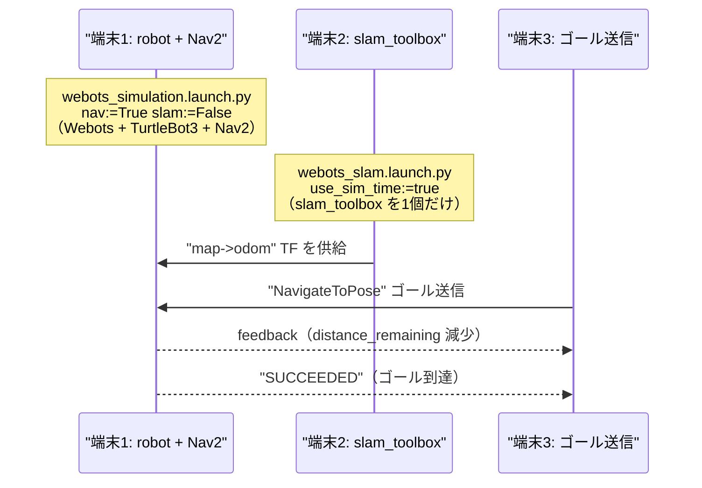

# Webots シミュレーション環境ガイド（ROS2 Humble）

Webots 環境全般の手引き。マッピングタスクの目的・合格基準・確認手順は
[`tasks/mapping_indoor.md`](tasks/mapping_indoor.md)、world の使い分けは [`worlds.md`](worlds.md)、
ロボット/LiDAR 構成は [`robot_lidar.md`](robot_lidar.md) に分離している。

屋外・屋内の大型シミュレーションを Webots で動かすための手引き。**実際に動かして確認した手順**を
まとめている（車・信号・歩行者が動く街、屋内外切替、ROS2 連携、Nav2 自律ナビまで）。

> なぜ Webots か: つくばチャレンジ級の「まちなか走行」を Gazebo 以外も含めて調査した結果
> （[[tsukuba-challenge-research]] 参照）、**車・信号が動く + 人が動く + 屋内外切替 + ROS2 公式対応**を
> 最もバランスよく満たすのが Webots だった。Apache-2.0、CPU でも動く、`city`/`village`/`apartment` 等の
> world が標準同梱、SUMO 連携で車が信号を守って自律走行する。

---

## 0. 結論（最初に読む）

実証済み（`susumu_object_perception` 同梱 launch で実際に動かせたもの）:

| 動かせたもの | 内容 | 状態 |
|---|---|---|
| 屋外の街 `city_traffic.wbt` | SUMO 連携で車が交通シミュ走行（最大100台）、信号機・歩行者が動く | ✅ |
| 屋内 `apartment.wbt` | e-puck / iRobot Create が障害物回避で走行 | ✅ |
| ROS2 連携 | TurtleBot3(LiDAR) が `/scan` `/odom` `/cmd_vel` を出力、`/cmd_vel` 送信でロボットが動く | ✅ |
| Nav2 自律ナビ | SLAM(slam_toolbox)で地図を作りながら、ゴール送信 → `SUCCEEDED` で完走 | ✅ |
| 屋内外切替 | 同じ TurtleBot3 を `world:=outdoor` / `world:=indoor` で切替、どちらも ROS2 連携 | ✅ |

最重要のハマりどころ（詳細は §6）:

1. **`nav:=true`(小文字)は launch がクラッシュ → `nav:=True`(大文字)が必須**
2. **SLAM/AMCL の二重起動に注意 → 本パッケージの launch は `slam:=True` で Nav2 bringup に
   slam_toolbox を 1 個だけ任せ、AMCL は起動しない（排他切替）よう統一済み**
3. **`SUMO_HOME` 未設定だと `city_traffic` で「SUMO not found」になる**

> 罠 1・2 は同梱 `webots_nav.launch.py` を使えば内部で吸収される（大文字固定で渡し、
> slam_toolbox を1個だけ起動する）。利用者は `world` だけ指定すればよい。

---

## 1. セットアップ（初回だけ）

### 1-1. webots_ros2（ROS2 連携）+ SUMO（交通シミュ）を apt 導入

```bash
sudo apt-get update
sudo apt-get install -y ros-humble-webots-ros2 sumo sumo-tools
```

- `ros-humble-webots-ros2`: ROS2 と Webots の連携パッケージ（turtlebot/tesla 等のデモ込み）
- `sumo` / `sumo-tools`: 都市交通シミュレータ。**Webots の街で車を信号通り走らせるのに必要**

### 1-2. Webots 本体を導入

`webots_ros2` だけでは Webots 本体は入らない（初回起動時に自動DLされる方式だが、明示導入が確実）。
公式 .deb を入れる:

```bash
cd /tmp
wget https://github.com/cyberbotics/webots/releases/download/R2025a/webots_2025a_amd64.deb
sudo apt-get install -y /tmp/webots_2025a_amd64.deb
which webots   # /usr/local/bin/webots が出れば OK
```

同梱の world は `/usr/local/webots/projects/` 配下にある（§A 参照）。

### 1-3. このパッケージをビルド

```bash
cd ~/ros2_ws
colcon build --packages-select susumu_object_perception --symlink-install
```

> 同梱 world（`webots_worlds/outdoor.wbt` `indoor.wbt`）は share に install されるため、
> 従来必要だった `/opt/ros/humble/share/webots_ros2_turtlebot/worlds/` への `sudo cp` は不要
> （§5・§B 参照）。

---

## 2. 前提環境変数（毎回 / 端末ごと）

各起動コマンドの前に、その端末で1度だけ実行しておく。以降のコマンド例ではこの export 済みを前提に省略する。

```bash
source /opt/ros/humble/setup.bash
source ~/ros2_ws/install/local_setup.bash
export DISPLAY=:0                  # GUI 表示先（ヘッドレスでも Webots は X を要求する）
export SUMO_HOME=/usr/share/sumo   # city_traffic 用。未設定だと「SUMO not found」
```

| 変数 | 値 | 必要な場面 |
|---|---|---|
| `DISPLAY` | `:0` | 全 Webots 起動（X サーバが居る前提。GUI 表示先） |
| `SUMO_HOME` | `/usr/share/sumo` | `city_traffic` 等の SUMO 連携 world（`webots_city.launch.py` は内部で既定設定するので省略可） |

---

## 3. 同梱 launch 一覧（第一の起動方法）

`susumu_object_perception` が同梱する Webots 用 launch。**同梱 world を直接起動するため `sudo cp` 不要**。
`nav` / `slam` は **大文字 True/False 必須**（小文字は launch 評価時に NameError）。

| launch | 役割 | 主な引数（既定） | 起動例 |
|---|---|---|---|
| `webots_simulation.launch.py` | TurtleBot3 + Webots 同梱 world を起動。ROS2 連携の基本。**LiDAR perception + 全天球色付き点群 + 画像認識（YOLO 物体分類 + 全天球信号認識）を含む**。wrapper launch はこの引数を渡すか、用途に応じて明示OFFにする | `world`(`outdoor.wbt` 拡張子込み), `mode`, `nav`(**True**), `slam`(False), `perception`(True), `omni_perception`(True), `image_recognition`(True), `use_sim_time`(True) | `ros2 launch susumu_object_perception webots_simulation.launch.py world:=outdoor.wbt` |
| `webots_outdoor.launch.py` / `webots_indoor.launch.py` | 上記の world 固定ショートカット（`world` 引数不要）。`nav`(**True**) / `slam`(False) / `mode` / 認識系引数は渡せる | `mode`, `nav`(True), `slam`(False), `perception`(True), `omni_perception`(True), `image_recognition`(True), `use_sim_time` | `ros2 launch susumu_object_perception webots_outdoor.launch.py` |
| `webots_slam.launch.py` | `slam_toolbox` を単独起動する補助（robot を別 launch で起動済みのとき用）。通常は `slam:=True` で足りるので不要 | `use_sim_time`(true) | `ros2 launch susumu_object_perception webots_slam.launch.py` |
| `webots_nav.launch.py` | robot + Nav2 + SLAM フルスタック。内部で simulation を `nav:=True slam:=True` で呼ぶだけ（bringup が slam_toolbox を1個起動・AMCL は無効。二重起動なし） | `world`(outdoor.wbt / indoor.wbt), `perception`(True), `omni_perception`(True), `image_recognition`(True), `use_sim_time`(true) | `ros2 launch susumu_object_perception webots_nav.launch.py world:=indoor.wbt` |
| `webots_city.launch.py` | **既定 `ros2:=True`: city にセンサ付き TurtleBot3 を組み込んだ `city_robot.wbt`（車 BmwX5 + 歩行者 Pedestrian + 信号）を起動し ROS2 認識（LiDAR perception + 全天球色付き点群 + YOLO 物体分類 + 信号認識）を回す。** `ros2:=False` で従来の眺めるだけの街デモ（city_traffic + SUMO 車100台、ROS2 連携なし）。`SUMO_HOME` を内部既定設定 | `ros2`(True), `mode`(realtime / fast / pause), `image_recognition`(True), `world`(ros2:=False 用 city_traffic / city / village 等) | `ros2 launch susumu_object_perception webots_city.launch.py mode:=fast` |

> `webots_simulation.launch.py` は外部 `webots_ros2_turtlebot/robot_launch.py` の driver 配線
> （`WebotsLauncher` + `WebotsController` + `robot_state_publisher` + ros2_control spawner）を踏襲し、
> URDF/ros2control/Nav2 の resource は `webots_ros2_turtlebot` の share をそのまま流用している
> （複製しない）。world だけ本パッケージ `webots_worlds/<world>.wbt` のフルパスを渡すことで sudo cp を不要にした。

---

## 4. ユースケース別の起動

### 4-1. ROS2 連携でロボットを動かす（最小）

```bash
ros2 launch susumu_object_perception webots_simulation.launch.py world:=outdoor.wbt
```

出てくる ROS2 トピック: `/scan`(2D LiDAR) `/scan/point_cloud` `/odom` `/cmd_vel` `/imu` `/tf`
（屋外 `outdoor` は `/gps` も出る。§5 の実証表参照）。

動作確認（ROS2 からロボットを動かす）:

```bash
ros2 topic pub /cmd_vel geometry_msgs/msg/Twist "{linear: {x: 0.15}, angular: {z: 0.3}}" -r 10
ros2 topic echo /odom --once   # 別端末: 位置が変化していれば ROS2 制御成功
```

### 4-2. Nav2 自律ナビ（SLAM で地図を作りながら）

`map->odom` TF を供給する SLAM が二重起動すると TF が壊れる（§6 罠2）。これを避けた**推奨手順**。

#### 推奨（1コマンド）: `webots_nav.launch.py`

```bash
# 端末1: robot + Nav2 + slam_toolbox を一括（下のシーケンス図の端末1+2を兼ねる）
ros2 launch susumu_object_perception webots_nav.launch.py world:=outdoor.wbt

# 端末2: ゴールを送って自律ナビ
ros2 action send_goal /navigate_to_pose nav2_msgs/action/NavigateToPose \
  "{pose: {header: {frame_id: 'map'}, pose: {position: {x: 0.8, y: 0.0}, orientation: {w: 1.0}}}}" --feedback
```

#### 内部の3端末構成（理解用 / 手動分離したい場合）



> **`webots_nav.launch.py` は上図の端末1+端末2を兼ねる**（内部で simulation を
> `nav:=True slam:=False` で include + `webots_slam.launch.py` を include）。利用者は別端末で
> ゴール送信（端末3）だけ行えばよい。手動で分離したい場合の各端末コマンド:

```bash
# 端末1: TurtleBot3 + Nav2（SLAM はここでは起動しない＝二重起動回避）
ros2 launch susumu_object_perception webots_simulation.launch.py world:=outdoor.wbt nav:=True slam:=False
#  ↑ nav:=True は大文字！ slam:=False で同梱 SLAM の二重起動を防ぐ

# 端末2: slam_toolbox を「1個だけ」起動（map->odom TF を供給）
ros2 launch susumu_object_perception webots_slam.launch.py
```

成功すると:

```
Goal accepted with ID: ...
distance_remaining: 0.95 → 0.27 → ...   （残距離が減っていく）
Goal finished with status: SUCCEEDED    （ゴール到達）
```

`/odom` の位置がゴール方向に移動していれば、Nav2 が実際にロボットを自律走行させている。

> 補足: この汎用ナビ手順自体は 2D LiDAR(LDS-01) でも完走する。ただし本パッケージの標準ロボットは
> 既に 3D LiDAR(MID-360 相当) を搭載しており、`resource/turtlebot_webots_3d.urdf` の Lidar
> `lidar3d` が `/lidar/points/point_cloud`(frame `lidar_link`) を出す。`/scan` は launch 側の
> pointcloud_to_laserscan が `/lidar/points/point_cloud` から生成する。Webots での MID-360 近似
> （`tiltAngle` で仰角中心を +22.5° に寄せる等）は [`mid360_lidar_research.md`](mid360_lidar_research.md) 参照。

### 4-3. 街で車・歩行者・信号を認識する（既定）/ 眺めるだけのデモ

`webots_city.launch.py` は 2 モード。`SUMO_HOME` は内部で既定設定する。

```bash
# 既定(ros2:=True): city にセンサ付き TurtleBot3 を置き ROS2 認識を回す。
# city_robot.wbt(車 BmwX5 + 歩行者 Pedestrian + 信号 + センサ付き TB3) を起動し、
# LiDAR perception + 全天球色付き点群 + YOLO 物体分類 + 信号認識 が動く。
ros2 launch susumu_object_perception webots_city.launch.py mode:=fast
# 別端末で /cmd_vel 操縦して対象に近づくと認識される（遠方は全天球で小さく映り苦手）:
ros2 topic pub /cmd_vel geometry_msgs/msg/Twist "{linear: {x: 0.4}}" -r 10
ros2 topic echo /perception/object_classes/markers   # car/person 等のクラス名
ros2 topic echo /perception/traffic_signals          # 信号の色

# ros2:=False: 従来の眺めるだけの街デモ（city_traffic + SUMO で車100台、ROS2 連携なし）。
ros2 launch susumu_object_perception webots_city.launch.py ros2:=False world:=city_traffic mode:=fast
```

ros2:=False 起動後、ログに `Using SUMO from /usr/share/sumo` / `Connect to SUMO...` が出れば成功
（SUMO プロセスが立ち、車が信号を守って自律走行する）。

> **認識のコツ**: 全天球カメラはロボット上部にあり、遠方の車・人は画像上端に小さく映って
> 苦手。ロボットを `/cmd_vel` で対象に近づけると、LiDAR で物体を捉え YOLO で car/person を
> 分類できる（近距離で `person` を高信頼度で認識できることを実機確認済み）。CPU で重ければ
> `image_recognition:=False` で画像認識を切れる（LiDAR perception は残る）。

---

## 5. 屋内外切替 × ROS2 連携

### 切替コマンド（同梱 launch なら sudo cp 不要）

`webots_simulation.launch.py` / `webots_nav.launch.py` の **`world` 引数**で切り替える。同梱 world を
直接起動するため、従来の `sudo cp` 配置は不要（§B 参照）。

```bash
# 屋外（/scan /odom /cmd_vel /gps が出る）
ros2 launch susumu_object_perception webots_simulation.launch.py world:=outdoor.wbt

# 屋内（/scan /odom /cmd_vel が出る）
ros2 launch susumu_object_perception webots_simulation.launch.py world:=indoor.wbt
```

どちらも `nav:=True` を足せば各 world で Nav2 自律ナビも可能（§4-2 参照）。実証済み:

| world | `/scan` | `/odom` | `/cmd_vel` | `/gps` |
|---|---|---|---|---|
| `outdoor` | ✅ | ✅ | ✅ | ✅ |
| `indoor` | ✅ | ✅ | ✅ | ✅ |

（両 world で `Controller successfully connected` + `/cmd_vel` 送信で `/odom` 変化を確認済み。
`indoor` は `turtlebot3_burger_example.wbt` のコピーで GPS センサを含むため `/gps`(`/TurtleBot3Burger/gps`) も出る。）

### 用意した world

`susumu_object_perception/webots_worlds/` に保存（install で share に配置される）。

- `indoor.wbt`: 同梱デモ（`turtlebot3_burger_example.wbt`）のコピー = 壁・窓・家具のある屋内
- `outdoor.wbt`: TurtleBot3 + 地面20×20 + 木4本 + 建物2棟（屋外）。屋外なので `/gps` も出る

> world は EXTERNPROTO を `https://raw.githubusercontent.com/cyberbotics/webots/...` から
> オンライン取得する。初回はネット接続が要る（取得後はキャッシュされる）。

### 仕組み（なぜ切替できるか）

ロボット（TurtleBot3）の ROS2 連携（`controller "<extern>"` による外部制御 + LiDAR/odom の publish）は
**world に依存しない**。そのため、**ロボットを置いた world ファイルを差し替えるだけで、同じロボット・
同じ ROS2 トピック構成のまま屋外↔屋内を切り替えられる**。これが Webots での「屋内外切替」の最も素直な方法。

> 「屋外と屋内が地続きで繋がった1つの world で、建物に入ると屋内になる」レベルは Webots でも
> Gazebo/Isaac でも難しく、**world を分けて切り替える**のが現実解（§8 の研究事例でも、実機は
> マルチセンサ融合で対応し、シミュは環境を分けるのが一般的）。

---

## 6. ハマりどころ（実際に踏んだ罠）

| 症状 | 原因 | 対処 |
|---|---|---|
| `NameError: name 'true' is not defined` で launch がクラッシュ、全プロセスが連鎖シャットダウン | **`nav:=true` の小文字 true が Python 名として評価される** | **`nav:=True` `slam:=True`（大文字）で渡す**。または `webots_nav.launch.py` を使う（内部で吸収） |
| Nav2 起動後 `TF_OLD_DATA ignoring data from the past for frame odom` が大量、ロボットが動かない | **`slam:=True` が Cartographer と slam_toolbox を二重起動して map→odom が競合** | **`slam:=False` にして slam_toolbox を別プロセスで1個だけ起動**（§4-2 / `webots_slam.launch.py`） |
| `SUMO not found. Please install it...` | SUMO は入れたが `SUMO_HOME` 未設定 | **`export SUMO_HOME=/usr/share/sumo`**（`webots_city.launch.py` は内部で既定設定） |
| 屋内 world（apartment）が `--no-rendering` で即死 | 屋内 world は描画前提 | `--no-rendering` を外して起動（`--minimize` で最小化はOK） |
| world が起動時に固まる/即死 | EXTERNPROTO のオンライン取得待ち（37個等） | ネット接続を確認。github raw が遅い時は待つ。取得後はキャッシュで速い |
| `process has died, exit code -2/-6` が大量 | たいてい上記 1 か 2 の**二次的なシャットダウン連鎖**。最初の ERROR を見る | ログを上から見て**最初の ERROR**（`is not defined` 等）を特定する |
| ROS2 トピックが `ros2 topic list` で出ない | DDS ディスカバリ/daemon の遅延 | `ros2 daemon stop && ros2 daemon start` してから再取得 |
| `/scan` が「全周の一部しか出ていない」ように見える | **`ros2 topic echo /scan` のテキスト出力が長い `ranges` 配列を省略表示**するのを手作業パースで誤読しただけ（実際は 723 点・全周 -180〜180 正常） | **点数/分布は echo テキストでなく `sensor_msgs_py.point_cloud2` / LaserScan を Python でデコードして数える**。echo の見た目で判断しない |
| 起動直後ロボットが動かない・controller が `Passing new path` を繰り返すだけ | **TF(map/odom)が未安定**な起動直後。`Invalid frame ID "odom"` 等が出る | 数十秒待つと TF が揃い `Reached the goal!` で正常探索に入る。遅延起動値（frontier は +22s 等）をむやみに詰めない |
| `nav2_params_webots_explore.yaml` の `use_sim_time` が `False` だらけで不安になる | **nav2_bringup の RewrittenYaml が起動時に `True` で上書き**するので実害なし | 実行値は `ros2 param get /controller_server use_sim_time` で確認（全ノード True になる）。yaml の値に惑わされない |
| 地図がぶれる（二重壁/斜め/星形） | 最有力は **`mode:=fast` の odom 21% 過大積算**（[mid360_lidar_research](mid360_lidar_research.md)）。`mode:=realtime` 前提なら衝突や TF 不整合を疑う | `mode:=realtime` で再現するか確認。バンパー(`/bumper/collision`)＋衝突診断ノードで「衝突しているか／scan・costmap に障害物が乗っているか」を切り分ける。屋内の合格基準は [マッピング（屋内）タスク](tasks/mapping_indoor.md)。広い outdoor/city は[未対応](tasks/mapping_outdoor.md) |

> ヘッドレス環境では Webots も X を要求するため `DISPLAY=:0` が要る（X サーバが居る前提）。
> GUI を見たいときは `--no-rendering`/`--minimize` を外して起動する。

---

## 7. プロセスの停止

Webots + ROS2 launch は子プロセスが孤児化しやすい。確実に止めるには:

```bash
pkill -9 -f "ros2 launch webots"   # 親の launch を先に
pkill -9 -f webots-bin             # Webots 本体
pkill -9 -f ros2_supervisor
pkill -9 -f sync_slam_toolbox; pkill -9 -f async_slam_toolbox
# 残骸が居たら PID 直接: ps -eo pid,args | grep webots-bin → kill -9 <pid>
```

> `pkill` はマッチが無いと終了コード 1 を返す。**シェルスクリプトで `pkill` を `&&`/`;` で連鎖すると
> そこで止まって後続（肝心の起動コマンド）に到達しないことがある**。`pkill ... || true` で吸収するか、
> 停止と起動を別コマンドに分ける。

---

## 8. 似た事例・参考記事

我々の取り組み（Webots + ROS2 + slam_toolbox + Nav2、屋内外切替）に近い事例。

### Webots + ROS2 + Nav2/SLAM の実践（最も近い）

- **Webots 公式 wiki「Navigate TurtleBot3」**（cyberbotics/webots_ros2）— `robot_launch.py nav:=true` で
  Webots+RViz+Nav2 を起動し、RViz の「Navigation2 Goal」でゴール指定。本ガイド §4-2 とほぼ同じ。
  https://github.com/cyberbotics/webots_ros2/wiki/Navigate-TurtleBot3
- **Husarion「Webots: ROSbot 2R + SLAM Toolbox」** — Webots で ROSbot を走らせ slam_toolbox で地図生成。
  Docker Compose 付きで再現性が高い。**我々の構成と一番近い実践例**。
  https://husarion.com/tutorials/vulcanexus/webots-rosbot/
- **The Robotics Back-End「ROS2 Nav2 - Generate a Map with slam_toolbox」** — slam_toolbox で地図を作る
  手順の丁寧な解説。https://roboticsbackend.com/ros2-nav2-generate-a-map-with-slam_toolbox/

### Webots + ROS2（自作ロボット/world）— 日本語

- **Zenn「WebotsとROS 2で自作モデルを動かす」**（tasada038）— urdf2webots で URDF→PROTO 変換、
  boundingObject 調整、.wbt 配置。https://zenn.dev/tasada038/articles/d84f74b808cf7f
- **「ROS2とWebotsの連携 調査編/実装編」**（odome.hatenablog.com）— ヒューマノイド動歩行を例に
  webots_ros2 連携を調査・実装。https://odome.hatenablog.com/entry/2022/09/26/233921
- **demura.net「Webotsシミュレータでルンバを動かそう」** — iRobot Create2 の ROS2 制御例。
  https://demura.net/robot/ros2/20567.html

### 屋内外を跨ぐナビゲーション（研究・実機寄り）

- **IndoorSim-to-OutdoorReal**（arXiv:2305.01098）— **屋内シミュだけで学習した視覚ナビを、屋外実機(Spot)で
  数百m zero-shot 走行**させた研究。屋外の勾配・歩道はシミュせず、衛星画像やラフスケッチの「context-map」で
  進路ヒントを与える。→ **「屋内外を1つの連続 world で繋ぐのは難しいので、シミュは環境を分け、屋外特有部分は
  別手段で補う」という我々の判断と同じ方向**。https://arxiv.org/abs/2305.01098
- **VAULT: Mobile Mapping System for ROS2**（arXiv:2506.09583）— 複数センサ融合で屋内外ともロバストに自己位置
  推定する ROS2 システム。実機の屋内外横断はマルチセンサ融合で対応する例。
- **JKU-ITS Last Mile Delivery Robot**（arXiv:2305.18276）— 3D LiDAR+RGB-D+IMU+GPS で屋外配送。
  実機は GPS+LiDAR SLAM 併用（屋内外で自己位置手段を切替）。

> **要点**: 「屋外も屋内も地続きの1 world で、建物に入ると屋内」レベルはどのシミュでも難しく、研究・実機でも
> **シミュは環境を分ける / 自己位置は屋内外で手段を切り替える（LiDAR↔GPS）** のが定石。我々の Webots
> `world:=` 切替はこの定石に沿った素直な実装。

---

## 9. 関連（本リポジトリ）

- つくばチャレンジ級シミュの調査・他候補（CARLA/Isaac/Habitat/Arena 等）: memory [[tsukuba-challenge-research]]
- Webots セットアップの要点 memory: [[webots-ros2-nav2-setup]]
- 本リポジトリ本体（Gazebo Classic + Autoware perception）: [`software_design.md`](software_design.md)

---

## 付録 A. 同梱 world の場所（標準 Webots、参考）

`webots_city.launch.py` の `world` 引数や、単体起動・3D LiDAR 化の参照用。

| 用途 | world ファイル |
|---|---|
| 屋外・街（車SUMO走行+信号+歩行者） | `/usr/local/webots/projects/vehicles/worlds/city_traffic.wbt` |
| 屋外・街（他バリエーション） | `city.wbt` / `village.wbt` / `village_realistic.wbt` / `highway.wbt`（同 vehicles/worlds） |
| 屋内（ロボット稼働） | `/usr/local/webots/projects/samples/environments/indoor/worlds/apartment.wbt` |
| 歩行者（社会力で歩く） | `/usr/local/webots/projects/humans/pedestrian/worlds/pedestrian.wbt` |
| 3D LiDAR(Velodyne) PROTO | `/usr/local/webots/projects/devices/velodyne/`（3D LiDAR 化に使える） |

単体 GUI で world を見るだけなら Webots コマンドを直接叩いてもよい（server+client が1コマンド）:

```bash
webots /usr/local/webots/projects/vehicles/worlds/city_traffic.wbt
# 検証向けヘッドレス高速:
webots --batch --mode=fast --no-rendering --stdout --stderr \
  /usr/local/webots/projects/vehicles/worlds/city_traffic.wbt
```

- `--batch`: 終了ダイアログ等を抑制 / `--mode=fast`: 可能な限り高速 /
  `--no-rendering`: 画面描画を省く（**屋内 apartment 等は描画前提で落ちることがある。その場合は外す**）

---

## 付録 B. 外部 launch を直接使う場合（旧手順・補足）

同梱 launch（§3）が使えれば不要だが、外部 `webots_ros2_turtlebot/robot_launch.py` を直接叩く場合の手順。
`robot_launch.py` は world を `PathJoinSubstitution([package_dir,'worlds',world])` で解決するため、
**パッケージ外フルパスの world を受け付けず、自作 world を `sudo cp` で配置する必要がある**（同梱
`webots_simulation.launch.py` はこの制約を回避するために作った）。

```bash
# 自作 world を webots_ros2_turtlebot に配置（同梱 launch なら不要）
WDIR=/opt/ros/humble/share/webots_ros2_turtlebot/worlds
sudo cp ~/ros2_ws/src/susumu_object_perception/webots_worlds/indoor.wbt  $WDIR/
sudo cp ~/ros2_ws/src/susumu_object_perception/webots_worlds/outdoor.wbt $WDIR/

# 屋外（/scan /odom /cmd_vel /gps）
ros2 launch webots_ros2_turtlebot robot_launch.py world:=outdoor.wbt rviz:=false
# 屋内（/scan /odom /cmd_vel）
ros2 launch webots_ros2_turtlebot robot_launch.py world:=indoor.wbt rviz:=false

# Nav2 推奨手順（外部 launch 版・§4-2 と同じ TF 競合回避）
ros2 launch webots_ros2_turtlebot robot_launch.py nav:=True slam:=False rviz:=false  # 端末1
ros2 launch slam_toolbox online_async_launch.py use_sim_time:=true                    # 端末2
```

> `city`/`village` は車用 world なので、そのままでは TurtleBot3 の ROS2 連携は付かない。
> `outdoor.wbt` を雛形に SimpleBuilding/Road 等を足して街化するのが早い。
